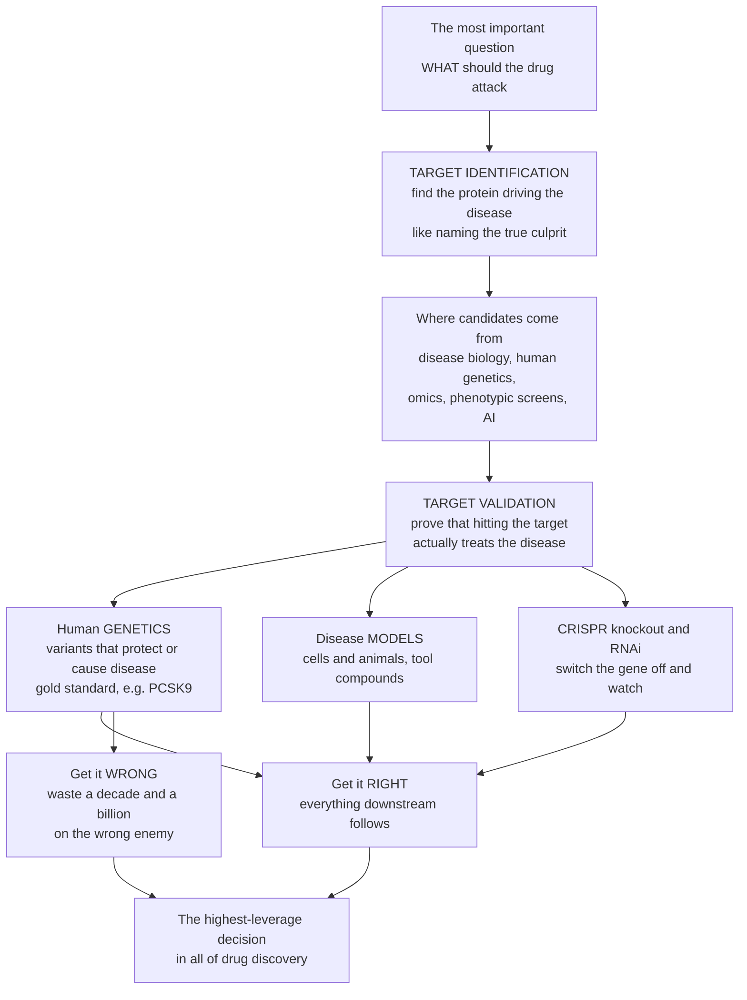

# 🕵️ Target Identification and Validation

> [!abstract] TL;DR
> Before you can design a drug you must answer the single most consequential question in the whole enterprise: **what should the drug attack?** **Target identification** is finding the specific molecule — almost always a **protein** — that, if you nudge it, would treat the disease. **Target validation** is the step so often skipped at everyone's peril: rigorously *proving* that this target really **drives** the disease, so that hitting it will actually help rather than merely correlate. The gold-standard evidence comes from **human genetics** — if people born with a naturally broken version of a gene are protected from (or prone to) a disease, that is powerful, *causal* proof the gene's protein is a real target. This is exactly how the blockbuster cholesterol drugs targeting **PCSK9** were validated: some people carry loss-of-function variants that give them lifelong low LDL and low heart-attack risk. Because a stunning fraction of drug failures trace back to a **bad target** — one that seemed important but did not drive the disease — choosing and validating the target is the **highest-leverage decision in drug discovery**. Drug programs with human genetic support for the target succeed in the clinic at roughly **double** the rate.

---

## Intuition

**Analogy first — the detective naming the true culprit.** Imagine a crime with a dozen suspects. Before you spend a decade and a billion dollars building the perfect weapon, a detective must identify the *actual* culprit behind the crime. Get the identification right and everything downstream follows — the arrest, the conviction, the closed case. Get it wrong and you will invest all that effort perfectly aimed at the *wrong enemy*, while the real culprit walks free and the crime continues. In drug discovery the "culprit" is the **molecular target**: the specific protein whose misbehaviour drives the disease.

Now the crucial twist that separates good detectives from bad ones: **suspicion is not proof**. A protein that is merely *present at the scene* — over-expressed in sick tissue, or statistically *associated* with the disease — is a suspect, not a convicted culprit. **Validation** is the trial: assembling evidence strong enough to prove that if you *neutralise this target, the disease actually improves*. The most damning evidence is a **natural experiment** written into human DNA — some people are simply *born* with the target's gene turned down or up. If those born with it turned down never get the disease, you have a preview of exactly what a drug hitting that target would do, before you have made a single molecule. That is why **human genetics** is the detective's DNA evidence: the strongest, most causal proof that you have named the right culprit.

---

## How It Works

### Core mechanics

1. **Identify a target.** Comb through disease biology to nominate a molecule whose modulation could plausibly treat the disease. The candidates come from several streams: **disease biology and pathway analysis** (understanding the mechanism), **genetics and genomics** (GWAS, Mendelian disease genes, sequencing that links genes to disease), **omics and functional genomics** (transcriptomics/proteomics flagging molecules that are differentially expressed or active), **phenotypic screening** (find a molecule that produces the desired effect, *then* identify what it binds — "target deconvolution"), and increasingly **computational / AI target discovery**.
2. **Check druggability early.** A beautiful disease hypothesis is worthless if the target has no bindable pocket. The candidate must lie inside the **druggable genome** — proteins that a small molecule or biologic can actually engage.
3. **Validate causality, not correlation.** Establish that *modulating* the target changes the disease. Evidence is tiered from weakest to strongest: biochemical → cell-based → animal model → **human genetic**.
4. **Reach for the natural experiment.** The strongest tier is **human loss-of-function / gain-of-function variants** that associate with disease protection or risk — they reveal what happens when the target is *naturally* perturbed across a whole population. **Mendelian randomization** formalises this: because genotype is randomised at conception, a variant-to-disease association is far more causal than an ordinary correlation.
5. **Confirm with tool perturbations.** **CRISPR knockout**, **RNAi knockdown**, and **knock-in** experiments in cells and animals switch the target off (or on) and read out whether the disease phenotype reverses. Tool compounds and antibodies test whether *pharmacological* modulation rescues the phenotype.
6. **Assess on-target safety.** Because humans born without the target are a preview of chronic inhibition, human genetics also predicts **on-target toxicity** — harm that no chemistry can engineer away because it is intrinsic to hitting the target at all.

### Flow



---

## Key Concepts

### Secondary (explain to a bright teenager)

- **A drug needs a culprit.** A medicine works by grabbing one specific molecule in the body — usually a protein — and changing what it does. Finding that molecule is **target identification**.
- **Suspicion is not proof.** A protein that just *looks* guilty (it shows up in sick tissue) may be an innocent bystander. **Target validation** is proving the protein really *causes* the disease, so switching it off actually helps.
- **DNA gives away the answer.** Some people are simply *born* with a gene turned down. If those people never get a disease, that gene's protein is a great target — nature already ran the experiment for free. This is how the **PCSK9** cholesterol drugs were found.
- **Tools to test the culprit.** Scientists use **CRISPR** to switch a gene off in cells or animals and see whether the disease gets better. If it does, the target is validated.
- **Getting this right is everything.** Pick the right target and a great drug can follow. Pick the wrong one and years of brilliant work lead nowhere — which is why most drugs that fail, fail *here*.

### Undergraduate (needs some biology)

- **Identification approaches.** *Disease biology / pathway analysis* nominates targets from mechanism. *Genetics and genomics* (GWAS, Mendelian disease genes, whole-exome/genome sequencing) links genes to disease. *Omics* (transcriptomics, proteomics) flags differentially expressed or active molecules. *Phenotypic screening* finds active compounds first and then does **target deconvolution** to identify what they hit. *Computational / AI* methods mine multi-omic and literature data for candidates.
- **The evidence hierarchy.** Confidence that modulating a target treats a disease rises: *biochemical* (does it bind?) → *cell-based* (does knockdown change cells?) → *animal model* (does it change a disease model?) → **human genetic** (do people with variants show the predicted phenotype?). Human genetic evidence sits at the top because it reports on *human* biology and is inherently *causal*.
- **The PCSK9 paradigm.** People with loss-of-function *PCSK9* variants have low LDL and reduced coronary disease; people with gain-of-function variants have familial hypercholesterolaemia. The variants told researchers, before any drug existed, that *inhibiting* PCSK9 would lower LDL and be tolerated — a validated, causal, safe-to-inhibit target. The drugs (evolocumab, inclisiran) followed the genetics.
- **Mendelian randomization (MR).** Because alleles are randomly assigned at conception, a genetic variant acts like a lifelong "natural randomized trial" of lower target activity. MR uses this to infer *causality* from observational genetic data, distinguishing true drivers from mere correlates.
- **Model-system validation.** **CRISPR knockout**, **RNAi knockdown**, and **knock-in** models test whether perturbing the target reverses a disease phenotype. Tool compounds and antibodies test pharmacological rescue. Together they triangulate causality alongside genetics.
- **On-target vs off-target.** *Off-target* effects come from hitting unintended proteins (fixable with selectivity). *On-target* (mechanism-based) effects come from modulating the intended target itself — an intrinsic consequence of the target choice, previewed by human loss-of-function biology.

### Graduate (system-level / molecular)

- **Target choice dominates attrition.** Analyses of clinical failure (notably Cook et al. on AstraZeneca's pipeline, the "5R" framework: right target, right tissue, right safety, right patient, right commercial) attribute a large share of **Phase II/III failures to lack of efficacy** — i.e. the *target was not truly causal*. This reframes discovery: the dominant risk is not chemistry but **the target itself**.
- **Quantifying the genetics advantage.** Nelson et al. (2015) showed that drug-target–indication pairs with **human genetic support** are roughly **twice** as likely to progress through the clinic to approval. This turned target selection from art toward a genomics-grounded discipline and drove industry investment in biobanks (UK Biobank, FinnGen) and MR pipelines.
- **The pharmacological audit trail.** A rigorous program links, at each stage, **target engagement** (does the drug bind the target in vivo?) → **pharmacodynamic biomarker** (is the target's activity actually changed?) → **phenotypic / clinical outcome**. Breaking this chain — showing efficacy without demonstrable target engagement — is a red flag that the mechanism, and possibly the target, is wrong.
- **Association vs causation in omics.** GWAS and expression studies produce *associations*; converting a locus to a *validated causal gene* requires fine-mapping, colocalization of eQTL and disease signals, direction-of-effect, and functional follow-up. Many "targets" evaporate when tested for causality — the central discipline of modern validation.
- **The undruggable-but-validated problem.** Some of the best-validated targets (certain transcription factors, KRAS historically, protein–protein interfaces) long lacked a tractable pocket. Validation and druggability are *orthogonal*: a target can be causally proven yet require new modalities (PROTACs, molecular glues, antisense/siRNA, covalent chemistry) to drug at all.
- **Genetics as a safety oracle.** Human loss-of-function homozygotes ("human knockouts") preview chronic on-target inhibition: if such individuals are healthy, on-target safety is de-risked; if they show pathology, the mechanism carries intrinsic toxicity. This is arguably as valuable as the efficacy signal.

---

## Python Demo

```python
# Target identification & validation — four illustrative pieces:
#   (a) GENETIC VALIDATION: a variant that lowers a target's activity associates
#       with lower disease risk (the PCSK9 logic — a causal, natural experiment)
#   (b) NATURAL EXPERIMENT: loss-of-function (LOF) carriers get the disease LESS
#       often than non-carriers (the Mendelian-randomization intuition)
#   (c) GENETICS DOUBLES SUCCESS: drug-target pairs WITH human-genetic support
#       reach approval ~2x more often than those without (Nelson et al. 2015)
#   (d) CRISPR KNOCKOUT RESCUE: switching the target gene OFF reverses the
#       disease phenotype in a model — a validation read-out
# All numbers are illustrative teaching values, not exact database counts.
# Educational content, not individual medical advice.
import numpy as np
import matplotlib.pyplot as plt

rng = np.random.default_rng(7)
fig, ax = plt.subplots(2, 2, figsize=(15, 11))

# ---------------------------------------------------------------------------
# (a) Genetic validation: target activity (genetically set) vs disease risk
#     Think PCSK9 activity -> LDL cholesterol -> coronary-disease risk.
n = 500
activity = rng.normal(100, 22, n).clip(20, 175)          # genetically-set activity
risk = (0.9 * activity + rng.normal(0, 14, n)).clip(0, None)   # CAUSAL + noise
lof = activity < 62                                       # loss-of-function carriers

ax[0, 0].scatter(activity[~lof], risk[~lof], s=18, alpha=0.5,
                 color="#7f8c8d", label="typical variants")
ax[0, 0].scatter(activity[lof], risk[lof], s=30, alpha=0.85,
                 color="#27ae60", label="loss-of-function carriers")
slope, intercept = np.polyfit(activity, risk, 1)
xs = np.linspace(activity.min(), activity.max(), 50)
ax[0, 0].plot(xs, slope * xs + intercept, color="#c0392b", lw=2.4,
              label="causal trend")
ax[0, 0].set_xlabel("Target activity, genetically set (arb. units)")
ax[0, 0].set_ylabel("Disease risk (arb. units)")
ax[0, 0].set_title("(a) Genetic validation: less target activity -> less disease")
ax[0, 0].legend(fontsize=8, loc="upper left")

# ---------------------------------------------------------------------------
# (b) The natural experiment: disease incidence in LOF carriers vs non-carriers
thresh = np.percentile(risk, 70)                          # "disease" = high-risk tail
inc_non = (risk[~lof] > thresh).mean() * 100
inc_lof = (risk[lof]  > thresh).mean() * 100
groups = ["Non-carriers", "LOF carriers\ntarget naturally low"]
inc = [inc_non, inc_lof]
bars = ax[0, 1].bar(groups, inc, color=["#7f8c8d", "#27ae60"])
for b, v in zip(bars, inc):
    ax[0, 1].text(b.get_x() + b.get_width()/2, v + 0.7, f"{v:.0f}%",
                  ha="center", fontweight="bold")
ax[0, 1].set_ylabel("Disease incidence (%)")
ax[0, 1].set_title("(b) Born with the target 'off' -> naturally protected")
ax[0, 1].set_ylim(0, max(inc) * 1.4)

# ---------------------------------------------------------------------------
# (c) Human genetic support roughly DOUBLES clinical success (Nelson et al.)
labels = ["No human\ngenetic support", "With human\ngenetic support"]
success = np.array([10.0, 20.0])                          # illustrative ~2x
bars2 = ax[1, 0].bar(labels, success, color=["#bdc3c7", "#2980b9"])
for b, v in zip(bars2, success):
    ax[1, 0].text(b.get_x() + b.get_width()/2, v + 0.4, f"{v:.0f}%",
                  ha="center", fontweight="bold")
ax[1, 0].annotate("about 2x", xy=(1, success[1]), xytext=(0.5, success[1] + 4),
                  fontsize=12, fontweight="bold", ha="center",
                  arrowprops=dict(arrowstyle="->"))
ax[1, 0].set_ylabel("Probability of clinical success (%)")
ax[1, 0].set_title("(c) Genetics roughly doubles the odds a target succeeds")
ax[1, 0].set_ylim(0, 26)

# ---------------------------------------------------------------------------
# (d) CRISPR knockout rescues the disease phenotype (validation read-out)
conds = ["Healthy\ncontrol", "Disease\nmodel", "Disease +\ntarget knockout"]
pheno = [20, 85, 34]                                      # phenotype severity score
err   = [4, 6, 5]
bars3 = ax[1, 1].bar(conds, pheno, yerr=err, capsize=6,
                     color=["#27ae60", "#c0392b", "#2980b9"])
ax[1, 1].axhline(20, color="#27ae60", ls=":", lw=1.5)
ax[1, 1].annotate("knocking the target OFF\nreverses the phenotype",
                  xy=(2, 34), xytext=(0.55, 62), fontsize=9,
                  arrowprops=dict(arrowstyle="->"))
ax[1, 1].set_ylabel("Disease phenotype severity (arb. units)")
ax[1, 1].set_title("(d) CRISPR knockout reverses disease -> target validated")
ax[1, 1].set_ylim(0, 100)

plt.tight_layout()
plt.savefig("target_identification_and_validation.png", dpi=120)
plt.show()

# Console sanity checks
print(f"(a) slope of risk vs target activity = {slope:.2f} (positive -> causal driver)")
print(f"(b) disease incidence: non-carriers={inc_non:.0f}%  LOF carriers={inc_lof:.0f}%")
print(f"(c) clinical success: no-genetics={success[0]:.0f}%  with-genetics={success[1]:.0f}%"
      f"  ({success[1]/success[0]:.1f}x)")
print(f"(d) phenotype: healthy={pheno[0]}, disease={pheno[1]}, disease+KO={pheno[2]} (rescued)")
```

**What it shows.** Panel **(a)** is the logic of genetic validation: across a population, people whose target activity is *genetically* lower sit at *lower* disease risk, and the loss-of-function carriers (green) cluster in the low-risk corner — exactly the PCSK9 story, where the slope is *causal* because the genotype was fixed at conception. Panel **(b)** turns that scatter into the headline natural experiment: individuals born with the target turned down develop the disease markedly *less* often than non-carriers — a preview of what a drug that inhibits the target would achieve. Panel **(c)** is the strategic payoff quantified by Nelson et al.: a target backed by human genetic evidence roughly **doubles** the probability of surviving to approval, which is why "pick better targets" is the highest-leverage improvement in the whole pipeline. Panel **(d)** is the complementary experimental proof: a **CRISPR knockout** of the target reverses the disease phenotype in a model back toward the healthy baseline — genetics plus perturbation together convict the culprit.

---

## Real-World Applications

> **Example — PCSK9 and the gold standard of genetic validation.** In the early 2000s, sequencing revealed that people with **loss-of-function** *PCSK9* variants had lifelong low LDL cholesterol and dramatically reduced heart-attack risk, while **gain-of-function** variants caused severe familial hypercholesterolaemia. This natural experiment proved, *before any drug existed*, that inhibiting PCSK9 would safely lower LDL. The result: **evolocumab/alirocumab** (antibodies) and **inclisiran** (an siRNA) — a target chosen and de-risked almost entirely by human genetics. It is the canonical demonstration that a naturally occurring variant is a preview of a drug's effect.

- **Phenotypic-to-target deconvolution.** Many classic drugs (aspirin, lithium, metformin) emerged from *phenotypic* observation, with their molecular targets identified only later. Modern chemoproteomics and CRISPR screens now perform this **target deconvolution** systematically, turning "it works" into "here is why."
- **CRISPR functional-genomic screens.** Genome-wide CRISPR knockout screens in cancer cell lines (e.g. the DepMap / Project Achilles effort) nominate and validate **genetic dependencies** — genes cancers cannot survive without — directly proposing causal, essential targets for oncology.
- **GWAS-to-target pipelines.** Loci from genome-wide association studies (e.g. *IL23R* in inflammatory bowel disease, *SLC30A8* in diabetes) are triaged by fine-mapping, colocalization, and Mendelian randomization to convert statistical hits into validated, druggable targets — the workflow behind many current immunology and metabolic programs.
- **The cautionary tale of weak validation.** A large share of failed **Alzheimer's** and oncology programs reflect not bad molecules but targets that were *associated* with pathology yet not truly *causal* (efficacy failures). These very expensive lessons drove the industry-wide shift toward genetics-first target selection captured in AstraZeneca's "5R" framework.

---

## Common Pitfalls

- **Mistaking association for causation.** A GWAS hit, an over-expressed protein, or a biomarker that tracks disease is *correlated* — not proven to *drive* pathology. Committing to such a target is the single most expensive error in the field; validation must establish causal *direction* (ideally human loss-of-function evidence or Mendelian randomization).
- **Skipping validation to save time.** Rushing a plausible target into chemistry feels fast, but the cost of a wrong target surfaces years later as a Phase II/III efficacy failure — the most expensive place to learn you were wrong. Validation up front is the cheapest de-risking in the whole pipeline.
- **Reverse causation and confounding.** A protein may rise *because* of the disease rather than *causing* it, or a lifestyle confounder may drive both. Observational omics cannot distinguish these; genetics (randomized at conception) and controlled perturbation can.
- **Ignoring on-target safety.** Human loss-of-function carriers preview chronic inhibition. If those individuals show harm, the target carries intrinsic (on-target) toxicity that *no chemistry can fix* — a target-selection issue, not a molecule issue.
- **Confusing a good target with a druggable one.** Validation and druggability are independent. A causally proven target with no tractable pocket (many transcription factors, historically KRAS) may need a new modality rather than a conventional inhibitor — recognise this before committing to small molecules.
- **Over-relying on a single model organism.** A phenotype that reverses on knockout in mice may not translate to humans. Triangulate across human genetics, multiple models, and tool compounds rather than trusting one system.

---

## Related Concepts

This note opens the **Drug Discovery Pipeline** section and sits upstream of everything that follows. Once a target is identified and validated here, the pipeline moves into *The Drug Discovery Pipeline* (the end-to-end map from target to approval), then into *Hit Discovery and High-Throughput Screening* (finding the first molecules that engage the validated target) and, increasingly, *AI and Machine Learning in Drug Discovery* (which now nominates and prioritises targets from multi-omic data). The universe of what *can* be a target — the receptor, enzyme, channel, and transporter classes and the concept of the druggable genome — is laid out in *Drug Targets and the Druggable Genome*, while *Nucleic Acid Therapeutics* explains how new modalities are expanding that universe to previously undruggable but well-validated targets. (These sibling and section notes are referenced in prose because they belong to this same discovery arc.)

Cross-vault foundations (Glob-verified):

- [[Complex_Trait_Genetics_and_GWAS]] — the genome-wide association studies whose loci become target candidates; explains how statistical hits are fine-mapped toward causal genes.
- [[Gene_Therapy_and_CRISPR]] — the CRISPR knockout/knock-in machinery used to switch a candidate target off (or on) and read out whether the disease phenotype reverses.
- [[CRISPR_and_Genome_Editing]] — the molecular mechanism of guide-RNA-directed Cas cutting that underpins functional-genomic validation screens.
- [[Functional_Genomics_and_Transcriptomics]] — the omics layer that flags differentially expressed and active molecules, one of the main streams feeding target identification.
- [[Precision_Medicine_and_Genomics_in_the_Clinic]] — the clinical endpoint where a validated molecular target becomes a genomics-matched, targeted therapy at the bedside.
- [[Etiology_and_Mechanisms_of_Disease]] — the disease-mechanism reasoning that nominates targets in the first place, distinguishing drivers from bystanders.
- [[Evidence_Based_Medicine_and_Clinical_Trials]] — the causal-inference framework (randomization, confounding) that Mendelian randomization borrows to argue a genetic variant proves target causality.

---

## Review Questions

**Secondary**
1. Using the "detective naming the culprit" picture, explain the difference between *identifying* a target and *validating* it — and why validation is so easy to skip yet so costly to get wrong.
2. Some people are born with a gene naturally turned down and never develop a certain disease. Why does that make the gene's protein a great drug target? Name the real example from cholesterol drugs.

**Undergraduate**
3. A protein is strongly *over-expressed* in diseased tissue, so a team proposes it as a target. Explain why this is only *suspicion*, and describe two kinds of evidence (one genetic, one experimental) that would move it toward *proof* of causality.
4. Explain how **Mendelian randomization** uses the fact that alleles are randomized at conception to argue causality, and how this is analogous to a randomized clinical trial of lower target activity.

**Graduate**
5. Nelson et al. found that targets with human genetic support are roughly twice as likely to reach approval, and Cook et al. attribute much Phase II attrition to "wrong target" efficacy failures. Synthesise these findings into an argument for *where* in the pipeline a company should invest to most reduce overall attrition, and what a "pharmacological audit trail" adds.
6. A target is *causally validated* by human genetics but has no small-molecule-tractable pocket. Explain why validation and druggability are orthogonal, outline how you would decide between abandoning the target and pursuing an alternative modality (PROTAC, siRNA, antibody), and how human loss-of-function biology informs the *on-target safety* half of that decision.

---

## Sources

- Nelson MR, Tipney H, Painter JL, et al. "The support of human genetic evidence for approved drug indications." *Nature Genetics* 2015;47:856–860. https://www.nature.com/articles/ng.3314
- Plenge RM, Scolnick EM, Altshuler D. "Validating therapeutic targets through human genetics." *Nature Reviews Drug Discovery* 2013;12:581–594. https://www.nature.com/articles/nrd4051
- Hughes JP, Rees S, Kalindjian SB, Philpott KL. "Principles of early drug discovery." *British Journal of Pharmacology* 2011;162:1239–1249. https://bpspubs.onlinelibrary.wiley.com/doi/10.1111/j.1476-5381.2010.01127.x
- Cook D, Brown D, Alexander R, et al. "Lessons learned from the fate of AstraZeneca's drug pipeline: a five-dimensional framework." *Nature Reviews Drug Discovery* 2014;13:419–431. https://www.nature.com/articles/nrd4309

---

#pharmacology #target-identification #target-validation #human-genetics #drug-discovery
