# 🏭 The Drug Discovery Pipeline

> [!abstract] TL;DR
> Bringing one new medicine to patients is among the **longest, riskiest, and most expensive endeavours in all of science**: roughly **10–15 years**, a capitalized cost estimated at **$1–2.6 billion**, and an attrition so brutal that about **90% of drugs that even reach human trials still fail**. The whole enterprise runs like a giant **funnel**: millions of candidate molecules enter, and — stage by ruthless stage — nearly all are eliminated until, at best, **one emerges approved**. The stages are fixed and sequential: pick the disease **target**, screen for **hits**, chemically polish the best into a drug-like **lead** and then a candidate, test it exhaustively in cells and animals (**preclinical**), run three escalating phases of **clinical trials** in humans, and finally win **regulatory approval** (FDA/EMA) followed by post-market surveillance. Understanding this funnel — *why* it is so slow, costly, and failure-prone, and how each stage weeds candidates out — is the key to understanding why medicines take so long, cost so much (you are paying for all the failures), and why AI and better science are racing to speed it up. This note frames every pipeline-stage and drug-design note in the vault.

---

## Intuition

**Analogy FIRST — a brutal, decade-long tournament with millions of contestants and one champion.** Imagine a knockout tournament so large that **millions of contestant molecules** enter at the starting line, and after ten to fifteen years of ever-harsher elimination rounds, **exactly one** is crowned an approved medicine. That is the drug discovery pipeline. It is shaped like a **funnel**: wide and cheap at the top, narrow and eye-wateringly expensive at the bottom. Each round is designed to *kill* candidates — cheaply if possible, before you have spent much on them.

The rounds go like this. First, **pick your enemy**: choose the specific molecular *target* in the disease you want to attack. Next, throw millions of molecules at that target and keep any that show a flicker of promise — the **hits**. Then spend *years* of painstaking chemistry sanding a rough hit into a real drug-like molecule — a **lead**, then a clinical candidate — one that is potent, selective, and behaves well in the body. Only then do you test it exhaustively in cells and animals for effectiveness and safety: the **preclinical** round. Survive that, and your molecule finally earns the right to enter **human clinical trials** — three escalating phases that test safety first, then effectiveness, in ever-larger groups of people. Clear all three, and a **regulator** like the FDA reviews everything and, perhaps, approves it. Even then, the tournament isn't quite over: the drug is watched for rare harms across millions of real patients (post-market surveillance).

The staggering statistics tell the whole story. The journey takes **10–15 years**. It costs, when you account for the money and the failures, on the order of **a billion dollars or more** per approved drug. And roughly **90% of the candidates that reach human trials still fail** — usually because they don't actually *work* (lack of efficacy) or because they turn out to be *unsafe* (toxicity). Here is the counter-intuitive punchline that explains drug prices: **most of that cost is not spent on the winner — it is spent on the failures.** The single approved drug has to pay for the graveyard of molecules that died along the way. Grasping this funnel — target → hit → lead → preclinical → clinical → approval — and its ferocious attrition is essential to appreciating both the enormous, patient effort behind every pill and the intense drive to accelerate it with computation, AI, and better biology.

---

## How It Works

### Core mechanics

1. **Target identification and validation — pick the enemy.** Everything starts by choosing a **molecular target** (usually a protein: a receptor, enzyme, ion channel, or transporter) whose modulation should treat the disease, and then *validating* that modulating it actually changes the disease. Getting this wrong is the most expensive mistake possible, because a *non-causal* target dooms the program no matter how good the chemistry. (See `Target_Identification_and_Validation`.)
2. **Hit discovery — find starting molecules.** With a target in hand, you search for any molecule that binds or modulates it. Methods include **high-throughput screening (HTS)** of large compound libraries, **fragment-based** discovery, **structure-based** (in-silico) design against the target's 3D structure, and **natural products**. The output is a set of **hits** — weak, imperfect, but real starting points. (See `Hit_Discovery_and_High_Throughput_Screening`.)
3. **Lead optimization — years of chemistry.** **Medicinal chemists** iteratively redesign and re-synthesize the best hits (the "hit-to-lead" then "lead optimization" cycle), improving **potency**, **selectivity**, and the drug-like **ADMET** properties — Absorption, Distribution, Metabolism, Excretion, and low Toxicity — until a single **clinical candidate** is nominated. This is the slowest chemistry stage and where "design–make–test–analyse" cycles dominate. (See `Lead_Optimization_and_Medicinal_Chemistry`.)
4. **Preclinical development — cells and animals.** Before any human sees the drug, it is tested *in vitro* and in animals for **efficacy**, **pharmacokinetics (PK)**, and above all **toxicology/safety**. Regulators require this package (and manufacturing/formulation work) before granting permission to begin human trials (an IND, Investigational New Drug application). (See `Preclinical_Development_and_Toxicology`.)
5. **Clinical trials — three escalating phases in humans.** **Phase I** (tens of healthy volunteers) tests **safety, tolerability, and PK**. **Phase II** (hundreds of patients) tests **efficacy and dose**. **Phase III** (thousands of patients) is the large, confirmatory, randomized trial that establishes efficacy and safety definitively. Each phase is a fresh chance to fail — and most candidates do. (See `Clinical_Trials_and_Drug_Approval`.)
6. **Regulatory approval and post-market surveillance.** A regulator (**FDA** in the US, **EMA** in Europe) reviews the full dossier and, if convinced, **approves** the drug for marketing. **Phase IV** post-market surveillance (pharmacovigilance) then monitors the drug across millions of real-world patients to catch rare adverse effects that trials of a few thousand could never detect.

### The economics and the attrition

- **The funnel and the ~90% clinical failure rate.** Only about **1 in 10** drugs entering Phase I ever reaches approval. Failures come mostly from **lack of efficacy** (the drug doesn't work well enough — often a wrong or non-causal target) and **safety/toxicity**, with **commercial/strategic** reasons a smaller third cause.
- **Most cost is late-stage.** Early screening is cheap; **Phase III** trials — thousands of patients across many sites — are the single most expensive line item. A late failure is catastrophic because you have spent nearly everything before learning the drug doesn't work.
- **You pay for the failures.** Because so few candidates succeed, the fully **capitalized** cost per approved drug (DiMasi et al. estimate **~$2.6 billion**) is dominated by the cost of all the molecules that died — plus the *time cost of capital* over 10–15 years.
- **The "valley of death" and Eroom's law.** The gap between promising lab science and a fundable clinical candidate is called the **valley of death**. And famously, drug-discovery productivity has *worsened* over decades — **Eroom's law** (Moore's law spelled backwards): the inflation-adjusted cost to develop one new drug has roughly *doubled* every ~9 years, even as the underlying science exploded.

### Flow

```mermaid
flowchart LR
    START["Millions of candidate molecules<br/>enter the funnel"] --> TARGET["1. TARGET identification<br/>and validation<br/>pick and confirm the disease enemy"]
    TARGET --> HIT["2. HIT discovery<br/>screen millions, find<br/>molecules that show promise"]
    HIT --> LEAD["3. LEAD optimization<br/>years of medicinal chemistry<br/>potency, selectivity, ADMET"]
    LEAD --> PRECLIN["4. PRECLINICAL<br/>cells and animals<br/>efficacy, PK, toxicology"]
    PRECLIN --> CLIN["5. CLINICAL TRIALS<br/>Phase I safety, Phase II efficacy<br/>Phase III large confirmatory"]
    CLIN --> APPROVE["6. REGULATORY approval<br/>FDA or EMA review<br/>plus Phase IV surveillance"]
    APPROVE --> DRUG["ONE approved drug"]
    DRUG --> STATS["10 to 15 years<br/>over a billion dollars<br/>roughly 90 percent fail"]
```



---

## Key Concepts

### Secondary (explain to a bright teenager)

- **It's a giant funnel.** Millions of molecules go in the top; one medicine comes out the bottom, 10–15 years later. Every stage is designed to throw out the ones that won't work.
- **The stages, in order.** Pick the *target* (the part of the disease to attack) → find *hits* (any molecule that does something) → polish the best into a *lead* and then a real drug candidate → test it in *cells and animals* (preclinical) → test it in *people* in three rounds of *clinical trials* → get it *approved* by the FDA.
- **Why three rounds of human testing?** Phase I checks it's *safe*, Phase II checks it *works and finds the dose*, Phase III checks it works *for real* in thousands of people.
- **Why so expensive?** Because about **9 out of 10** drugs that reach people still fail — and the one that succeeds has to pay for all the ones that failed. That's a big reason medicines cost so much.
- **Why so slow?** You cannot rush safety. Testing effects in the body, then in animals, then in ever-larger groups of humans, simply takes years — and you must wait to see long-term effects.
- **People are trying to speed it up.** Computers and **AI** now help pick targets and design molecules faster, hoping to cut the time, cost, and failure rate.

### Undergraduate (needs some biology / pharmacology)

- **The six stages as decision gates.** Each transition (hit→lead, candidate nomination, IND, end of each clinical phase) is a *go/no-go* gate. The strategy is **"fail fast, fail cheap"**: kill weak candidates as early and inexpensively as possible, because killing them late (in Phase III) is ruinous.
- **ADMET and drug-likeness.** A molecule can hit its target perfectly *in vitro* yet fail as a drug if it is poorly absorbed, rapidly metabolized, or toxic. **Lead optimization** is largely about engineering acceptable **ADMET** and PK (see `Pharmacokinetics_ADME`) — potency alone is never enough.
- **Where failures come from.** Analyses (e.g. AstraZeneca's "5R" framework) attribute most Phase-II failures to **lack of efficacy**, i.e. the wrong target, and a large share of the rest to **safety/toxicity**. This is why *target validation* (getting the right target) dominates early strategy.
- **Target-based vs phenotypic discovery.** *Target-based* (rational) discovery starts from a known molecular target and screens for modulators of it — mechanism first. *Phenotypic* discovery screens for a desired **effect** on cells or organisms *without* knowing the mechanism, deconvoluting the target later (aspirin and many first-in-class drugs came this way). Phenotypic screens can find genuinely novel biology but make optimization harder.
- **Small molecules vs biologics.** **Small molecules** are cheap, orally available, membrane-permeable (reach intracellular targets), but often less selective. **Biologics** (antibodies, proteins — see `Antibodies_and_Biologics`) are exquisitely selective and reach extracellular/surface targets, but are large, injectable, and costly to manufacture. The choice reshapes the whole pipeline.
- **Drug repurposing.** Because de-novo discovery is so slow, **repurposing** an already-approved drug for a new indication can bypass much of the early pipeline and preclinical safety work — famously fast during emergencies (e.g. dexamethasone in COVID-19).
- **Who does what.** **Academia** and small **biotech** typically drive early discovery and novel biology; large **pharma** funds and runs the expensive late-stage clinical trials, manufacturing, and global regulatory approval — the classic hand-off across the "valley of death."

### Graduate (system-level / economics)

- **The DiMasi cost estimate and its structure.** DiMasi, Grabowski & Hansen (2016) estimated the **capitalized** cost per approved new drug at **~$2.558 billion**: roughly **$1.4 billion out-of-pocket** plus **~$1.2 billion in time costs of capital** over the long development horizon. The headline figure is dominated by (i) the cost of **failed** candidates and (ii) **capitalization** — the opportunity cost of money tied up for a decade-plus. Critics (e.g. Prasad & Mailankody) argue the true figure varies enormously by therapeutic area and drug type.
- **Attrition arithmetic — why ~10% overall.** Overall clinical success is the *product* of per-phase probabilities. Using representative likelihood-of-approval figures (Wong, Siah & Lo / BIO): Phase I→II ≈ 0.63, II→III ≈ 0.31, III→NDA ≈ 0.58, NDA→approval ≈ 0.85, giving an overall Phase-I-to-approval probability of roughly **0.63 × 0.31 × 0.58 × 0.85 ≈ 0.10**. The **Phase II** transition is the great killer — the point where efficacy is first truly tested and most candidates die.
- **Eroom's law.** Scannell et al. (2012) documented that the number of new drugs approved per billion (inflation-adjusted) dollars of R&D **halved roughly every nine years** for decades — the inverse of Moore's law. Proposed causes: the **"better than the Beatles" problem** (each new drug must beat an ever-improving back-catalog of generics), the **"cautious regulator,"** the **"throw money at it"** tendency, and the **"basic research–brute force"** bias. Whether modern genomics and AI have finally bent this curve is an open, actively debated question.
- **Where the cost sits.** Cost accrues **super-linearly** toward the clinic. Discovery and preclinical are a small fraction of out-of-pocket spend; **Phase III** — large, long, multi-site, statistically powered — is the dominant expense. This is why a Phase III failure is the worst outcome and why enrichment strategies (biomarkers, precision medicine) that raise Phase-III success are so valuable.
- **On-target safety and the target-selection dominance.** Because *lack of efficacy* (wrong/non-causal target) and *on-target toxicity* (modulating an essential target harms healthy tissue) are properties of the **target**, not the molecule, the industry has re-centred on **human genetic evidence** (Mendelian genes, GWAS, Mendelian randomization) for target validation — human genetic support roughly **doubles** the probability of clinical success. See `Drug_Targets_and_the_Druggable_Genome`.
- **How the pipeline is changing.** Computational and **AI-driven discovery** (generative chemistry, AlphaFold-scale structure prediction, ML property/toxicity prediction) attacks early stages; better human-relevant **models** (organoids, organ-on-chip, humanized models) aim to cut preclinical false-positives; **translational science** and **adaptive/basket/platform trials** aim to make clinical trials smaller, faster, and more informative. The shared goal is to move failures *earlier and cheaper* and to raise the abysmal ~10% clinical success rate.

---

## Python Demo

```python
# The drug discovery pipeline, three quantitative views of the SAME funnel:
#   (a) ATTRITION FUNNEL   : how the candidate count collapses stage by stage (log scale)
#   (b) TIME & COST         : cumulative years and dollars accruing across stages
#                             (most cost lands late, in Phase III)
#   (c) PHASE SUCCESS        : per-phase probabilities compounding to the ~10% overall rate
# All numbers are illustrative teaching values consistent with the literature
# (DiMasi 2016; Wong/Siah/Lo; Paul 2010), NOT exact figures for any one drug.
# Educational content, not individual medical advice.
import numpy as np
import matplotlib.pyplot as plt

fig, ax = plt.subplots(1, 3, figsize=(19, 6))

# ---------------------------------------------------------------------------
# (a) ATTRITION FUNNEL : count of surviving candidates at each stage (log scale)
stages_f = ["Screened", "Hits", "Leads", "Preclinical\ncandidates",
            "Enter\nPhase I", "Approved"]
counts   = np.array([10000, 500, 25, 10, 5, 1], dtype=float)
colors_f = plt.cm.plasma(np.linspace(0.1, 0.85, len(stages_f)))

bars = ax[0].bar(stages_f, counts, color=colors_f, edgecolor="black", linewidth=0.6)
ax[0].set_yscale("log")
for b, v in zip(bars, counts):
    ax[0].text(b.get_x() + b.get_width()/2, v * 1.3, f"{int(v):,}",
               ha="center", fontsize=9, fontweight="bold")
ax[0].set_ylabel("Surviving candidate molecules (log scale)")
ax[0].set_title("(a) The attrition funnel:\n~10,000 screened -> 1 approved")
ax[0].tick_params(axis="x", labelsize=8)
ax[0].set_ylim(0.5, 30000)

# ---------------------------------------------------------------------------
# (b) TIME & COST accruing across stages (twin y-axis)
stages_t = ["Target-\nto-hit", "Hit-to-\nlead", "Lead\nopt", "Preclin",
            "Phase I", "Phase II", "Phase III", "Approval"]
years  = np.array([1.0, 1.5, 2.0, 1.0, 1.5, 2.5, 2.5, 1.5])      # duration per stage
cost_m = np.array([5,   10,  20,  40,  30,  70,  250, 30], float)  # out-of-pocket, $M

cum_years = np.cumsum(years)
cum_cost  = np.cumsum(cost_m)
x = np.arange(len(stages_t))

l1, = ax[1].plot(x, cum_years, "o-", color="#2980b9", lw=2.5, label="Cumulative time (years)")
ax[1].set_ylabel("Cumulative time (years)", color="#2980b9")
ax[1].tick_params(axis="y", labelcolor="#2980b9")
ax[1].set_xticks(x); ax[1].set_xticklabels(stages_t, fontsize=8)
ax[1].set_ylim(0, 15)

ax1b = ax[1].twinx()
l2, = ax1b.plot(x, cum_cost, "s--", color="#c0392b", lw=2.5,
                label="Cumulative cost ($M, out-of-pocket)")
ax1b.fill_between(x, cum_cost, alpha=0.12, color="#c0392b")
ax1b.set_ylabel("Cumulative out-of-pocket cost ($M)", color="#c0392b")
ax1b.tick_params(axis="y", labelcolor="#c0392b")
ax1b.set_ylim(0, 500)
ax[1].axvspan(4.5, 7.5, color="#c0392b", alpha=0.05)
ax[1].text(6, 2, "clinical trials:\nmost of the cost", ha="center",
           fontsize=8.5, color="#7b241c", fontweight="bold")
ax[1].set_title("(b) ~13 years and steep late cost:\ncost explodes in the clinic")
ax[1].legend(handles=[l1, l2], loc="upper left", fontsize=8)

# ---------------------------------------------------------------------------
# (c) PHASE SUCCESS compounding to the overall ~10% clinical success rate
transitions = ["Enter\nPhase I", "-> Phase II", "-> Phase III", "-> NDA/BLA", "-> Approved"]
p_phase = np.array([0.63, 0.31, 0.58, 0.85])   # per-transition likelihood
cum_p = np.concatenate([[1.0], np.cumprod(p_phase)])  # survival curve from Phase I

bars3 = ax[2].bar(transitions, cum_p * 100,
                  color=plt.cm.viridis(np.linspace(0.85, 0.15, len(cum_p))),
                  edgecolor="black", linewidth=0.6)
for b, v in zip(bars3, cum_p):
    ax[2].text(b.get_x() + b.get_width()/2, v*100 + 1.5, f"{v*100:.0f}%",
               ha="center", fontsize=9, fontweight="bold")
ax[2].annotate("Phase II is the\ngreat killer",
               xy=(1, 63), xytext=(1.4, 78),
               arrowprops=dict(arrowstyle="->"), fontsize=8.5, color="#7b241c")
ax[2].set_ylabel("Probability of reaching this stage (from Phase I start)")
ax[2].set_title(f"(c) Phases compound to ~{cum_p[-1]*100:.0f}% overall\nclinical success")
ax[2].set_ylim(0, 108)
ax[2].tick_params(axis="x", labelsize=8)

plt.tight_layout()
plt.savefig("drug_discovery_pipeline.png", dpi=120)
plt.show()

# Console sanity checks
print(f"(a) Funnel: {int(counts[0]):,} screened collapse to {int(counts[-1])} approved "
      f"(1 in {int(counts[0]/counts[-1]):,})")
print(f"(b) Total time  = {cum_years[-1]:.1f} years; "
      f"total out-of-pocket = ${cum_cost[-1]:.0f}M; "
      f"Phase III alone = {cost_m[-2]/cost_m.sum()*100:.0f}% of out-of-pocket cost")
print(f"(c) Overall Phase-I-to-approval success = {cum_p[-1]*100:.1f}% "
      f"(~1 in {1/cum_p[-1]:.0f})")
```

**What it shows.** Panel **(a)** is the funnel made literal: on a log scale, roughly **10,000 screened compounds collapse to a single approved drug** — a 10,000-to-1 wipeout, with the steepest cliffs early (hits→leads) and again at the clinical gate. Panel **(b)** overlays **cumulative time and cost**: about **13 years** accrue steadily, but **dollars explode late** — the cost curve is nearly flat through discovery and preclinical and then rockets upward in the clinic, with **Phase III** the single biggest expense (why a late failure is catastrophic and why most spend pays for trials). Panel **(c)** turns the survival curve into probabilities: multiplying the per-phase success rates (0.63 × 0.31 × 0.58 × 0.85) yields an overall **~10%** chance a drug entering Phase I ever gets approved, with the **Phase II** transition — the first real test of efficacy — as the great killer. Together the three panels are the same story from three angles: *almost everything dies, most of it late, and mostly because it doesn't work.*

---

## Real-World Applications

> **Why your prescription is expensive — the funnel, priced.** When a pharmaceutical company sets the price of a new drug, it is not pricing the pennies of chemicals in the pill. It is trying to recover the **~$1–2.6 billion** spent to bring *this* drug through the funnel — the overwhelming majority of which paid for the **hundreds of molecules that failed** along the way, plus a decade of the time-cost of capital. The 90% attrition rate is baked directly into drug pricing: **survivors subsidize the graveyard.** This is the single most important thing the pipeline explains about the economics of medicine.

- **A textbook success: Gleevec (imatinib).** A target-based program — inhibit the **BCR-ABL** kinase that drives chronic myeloid leukemia — proceeded through hit discovery, lead optimization, preclinical tox, and clinical trials to become a landmark targeted therapy. It shows the pipeline working exactly as designed when the target is *causal*.
- **A cautionary graveyard: Alzheimer's amyloid programs.** Dozens of anti-amyloid candidates advanced at enormous cost and failed in **Phase III** — mostly because the **target/hypothesis was not clearly causal** to cognitive decline. This is the archetype of "fail late, fail expensive," and the strongest argument for rigorous target validation up front.
- **Speed via repurposing: dexamethasone in COVID-19.** An old, cheap, already-approved steroid was **repurposed**, skipping years of early discovery and preclinical safety, and shown in a large pragmatic trial (RECOVERY) to cut mortality in severe COVID-19 — a demonstration that bypassing the front of the funnel can save years when the biology permits.
- **AI compressing the front end.** Companies such as those behind **AlphaFold-guided** structure prediction and generative chemistry aim to shorten *hit discovery and lead optimization* from years to months by predicting structures, generating candidate molecules, and forecasting ADMET/toxicity in silico — directly attacking the slow, expensive early cycles and (hopefully) the attrition rate.
- **Better models to cut preclinical false-positives.** **Organoids** and **organ-on-chip** systems aim to predict human efficacy and toxicity better than traditional animal models, so that molecules destined to fail in humans are killed *before* the multi-hundred-million-dollar clinical stage rather than during it.

---

## Common Pitfalls

- **Thinking discovery is the expensive part.** It is the opposite: the early "discovery" of hits and leads is comparatively cheap. **Clinical trials — especially Phase III — dominate cost.** Optimizing the wrong (early) stage saves little; the leverage is in raising *clinical* success and failing candidates *before* they reach the clinic.
- **Underestimating attrition when reading headlines.** A promising molecule "in trials" has, on average, only about a **10% chance** of ever being approved. Reporting (and investing) that treats a Phase I or II result as near-certain approval ignores the funnel and the Phase-II cliff.
- **Confusing efficacy failure with a bad molecule.** Most failures are *lack of efficacy*, which usually means the **target was wrong** (non-causal), not that the chemistry was poor. No amount of medicinal chemistry rescues a molecule aimed at the wrong biology — hence the primacy of **target validation**.
- **Ignoring ADMET until too late.** A compound that binds its target beautifully still fails if it is poorly absorbed, quickly metabolized, or toxic. Deferring **ADMET/PK** optimization to late lead-optimization causes expensive back-tracking; drug-likeness must be engineered in parallel with potency (see `Pharmacokinetics_ADME`).
- **Assuming AI or a new modality removes the need for clinical trials.** Computation can speed *discovery* and improve candidate quality, but **human safety and efficacy still must be demonstrated in staged clinical trials**. The regulatory funnel — Phase I → II → III → approval → Phase IV — is not something AI bypasses; at best it feeds better candidates into it.
- **Treating "one drug approved" as the end.** **Phase IV** post-market surveillance catches rare harms invisible to trials of a few thousand people; drugs are occasionally withdrawn *after* approval. Safety monitoring continues across the drug's whole market life.

---

## Related Concepts

This note is the **S04 section opener** — the map for the whole "Drug Discovery Pipeline" section — and it frames the five stage-notes that follow it. Choosing and confirming the molecular enemy is the subject of **Target Identification and Validation**. Finding the first real starting molecules through high-throughput, fragment-based, structure-based, and natural-product screening is covered in **Hit Discovery and High Throughput Screening**. The multi-year medicinal-chemistry grind that turns a rough hit into a potent, selective, drug-like candidate lives in **Lead Optimization and Medicinal Chemistry**. The *in-vitro* and animal testing of efficacy, PK, and safety before humans is detailed in **Preclinical Development and Toxicology**. And the three escalating phases of human testing, regulatory review, and post-market surveillance are the subject of **Clinical Trials and Drug Approval**. (These sibling notes are referenced in prose because they share this section.)

Anchors elsewhere in the vault (Glob-verified):

- [[Pharmacology_and_Drug_Discovery_Overview]] — the vault's master overview; this pipeline note is the process-level expansion of the "how medicines are made" thread introduced there.
- [[Drug_Targets_and_the_Druggable_Genome]] — the biology behind **stage 1**: what makes a target *druggable* and *disease-causal*, the decision that most determines whether the whole pipeline succeeds.
- [[Pharmacokinetics_ADME]] — the ADMET/PK properties that **lead optimization** and **preclinical** development must engineer and verify before a molecule can survive in the body.
- [[Antibodies_and_Biologics]] — the **biologics** modality whose different discovery, manufacturing, and delivery reshape the pipeline versus small molecules.
- [[Evidence_Based_Medicine_and_Clinical_Trials]] — the clinical-trial methodology (randomization, phases, endpoints, statistics) that governs the human-testing stages of the pipeline.
- [[Genomics_and_Bioinformatics]] — the omics and human-genetics tools that increasingly drive **target identification and validation** at the front of the funnel.
- [[Reaction_Mechanisms_and_Arrow_Pushing]] — the organic-synthesis foundation of the medicinal chemistry that fabricates and optimizes candidate molecules.

---

## Review Questions

**Secondary**
1. Draw the drug discovery funnel from memory, labelling the six stages in order. Roughly how many years does the whole journey take, and about what fraction of drugs that reach human testing end up approved?
2. Explain, in your own words, why medicines are so expensive using the idea that "the survivor pays for the failures."

**Undergraduate**
3. Roughly 90% of drugs entering clinical trials fail. What are the two dominant *reasons* they fail, and which pipeline stage (and which earlier decision) is most responsible for the biggest reason?
4. Contrast **target-based** and **phenotypic** discovery. For a disease whose biology is poorly understood, argue which approach you might favour and what trade-off you accept.

**Graduate**
5. Given per-phase clinical success probabilities of roughly 0.63 (I→II), 0.31 (II→III), 0.58 (III→NDA), and 0.85 (NDA→approval), compute the overall probability that a drug entering Phase I is approved. Which transition contributes most to overall attrition, and what does that imply about *where* in the pipeline to invest in de-risking?
6. Explain **Eroom's law** and give two proposed causes. Then argue whether computational/AI-driven discovery and human-genetics-based target validation are likely to bend the cost-per-drug curve — and identify which *stage* of the funnel each intervention primarily targets.

---

## Sources

- DiMasi JA, Grabowski HG, Hansen RW. "Innovation in the pharmaceutical industry: New estimates of R&D costs." *Journal of Health Economics* 2016;47:20–33 — the ~$2.6 billion capitalized-cost estimate and its structure.
- Paul SM, Mytelka DS, Dunwiddie CT, et al. "How to improve R&D productivity: the pharmaceutical industry's grand challenge." *Nature Reviews Drug Discovery* 2010;9:203–214 — the canonical pipeline/attrition model and cost-per-launch analysis.
- Hughes JP, Rees S, Kalindjian SB, Philpott KL. "Principles of early drug discovery." *British Journal of Pharmacology* 2011;162:1239–1249 — target-to-candidate stages, screening, and lead optimization.
- Scannell JW, Blanckley A, Boldon H, Warrington B. "Diagnosing the decline in pharmaceutical R&D efficiency." *Nature Reviews Drug Discovery* 2012;11:191–200 — Eroom's law and its causes.
- Rang HP, Ritter JM, Flower RJ, Henderson G. *Rang & Dale's Pharmacology*, "Drug Discovery and Development" chapter, Elsevier — standard textbook overview of the pipeline stages.

---

#pharmacology #drug-discovery #drug-development #clinical-trials #attrition
