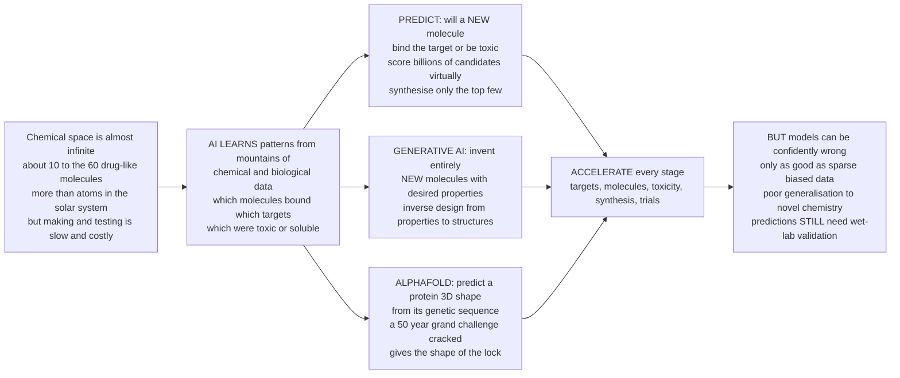

# 🤖 AI and Machine Learning in Drug Discovery

> [!abstract] TL;DR
> Drug discovery is drowning in a paradox: the number of drug-like molecules that *could* exist is estimated at around **10^60** — more than the atoms in the solar system — yet a lab can only make and test a vanishingly tiny sliver of them. That is a **needle-in-an-impossibly-large-haystack** problem, exactly what modern **artificial intelligence** excels at. AI works by learning patterns from **mountains of chemical and biological data** (which molecules bound which targets, which were toxic) to make two moves no human can: it **predicts** whether a *new* molecule will bind or be toxic — screening *billions* virtually in the time it takes to make one — and, with **generative AI**, it *invents entirely new molecules* engineered to have desired properties (inverse design, like a creative chemist dreaming up novel structures). Its most stunning triumph was **AlphaFold**, which cracked a 50-year grand challenge by predicting a protein's 3D shape from its genetic sequence, instantly handing structural biologists the shapes of nearly every human protein and supercharging design. AI now accelerates *every* stage — finding targets, generating molecules, predicting toxicity, planning synthesis, designing trials, repurposing drugs. But the usual AI cautions apply: models can be **confidently wrong**, are only as good as their often **sparse, biased, or noisy training data**, generalize poorly to novel chemistry (**activity cliffs**), and their predictions **still must be validated in the real lab**. AI is transforming drug discovery from a slow, luck-driven *search* into a faster, data-driven *design science* — while learning where its confident guesses can mislead.
>
> *Educational science note — not individual medical or dosing advice.*

---

## Intuition

**Analogy FIRST — searching an ocean the size of the solar system with a thimble.** Imagine you must find a single, perfect grain of sand, but the beach is not a beach — it is an **ocean of roughly 10^60 possible drug-like molecules**, more grains than there are atoms in our entire solar system. Your only tool to check any one grain the old way is a **thimble**: making and testing a real molecule in a lab is slow, costs money, and takes days to weeks. At that rate you could search for a billion years and never scratch the surface. This is drug discovery's central agony — an **almost-infinite space of possibilities** paired with a **tiny, expensive ability to actually look**.

Now hand the problem to a modern **artificial intelligence**. It cannot make molecules either — but it has read the results of *every* thimble anyone has ever dipped: enormous databases of which molecules bound which targets, which dissolved, which poisoned cells. From those mountains of examples it **learns the patterns** connecting a molecule's *structure* to its *behaviour*. Now, given a brand-new molecule it has never seen, it can **predict** in milliseconds: *will this bind the target? will it be toxic?* Suddenly you can **screen billions of candidates virtually**, ranking them so chemists only bother synthesising the most promising handful. The thimble becomes a searchlight.

**Generative AI goes one bolder step further.** Instead of merely *screening molecules that already exist*, it **invents brand-new ones** — designed from scratch to have the properties you asked for. This is **inverse design**: you specify the destination (bind this target, be non-toxic, be soluble) and the model *dreams up novel structures* to get there, like a tireless creative chemist proposing molecules nobody has ever drawn. And the single most breathtaking triumph of this whole revolution was **AlphaFold**: for fifty years, predicting a protein's folded **3D shape** from its raw genetic sequence was biology's great unsolved puzzle — and a deep-learning system essentially *solved it*, delivering accurate structures for nearly every known protein and giving drug designers the **shape of the lock** so they can design the key. AI is now accelerating *every* stage of the pipeline. But — and this matters — it inherits every weakness of AI everywhere: it can be **confidently, fluently wrong**; it is only as good as its **training data** (which is often sparse, biased toward what's already been studied, and noisy); it stumbles on genuinely **novel chemistry** outside what it has seen; and **nothing it predicts is real until the wet lab confirms it**. AI turns drug discovery from a slow, serendipity-driven *search* into a faster, data-driven *design* — provided we remember it is guessing, and check its guesses.

---

## How It Works

### Core mechanics

The engine has four moving parts: **represent** molecules as numbers, **learn** from data, **predict or generate**, then **validate** in reality.

1. **Represent the molecule numerically.** A model cannot read a structural drawing; it needs numbers. Chemists encode molecules as **fingerprints** (bit-vectors flagging which substructures are present), **SMILES strings** (a molecule written as text, e.g. `CC(=O)Oc1ccccc1C(=O)O` for aspirin), **molecular graphs** (atoms as nodes, bonds as edges — the natural input for **graph neural networks**), or full **3D structures**. The representation is a design choice that decides what the model can even "see."
2. **Learn patterns from data.** Trained on databases pairing structures with measured outcomes (ChEMBL, PubChem, PDB, assay results, genomics, the literature), the model fits the **structure-to-property map**: classical **QSAR** regressions, gradient-boosted trees, deep **neural networks**, graph networks, and transformer **language models** on molecular strings. This is the descendant of decades of **quantitative structure-activity relationship (QSAR)** work, now supercharged by scale.
3. **Predict — the discriminative mode.** Given a *new* molecule, the model outputs a number: predicted binding affinity, **ADMET** (absorption/distribution/metabolism/excretion/toxicity), solubility, or toxicity risk. Because prediction is near-instant and free, you can **virtually screen billions** of candidates and only synthesise the top-ranked few — this is **virtual screening**, the workhorse application.
4. **Generate — the inverse-design mode.** Generative models (variational autoencoders, GANs, **diffusion models**, reinforcement learning, and molecular language models) run the arrow *backwards*: from *desired properties* to *novel structures*. Instead of picking from a fixed catalogue, they **invent** molecules optimised for a target profile, exploring chemistry no library contains.
5. **Predict structure — the AlphaFold leap.** A special, landmark case: deep learning predicts a **protein's 3D structure from its amino-acid sequence** (AlphaFold), and predicts how a small molecule **docks** into that structure. Knowing the target's shape transforms **structure-based design** from a bottleneck (structures took years of crystallography) into a starting assumption.
6. **Validate — the non-negotiable step.** Every confident prediction is a *hypothesis*. It must be **made and tested in the wet lab**, and every drug must still pass staged **clinical trials**. AI feeds better candidates *into* the pipeline; it does not bypass it.

### Where AI acts across the pipeline

- **Target discovery & biology** — mining omics, networks, and literature to find and validate *what* to drug.
- **Hit finding** — virtual screening of billions; predicting activity to enrich screening decks.
- **Lead optimisation** — predicting ADMET/toxicity and generating better analogs to compress the design-make-test-analyze cycle.
- **Structure** — AlphaFold-scale structure prediction and docking/binding-pose prediction.
- **Downstream** — **retrosynthesis** (predicting how to *make* a molecule), **drug repurposing**, trial design, and analysis of real-world/clinical data.

### Flow



---

## Key Concepts

### Secondary (explain to a bright teenager)

- **The haystack is basically infinite.** There are roughly **10^60** possible drug-like molecules — vastly more than we could ever build and test. AI helps us search this ocean without dipping the thimble every time.
- **AI learns from examples.** Show a model millions of molecules and whether each one worked or was toxic, and it learns the *patterns* — so it can guess about brand-new molecules it has never seen.
- **Two superpowers.** (1) **Prediction**: guess whether a new molecule will work or be poisonous, so we test only the best ones. (2) **Generation**: *invent* brand-new molecules designed to have the properties we want.
- **AlphaFold was a landmark.** For 50 years scientists could not reliably predict a protein's folded 3D shape from its gene. An AI finally did it — and knowing the shape helps us design drugs that fit.
- **AI is not magic.** It can be **confidently wrong**, it only knows what its data taught it, and *every* prediction must still be checked in a real laboratory. AI speeds up discovery; it does not replace testing.

### Undergraduate (needs some biology / ML background)

- **Why AI *fits* drug discovery.** The problem is a **prediction-and-search** problem over an enormous, mostly-unexplored space, with an explosion of **data** (compound-activity databases like ChEMBL, genomics, protein structures, literature) and cheap **compute** to learn from it. That combination is precisely where machine learning shines.
- **Molecular representations.** **Fingerprints** (substructure bit-vectors), **SMILES** (text), **molecular graphs** (for **graph neural networks**), and **3D** coordinates. The representation determines the model class and what patterns are learnable.
- **Property & activity prediction (QSAR's descendants).** From linear **QSAR** to random forests, gradient boosting, deep nets, and **GNNs** — models predict binding affinity, **ADMET**, solubility, and toxicity. Feeding these into ranking enables **virtual screening** of billions of compounds.
- **Generative molecular design (inverse design).** **VAEs**, **GANs**, **diffusion models**, **reinforcement learning**, and molecular **language models** generate novel structures optimised toward a target property — expanding *beyond* existing libraries rather than selecting *from* them.
- **Structure prediction & docking.** **AlphaFold** solved single-chain protein structure prediction to near-experimental accuracy; docking predicts the **binding pose** of a ligand in a pocket. Together they power **structure-based design** at scale.
- **Learning paradigms.** **Supervised** (labelled activity/tox data), **unsupervised** (clustering chemical space, learned embeddings), **reinforcement/active learning** (optimise toward a reward), **generative** (model the data distribution to sample new molecules).
- **The data problem is the whole ball game.** Public bioactivity data is **sparse, imbalanced (few actives), noisy, and biased** toward well-studied targets and "make-able" chemistry. Model quality is capped by data quality — *garbage in, confident garbage out*.

### Graduate (system-level / methodological)

- **Distribution shift and generalisation.** Models interpolate well *inside* their training distribution and often fail *outside* it — the core risk in a field whose entire value is exploring **novel chemotypes**. Scaffold-based or time-split validation (not random split) is essential; random splits leak near-duplicates and massively inflate apparent performance.
- **Activity cliffs.** SAR is not smooth: two nearly-identical molecules can have wildly different activity. Cliffs violate the smoothness assumption most regressors rely on, so a model confidently interpolates a value that is simply wrong — a structural reason for "confidently wrong."
- **The confidently-wrong / calibration problem.** Neural nets are frequently **over-confident** and poorly **calibrated**; they emit a crisp number with no honest uncertainty. **Uncertainty quantification** (ensembles, Gaussian processes, conformal prediction) and **applicability-domain** estimates are needed to know *when to trust* a prediction — and to drive **active learning**.
- **AlphaFold's reach and limits.** AlphaFold predicts (mostly) a *single static* structure with a per-residue confidence (**pLDDT**); it does not natively model **conformational ensembles**, ligand-induced fit, most **mutations'** functional effects, or (in its original form) small-molecule complexes. Successor and diffusion-based methods (e.g. **AlphaFold-Multimer**, **RoseTTAFold**, structure-and-ligand co-folding) extend toward complexes. Structure alone is a starting point, not a designed drug.
- **Generative model pathologies.** Generators can propose molecules that are **invalid**, **unsynthesisable**, or that "**reward-hack**" the scoring function (maximising a predicted score the way an adversarial example does, not real activity). Guardrails: validity/synthesisability filters, **retrosynthesis** scoring, and docking/physics-based re-scoring.
- **Reproducibility & the hype cycle.** Data leakage, weak baselines, cherry-picked targets, and unblinded retrospective benchmarks have produced inflated claims; rigorous, **prospective**, wet-lab-validated evaluation is the only honest test. Well-designed simple baselines (e.g. nearest-neighbour on fingerprints) are famously hard to beat.
- **The still-essential wet lab and clinic.** Even the strongest in-silico case is a hypothesis; **experimental validation** and staged **clinical trials** remain gating. AI's dividend is *fewer, better* candidates and *faster early cycles*, not a bypass of biology or regulation. Milestones — AI-*designed* molecules reaching clinical trials — are real but early, and clinical-stage attrition still applies.

---

## Python Demo

```python
# AI in drug discovery — three linked views of the same idea:
#   (a) ML PROPERTY PREDICTION : train a simple model on fingerprint-like
#       descriptors to predict activity (pIC50) for UNSEEN molecules (QSAR).
#   (b) VIRTUAL SCREENING      : rank a large virtual library by predicted
#       activity and recover the rare actives far faster than random picking
#       (enrichment) — this is how you "screen billions virtually".
#   (c) GENERATIVE / ACTIVE-LEARNING : an inverse-design loop whose proposals
#       drift toward a target property, so the BEST molecule found improves
#       over iterations — vs blind random library enumeration.
# All data are synthetic teaching values. numpy + matplotlib only.
# Educational content, not individual medical advice.
import numpy as np
import matplotlib.pyplot as plt

rng = np.random.default_rng(42)

# =====================================================================
# (a) ML PROPERTY / ACTIVITY PREDICTION (a toy QSAR model)
#   Each "molecule" is a fingerprint-like descriptor vector. A hidden
#   structure-activity map turns descriptors into activity (pIC50) with
#   noise + a nonlinear term. We fit ridge regression and test on unseen
#   molecules — the core loop behind ML virtual screening.
# =====================================================================
n_features = 20
n_train, n_test = 400, 200
true_w = rng.normal(0, 1, n_features)          # hidden SAR map

def make_molecules(n):
    X = rng.normal(0, 1, (n, n_features))       # descriptor vectors
    y = X @ true_w + 0.4 * X[:, 0]**2 + rng.normal(0, 0.8, n)  # activity
    return X, y

X_tr, y_tr = make_molecules(n_train)
X_te, y_te = make_molecules(n_test)

lam = 1.0                                        # ridge regularisation
w_hat = np.linalg.solve(X_tr.T @ X_tr + lam*np.eye(n_features), X_tr.T @ y_tr)
y_pred = X_te @ w_hat
r2 = 1 - np.sum((y_te - y_pred)**2) / np.sum((y_te - y_te.mean())**2)

# =====================================================================
# (b) VIRTUAL SCREENING ENRICHMENT
#   A large virtual library, mostly inactive with a rare 2% active.
#   Score every molecule with the trained model, rank best-first, and
#   ask: screening the top k%, what fraction of the true actives do we
#   recover? A good model concentrates actives at the top (enrichment).
# =====================================================================
n_lib = 20000
Xl = rng.normal(0, 1, (n_lib, n_features))
true_act = Xl @ true_w + 0.4*Xl[:, 0]**2 + rng.normal(0, 0.8, n_lib)
is_active = true_act >= np.quantile(true_act, 0.98)     # top 2% = actives
order = np.argsort(-(Xl @ w_hat))                        # rank by prediction
recovered = np.cumsum(is_active[order]) / is_active.sum()
frac_screened = np.arange(1, n_lib+1) / n_lib
top1 = recovered[int(0.01*n_lib)-1]                      # actives found in top 1%

# =====================================================================
# (c) GENERATIVE / ACTIVE-LEARNING EXPLORATION
#   An inverse-design loop: each round proposes a batch of candidate
#   molecules; a learned policy nudges the batch toward higher property,
#   so the BEST-so-far property climbs toward the target — vs random
#   enumeration of a fixed, unguided library that barely improves.
# =====================================================================
n_iter, batch, target = 30, 40, 8.0
mu = 3.0                                          # guided proposal mean
best_guided, best_random = [], []
cur_g = cur_r = -np.inf
for t in range(n_iter):
    prop_g = rng.normal(mu, 0.7, batch)          # guided proposals
    mu += 0.18 * (target - mu)                    # drift toward target
    cur_g = max(cur_g, prop_g.max()); best_guided.append(cur_g)
    prop_r = rng.normal(3.0, 0.7, batch)          # random library, no learning
    cur_r = max(cur_r, prop_r.max()); best_random.append(cur_r)

# =====================================================================
# PLOT
# =====================================================================
fig, ax = plt.subplots(1, 3, figsize=(18, 5.2))

# --- (a) predicted vs actual ---
lo, hi = min(y_te.min(), y_pred.min()), max(y_te.max(), y_pred.max())
ax[0].scatter(y_te, y_pred, s=16, alpha=0.5, color="steelblue", edgecolor="none")
ax[0].plot([lo, hi], [lo, hi], "k--", lw=1.5, label="perfect prediction")
ax[0].set_xlabel("Measured activity  pIC50 (unseen molecules)")
ax[0].set_ylabel("Model-predicted activity  pIC50")
ax[0].set_title(f"(a) ML property prediction (QSAR)\nR-squared = {r2:.2f} on unseen molecules")
ax[0].legend(fontsize=8); ax[0].grid(alpha=0.3)

# --- (b) enrichment curve ---
ax[1].plot(frac_screened*100, recovered*100, color="darkgreen", lw=2.5,
           label="ML-ranked screening")
ax[1].plot([0, 100], [0, 100], "k--", lw=1.5, label="random picking")
ax[1].axvline(1.0, color="crimson", ls=":", lw=1.5)
ax[1].annotate(f"top 1% recovers\n{top1*100:.0f}% of actives",
               xy=(1.0, top1*100), xytext=(18, top1*100-18),
               arrowprops=dict(arrowstyle="->", color="crimson"),
               fontsize=8.5, color="crimson")
ax[1].set_xlabel("Percent of virtual library screened (ranked)")
ax[1].set_ylabel("Percent of true actives recovered")
ax[1].set_title("(b) Virtual screening enrichment:\nfind actives fast, skip the rest")
ax[1].legend(fontsize=8, loc="lower right"); ax[1].grid(alpha=0.3)
ax[1].set_xlim(0, 100); ax[1].set_ylim(0, 101)

# --- (c) generative / active-learning loop ---
it = np.arange(1, n_iter+1)
ax[2].plot(it, best_guided, "o-", color="purple", lw=2, ms=4,
           label="Guided generative / active learning")
ax[2].plot(it, best_random, "s--", color="gray", lw=2, ms=4,
           label="Random library enumeration")
ax[2].axhline(target, color="crimson", ls=":", lw=1.5, label="target property")
ax[2].set_xlabel("Design-make-test iteration")
ax[2].set_ylabel("Best property found so far  pIC50")
ax[2].set_title("(c) Generative inverse design:\nsteer chemical space toward the target")
ax[2].legend(fontsize=8, loc="lower right"); ax[2].grid(alpha=0.3)

plt.tight_layout()
plt.savefig("ai_drug_discovery.png", dpi=120)
plt.show()

# --- console summary ---
print(f"(a) Property prediction R-squared on unseen molecules = {r2:.2f}")
print(f"(b) Random screening of top 1% would find ~1% of actives; "
      f"ML ranking finds {top1*100:.0f}% -> ~{top1*100:.0f}x enrichment")
print(f"(c) Guided search best property = {best_guided[-1]:.2f} "
      f"vs random {best_random[-1]:.2f} (target {target})")
```

**What the plots show.** Panel **(a)** is **ML property prediction** made concrete: trained only on some molecules, the model predicts activity for *unseen* ones and the points hug the diagonal (a decent R-squared) — this is the descendant of **QSAR** and the atom of every ML screen. Panel **(b)** turns that prediction into power: ranking a 20,000-molecule virtual library by predicted activity and screening just the **top 1%** recovers the large majority of the rare true actives, versus ~1% by random picking — the **enrichment** that lets teams "screen billions virtually" and synthesise only a handful. Panel **(c)** is the **generative / active-learning** loop: a guided inverse-design policy steers each batch of proposals toward higher property, so the *best molecule found* climbs steadily toward the target, while blind random enumeration of a fixed library stalls — the visual signature of **designing** new chemistry rather than merely **selecting** from a catalogue. (The same demo also hints at the perils: swap the test set for molecules drawn from a *different* distribution — a novel chemotype — and panel (a)'s tidy diagonal would fall apart, the picture of poor generalisation and "confidently wrong.")

---

## Real-World Applications

> **AlphaFold — the landmark that reset the field.** For half a century, the "**protein folding problem**" — predicting a protein's 3D shape from its amino-acid sequence — was one of biology's grandest challenges, because a protein's *shape is its function* and shape is what a drug must fit. In 2020–21 DeepMind's **AlphaFold2** essentially solved it at the CASP14 assessment, reaching near-experimental accuracy, and the **AlphaFold Protein Structure Database** then released predicted structures for **over 200 million proteins** — nearly the entire known protein universe — free to all. For drug discovery this collapsed a years-long crystallography bottleneck into a starting assumption: designers now begin with the **shape of the lock**. It is the clearest proof that deep learning can crack problems that resisted decades of conventional science — while also reminding us that a static predicted structure is a powerful *starting point*, not a finished drug.

- **Deep learning finds a new antibiotic (halicin).** Stokes et al. (2020) trained a graph neural network on molecules labelled for *E. coli* growth inhibition, then **virtually screened** vast chemical libraries and flagged a molecule — nicknamed **halicin** — structurally unlike existing antibiotics, which was then *experimentally confirmed* to have broad-spectrum activity. A textbook case of predict-then-validate discovering genuinely novel chemistry.
- **Generative design reaching the clinic.** Companies such as **Insilico Medicine**, **Exscientia**, and **Recursion** use generative chemistry and ML property prediction to compress hit-finding and lead optimisation from years to months, with AI-*designed* or AI-*prioritised* molecules entering **clinical trials** — early, closely-watched milestones for the whole approach.
- **Virtual screening at billion-molecule scale.** Ultra-large "make-on-demand" libraries (e.g. **Enamine REAL**, billions of compounds) are dockable and ML-screenable in silico; teams computationally triage billions to synthesise only the most promising few, a scale impossible for physical **high-throughput screening**.
- **ADMET and toxicity prediction.** ML models predict solubility, permeability, metabolic stability, **hERG** cardiotoxicity, and mutagenicity to kill bad candidates *before* expensive synthesis and animal testing — directly attacking the pipeline's dominant attrition point in lead optimisation.
- **Retrosynthesis and repurposing.** Transformer models predict **synthetic routes** (how to *make* a proposed molecule), while ML mines existing-drug data to find **repurposing** opportunities — reusing approved, already-safety-tested drugs for new diseases.
- **Bridging to the clinic.** Downstream, the same data-driven mindset informs **precision medicine** (matching drugs to patients) and clinical AI — the connection this note carries into the Clinical Medicine vault.

---

## Common Pitfalls

- **Trusting a confident number without uncertainty.** Neural nets are routinely **over-confident and poorly calibrated** — they output a crisp value with no honest sense of doubt. Without **uncertainty quantification** and an **applicability domain**, you cannot tell a reliable prediction from a fluent hallucination. Treat every prediction as a hypothesis, not a result.
- **Random-split leakage inflating performance.** Splitting train/test **randomly** leaves near-duplicate molecules on both sides, so the model "memorises" and reports spectacular metrics that **collapse on real novel chemistry**. Use **scaffold** or **time-based** splits to measure the generalisation you actually need.
- **Ignoring distribution shift and activity cliffs.** Models interpolate inside their training data and fail outside it — yet the whole *point* is exploring **novel chemotypes**. And SAR is not smooth: **activity cliffs** mean a tiny structural change can flip activity, so a confidently interpolated value is simply wrong.
- **Garbage in, confident garbage out.** Public bioactivity data is **sparse, noisy, imbalanced (few actives), and biased** toward well-studied targets and easy-to-make chemistry. The model can only be as good as this data; unexamined bias becomes confident bias.
- **Reward-hacking generative models.** A generator told to *maximise a predicted score* may exploit blind spots in that scorer — proposing **invalid, unsynthesisable, or adversarial** molecules that score high but are not real drugs. Always gate outputs through validity, **synthesisability/retrosynthesis**, and physics-based re-scoring.
- **Believing structure equals drug.** **AlphaFold** gives a (mostly static) predicted structure with a confidence score, not a binding drug, not a conformational ensemble, and not a validated pocket. It supercharges design; it does not complete it.
- **Assuming AI removes wet-lab and clinical validation.** AI accelerates *discovery* and improves candidate quality, but human **safety and efficacy must still be proven in staged clinical trials**. The regulatory funnel is not something AI bypasses — at best it feeds better candidates into it.

---

## Related Concepts

This note is the **AI/data-driven capstone** of the *Computational and Modern Drug Design* section and the explicit **bridge from the AI-ML vault into pharmacology**. Its section siblings are referenced here in prose (same folder): *Computational Drug Design* frames the broader in-silico toolkit this note's methods sit within; *Structure-Based Drug Design and Docking* is where **AlphaFold** structures and docking predictions are actually used to design against a target's 3D shape; *Ligand-Based Design and QSAR* is the classical ancestor of the ML property-prediction models shown here; *Cheminformatics and Chemical Space* supplies the molecular representations (fingerprints, SMILES, graphs) and the ~10^60 space these models search; and *The Reach and Future of Pharmacology* situates AI-driven discovery within where the whole field is heading.

Verified cross-links (other sections and vaults):

- [[Pharmacology/04_Drug_Discovery_Pipeline/The_Drug_Discovery_Pipeline|The Drug Discovery Pipeline]] — the end-to-end funnel; this note shows *which stage* each AI method accelerates and why the ~10% clinical attrition still applies.
- [[Pharmacology/04_Drug_Discovery_Pipeline/Hit_Discovery_and_High_Throughput_Screening|Hit Discovery and High-Throughput Screening]] — **virtual screening** is the in-silico counterpart to physical HTS; the enrichment demo is exactly this stage.
- [[Pharmacology/04_Drug_Discovery_Pipeline/Lead_Optimization_and_Medicinal_Chemistry|Lead Optimization and Medicinal Chemistry]] — generative and ADMET-predictive models plug directly into the design-make-test-analyze cycle to cut attrition.
- [[Pharmacology/04_Drug_Discovery_Pipeline/Target_Identification_and_Validation|Target Identification and Validation]] — AI mines omics, networks, and literature to find and validate the target at the front of the funnel.
- [[Pharmacology/04_Drug_Discovery_Pipeline/Preclinical_Development_and_Toxicology|Preclinical Development and Toxicology]] — ML toxicity/ADMET prediction aims to kill unsafe candidates *before* the expensive preclinical and clinical stages.
- [[Pharmacology/01_Principles_of_Pharmacology/Pharmacokinetics_ADME|Pharmacokinetics (ADME)]] — the **ADMET** properties that predictive models forecast are the pharmacokinetics defined here.
- [[Pharmacology/01_Principles_of_Pharmacology/Drug_Receptor_Interactions_and_Binding|Drug-Receptor Interactions and Binding]] — "predict whether a molecule binds" is predicting the affinity/pose of this interaction.
- [[Pharmacology/02_Molecular_Targets_and_Mechanisms/Drug_Targets_and_the_Druggable_Genome|Drug Targets and the Druggable Genome]] — the targets whose druggability and structure AI helps identify and design against.
- [[AI-ML/02_Deep_Learning/Fundamentals/Neural_Network_Basics|Neural Network Basics]] — the deep-learning engine (and its descendants like graph nets and transformers) underlying prediction, generation, and AlphaFold.
- [[AI-ML/02_Deep_Learning/Architectures/Transformer_Architecture|Transformer Architecture]] — powers molecular **language models** (SMILES generation) and retrosynthesis, and is a core building block of modern structure predictors.
- [[AI-ML/03_NLP/Language_Models/Language_Model_Basics|Language Model Basics]] — treating a molecule as a **SMILES string** lets language-model machinery generate novel structures.
- [[AI-ML/01_Classical_ML/Unsupervised/UMAP|UMAP]] — the kind of dimensionality reduction used to draw low-dimensional **chemical space** maps with actives clustered.
- [[AI-ML/01_Classical_ML/Evaluation/Cross_Validation|Cross-Validation]] — why **scaffold/time splits** (not random splits) are essential to measure real generalisation and avoid inflated claims.
- [[AI-ML/00_Foundations/Math/Probability_and_Statistics|Probability and Statistics]] — the basis of uncertainty quantification, calibration, and the enrichment/attrition statistics here.
- [[Chemistry/06_Biochemistry/Protein_Structure_and_Function|Protein Structure and Function]] — the protein whose 3D shape **AlphaFold** predicts and against which drugs are designed.
- [[Chemistry/04_Organic_Chemistry/Structure_Bonding_and_Functional_Groups|Structure, Bonding and Functional Groups]] — the chemical structures that fingerprints, SMILES, and molecular graphs encode as model input.
- [[Clinical_Medicine/06_Clinical_Reasoning_and_Modern_Medicine/AI_and_Technology_in_Clinical_Medicine|AI and Technology in Clinical Medicine]] — the clinical counterpart: the same data-driven mindset applied downstream in diagnosis and care.
- [[Clinical_Medicine/06_Clinical_Reasoning_and_Modern_Medicine/Precision_Medicine_and_Genomics_in_the_Clinic|Precision Medicine and Genomics in the Clinic]] — matching AI-discovered drugs to the right patients closes the loop from molecule to bedside.

---

## Review Questions

**Secondary**
1. Roughly how many drug-like molecules could exist, and why does that number make drug discovery a good problem for AI rather than for testing every molecule in a lab?
2. Explain in your own words the difference between an AI that **predicts** whether a molecule will work and an AI that **generates** brand-new molecules. Give a one-line example of each.
3. Why was **AlphaFold** such a big deal, and why does knowing a protein's 3D shape help in designing a drug?

**Undergraduate**
4. Trace where AI acts across the drug discovery pipeline — from target identification to lead optimisation to structure. For each, name what the model predicts or generates and why it saves time or money.
5. What is **virtual screening**, and how does an ML property-prediction model turn a billion-molecule library into a short synthesis list? Relate this to the enrichment curve in the demo.
6. Give three concrete reasons the *training data* limits an AI drug-discovery model, and explain how each could make the model **confidently wrong** on a new molecule.

**Graduate**
7. Why does **random** train/test splitting dramatically overstate a model's performance in cheminformatics, and how do **scaffold** or **time-based** splits and the concept of an **applicability domain** give a more honest estimate of generalisation to novel chemotypes?
8. Explain **activity cliffs** and **distribution shift** as mechanistic reasons a well-trained model can fail. How do **uncertainty quantification** and **active learning** turn "I don't know" from a weakness into a design advantage?
9. AlphaFold "solved" static single-protein structure prediction — yet drug design still needs conformational ensembles, ligand-bound complexes, and mutation effects. Argue where AI has genuinely transformed drug discovery versus where its confident outputs still demand wet-lab and clinical validation, using at least one real example.

---

## Sources

- Vamathevan, J., Clark, D., Czodrowski, P., et al. (2019). "Applications of machine learning in drug discovery and development." **Nature Reviews Drug Discovery** 18(6): 463–477.
- Jumper, J., Evans, R., Pritzel, A., et al. (2021). "Highly accurate protein structure prediction with AlphaFold." **Nature** 596: 583–589.
- Stokes, J. M., Yang, K., Swanson, K., et al. (2020). "A deep learning approach to antibiotic discovery." **Cell** 180(4): 688–702 (the halicin study).
- Schneider, G. (2018). "Automating drug discovery." **Nature Reviews Drug Discovery** 17(2): 97–113.
- Chen, H., Engkvist, O., Wang, Y., Olivecrona, M., Blaschke, T. (2018). "The rise of deep learning in drug discovery." **Drug Discovery Today** 23(6): 1241–1250.

---

#pharmacology #AI-drug-discovery #machine-learning #alphafold #generative-design
