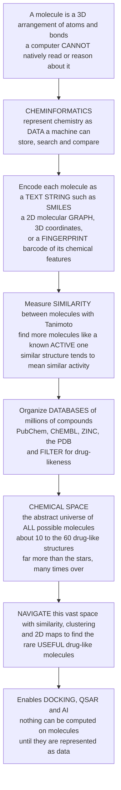

# 🗺️ Cheminformatics and Chemical Space: Representing Molecules as Data and Navigating the Universe of Compounds

> [!abstract] TL;DR
> Before a computer can help design a drug, it must first be able to **read and reason about molecules** — but a molecule is a 3D cloud of atoms and bonds, not something a machine natively understands. **Cheminformatics** is the discipline of turning chemistry into **data**: encoding a molecule as a text string (**SMILES** — you write `CCO` for ethanol), as a 2D **molecular graph** of atoms and bonds, as 3D coordinates, or as a **fingerprint** — a barcode of *which chemical features a molecule contains*. Fingerprints let you instantly measure how **similar** two molecules are (the **Tanimoto** coefficient), which powers the single most useful query in drug discovery: *"find me more molecules like this active one."* Zoom out and you meet the mind-bending idea of **chemical space** — the abstract universe of **all possible molecules**, estimated at roughly **10⁶⁰** drug-like structures, vastly more than the stars in the observable universe. We have synthesized only about **10⁸** of them — a vanishing speck. Drug discovery is therefore a **search problem of staggering scale**, and cheminformatics supplies the map, compass, and databases: representations to compute on, similarity metrics to navigate by, million-compound databases to search, and drug-likeness filters to focus the hunt. It is the unglamorous but essential plumbing beneath **all** computational drug design — docking, QSAR, and AI — because *you cannot compute on molecules until you can represent them as data.*
>
> *Educational science note — not individual medical or dosing advice.*

---

## Intuition

**Analogy FIRST — a molecule is a physical object; a computer only understands data, so first you must "photograph and barcode" every molecule.** Imagine you run the world's largest warehouse of chemicals and you want a robot to help you find useful ones. The robot cannot pick up a beaker and *see* that two compounds are chemically cousins — it has no eyes and no chemical intuition. So before the robot can do anything, you must convert every molecule into something it *can* handle: **data**. You take each molecule and either **write it down as a short text string** (this is **SMILES** — ethanol becomes the string `CCO`, aspirin becomes `CC(=O)Oc1ccccc1C(=O)O`), or you stamp it with a **barcode** that records *which chemical features it has* — does it contain a benzene ring? an amine? a carboxylic acid? That barcode is a **molecular fingerprint**.

**Once everything is barcoded, "similar" becomes a number you can compute.** Two molecules whose barcodes light up in many of the *same* places are chemically alike; the fraction of shared bits is the **Tanimoto similarity**, a number from 0 to 1. Now the robot can do something magical: hand it one molecule that *works* against your disease target, and it can instantly scan a database of a **million** compounds and rank them by how similar their barcodes are — surfacing the ones most likely to *also* work. That single trick — *"find more molecules like this active one"* — is the beating heart of early drug discovery, and it rests on the quiet, deep principle that **structurally similar molecules tend to behave similarly**.

**Now zoom all the way out, and the analogy turns vertiginous.** Every possible way of legally bonding a handful of carbon, nitrogen, oxygen, and hydrogen atoms into a drug-sized molecule is a *point* in an abstract landscape called **chemical space**. How big is this landscape? Estimates for drug-like molecules run to about **10⁶⁰** — a one followed by sixty zeros. There are only about **10²⁴** stars in the observable universe, so chemical space is larger than *a trillion trillion trillion universes' worth of stars*. And of that unimaginable expanse, chemistry has physically made only about **10⁸** molecules — you could search a *billion* new compounds every second since the Big Bang and still not scratch it. Drug discovery, then, is the search for the rare useful molecules hidden in an almost inconceivably vast dark ocean. **Cheminformatics is the map and compass**: it gives us ways to *represent* molecules as data, *measure* their similarity, *organize* databases of the millions we know, *filter* for the drug-like regions worth exploring, and *navigate* toward promising islands. It is the plumbing that makes docking, QSAR, and AI even *possible* — because none of them can run until molecules have been turned into numbers.

---

## How It Works

### Core mechanics

1. **Represent the molecule as data (the foundational step).** A molecule can be encoded at increasing levels of richness:
   - **Line notations** — compact text strings. **SMILES** (`CCO` for ethanol) writes atoms and bonds as characters a computer can parse; **InChI** is a canonical, standardized identifier for unambiguous database lookup.
   - **2D connection table / molecular graph** — atoms are **nodes**, bonds are **edges**. This *graph* is the natural object for substructure search and the direct input to **graph neural networks** (link to AI).
   - **3D coordinates / conformers** — the actual spatial arrangement, needed for shape, docking, and pharmacophores.
   - **Descriptors and fingerprints** — reduce a molecule to **numbers**: *descriptors* are computed quantities (molecular weight, logP, polar surface area); *fingerprints* are **bit vectors** that flag which substructures or circular atom-environments are present (MACCS keys, ECFP/Morgan). These vectors are what you compute *similarity* and *machine-learning models* on.
2. **Measure molecular similarity.** On binary fingerprints the standard metric is the **Tanimoto (Jaccard) coefficient**: the number of bits ON in *both* molecules divided by the number ON in *either*. It runs 0 (nothing in common) to 1 (identical fingerprints). This operationalizes the **similar-property principle** — structurally similar molecules tend to have similar activity.
3. **Search, cluster, and filter.** With a similarity metric you can run **similarity searching** (rank a library against a known active — literally nearest-neighbor search), **substructure searching** (find everything containing a query fragment), **pharmacophore searching** (find a 3D arrangement of features), **clustering** (group a library into chemotypes), and **diversity analysis** (pick a spread-out subset). **Drug-likeness filters** (Lipinski's Rule of Five, Veber, PAINS, lead-likeness) prune obviously unsuitable regions so you search where drugs actually live.
4. **Organize it in databases.** The known and purchasable universe lives in big repositories — **PubChem** and **ChEMBL** (compounds + bioactivity), **ZINC** (purchasable/screenable), the **Protein Data Bank** (3D structures) — plus **enumerated "make-on-demand" virtual libraries** of billions of not-yet-synthesized compounds. Toolkits like **RDKit** do the parsing, fingerprinting, and searching.
5. **Frame discovery as navigating chemical space.** The full space of possible drug-like molecules is astronomically large (about **10⁶⁰**); we have made a mere **~10⁸**. Because you cannot enumerate it, you **navigate** it — using similarity, clustering, dimensionality reduction (**PCA / t-SNE / UMAP** maps), and generative models — toward the rare "useful" regions.
6. **Everything downstream depends on step 1.** Docking needs 3D representations and scoreable poses; QSAR needs descriptors/fingerprints as features; AI needs graphs or learned embeddings; virtual screening needs searchable, filtered libraries. *Garbage in, garbage out*: the quality of representation and curated data caps the quality of every model built on top.

### Flow — from an unreadable molecule to a navigable universe



---

## Key Concepts

### Secondary (explain to a bright teenager)

- **Computers can't read molecules — you have to turn them into data first.** A molecule is a physical thing made of atoms. Before software can help, we rewrite each molecule as text or numbers the computer can handle. This whole craft is **cheminformatics**.
- **SMILES is a molecule written as a short text string.** Ethanol is `CCO`; every atom and bond becomes a character. Now the computer can store and search millions of molecules like words in a dictionary.
- **A fingerprint is a molecule's barcode.** It records which chemical pieces the molecule contains (a ring here, an oxygen there). Two molecules with lots of the *same* barcode marks are chemically alike.
- **Similarity is the killer feature.** Give the computer one molecule that works, and it can instantly find the most *similar* molecules in a giant database — because similar molecules usually behave in similar ways. This is how you "find more like this."
- **Chemical space is the universe of all possible molecules.** It is unbelievably huge — around **10⁶⁰** drug-like molecules, more than all the stars in the sky many times over. We have made only a tiny speck of it. Finding a good drug is like searching that whole ocean for a few special drops.
- **Databases are our catalogs.** Places like **PubChem** and **ChEMBL** store millions of known molecules and what they do, so scientists can search them instead of starting from scratch.

### Undergraduate (needs some chemistry / programming)

- **Levels of molecular representation.** *Line notations* (**SMILES**, canonical SMILES, **InChI**/InChIKey for exact lookup) → *2D connection table / **molecular graph*** (atoms = nodes, bonds = edges) → *3D coordinates and conformers* → *descriptors and fingerprints* (numeric summaries). Each level supports different tasks; you pick the cheapest representation that captures the property you care about.
- **Descriptors vs fingerprints.** **Descriptors** are computed scalars — MW, logP, TPSA, H-bond donor/acceptor counts, ring counts — a handful of interpretable numbers. **Fingerprints** are high-dimensional **bit vectors** encoding *substructures*: **MACCS keys** (166 predefined structural questions), **ECFP/Morgan** circular fingerprints (hashed atom environments up to a radius). Fingerprints are the standard input to similarity and ML.
- **Tanimoto / Jaccard coefficient.** For binary fingerprints, $T = \dfrac{c}{a + b - c}$, where $a$ and $b$ are the bits ON in each molecule and $c$ the bits ON in *both*. Range 0–1; the de-facto similarity metric for 2D fingerprints. (Other coefficients: Dice, cosine.)
- **The similar-property principle.** *Structurally similar molecules tend to have similar properties and activity.* It is a **tendency, not a law**, but it justifies similarity searching, clustering, and read-across — the empirical foundation of ligand-based design.
- **Search modes.** **Similarity search** (rank a library by Tanimoto to a query active — nearest neighbors), **substructure search** (exact fragment match, uses subgraph isomorphism), **pharmacophore search** (3D feature pattern), plus **clustering** and **diversity picking** to organize or subsample collections.
- **Drug-likeness and quality filters.** **Lipinski's Rule of Five**, **Veber** (rotatable bonds, TPSA), **lead-likeness** (lower MW/logP to leave optimization headroom), and **PAINS** filters (remove pan-assay-interference nuisance scaffolds) shrink chemical space to the developable, non-artifactual regions (link to lead optimization).
- **Databases and toolkits.** **PubChem** (~10⁸ compounds), **ChEMBL** (curated bioactivities), **ZINC** (purchasable/screenable), **PDB** (protein–ligand structures); enumerated **make-on-demand** libraries (Enamine REAL, billions). **RDKit** is the dominant open-source toolkit for parsing, fingerprinting, and searching.

### Graduate (system-level / quantitative)

- **The staggering size of chemical space — and how it's estimated.** Exhaustive enumeration of small molecules (Reymond's **GDB-17**) yields ~**166 billion** molecules with ≤17 heavy atoms; extrapolations to drug-like space give **10³³–10⁶⁰**. Against the ~**10⁸** compounds ever synthesized, discovery has explored a *vanishing fraction* — a formal statement of why the problem is a search, not an enumeration.
- **Fingerprint design and its failure modes.** Hashed circular fingerprints (**ECFP**) fold vast substructure alphabets into fixed-length bit vectors, causing **bit collisions**; the radius and bit-length trade resolution against collision rate. Count vectors, folded vs unfolded, and feature vs connectivity variants (FCFP) change which "similarity" you compute — there is *no single* molecular similarity.
- **When the similar-property principle breaks — activity cliffs.** Pairs of molecules with high structural similarity but *large* activity differences ("activity cliffs") violate smoothness and defeat naive similarity-based prediction and interpolation; their density measures the *roughness* of a structure-activity landscape and bounds QSAR performance.
- **Dimensionality reduction for visualization.** **PCA** (linear, variance-preserving) and **t-SNE / UMAP** (nonlinear manifold) project high-dimensional fingerprint/descriptor space to 2D **chemical-space maps** that reveal chemotype clusters and diversity. *Caveat:* nonlinear-embedding distances and cluster sizes are **not faithful** — do not read them metrically.
- **The molecular graph as a learned representation.** Instead of fixed fingerprints, **graph neural networks** learn task-specific embeddings directly from the atom-bond graph; message passing produces continuous vectors that often outperform hand-crafted fingerprints and enable **generative** sampling of novel chemical space (link to AI).
- **Enumerated vs accessible space.** **Ultra-large virtual libraries** (10¹¹–10¹² make-on-demand compounds) are docked at scale to nominate physical hits before synthesis — but "enumerable" is not "synthesizable"; synthetic accessibility scoring and retrosynthesis gate what is truly reachable.
- **Data quality — the GIGO imperative.** Every downstream model inherits the errors in its inputs: structure **standardization** (tautomers, salts, charges, stereochemistry), **deduplication**, unit harmonization, and **bioactivity curation** (ChEMBL's confidence flags, assay heterogeneity) are prerequisites, not afterthoughts. Poorly curated chemistry silently poisons QSAR, similarity, and AI alike.

---

## Python Demo

```python
# Cheminformatics and chemical space -- four illustrative pieces:
#   (a) FINGERPRINT SIMILARITY : model molecules as binary fingerprints and
#       compute the TANIMOTO coefficient -> a similarity heatmap. Same-scaffold
#       molecules score high; different scaffolds score low.
#   (b) SIMILARITY SEARCH : given one ACTIVE query, rank a library by Tanimoto.
#       Because "similar structure -> similar activity", actives concentrate at
#       the top -> early enrichment (the basis of similarity-based screening).
#   (c) CHEMICAL SPACE MAP : project the fingerprint library to 2D with PCA
#       (implemented via SVD, numpy only) -> chemotype clusters / diversity.
#   (d) THE SCALE OF CHEMICAL SPACE : a log-scale bar dramatizing known (~1e8)
#       vs make-on-demand (~1e12) vs drug-like estimate (~1e60) compounds,
#       with the number of stars in the observable universe for perspective.
# All numbers are illustrative teaching values. Educational content, not medical advice.
import numpy as np
import matplotlib.pyplot as plt

rng = np.random.default_rng(42)

# ---------------------------------------------------------------------------
# Tanimoto (Jaccard) coefficient on binary fingerprints: shared / union bits
def tanimoto(fp1, fp2):
    inter = np.sum(fp1 & fp2)
    union = np.sum(fp1 | fp2)
    return inter / union if union else 0.0

# ---------------------------------------------------------------------------
# Build synthetic molecular fingerprints ("feature barcodes").
# Real fingerprints (ECFP/Morgan, MACCS) flag which substructures a molecule
# contains. Here we fabricate three chemical "series" that each share a
# common SCAFFOLD (shared ON bits) plus variable decorations, so that
# structurally related molecules end up with overlapping barcodes.
n_bits = 256
def make_series(scaffold_bits, n_members, n_variable=22):
    fps = np.zeros((n_members, n_bits), dtype=bool)
    for i in range(n_members):
        fps[i, scaffold_bits] = True                              # shared core
        fps[i, rng.choice(n_bits, n_variable, replace=False)] = True  # decorations
    return fps

scaffoldA = rng.choice(n_bits, 28, replace=False)
scaffoldB = rng.choice(n_bits, 28, replace=False)
scaffoldC = rng.choice(n_bits, 28, replace=False)
fps_A, fps_B, fps_C = make_series(scaffoldA, 40), make_series(scaffoldB, 40), make_series(scaffoldC, 40)
library = np.vstack([fps_A, fps_B, fps_C])
series  = np.array([0]*40 + [1]*40 + [2]*40)      # chemotype label per molecule

# Similar-property principle: series A shares the pharmacophore that confers
# ACTIVITY (active w.p. ~0.9); other series are mostly inactive (w.p. ~0.1).
p_active = np.where(series == 0, 0.90, 0.10)
active   = rng.random(len(library)) < p_active

fig, ax = plt.subplots(2, 2, figsize=(14, 10))

# ---------------------------------------------------------------------------
# (a) SIMILARITY HEATMAP among a small hand-picked set of molecules
pick  = [0, 1, 40, 41, 80, 81]                    # two from each series
names = ["A1", "A2", "B1", "B2", "C1", "C2"]
S = np.array([[tanimoto(library[i], library[j]) for j in pick] for i in pick])
im = ax[0, 0].imshow(S, cmap="viridis", vmin=0, vmax=1)
ax[0, 0].set_xticks(range(len(pick))); ax[0, 0].set_xticklabels(names)
ax[0, 0].set_yticks(range(len(pick))); ax[0, 0].set_yticklabels(names)
for i in range(len(pick)):
    for j in range(len(pick)):
        ax[0, 0].text(j, i, f"{S[i,j]:.2f}", ha="center", va="center",
                      color="white" if S[i, j] < 0.55 else "black", fontsize=8)
ax[0, 0].set_title("(a) Tanimoto similarity: same scaffold -> high, different -> low")
fig.colorbar(im, ax=ax[0, 0], fraction=0.046, pad=0.04, label="Tanimoto")

# ---------------------------------------------------------------------------
# (b) SIMILARITY SEARCH: rank library by Tanimoto to one active query
q = 2                                             # a known ACTIVE from series A
sims = np.array([tanimoto(library[q], library[k]) for k in range(len(library))])
order = np.argsort(sims)[::-1]                    # most similar first
order = order[order != q]                         # drop the query itself
ranks = np.arange(1, len(order) + 1)
ax[0, 1].scatter(ranks[active[order]],  sims[order][active[order]],
                 s=22, color="#27ae60", label="active", zorder=3)
ax[0, 1].scatter(ranks[~active[order]], sims[order][~active[order]],
                 s=16, color="#c0392b", alpha=0.5, label="inactive")
top_k = 20
enrich_top = 100 * active[order][:top_k].mean()
enrich_all = 100 * active.mean()
ax[0, 1].axvline(top_k, ls="--", color="gray", lw=1)
ax[0, 1].set_xlabel("Rank by similarity to the active query (most similar = 1)")
ax[0, 1].set_ylabel("Tanimoto similarity to query")
ax[0, 1].set_title(f"(b) Similarity search: actives enrich at the top\n"
                   f"top-{top_k} = {enrich_top:.0f}% active vs {enrich_all:.0f}% overall")
ax[0, 1].legend(fontsize=8)

# ---------------------------------------------------------------------------
# (c) CHEMICAL SPACE MAP: PCA of the fingerprint library via SVD (numpy only)
X = library.astype(float)
Xc = X - X.mean(axis=0)
U, Sig, Vt = np.linalg.svd(Xc, full_matrices=False)
coords = U[:, :2] * Sig[:2]                        # 2D principal-component scores
colors = {0: "#2980b9", 1: "#e67e22", 2: "#8e44ad"}
for s in (0, 1, 2):
    m = series == s
    ax[1, 0].scatter(coords[m, 0], coords[m, 1], s=26, alpha=0.75,
                     color=colors[s], label=f"chemotype {chr(65+s)}")
ax[1, 0].scatter(coords[q, 0], coords[q, 1], marker="*", s=320,
                 color="#c0392b", edgecolor="black", zorder=5, label="active query")
ax[1, 0].set_xlabel("PC 1"); ax[1, 0].set_ylabel("PC 2")
ax[1, 0].set_title("(c) Chemical space map (PCA): chemotypes cluster")
ax[1, 0].legend(fontsize=8)

# ---------------------------------------------------------------------------
# (d) THE SCALE OF CHEMICAL SPACE (log axis)
labels = ["Synthesized\n(known, ~1e8)", "Make-on-demand\nvirtual (~1e12)", "Drug-like\nestimate (~1e60)"]
sizes  = [1e8, 1e12, 1e60]
bars = ax[1, 1].bar(labels, sizes, color=["#95a5a6", "#f39c12", "#c0392b"])
ax[1, 1].set_yscale("log")
ax[1, 1].set_ylabel("Number of molecules (log scale)")
ax[1, 1].set_title("(d) The scale of chemical space: we've made a speck")
# reference line: stars in the observable universe (~1e24)
ax[1, 1].axhline(1e24, ls="--", color="navy", lw=1.5)
ax[1, 1].text(2.4, 1e24 * 3, "stars in observable\nuniverse ~1e24",
              color="navy", ha="right", fontsize=8)
for b, s in zip(bars, sizes):
    ax[1, 1].text(b.get_x() + b.get_width()/2, s * 3, f"1e{int(np.log10(s))}",
                  ha="center", fontsize=9, fontweight="bold")
ax[1, 1].set_ylim(1e6, 1e66)

plt.tight_layout()
plt.show()

# Console summary
print(f"(a) Within-series Tanimoto (A1,A2) = {tanimoto(library[0], library[1]):.2f} "
      f"| cross-series (A1,C1) = {tanimoto(library[0], library[80]):.2f}")
print(f"(b) Similarity search: top-{top_k} enrichment {enrich_top:.0f}% active "
      f"vs {enrich_all:.0f}% baseline  (similar-property principle at work)")
print(f"(c) PCA captured {100*(Sig[:2]**2).sum()/(Sig**2).sum():.1f}% of variance in 2 components")
print("(d) Known ~1e8  <<  make-on-demand ~1e12  <<<  drug-like ~1e60 "
      "(> a trillion-trillion-trillion universes of stars)")
```

**What it shows.** Panel **(a)** turns molecules into **binary fingerprints** and computes **Tanimoto similarity**: molecules sharing a scaffold score high (bright), different chemotypes score low (dark) — similarity is now a *number*. Panel **(b)** is the workhorse query of drug discovery, **similarity searching**: rank a whole library against one **active** query, and the green **actives pile up at the top ranks** while inactives sink — the *similar-property principle* delivering **early enrichment**, exactly why "find more like this active" works. Panel **(c)** is a **chemical-space map** — PCA (via SVD) flattens the high-dimensional fingerprints into 2D, where the three chemotypes fall into **distinct clusters** and the active query sits inside its family; this is the same idea as t-SNE/UMAP maps of real compound collections. Panel **(d)** dramatizes the **scale**: on a log axis, the ~10⁸ compounds ever *synthesized* and even the ~10¹² *make-on-demand* virtual library are dwarfed into invisibility beneath the ~10⁶⁰ estimate of drug-like space — which towers even over the ~10²⁴ **stars in the observable universe**. Discovery is a search of an ocean in which we have sampled a single drop.

---

## Real-World Applications

> **Example — RDKit as the plumbing of modern discovery.** **RDKit**, the dominant open-source cheminformatics toolkit, is the invisible engine under most academic and industrial pipelines: it parses **SMILES** into molecular graphs, computes **Morgan/ECFP fingerprints** and descriptors, runs **Tanimoto** similarity and substructure searches, standardizes structures, and feeds features to QSAR and ML models. Almost every computational drug-design workflow — docking prep, QSAR, generative design — begins by calling a cheminformatics toolkit to turn molecules into data.

- **Bioactivity databases — ChEMBL, PubChem, ZINC, the PDB.** **ChEMBL** curates millions of measured compound–target activities (the training data for QSAR and AI); **PubChem** catalogs ~10⁸ compounds; **ZINC** organizes purchasable/screenable molecules for virtual screening; the **Protein Data Bank** supplies the 3D structures that docking and pharmacophore searches read from.
- **Similarity searching and scaffold hopping.** Given one hit or marketed drug, medicinal chemists run **similarity and substructure searches** across databases to find analogs, back-ups, and novel scaffolds with the same activity but different IP — "lead hopping" is cheminformatics applied daily.
- **Ultra-large virtual screening of make-on-demand space.** Landmark studies docked **hundreds of millions** of enumerated Enamine REAL compounds against a target to nominate physical hits before any synthesis (e.g., Lyu et al., *Nature* 2019) — navigating a virtual chemical space far larger than any physical library.
- **The GDB project — mapping small chemical space exhaustively.** Reymond's **GDB-17** enumerates ~166 billion molecules up to 17 heavy atoms, quantifying just how vast even *small* chemical space is and providing a map of unexplored, synthesizable regions.
- **Chemical-space visualization for portfolio and library design.** Companies project their screening decks with **t-SNE/UMAP/PCA** maps to assess diversity, spot gaps, and design **focused or diverse libraries** — deciding *where* in chemical space to invest.
- **Generative de novo design.** Modern AI models *sample* chemical space — proposing novel, drug-like structures as SMILES or graphs — which are then filtered and scored by the same cheminformatics machinery (drug-likeness, similarity to known actives) before synthesis (link to AI).

---

## Common Pitfalls

- **Treating "similarity" as a single objective truth.** There is no unique molecular similarity: MACCS vs ECFP, radius, bit length, and Tanimoto vs Dice/cosine all give *different* neighbors. A "0.85 Tanimoto" cutoff is a heuristic, not a law of nature — always state *which* fingerprint and metric produced it.
- **Assuming the similar-property principle always holds (activity cliffs).** Near-identical molecules can have wildly different activity. Interpolating naively across a rugged structure-activity landscape produces confident, wrong predictions; expect discontinuities and validate them.
- **Garbage in, garbage out.** Unstandardized tautomers, salts, charges, missing/erroneous stereochemistry, duplicates, and mis-transcribed bioactivities silently corrupt every downstream similarity, QSAR, and AI result. Structure standardization and data curation are prerequisites, not optional polish.
- **Confusing "enumerable" with "synthesizable" (and both with "searchable").** A 10⁶⁰ space cannot be exhaustively searched, and a make-on-demand virtual compound may fail to synthesize. Synthetic-accessibility scoring and retrosynthesis, not raw enumeration counts, tell you what is truly reachable.
- **Reading 2D chemical-space maps literally.** **t-SNE/UMAP** distances, cluster sizes, and gaps are *not* faithful to the true high-dimensional distances; **PCA** discards variance. Use maps to *hypothesize* structure, never to *measure* it.
- **Fingerprint bit collisions and mismatched representations.** Hashed fingerprints fold many substructures onto the same bit, blurring similarity; and using a **2D** fingerprint for a **3D/shape-driven** effect (or ignoring stereochemistry) measures the wrong thing entirely. Match the representation to the property.
- **Over-trusting drug-likeness filters as hard gates.** Lipinski/PAINS are *guidelines*; used as strict filters they discard legitimate chemistry (natural products, beyond-Rule-of-Five drugs, useful scaffolds flagged as false PAINS). Filter to *focus*, not to *forbid*.

---

## Related Concepts

This note is the **data-and-representation foundation** of the *Computational and Modern Drug Design* section, and its section-siblings all *stand on it* (referenced in prose): **Computational Drug Design** is the umbrella whose every method first requires molecules-as-data; **Structure-Based Drug Design and Docking** needs the 3D representations, conformers, and scoreable poses that cheminformatics generates; **Ligand-Based Design and QSAR** is built directly on the *descriptors and fingerprints* defined here, mapping them to activity; **AI and Machine Learning in Drug Discovery** consumes molecular **graphs**, fingerprints, and learned embeddings as its input features and *samples* chemical space generatively; and **Hit Discovery and High-Throughput Screening** depends on cheminformatics for **library design**, diversity/quality filtering, and the very notion of searching an astronomically large chemical space. Because these are siblings in the same conceptual group, they are named here in prose rather than wikilinked.

Verified cross-links (other sections and vaults):

- [[Pharmacology/04_Drug_Discovery_Pipeline/Lead_Optimization_and_Medicinal_Chemistry|Lead Optimization and Medicinal Chemistry]] — the **drug-likeness filters** (Lipinski, lead-likeness, PAINS) that focus chemical-space searches are the physicochemical rules this note uses to prune the space.
- [[Pharmacology/01_Principles_of_Pharmacology/Drug_Receptor_Interactions_and_Binding|Drug-Receptor Interactions and Binding]] — the **similar-property principle** works because similar structures make similar contacts in a binding site; molecular similarity is a proxy for shared binding behavior.
- [[Chemistry/01_General_and_Foundational_Chemistry/Chemical_Bonding_and_Molecular_Geometry|Chemical Bonding and Molecular Geometry]] — the **atoms-and-bonds molecular graph** that SMILES, connection tables, and fingerprints all encode is exactly the bonding/geometry described here.
- [[Chemistry/04_Organic_Chemistry/Structure_Bonding_and_Functional_Groups|Structure, Bonding and Functional Groups]] — the **functional groups and substructures** that a fingerprint records (and a substructure search matches) are the organic-chemistry vocabulary defined here.
- [[Chemistry/04_Organic_Chemistry/Stereochemistry_and_Chirality|Stereochemistry and Chirality]] — **SMILES/InChI must encode stereochemistry**, and stereoisomers are *distinct points* in chemical space with distinct activity; ignoring chirality corrupts representation.
- [[AI-ML/01_Classical_ML/Techniques/Feature_Engineering|Feature Engineering]] — molecular **descriptors and fingerprints are the engineered features** on which molecular ML and QSAR are trained; this note is feature engineering for chemistry.
- [[AI-ML/01_Classical_ML/Supervised/KNN|KNN]] — **similarity searching is literally nearest-neighbor** retrieval in fingerprint space; ranking a library by Tanimoto to an active is k-NN.
- [[AI-ML/01_Classical_ML/Unsupervised/PCA|PCA]] — the linear **dimensionality reduction** used (via SVD in the demo) to project fingerprints into 2D chemical-space maps.
- [[AI-ML/01_Classical_ML/Unsupervised/tSNE|t-SNE]] — the nonlinear method most used to **visualize chemical space** and reveal chemotype clusters (with its distortion caveats).
- [[AI-ML/01_Classical_ML/Unsupervised/UMAP|UMAP]] — the modern nonlinear alternative for **chemical-space maps**, clustering, and diversity analysis of large compound collections.

---

## Review Questions

**Secondary**
1. Using the "photograph and barcode every molecule" picture, explain why a computer needs **cheminformatics** before it can help design a drug, and what a **SMILES** string and a **fingerprint** each are.
2. **Chemical space** is estimated at about 10⁶⁰ drug-like molecules, yet we have made only about 10⁸. In your own words, why does this make drug discovery a "search" problem, and why is finding a good drug so hard?

**Undergraduate**
3. Define the **Tanimoto coefficient** on binary fingerprints and state its range. How does it, together with the **similar-property principle**, make **similarity searching** ("find more molecules like this active") work — and what is one reason the ranked results still need experimental confirmation?
4. Name the four levels of **molecular representation** (line notation → graph → 3D → descriptors/fingerprints) and give one drug-discovery task each level enables. Why might a **2D fingerprint** be the wrong representation for a shape-driven, 3D effect?

**Graduate**
5. Explain the phenomenon of **activity cliffs** and why they violate the assumption behind similarity-based virtual screening and QSAR. How would the presence of many activity cliffs limit what a fingerprint-based nearest-neighbor model can achieve, and how does the *choice* of fingerprint and similarity metric affect the result?
6. You are handed a 500,000-compound corporate screening deck and asked to (a) select a diverse 20,000-compound subset and (b) explain to management "where in chemical space" the collection is strong or weak. Describe how you would use **fingerprints, clustering, and dimensionality reduction (PCA/t-SNE/UMAP)**, and state two ways a 2D map could **mislead** the decision if read naively.

---

## Sources

- Leach AR, Gillet VJ. *An Introduction to Chemoinformatics* (revised ed.). Springer, 2007. — the standard textbook on molecular representation, fingerprints, similarity, and databases.
- Reymond J-L. "The Chemical Space Project." *Accounts of Chemical Research* 2015;48(3):722–730. https://doi.org/10.1021/ar500432k — enumeration (GDB) and the scale/structure of chemical space.
- Bajorath J. "Integration of virtual and high-throughput screening." *Nature Reviews Drug Discovery* 2002;1:882–894. https://doi.org/10.1038/nrd941 — cheminformatics, similarity, and filtering in the screening workflow.
- Willett P. "Similarity-based virtual screening using 2D fingerprints." *Drug Discovery Today* 2006;11(23–24):1046–1053. https://doi.org/10.1016/j.drudis.2006.10.005 — fingerprints, Tanimoto, and similarity searching in practice.
- RDKit: Open-source cheminformatics. https://www.rdkit.org — the toolkit implementing SMILES parsing, fingerprints, descriptors, and similarity used across the field.

---

#pharmacology #cheminformatics #chemical-space #molecular-fingerprints #SMILES
