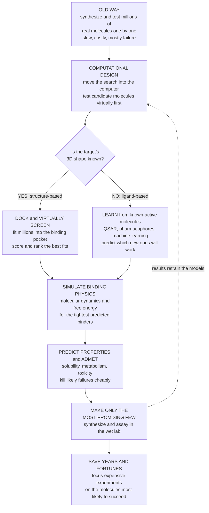

# 💻 Computational Drug Design

> [!abstract] TL;DR
> **Computer-Aided Drug Design (CADD)** moves much of the search for new medicines **into the computer**: instead of blindly synthesizing and testing millions of real compounds one at a time, scientists **predict which molecules will work before making any of them**, then aim the expensive lab work at the most promising few. There are **two grand strategies**. When the **target protein's 3D shape is known** (from X-ray crystallography, cryo-EM, or now **AlphaFold** predictions), you use **structure-based** design — **dock** candidate molecules into the binding pocket and **virtually screen** millions, ranking the best fits. When the shape is **unknown but active molecules are known**, you use **ligand-based** design — learn what the actives have in common (**QSAR**, pharmacophores, similarity) and predict new ones. On top of both sits **simulation** (molecular dynamics and free-energy calculations to model binding physics rigorously) and the fast-rising **data/AI dimension** (cheminformatics to represent and search chemical space; machine-learning and generative models to predict properties, forecast **ADMET**/toxicity, and invent novel molecules). The payoff is enormous efficiency — **screen millions in silico, synthesize a few** — but the limits are real: scoring functions are inaccurate, binding and bioactivity remain genuinely hard to predict, and *garbage in gives garbage out*. **Computation guides the lab; it does not replace it.** This note is the **S05 section opener**, framing docking, QSAR, molecular dynamics, AI/ML, and cheminformatics as the computational toolkit of modern drug discovery.

---

## Intuition

**Analogy FIRST — finding the one key that fits a lock, without trying millions of physical keys by hand.** The old way of designing a drug is like being handed a mystery lock and a warehouse of **ten million keys**, and being told to find the one that fits by physically trying each key, one at a time. It is slow, it is ruinously expensive, and it is *mostly failure* — nearly every key you pick up and insert does nothing. That is classical trial-and-error drug discovery: synthesize a real molecule, test it against the target, throw it away, repeat.

**Computational drug design does something radically more efficient: it moves the search into the computer.** If you happen to know the **exact 3D shape of the lock** — the target protein's binding pocket — then a computer can build a virtual model of it and try fitting **millions of candidate keys into it at superhuman speed**, ranking which ones fit best before you ever cut a single real key. That is **virtual screening and docking**: like a video game that tests keys against a 3D model of the lock. If you *don't* know the lock's shape but you *do* have a handful of keys **already known to open it**, you can instead study what those working keys have in common — their teeth, their length, their notches — and predict which new, untried keys share that winning pattern. That is **machine learning from known-active molecules**. And for the most promising candidates, the computer can go further and **simulate the actual jiggling physics** of a key wobbling inside the lock — the atoms of a molecule breathing and flexing in the binding site — to estimate how *tightly* it truly binds.

The payoff is staggering. Instead of synthesizing and testing **ten thousand real compounds**, you can computationally triage **millions** and make only the **most promising few** — saving years and fortunes. Crucially, computational design does **not** replace the lab: the scoring is imperfect, biology is unpredictable, and the final proof is always experimental. What it does is **aim the lab's expensive efforts at the molecules most likely to succeed**. And with modern AI — supercharged by the **AlphaFold** structure-prediction revolution and machine-learning models that predict activity and toxicity — it is rapidly becoming one of the most transformative forces in all of drug discovery.

---

## How It Works

### Core mechanics

1. **Represent the problem in silico.** A molecule becomes data — a **SMILES** string, a molecular graph, a 3D conformer, or a numeric **descriptor/fingerprint** vector — and the target becomes a 3D structure or a set of known-active examples. This digital representation of chemistry is the province of **cheminformatics**, and it is what makes searching a vast **chemical space** (estimated at over **10⁶⁰** drug-like molecules) computationally tractable.
2. **Strategy 1 — structure-based design (you know the target's shape).** With a 3D structure of the target's binding pocket, **molecular docking** computationally places each candidate molecule into the pocket, samples poses and conformations, and a **scoring function** estimates how well it fits and binds. Run this across a huge library and you have **virtual screening**; grow molecules atom-by-atom to fit the pocket and you have **de-novo design**. The output is a ranked shortlist of predicted binders.
3. **Strategy 2 — ligand-based design (you know what already works).** When the target structure is unknown but a set of **active molecules** exists, you learn what they share. **QSAR** (Quantitative Structure–Activity Relationship) fits a model mapping molecular descriptors → activity; **pharmacophore** models capture the essential 3D arrangement of features (a donor here, a ring there); **similarity searching** finds new molecules resembling known actives. The model then predicts activity for untested molecules.
4. **Refine with physics — simulation.** For the top candidates, **molecular dynamics (MD)** simulates the target–ligand complex over time using Newtonian physics on a force field, and **free-energy calculations** (FEP, thermodynamic integration) estimate binding affinity far more rigorously than a fast docking score — modelling the real thermodynamics and kinetics of binding.
5. **Predict developability early — ADMET and AI.** Beyond "does it bind," models predict **ADMET** (Absorption, Distribution, Metabolism, Excretion, Toxicity), solubility, and off-target liabilities, so molecules destined to fail as *drugs* are killed cheaply. Increasingly, **machine learning and generative models** predict activity/properties and even **invent** novel molecules — while **AlphaFold** now supplies predicted structures for targets that were never crystallized, extending structure-based design to vastly more of the genome.
6. **Triage, then experiment.** The computer ranks millions; chemists **synthesize and assay only the best few**. Results feed back to improve the models. Computation narrows the funnel; the wet lab confirms — a closed **design → predict → make → test** loop.

### Flow



---

## Key Concepts

### Secondary (explain to a bright teenager)

- **The big idea.** Trying real molecules in a lab is slow and expensive. So do the first search **inside a computer** — test millions of molecules *virtually*, then make only the handful that look best.
- **Two situations.** If you know the **shape** of the target (the "lock"), the computer tries fitting millions of molecule "keys" into it and ranks the best fits — that's **docking / virtual screening**. If you only know a few molecules that **already work**, the computer learns their pattern and predicts new ones — that's **machine learning**.
- **Simulate the wobble.** For the best candidates, the computer can simulate the atoms **jiggling** in the pocket to judge how *tightly* the molecule really sticks.
- **Why it's a big deal.** Instead of making 10,000 real compounds, you can rank **millions** on a computer and make just the top few — saving years and huge amounts of money.
- **It doesn't replace the lab.** The computer's guesses are imperfect. It **guides** the experiments toward the best molecules; the lab still has the final say.
- **AI is turbo-charging it.** New AI like **AlphaFold** can predict protein shapes, and machine learning can predict which molecules will work — making computational design one of the hottest areas in drug discovery.

### Undergraduate (needs some biology / chemistry)

- **CADD's job: de-risk and accelerate.** Computational methods raise the *quality* of molecules entering synthesis and reduce the number you must make, attacking the slow, costly early stages of the pipeline (hit discovery and lead optimization).
- **Structure-based drug design (SBDD).** Requires a 3D target structure. **Docking** searches ligand poses in the pocket and scores them; **virtual screening** ranks large libraries; **de-novo design** builds novel ligands to fit. Scoring functions trade accuracy for speed — fast enough for millions, but only *approximately* correlated with true affinity.
- **Ligand-based drug design (LBDD).** Used when no structure exists. **QSAR** regresses activity on descriptors; **pharmacophore** models encode the 3D feature pattern shared by actives; **similarity/fingerprint** search exploits the "similar molecules have similar activity" principle. LBDD is only as good as the known-active data it learns from.
- **The accuracy hierarchy.** Speed and rigor trade off: **similarity search / fingerprints** (fastest, roughest) → **docking scores** → **MM-GBSA/PBSA** endpoint methods → **free-energy perturbation (FEP)** (slowest, most rigorous). You use fast methods to triage millions, then expensive physics on the survivors.
- **Descriptors and fingerprints.** Molecules are encoded as numeric vectors — physicochemical descriptors (logP, molecular weight, H-bond donors) or structural **fingerprints** (bit-vectors of substructures, e.g. ECFP). These features feed QSAR/ML models and similarity searches — the heart of **cheminformatics**.
- **ADMET prediction.** Binding is necessary but not sufficient. In-silico models flag poor absorption, rapid metabolism, hERG cardiotoxicity, and mutagenicity early — enforcing **drug-likeness** (e.g. Lipinski's rule of five) alongside potency (see `Pharmacokinetics_ADME`).
- **The AlphaFold inflection.** Reliable **predicted structures** for most human proteins mean structure-based methods are no longer gated by the availability of an experimental crystal — dramatically widening the set of targets amenable to SBDD.

### Graduate (mechanistic / methodological)

- **Docking as a search + scoring problem.** Docking factorizes into (i) a **conformational/pose search** over ligand rotatable bonds and rigid-body placement (often with limited receptor flexibility) and (ii) a **scoring function** (force-field-based, empirical, knowledge-based, or ML-learned) approximating binding free energy. The central failure mode is **scoring-function inaccuracy**: poses are often ranked well relative to decoys yet **absolute affinity is poorly predicted**, and **induced fit**, ordered waters, protonation/tautomer states, and entropy are hard to capture.
- **Rigorous binding free energy.** **Alchemical free-energy methods** (FEP, TI) compute relative ΔΔG between congeneric ligands via a nonphysical thermodynamic cycle sampled with **MD**; modern implementations reach ~1 kcal/mol accuracy for well-behaved series — powerful for **lead optimization** but computationally heavy and sensitive to force-field quality and sampling convergence. See `Molecular_Dynamics_Simulation`.
- **QSAR/ML formalism and its traps.** A model f: descriptors → activity is fit on known compounds; validity is bounded by the **applicability domain** (predictions for molecules unlike the training set are unreliable). Chief pitfalls: **activity cliffs** (tiny structural changes causing large activity jumps that smooth models miss), **data leakage / analog bias**, and over-optimistic validation from random rather than **scaffold/time splits**.
- **Deep and generative chemistry.** **Graph neural networks** and message-passing models learn molecular representations directly; **generative models** (VAEs, autoregressive SMILES models, diffusion, reinforcement learning) navigate chemical space to propose novel, synthesizable candidates optimized for multi-parameter objectives. The frontier couples generation with **synthetic-accessibility** and retrosynthesis constraints so that in-silico designs are actually makeable.
- **Structure prediction as an enabler.** **AlphaFold2/3**-class models turned protein (and complex) structure prediction into a commodity, but **caveat**: predicted structures may misplace side chains, flexible loops, and — critically — **binding-site conformations and cofactors**, so blind docking into predicted apo structures can mislead; validation and ensemble/induced-fit treatment remain essential.
- **The value/limit synthesis.** CADD's leverage is **enrichment** (recovering most actives from a small top-ranked fraction) and **early ADMET triage**, compressing the front of the funnel. Its hard limits are **imperfect scoring**, the genuine difficulty of predicting binding and phenotypic bioactivity, and **"garbage in, garbage out"** (poor structures, biased data). The mature stance is **computation-guided, experiment-validated** iteration — CADD raises the odds and narrows the search; it does not certify a drug.

---

## Python Demo

```python
# COMPUTATIONAL DRUG DESIGN, three quantitative views of why moving the search
# into the computer pays off:
#   (a) VIRTUAL-SCREENING ENRICHMENT : ranking a huge library by a computational
#       score recovers most of the TRUE ACTIVES from a small top fraction, far
#       better than random picking (an ROC/enrichment curve).
#   (b) SCORE DISTRIBUTION           : imperfect scoring separates likely-actives
#       from inactives WITH OVERLAP; a selection cutoff trades recall vs cost.
#   (c) THROUGHPUT & COST            : virtual vs physical screening, log scale
#       (millions in silico vs thousands in the lab) -> the time/money saving.
# All numbers are illustrative teaching values, NOT figures for any real campaign.
# Educational content, not individual medical advice.
import numpy as np
import matplotlib.pyplot as plt

rng = np.random.default_rng(42)

# --- Simulate one virtual-screening campaign ------------------------------
N          = 100_000          # molecules in the virtual library
active_frac = 0.01            # 1% are TRUE actives (hidden until tested)
n_active   = int(N * active_frac)

labels = np.zeros(N, dtype=bool)
labels[:n_active] = True                       # first n_active are true actives

# Computational score: inactives ~ N(0,1); actives shifted up (imperfect method,
# heavy overlap -> realistic enrichment, not magic).
scores = rng.normal(0.0, 1.0, N)
scores[labels] += 1.3

order         = np.argsort(-scores)            # rank whole library, best first
labels_ranked = labels[order]

frac_screened = np.arange(1, N + 1) / N        # fraction of library picked
recall        = np.cumsum(labels_ranked) / n_active   # fraction of actives found

# Enrichment factor at the top 1% (how many x better than random)
top_idx = int(0.01 * N)
ef_top1 = (labels_ranked[:top_idx].sum() / top_idx) / active_frac

fig, ax = plt.subplots(1, 3, figsize=(19, 5.6))

# --- (a) Enrichment / ROC-like curve --------------------------------------
ax[0].plot(frac_screened * 100, recall * 100, color="#1f77b4", lw=2.6,
           label="Computational triage")
ax[0].plot([0, 100], [0, 100], "--", color="grey", lw=1.6, label="Random picking")
ax[0].axvline(1, color="#c0392b", ls=":", lw=1.5)
ax[0].fill_between(frac_screened * 100, recall * 100, frac_screened * 100,
                   alpha=0.10, color="#1f77b4")
ax[0].set_xlabel("Percent of library synthesized and tested")
ax[0].set_ylabel("Percent of TRUE actives recovered")
ax[0].set_title(f"(a) Virtual-screening enrichment\ntop 1% is ~{ef_top1:.0f}x better than random")
ax[0].legend(loc="lower right", fontsize=9)
ax[0].set_xlim(0, 100); ax[0].set_ylim(0, 100)

# --- (b) Score distribution with a selection cutoff -----------------------
cutoff = 1.5
bins = np.linspace(-4, 6, 60)
ax[1].hist(scores[~labels], bins=bins, color="#95a5a6", alpha=0.75,
           label="Inactives (99%)")
ax[1].hist(scores[labels],  bins=bins, color="#e67e22", alpha=0.85,
           label="True actives (1%)")
ax[1].axvline(cutoff, color="#c0392b", lw=2.2, ls="--",
              label=f"Selection cutoff = {cutoff}")
picked        = scores >= cutoff
purity        = labels[picked].mean() * 100        # % of picks that are active
recall_cut    = labels[picked].sum() / n_active * 100
ax[1].set_yscale("log")
ax[1].set_xlabel("Computational score (higher = predicted binder)")
ax[1].set_ylabel("Molecule count (log scale)")
ax[1].set_title(f"(b) Imperfect scores overlap\ncutoff -> {recall_cut:.0f}% of actives, {purity:.0f}% hit rate")
ax[1].legend(loc="upper right", fontsize=8.5)

# --- (c) Throughput & cost: virtual vs physical (log scale) ---------------
methods    = ["Virtual\nscreening", "Physical\nHTS"]
throughput = np.array([1.0e7, 1.0e4])     # molecules evaluable per campaign
cost_per   = np.array([0.002, 12.0])      # $ per molecule (illustrative)
colors_c   = ["#2ca02c", "#7f7f7f"]

bars = ax[2].bar(methods, throughput, color=colors_c, edgecolor="black", linewidth=0.6)
ax[2].set_yscale("log")
ax[2].set_ylabel("Molecules evaluable per campaign (log scale)")
ax[2].set_title("(c) Throughput & cost per molecule\nmillions in silico vs thousands in the lab")
for b, t, c in zip(bars, throughput, cost_per):
    ax[2].text(b.get_x() + b.get_width()/2, t * 1.4,
               f"{t:,.0f}\n(~${c:.3f}/mol)", ha="center",
               fontsize=9, fontweight="bold")
ax[2].set_ylim(1e3, 1e8)

plt.tight_layout()
plt.savefig("computational_drug_design.png", dpi=120)
plt.show()

# --- Console summary ------------------------------------------------------
print(f"(a) Enrichment: screening the top 1% of the library recovers "
      f"{recall[top_idx-1]*100:.0f}% of all actives "
      f"(~{ef_top1:.0f}x better than random).")
print(f"(b) Cutoff {cutoff}: picks {picked.sum():,} molecules; "
      f"{recall_cut:.0f}% of actives caught at a {purity:.0f}% hit rate "
      f"(vs {active_frac*100:.0f}% by random synthesis).")
print(f"(c) Throughput ratio virtual:physical = "
      f"{throughput[0]/throughput[1]:,.0f}x ; "
      f"cost ratio physical:virtual = {cost_per[1]/cost_per[0]:,.0f}x.")
```

**What it shows.** Panel **(a)** is the core promise of virtual screening made literal: rank the whole library by a computational score and the **enrichment curve bows sharply above the random diagonal** — testing just the **top 1%** of molecules recovers a large majority of all the true actives, roughly an order of magnitude better than picking at random. That is the enrichment CADD exists to deliver. Panel **(b)** is the honest caveat: because scoring is **imperfect**, the score distributions of actives and inactives **overlap**, so any selection cutoff trades **recall** (how many actives you catch) against **hit rate/cost** (how many of your picks are real) — there is no free lunch, only a much better starting point than blind chemistry. Panel **(c)** quantifies the economics on a log scale: a computer can evaluate **millions** of molecules at a fraction of a cent each, while physical high-throughput screening handles **thousands** at dollars each — the throughput and cost gaps span **orders of magnitude**. Together: *computation triages vast chemical space cheaply and enriches for winners, so the expensive lab makes only the promising few — but the overlap in (b) is exactly why computation guides rather than replaces the experiment.*

---

## Real-World Applications

> **The AlphaFold inflection point — structure-based design for (almost) any target.** For decades, structure-based drug design was gated by a brutal bottleneck: you needed an **experimental 3D structure** of your target protein (from X-ray crystallography or cryo-EM), and many important targets stubbornly refused to crystallize. **AlphaFold** (DeepMind, 2021) collapsed that barrier by predicting accurate structures for essentially the entire human proteome and hundreds of millions of proteins, and released them openly. Overnight, docking and virtual screening became feasible for a vast set of previously "structureless" targets. It is the clearest recent example of a **computational advance directly reshaping how drugs are discovered** — though practitioners quickly learned to treat predicted binding-site conformations with care.

- **HIV protease inhibitors — the SBDD showcase.** Drugs like **saquinavir**, **indinavir**, and **nelfinavir** were designed against the crystal structure of HIV protease, docking and refining molecules to fit its active site. A landmark demonstration that knowing the target's 3D shape lets chemists rationally engineer tight binders.
- **Virtual screening at scale — ultra-large libraries.** Modern campaigns dock **hundreds of millions to billions** of make-on-demand molecules (e.g. Enamine REAL space) against a target pocket, then synthesize only the top-ranked few hundred — routinely surfacing novel, potent hits that physical HTS of a few million compounds would never have reached.
- **QSAR/ML for ADMET and property prediction.** Pharma routinely uses **random forests, gradient boosting, and graph neural networks** to predict solubility, permeability, metabolic stability, and toxicity liabilities (like hERG) from structure — killing bad molecules **before** synthesis and steering lead optimization (see `Pharmacokinetics_ADME`).
- **Free-energy calculations guiding lead optimization.** **FEP** (e.g. Schrödinger's FEP+) prioritizes which analogs to synthesize by predicting relative binding affinities to ~1 kcal/mol, shrinking the design–make–test cycle for congeneric series in real programs.
- **AI-native drug discovery companies.** Firms such as those behind **generative chemistry** and end-to-end AI platforms (e.g. Exscientia, Insilico Medicine, Recursion) have advanced computationally designed molecules into clinical trials, compressing early discovery from years toward months — while the field still awaits the first AI-designed drug to clear the full clinical gauntlet, a reminder that computation feeds the funnel but does not shortcut it.

---

## Common Pitfalls

- **Trusting docking scores as true affinities.** Fast **scoring functions rank well but predict absolute binding poorly**; a top-ranked pose is a *hypothesis*, not a measured Kd. Treat virtual screening output as an **enrichment shortlist** to test, never as proof of potency. Use rigorous free-energy methods only on the survivors.
- **"Garbage in, garbage out."** A wrong protonation state, a low-resolution or **predicted-but-unvalidated structure**, an incorrect binding-site conformation, or a biased training set silently corrupts every downstream prediction. Structure and data **quality** dominate method sophistication.
- **QSAR/ML outside its applicability domain.** A model interpolates well among molecules like its training data and fails on genuinely novel scaffolds. Random train/test splits **inflate** apparent accuracy; use **scaffold or temporal splits**, and beware **activity cliffs** where near-identical molecules have wildly different activity.
- **Confusing binding with a drug.** A perfect in-silico binder still fails if it is insoluble, rapidly metabolized, impermeable, or toxic. **ADMET/developability** must be predicted **in parallel** with potency, not bolted on at the end (see `Pharmacokinetics_ADME`).
- **Designing molecules nobody can make.** Generative models happily invent high-scoring but **synthetically inaccessible** structures. Couple generation to **synthetic-accessibility** and retrosynthesis constraints, or the shortlist is unusable.
- **Believing computation replaces the lab.** CADD **guides and enriches**; it does not certify efficacy or safety. The final arbiter is always the **experiment and, ultimately, the clinic**. Over-claiming "AI-designed drug" ignores that human trials — Phase I → II → III — still decide (see `The_Drug_Discovery_Pipeline`).

---

## Related Concepts

This note is the **S05 section opener** — the map for the whole "Computational and Modern Drug Design" section — and it frames the deep-dive notes that follow it. The first grand strategy, **docking candidate molecules into a known binding pocket, virtual screening, and de-novo design**, is the subject of **Structure-Based Drug Design and Docking**. The second strategy, **learning what active molecules share via QSAR, pharmacophores, and similarity when the target structure is unknown**, is developed in **Ligand-Based Design and QSAR**. The rigorous physics of binding — simulating the target–ligand complex over time and estimating binding thermodynamics — lives in **Molecular Dynamics and Free Energy**. The fast-rising data-and-AI dimension, from property/activity prediction to generative molecule design and the AlphaFold revolution, is covered in **AI and Machine Learning in Drug Discovery**. And the representation and searching of vast chemical space — descriptors, fingerprints, SMILES, similarity — is the foundation laid in **Cheminformatics and Chemical Space**. (These sibling notes are referenced in prose because they share this section.)

Anchors elsewhere in the vault (Glob-verified):

- [[The_Drug_Discovery_Pipeline]] — CADD's home turf: computation attacks the slow, costly **early stages** (hit discovery, lead optimization) of the funnel this note's section extends.
- [[Drug_Targets_and_the_Druggable_Genome]] — structure-based design needs a **druggable target with a defined pocket**; this note explains what makes a target amenable to computational attack.
- [[Drug_Receptor_Interactions_and_Binding]] — docking and free-energy methods are, at heart, attempts to **predict the binding** whose biophysics this note describes.
- [[Pharmacokinetics_ADME]] — the **ADMET/PK** properties that in-silico models predict early to enforce drug-likeness alongside potency.
- [[Protein_Structure_and_Function]] — the **3D protein structure** (from crystallography, cryo-EM, or AlphaFold) that structure-based design docks molecules into.
- [[Molecular_Dynamics_Simulation]] — the physics-based simulation engine underlying rigorous **binding free-energy** calculations on candidate ligands.
- [[Quantum_Chemistry_and_Atomic_Orbitals]] — the quantum/molecular-modeling foundation beneath force fields and the electronic-structure view of molecular interactions.
- [[Random_Forests]] — a workhorse ML algorithm behind classic **QSAR and ADMET** property prediction from molecular descriptors.
- [[Neural_Network_Basics]] — the deep-learning foundation powering modern molecular property models, generative chemistry, and AlphaFold-class structure prediction.

---

## Review Questions

**Secondary**
1. In your own words, why is it faster and cheaper to first search for a drug "inside a computer" than to make and test millions of real molecules in a lab?
2. Explain the two situations in computational drug design: what does the computer do when it **knows** the target's 3D shape, versus when it only knows a few molecules that **already work**?

**Undergraduate**
3. Distinguish **structure-based** from **ligand-based** drug design: what input does each require, and name one method from each. For a brand-new target with no crystal structure and only three known active molecules, which strategy would you use and why?
4. Virtual screening "enriches" for active molecules. Using the idea of an enrichment curve, explain what it means that screening the top 1% of a library recovers most of the actives — and why an imperfect scoring function still leaves you with false positives.

**Graduate**
5. Docking is often described as "good at ranking poses, poor at predicting absolute affinity." Explain the search-plus-scoring structure of docking, name three physical effects scoring functions struggle to capture, and describe how free-energy perturbation (FEP) improves on docking for lead optimization — and at what cost.
6. AlphaFold made predicted structures available for most proteins. Argue both how this expands structure-based drug design **and** what specific pitfalls arise from docking into a predicted (rather than experimental) structure. Then explain why, despite all these computational advances, CADD is said to "guide but not replace" the experiment.

---

## Sources

- Leach AR. *Molecular Modelling: Principles and Applications*, 2nd ed. Prentice Hall/Pearson — comprehensive foundation for docking, force fields, conformational search, and free-energy methods.
- Jorgensen WL. "The many roles of computation in drug discovery." *Science* 2004;303(5665):1813–1818 — a canonical survey of how computation contributes across discovery.
- Sliwoski G, Kothiwale S, Meiler J, Lowe EW. "Computational methods in drug discovery." *Pharmacological Reviews* 2014;66(1):334–395 — thorough review of SBDD, LBDD, QSAR, and virtual screening.
- Schneider G, Fechner U. "Computer-based de novo design of drug-like molecules." *Nature Reviews Drug Discovery* 2005;4(8):649–663 — foundational review of de-novo and generative molecular design.
- Jumper J, et al. "Highly accurate protein structure prediction with AlphaFold." *Nature* 2021;596:583–589 — the structure-prediction breakthrough enabling structure-based design at proteome scale.

---

#pharmacology #computational-drug-design #CADD #virtual-screening #drug-discovery
