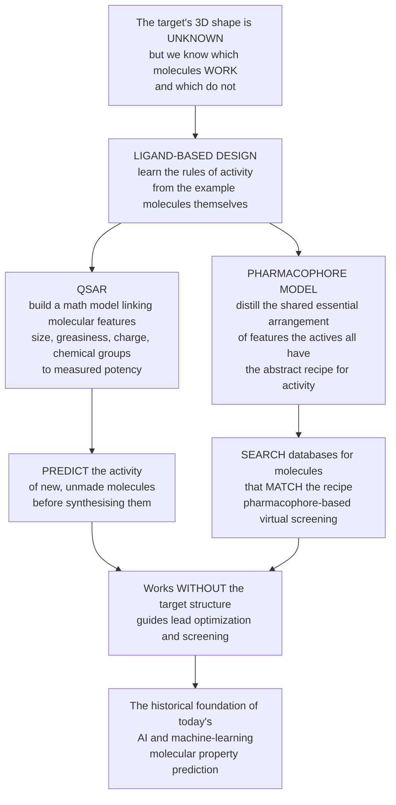

# 🧪 Ligand-Based Design and QSAR

> [!abstract] TL;DR
> Sometimes you want to design a drug but you **don't know the 3D shape of the target** — you only know which molecules happen to work and which don't. You can still make progress by **learning from the examples themselves**. This is **ligand-based design**, and its classic tool is **QSAR** — a *Quantitative Structure-Activity Relationship* — a mathematical model that connects computed **features of a molecule** (its size, greasiness, charge, particular chemical groups) to its **measured potency**, so you can predict the activity of molecules you **haven't even made yet**. A sibling idea is the **pharmacophore**: distilling from the active molecules the essential *arrangement* of features they all share (a hydrogen-bond donor HERE, an aromatic ring THERE, a positive charge over THERE) — the abstract **recipe** for activity — then searching databases for new molecules that match it. Because these methods need only **known active molecules** and *not* the target's structure, ligand-based design works even for mysterious targets that structure-based methods cannot touch. It is decades old, it is essentially **machine learning for chemistry**, and it is the direct conceptual ancestor of today's AI-driven molecular property prediction.

---

## Intuition

**Analogy first — learning what makes a good joke without a theory of humour.** Suppose you want to write a joke that lands, but nobody can give you a *theory* of why things are funny. You are not helpless: you can study **many known good jokes and many bad ones**, notice the patterns (timing, surprise, a well-set-up punchline), and then predict whether a **new** joke will get a laugh — all without ever formalising "humour." You learned the rules **directly from the examples**.

Ligand-based drug design does exactly this for molecules. You do **not** know the 3D shape of the biological target (the "theory of humour" is missing), but you **do** have a pile of molecules with **measured activity** — some potent, some inactive. **QSAR** studies these examples and fits a mathematical model linking each molecule's *features* — how big it is, how greasy (lipophilic), how charged, which chemical groups it carries — to its measured **potency**, so it can score a molecule that has never been synthesised. The **pharmacophore** is the complementary distillation: instead of a number-crunching model, it captures the **shared essential feature-pattern** that every active molecule has — the joke's underlying *structure* — so you can go hunting for brand-new molecules that fit the same recipe.

---

## How It Works

### Core mechanics

1. **Start from the ligands, not the target.** You have a set of molecules with **known activity** (actives and inactives) but **no reliable 3D structure** of the target protein. The whole strategy is to *infer the requirements for activity from the molecules themselves*. This is the complement of structure-based design (docking into a known pocket).
2. **Compute molecular descriptors.** Turn each molecule into numbers — its **physicochemical** properties (**logP / lipophilicity**, molecular weight, **polar surface area**, charge, **pKa**), **topological** indices (connectivity, shape), **electronic** properties, and **substructural / fingerprint** features (which functional groups are present).
3. **Fit a QSAR model.** Build a statistical or machine-learning model that maps `descriptors → measured activity`. The historical form is **Hansch analysis**: activity expressed as a function of lipophilic, electronic, and steric terms — famously a **parabola in logP**, because a drug that is too water-loving never crosses membranes and one that is too greasy gets stuck in them, so potency peaks at an **optimal lipophilicity**.
4. **Predict and prioritise.** Use the fitted model to **score virtual, un-synthesised molecules**, ranking which to make next — the engine of virtual screening and lead optimization.
5. **Validate honestly.** Split data into **training and test** sets, guard against **overfitting**, and respect the **applicability domain**: a QSAR prediction is only trustworthy for molecules *similar to those the model was trained on*. Extrapolate outside that region and the number is fiction.
6. **Or abstract a pharmacophore.** Instead of a regression, align the active molecules and extract the shared **3D arrangement of chemical features** (H-bond donors/acceptors, hydrophobic groups, aromatic rings, charged centres) — the **recipe**. Then run **pharmacophore-based virtual screening**: search databases for molecules that match the pattern, enabling **scaffold hopping** to new chemical series.

### Flow



---

## Key Concepts

### Secondary (explain to a bright teenager)

- **Design a drug without seeing the target.** Often we do not know the exact shape of the protein a drug must grab. But we *do* know which molecules already work. Ligand-based design **learns from those examples** — like learning to write funny jokes by studying lots of good and bad ones.
- **QSAR = a formula for potency.** Every molecule can be described by numbers: how big, how greasy, how charged, which chemical bits it has. **QSAR** finds a formula linking those numbers to how well the molecule works, so you can *predict* the strength of a molecule **before you make it**.
- **The Goldilocks greasiness.** A drug that is too water-loving cannot get through the body's oily membranes; one that is too oily gets stuck. So potency is usually **best in the middle** — an *optimal* greasiness. This "hump-shaped" rule is the famous **Hansch** finding.
- **The recipe (pharmacophore).** Look at all the molecules that work and ask: what do they **share**? Maybe a hydrogen-bond spot here, a ring there, a positive charge over there. That shared pattern is the **recipe** for activity, and you can search for brand-new molecules that follow the same recipe.
- **Only trust it near what you know.** These predictions are reliable for molecules that **look like the examples** you learned from. Guess wildly outside that zone and the answer is unreliable.

### Undergraduate (needs some chemistry / stats)

- **When to reach for it.** Ligand-based methods are the tool of choice when the **target structure is unavailable** (no crystal/cryo-EM structure, no good homology model) but a **structure-activity dataset** exists. They are complementary to structure-based docking, which needs the pocket.
- **Descriptor families.** *Physicochemical* (logP, MW, polar surface area, H-bond donor/acceptor counts, pKa, charge), *topological* (graph connectivity, shape indices), *electronic* (HOMO/LUMO, partial charges), and *substructural / fingerprint* (presence of functional groups, 2D fragment bitstrings). Choosing and **selecting** the right descriptors is half the battle.
- **Hansch analysis.** The founding QSAR framework: `log(1/C) = a·(logP) − b·(logP)² + ρσ + steric + const`, giving the characteristic **parabolic optimum in logP** plus electronic (Hammett σ) and steric terms. It reframed medicinal chemistry as a *quantitative, predictive* discipline in 1964.
- **2D vs 3D-QSAR.** *2D-QSAR* correlates activity with descriptors computed from the molecular graph. *3D-QSAR* (e.g. **CoMFA**, Comparative Molecular Field Analysis) aligns molecules in 3D and correlates activity with **steric and electrostatic fields** sampled on a grid around them — closer to how the molecule is actually "felt" by a receptor.
- **Model validation is non-negotiable.** Train/test (or cross-validation) split, watch for **overfitting** (a model that memorises noise), and define the **applicability domain** — the descriptor-space region where predictions are trustworthy. A dazzling training R² with a collapsing test R² is the classic warning sign.
- **Pharmacophore modelling.** Abstract the essential 3D feature arrangement — H-bond donors/acceptors, hydrophobes, aromatic rings, charged centres — shared by actives. Use it for **pharmacophore-based virtual screening** and to design **new scaffolds**.
- **The molecular similarity principle.** *Similar molecules tend to have similar activity.* This underpins **similarity searching** with molecular **fingerprints** (Tanimoto coefficient) and, when you want a similar *effect* from a *different* core, **scaffold hopping**.

### Graduate (system-level / method-level)

- **QSAR as supervised learning on chemistry.** Formally, QSAR is a regression (or classification) problem `y = f(x) + ε` where `x` is a descriptor vector and `y` is a biological endpoint (pIC50, pKi, log solubility). Every modern regressor applies — from ordinary least squares and **PLS** (partial least squares, essential when descriptors outnumber compounds and are collinear) to random forests, gradient boosting, and graph neural networks. Seeing QSAR *as ML* is the bridge to today's deep property predictors.
- **The dimensionality trap.** Descriptor spaces are huge and highly correlated, and datasets are small, so **p ≫ n** is common. This makes **feature selection**, **regularization** (ridge/LASSO), dimensionality reduction, and rigorous validation central — not optional. Chance correlation (Topliss–Costello effect) is a real hazard: with enough descriptors you can "fit" random activity.
- **Applicability domain, formally.** Define a region of descriptor space (leverage / hat values, distance-to-training-set, kernel density, conformal prediction) and *flag* or *refuse* predictions for query molecules outside it. Reported accuracy without an applicability-domain statement is close to meaningless.
- **Activity cliffs break the core assumption.** The similarity principle assumes a *smooth* structure-activity landscape, but **activity cliffs** — pairs of near-identical molecules with vastly different potency (a single methyl flips activity 1000-fold) — are exactly where medicinal chemistry is most interesting and where continuous QSAR models fail hardest. Modelling the landscape's *ruggedness* (SALI, matched molecular pairs) is an active field.
- **3D-QSAR subtleties.** CoMFA/CoMSIA results are exquisitely sensitive to **alignment** and **conformer choice** and to the assumed **bioactive conformation** — a source of non-reproducibility. The predicted "contour maps" are interpretable but only as good as the alignment hypothesis.
- **ADMET and tox by QSAR.** Ligand-based models predict not just potency but **drug-likeness and safety**: solubility, permeability (Caco-2), hERG cardiotoxicity, CYP inhibition, mutagenicity (Ames), hepatotoxicity. Regulatory frameworks (**OECD QSAR validation principles**; ICH M7 for mutagenic impurities) formally accept QSAR predictions here, making it one of the few *regulatorily sanctioned* in-silico methods.
- **Correlation is not causation / mechanism.** A QSAR descriptor that correlates with activity need not be *mechanistically* responsible. Good models can still mislead optimization if the "important" descriptor is a proxy. Interpretability (SHAP, matched pairs) helps, but causal claims require experiment.

---

## Python Demo

```python
# Ligand-based design / QSAR — four illustrative pieces:
#   (a) HANSCH RELATIONSHIP: activity peaks at an OPTIMAL lipophilicity (logP)
#       -> the classic parabola that founded QSAR
#   (b) QSAR MODEL & PREDICTION: fit a regression on molecular descriptors and
#       predict the activity of HELD-OUT (unseen) compounds
#   (c) OVERFITTING & APPLICABILITY DOMAIN: piling on meaningless descriptors
#       inflates the TRAINING fit while DESTROYING real predictive power
#   (d) PHARMACOPHORE MATCH: rank candidate molecules by how well their feature
#       pattern fits the "recipe" abstracted from known actives (virtual screening)
# All values are illustrative teaching numbers, not real assay data.
# Educational science content, not individual medical or dosing advice.
import numpy as np
import matplotlib.pyplot as plt

rng = np.random.default_rng(42)
fig, ax = plt.subplots(2, 2, figsize=(15, 11))

# ---------------------------------------------------------------------------
# Build a synthetic QSAR dataset.
# Descriptors: logP (lipophilicity), MW (size), HBD (H-bond donor count).
n = 300
logP = rng.uniform(-1.0, 6.0, n)
MW   = rng.uniform(200.0, 500.0, n)
HBD  = rng.integers(0, 6, n).astype(float)

# "True" activity (pIC50-like): classic Hansch PARABOLIC dependence on logP
# with an optimum, plus mild linear size/donor effects, plus assay noise.
logP_opt = 2.5
activity = (8.0
            - 0.45 * (logP - logP_opt) ** 2   # parabolic Hansch lipophilicity term
            - 0.004 * (MW - 350.0)            # mild size penalty
            - 0.20 * HBD                      # too many donors -> less permeable/potent
            + rng.normal(0.0, 0.30, n))       # experimental noise

# ---------------------------------------------------------------------------
# (a) Hansch analysis: activity vs logP shows an OPTIMAL lipophilicity
c2 = np.polyfit(logP, activity, 2)                 # fit a parabola in logP alone
xs = np.linspace(logP.min(), logP.max(), 200)
logP_star = -c2[1] / (2 * c2[0])                   # vertex = optimal logP
ax[0, 0].scatter(logP, activity, s=14, alpha=0.35, color="#7f8c8d",
                 label="measured compounds")
ax[0, 0].plot(xs, np.polyval(c2, xs), color="#c0392b", lw=2.5,
              label="Hansch parabola fit")
ax[0, 0].axvline(logP_star, color="#27ae60", ls="--", lw=1.8,
                 label=f"optimal logP ~ {logP_star:.1f}")
ax[0, 0].set_xlabel("logP  (lipophilicity)")
ax[0, 0].set_ylabel("Activity  (pIC50, higher = more potent)")
ax[0, 0].set_title("(a) Hansch analysis: potency peaks at an OPTIMAL greasiness")
ax[0, 0].legend(fontsize=8)

# ---------------------------------------------------------------------------
# (b) Fit a QSAR regression model, then PREDICT held-out compounds
def design(lp, mw, hbd):
    # design matrix includes logP AND logP^2 so the model can learn the parabola
    return np.column_stack([np.ones_like(lp), lp, lp ** 2, mw, hbd])

idx = rng.permutation(n)
tr, te = idx[:210], idx[210:]                      # train / test split
X_tr, y_tr = design(logP[tr], MW[tr], HBD[tr]), activity[tr]
X_te, y_te = design(logP[te], MW[te], HBD[te]), activity[te]
beta, *_ = np.linalg.lstsq(X_tr, y_tr, rcond=None) # least-squares QSAR fit
pred_te = X_te @ beta
r2 = 1.0 - np.sum((y_te - pred_te) ** 2) / np.sum((y_te - y_te.mean()) ** 2)
lims = [min(y_te.min(), pred_te.min()) - 0.2, max(y_te.max(), pred_te.max()) + 0.2]
ax[0, 1].scatter(y_te, pred_te, s=28, alpha=0.7, color="#2980b9",
                 label="held-out compounds")
ax[0, 1].plot(lims, lims, color="#c0392b", ls="--", lw=1.8, label="perfect prediction")
ax[0, 1].set_xlim(lims); ax[0, 1].set_ylim(lims)
ax[0, 1].set_xlabel("Measured activity (test set)")
ax[0, 1].set_ylabel("QSAR-predicted activity")
ax[0, 1].set_title(f"(b) QSAR predicts UNSEEN molecules   (test R2 = {r2:.2f})")
ax[0, 1].legend(fontsize=8)

# ---------------------------------------------------------------------------
# (c) OVERFITTING & applicability domain: add junk descriptors and watch the
#     TRAINING fit soar while TEST performance collapses.
max_extra = 40
noise = rng.normal(0.0, 1.0, (n, max_extra))       # meaningless descriptors
base_tr = design(logP[tr], MW[tr], HBD[tr])
base_te = design(logP[te], MW[te], HBD[te])
ks = list(range(0, max_extra + 1, 2))
train_r2, test_r2 = [], []
for k in ks:
    Xtr = np.column_stack([base_tr, noise[tr, :k]])
    Xte = np.column_stack([base_te, noise[te, :k]])
    b, *_ = np.linalg.lstsq(Xtr, y_tr, rcond=None)
    ptr, pte = Xtr @ b, Xte @ b
    train_r2.append(1 - np.sum((y_tr - ptr) ** 2) / np.sum((y_tr - y_tr.mean()) ** 2))
    test_r2.append(1 - np.sum((y_te - pte) ** 2) / np.sum((y_te - y_te.mean()) ** 2))
ax[1, 0].plot(ks, train_r2, "-o", color="#27ae60", ms=4, label="training R2 (looks great)")
ax[1, 0].plot(ks, test_r2, "-s", color="#c0392b", ms=4, label="test R2 (the real truth)")
ax[1, 0].axhline(0.0, color="k", lw=0.6)
ax[1, 0].set_ylim(min(test_r2) - 0.1, 1.05)
ax[1, 0].set_xlabel("Number of extra (noise) descriptors piled on")
ax[1, 0].set_ylabel("R2")
ax[1, 0].set_title("(c) Too many descriptors -> OVERFITTING (train up, test down)")
ax[1, 0].legend(fontsize=8)

# ---------------------------------------------------------------------------
# (d) PHARMACOPHORE match: score candidates by how well their feature pattern
#     matches the "recipe" abstracted from known actives.
# Ideal feature vector = [HBD, HBA, aromatic_rings, positive_charge, hydrophobes]
ideal = np.array([1, 3, 2, 1, 2], dtype=float)
names = ["Cand-A", "Cand-B", "Cand-C", "Cand-D", "Cand-E", "Cand-F"]
cands = np.array([
    [1, 3, 2, 1, 2],   # near-perfect match to the recipe
    [1, 2, 2, 1, 1],
    [0, 3, 1, 1, 2],
    [2, 1, 2, 0, 3],
    [0, 1, 0, 0, 1],   # poor match
    [1, 4, 2, 1, 2],
], dtype=float)
dist = np.sqrt(((cands - ideal) ** 2).sum(axis=1))
score = 1.0 / (1.0 + dist)                          # higher = closer to the recipe
order = np.argsort(score)                           # ascending -> best ends at top
sorted_names = [names[i] for i in order]
sorted_scores = score[order]
colors = plt.cm.RdYlGn(sorted_scores / sorted_scores.max())
ax[1, 1].barh(sorted_names, sorted_scores, color=colors)
ax[1, 1].set_xlabel("Pharmacophore-match score (higher = fits the recipe)")
ax[1, 1].set_title("(d) Rank candidates by pharmacophore fit -> virtual screening")

plt.tight_layout()
plt.savefig("ligand_based_design_and_qsar.png", dpi=120)
plt.show()

# Console sanity checks
print(f"(a) fitted optimal logP (parabola vertex) = {logP_star:.2f}")
print(f"(b) QSAR test-set R2 on unseen compounds   = {r2:.2f}")
print(f"(c) train R2 with 0 -> {max_extra} junk descriptors: "
      f"{train_r2[0]:.2f} -> {train_r2[-1]:.2f}   "
      f"(test R2: {test_r2[0]:.2f} -> {test_r2[-1]:.2f})")
best = sorted_names[-1]
print(f"(d) best pharmacophore match = {best} (score {sorted_scores[-1]:.2f})")
```

**What it shows.** Panel **(a)** reproduces the founding QSAR result: plot potency against **logP** and it does not climb forever — it **peaks at an optimal lipophilicity** and falls off on either side, the parabola Hansch discovered in 1964, encoding "too water-loving cannot cross membranes, too greasy gets stuck." Panel **(b)** is QSAR doing its job: a regression fitted on molecular **descriptors** predicts the activity of **held-out compounds it never saw**, with points clustering along the diagonal — this is exactly how a model scores virtual molecules before anyone synthesises them. Panel **(c)** is the cautionary heart of the note: as we pile on **meaningless descriptors**, the **training** R² marches toward a flawless 1.0 while the **test** R² **collapses** — the visual signature of **overfitting** and the reason the **applicability domain** and honest validation matter more than a pretty training fit. Panel **(d)** switches to the pharmacophore view: given the shared feature **recipe** of known actives, we rank candidate molecules by how closely their feature pattern **matches** it — the core scoring step of **pharmacophore-based virtual screening**.

---

## Real-World Applications

> **Example — the founding of QSAR and the "rule of 5".** In 1964 **Corwin Hansch and Toshio Fujita** showed that biological activity across a series of related molecules could be *fitted* as a function of **lipophilicity (π/logP), electronic (Hammett σ), and steric** parameters — the birth of QSAR and the reason logP is still computed for essentially every drug candidate today. Decades later, **Lipinski's Rule of 5** (a ligand-based, descriptor-driven heuristic: MW ≤ 500, logP ≤ 5, H-bond donors ≤ 5, acceptors ≤ 10) distilled the same "learn drug-likeness from known oral drugs" philosophy into a filter now applied to millions of virtual compounds. Both are ligand-based design in its purest form: **rules learned from the examples, used to prioritise molecules nobody has made yet.**

- **3D-QSAR in lead optimization (CoMFA).** Pharmaceutical teams routinely build **CoMFA/CoMSIA** models on a congeneric series to produce interpretable "contour maps" — where adding bulk or charge would help or hurt potency — steering the next round of synthesis without a target crystal structure.
- **Pharmacophore-based virtual screening.** Software such as **Catalyst, Phase, and LigandScout** builds a pharmacophore from known actives and screens vendor libraries of millions of compounds for matches, routinely finding **novel scaffolds** (scaffold hopping) that structure-based docking might miss.
- **ADMET and toxicity prediction (regulatory).** Ligand-based QSAR is a **regulatorily accepted** in-silico method: under **ICH M7**, two complementary QSAR systems (e.g. **DEREK** expert-rules + **Sarah/CASE Ultra** statistical) can be used to assess the **mutagenic potential of drug impurities** in lieu of an Ames test — a rare case where a computed prediction is formally sufficient for a regulator.
- **Structure-agnostic targets.** For targets that resist crystallisation or lack a well-defined pocket (many **GPCRs** historically, membrane proteins, protein-protein interfaces), ligand-based models built on screening data have driven optimization when **structure-based methods simply could not be applied**.
- **The seed of modern AI drug discovery.** Deep-learning property predictors (message-passing graph neural nets, the models behind large virtual screens) are QSAR's direct descendants — same problem (`molecule → property`), richer function class. Antibiotic discovery efforts that trained neural nets on activity data to nominate novel antibacterials (e.g. the halicin work) are QSAR at industrial, learned-representation scale.

---

## Common Pitfalls

- **Predicting outside the applicability domain.** A QSAR model is only trustworthy for molecules **similar to its training set**. Scoring a wildly different chemotype and believing the number is the single most common ligand-based error — always report and enforce an applicability domain (leverage, distance-to-training, conformal prediction).
- **Overfitting and chance correlation.** With **more descriptors than compounds**, you can fit *random* activity to a high R². A gorgeous training fit means nothing without a **held-out test / cross-validation** and, ideally, **y-scrambling** to rule out chance correlation. Use **feature selection** and **regularization** to keep the model honest.
- **Activity cliffs.** The whole enterprise assumes *similar molecules → similar activity*, but a single small change can crater potency 1000-fold. Continuous QSAR models **smear over cliffs** and mislead exactly where medicinal chemistry matters most — inspect matched molecular pairs and the ruggedness of the landscape.
- **Bad or inconsistent activity data.** QSAR is only as good as its `y` values. Pooling IC50s from **different assays, labs, or conditions**, or mixing readouts, injects noise that no amount of modelling can fix. Garbage in, confident garbage out.
- **Confusing correlation with mechanism.** A descriptor that correlates with activity is **not necessarily causal**. Optimising a proxy descriptor can send chemistry in the wrong direction; treat descriptor "importance" as a hypothesis, not a mechanism.
- **Alignment/conformer sensitivity in 3D-QSAR.** CoMFA-style models depend heavily on the assumed **bioactive conformation** and **molecular alignment**; a different (equally plausible) alignment can give a different, non-reproducible model. Report the alignment hypothesis explicitly.

---

## Related Concepts

This note opens the **Computational and Modern Drug Design** section and defines the *structure-free* half of computational medicinal chemistry. It sits inside the broader map drawn by *Computational Drug Design* and is the deliberate complement of *Structure-Based Drug Design and Docking*: where docking needs the target's 3D pocket, ligand-based design needs only known active molecules, so the two are usually run **together** and cross-checked. Its outputs feed directly into *Lead Optimization and Medicinal Chemistry* — QSAR contour maps and pharmacophores tell chemists *which molecule to make next*. The descriptor and fingerprint machinery it relies on is developed in *Cheminformatics and Chemical Space*, and QSAR is, historically and conceptually, the **direct ancestor** of the learned models covered in *AI and Machine Learning in Drug Discovery*. (These sibling notes in this section are referenced in prose because they belong to the same computational-design arc.)

Cross-vault foundations (Glob-verified):

- [[Linear_Regression]] — the core statistical engine of classical QSAR; a QSAR model is literally a regression of activity onto molecular descriptors.
- [[Regression_and_Correlation]] — the underlying statistics of fitting and interpreting a structure-activity relationship, including the correlation-is-not-causation caveat central to QSAR.
- [[Bias_Variance_Tradeoff]] — the formal account of the overfitting shown in the demo; why piling on descriptors inflates training fit but destroys prediction, motivating the applicability domain.
- [[Cross_Validation]] — the train/test discipline that separates a genuinely predictive QSAR model from one that has merely memorised its training compounds.
- [[Regularization]] — ridge/LASSO penalties that tame high-dimensional, collinear descriptor spaces and prevent chance-correlation QSAR models.
- [[Feature_Selection]] — choosing which molecular descriptors to keep, a make-or-break step given that descriptors vastly outnumber compounds.
- [[Chemical_Bonding_and_Molecular_Geometry]] — the chemistry from which physicochemical descriptors (logP, polar surface area, H-bond donors, charge) ultimately arise.

---

## Review Questions

**Secondary**
1. Using the "learn what makes a good joke without a theory of humour" analogy, explain how ligand-based design lets you improve a drug even when you cannot see the target's 3D shape.
2. Potency does not always increase as a molecule gets greasier — it usually peaks in the middle. In everyday terms, why is there an *optimal* lipophilicity rather than "greasier is always better"?

**Undergraduate**
3. You have 60 compounds with measured IC50s but no crystal structure of the target. Outline how you would build and *honestly validate* a QSAR model, and explain what the "applicability domain" is and why you must state it.
4. Contrast a **QSAR model** with a **pharmacophore model**: what does each take as input, what does each produce, and how would you use each one to find new candidate molecules?

**Graduate**
5. A colleague reports a QSAR model with training R² = 0.98 built from 400 descriptors on 45 compounds and wants to nominate a structurally novel chemotype from it. Identify every red flag (dimensionality, chance correlation, applicability domain, activity cliffs) and describe the experiments/checks (cross-validation, y-scrambling, applicability-domain analysis) you would demand before trusting a single prediction.
6. Explain why ligand-based QSAR is the *conceptual ancestor* of modern deep-learning property predictors: cast QSAR as supervised learning `molecule → property`, and discuss what deep representations (graph neural nets) change and what they do **not** change about the fundamental limits (data quality, activity cliffs, applicability domain).

---

## Sources

- Hansch C, Fujita T. "ρ-σ-π Analysis. A Method for the Correlation of Biological Activity and Chemical Structure." *Journal of the American Chemical Society* 1964;86(8):1616–1626. https://pubs.acs.org/doi/10.1021/ja01062a035
- Cherkasov A, Muratov EN, Fourches D, et al. "QSAR Modeling: Where Have You Been? Where Are You Going To?" *Journal of Medicinal Chemistry* 2014;57(12):4977–5010. https://pubs.acs.org/doi/10.1021/jm4004285
- Leach AR. *Molecular Modelling: Principles and Applications.* 2nd ed. Prentice Hall, 2001. https://www.pearson.com/en-gb/subject-catalog/p/molecular-modelling-principles-and-applications/P200000005659
- Güner OF (ed.). *Pharmacophore Perception, Development, and Use in Drug Design.* International University Line, 2000. https://www.iul-press.us/
- Lipinski CA, Lombardo F, Dominy BW, Feeney PJ. "Experimental and computational approaches to estimate solubility and permeability in drug discovery and development settings." *Advanced Drug Delivery Reviews* 1997;23(1-3):3–25. https://www.sciencedirect.com/science/article/abs/pii/S0169409X96004231

---

#pharmacology #QSAR #ligand-based-design #pharmacophore #molecular-descriptors
