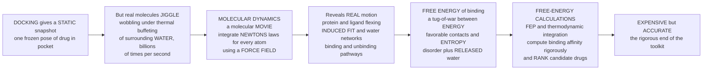

# 🎬 Molecular Dynamics and Free Energy

> [!abstract] TL;DR
> **Docking** hands you a single *photograph* — one frozen pose of a drug wedged in its pocket. But real molecules are never still: every atom **jiggles, wobbles, and dances**, buffeted billions of times a second by the thermal kicks of surrounding water. **Molecular dynamics (MD)** turns the photograph into a **molecular movie** — it uses **Newton's laws of motion** and a **force field** (the potential-energy function) to compute the force on every atom and step it forward in femtosecond increments, revealing how the drug and its target actually *flex, breathe, and settle into an induced fit* in a realistic watery box. This matters because the number we ultimately want is how **tightly** a drug binds — its **free energy of binding, $\Delta G = \Delta H - T\Delta S$** — a thermodynamic tug-of-war between favorable *energy* (contacts) and *entropy* (disorder, and especially the water molecules *released* when binding happens). **Free-energy calculations** (the alchemical methods **FEP** and **thermodynamic integration**) run these simulations plus statistical mechanics to compute that balance rigorously, even predicting which of two near-identical candidates binds tighter — guiding chemists' expensive synthesis choices. The catch: simulating atoms jiggling is enormously compute-hungry, so this is the **expensive-but-accurate** end of the computational toolkit, reserved for when you truly need the binding energy right.
>
> *Educational science note — not individual medical or dosing advice.*

---

## Intuition

**Analogy — docking is a photograph, molecular dynamics is a movie.** When you *dock* a candidate drug into a protein pocket, you get one crisp still image: this molecule, this pose, this frozen instant. It looks convincing. But it is a lie of stillness. In reality, both the drug and the protein are seething with motion — side chains flick, loops flap open and shut, and the drug rattles in its cradle while a storm of **water molecules** slams into everything billions of times per second. A photograph can hide a bad fit that a movie would expose in the first second of play.

**Molecular dynamics films that movie, frame by frame, using physics.** Give every atom a position and a velocity, work out the **force** pulling on it from all its neighbours (that is the *force field*), and use **Newton's $F = ma$** to nudge each atom forward a tiny sliver of time — a **femtosecond**, a millionth of a billionth of a second. Repeat a few hundred million times and you have watched the drug and protein *actually move*: you see the pocket mould itself around the drug (**induced fit**), you see which water molecules stay trapped and which get squeezed out, you see whether the drug clings or slips free. That is dynamics a single snapshot can never show.

**But the prize is not the movie — it is a single number: how tightly does the drug stick?** That "stickiness" is the **free energy of binding**, and here is the subtle part: binding is not just about making good contacts (that is the *energy*, the enthalpy $\Delta H$). It is a *tug-of-war* with **entropy** — disorder. A floppy drug loses freedom when it locks into a pocket (entropy cost), but binding also *frees* the ordered water molecules that used to blanket the drug and the pocket, spilling them back into the bulk (entropy gain). The winner of that tug-of-war, $\Delta G = \Delta H - T\Delta S$, decides the affinity. **Free-energy calculations** are the only computational methods that take this whole thermodynamic accounting seriously. They can even do the magician's trick of **alchemy** — gradually *morphing* one drug candidate into another inside the simulation — to predict which of the two binds tighter, telling a chemist which molecule is worth the weeks and dollars of synthesis. The price of all this rigour is compute: jiggling atoms is *expensive*, which is exactly why MD and free-energy methods sit at the accurate-but-costly end of the toolkit, where docking and QSAR only approximate.

---

## How It Works

### Core mechanics

Molecular dynamics answers a mechanical question — *how does the system move?* — and free-energy calculation answers the thermodynamic one — *how tightly does it bind?* They stack on top of each other:

1. **A force field defines the energy.** The **potential energy** of the whole system is a sum of simple physical terms: **bonds** (springs), **angles** (springs), **torsions** (rotations about bonds), **van der Waals** (Lennard-Jones packing), and **electrostatics** (Coulomb charges). Popular parameter sets — **AMBER**, **CHARMM**, **OPLS**, **GROMOS** — differ in how these terms are fit. The *negative gradient* of this energy is the **force** on each atom.
2. **Integrate Newton's equations.** With forces in hand, an integrator (the **velocity-Verlet** algorithm, a symplectic scheme) advances positions and velocities by a tiny **timestep** — typically **1–2 femtoseconds**, small enough to resolve the fastest bond vibrations. Each step is one frame of the movie.
3. **Control temperature and pressure.** A raw Newtonian system conserves energy (the **NVE** ensemble). To mimic a cell at body temperature and pressure, a **thermostat** (e.g. Langevin, Nosé–Hoover) holds temperature and a **barostat** holds pressure, generating the physically relevant **NVT** (canonical) or **NPT** ensembles — the ensembles of statistical mechanics.
4. **Solvate realistically.** The protein–drug complex is dropped into a box of **explicit water** molecules (and ions), with **periodic boundary conditions** so the box tiles space and has no artificial walls; long-range electrostatics are summed with **Particle Mesh Ewald (PME)**. Water is not scenery — it drives the hydrophobic effect and the entropy of binding.
5. **Read out the dynamics.** From the trajectory you extract **flexibility**, **conformational changes**, **induced fit**, **water networks**, **binding/unbinding pathways**, and even **residence time** — everything a static structure omits.
6. **Compute the free energy.** Because a long trajectory *samples the Boltzmann distribution* $P \propto e^{-E/kT}$, the free energy along any coordinate is $F(x) = -kT\ln P(x)$ (a **potential of mean force**). To compare two candidates, **alchemical** methods — **free-energy perturbation (FEP)** and **thermodynamic integration (TI)** — introduce a coupling parameter $\lambda$ and computationally *mutate* ligand A into ligand B, reading off the **relative binding free energy** $\Delta\Delta G$ via a thermodynamic cycle. Cheaper **endpoint** methods (**MM-PBSA / MM-GBSA**) estimate absolute binding energy from the complex, protein, and ligand alone.

The whole edifice rests on statistical mechanics: free energy is $F = -kT\ln Z$, where $Z$ is the partition function, and every average is an ensemble average over the sampled configurations.

### From a static snapshot to a rigorous binding number



---

## Key Concepts

### Secondary (foundations)
- **Atoms jiggle.** Nothing in a molecule sits still; thermal motion shakes every atom constantly, especially the water surrounding a drug.
- **MD is a molecular movie.** It uses **Newton's laws** to step every atom forward in tiny time slices, so you *watch* how a drug and protein move rather than guessing from one snapshot.
- **Snapshot vs movie.** Docking gives a still photo; MD shows the drug and pocket flexing, the **induced-fit** handshake a photo misses.
- **Binding free energy is the goal.** It is a single number for *how tightly* a drug sticks — the thing that actually decides whether it works.
- **Energy vs entropy tug-of-war.** Binding trades off *good contacts* (energy) against *disorder* (entropy), including the ordered **water** that gets released when the drug docks.
- **Expensive but accurate.** Simulating jiggling atoms costs enormous compute, so these methods are used when you must get the binding energy *right*.

### Undergraduate (mechanisms and parameters)
- **Force field.** The potential-energy function — **bonds, angles, torsions, van der Waals, electrostatics** — whose gradient gives the forces. Parameter sets: **AMBER, CHARMM, OPLS, GROMOS**.
- **Integration.** **Velocity-Verlet** advances positions and velocities at a **1–2 fs** timestep; too large a step and bonds "explode".
- **Thermostats and barostats.** Devices that impose constant temperature (**NVT**) or temperature *and* pressure (**NPT**) — the ensembles that match a real cell — instead of bare energy-conserving **NVE**.
- **Explicit solvent and periodic boundaries.** The complex sits in a box of **water** and ions; **periodic boundary conditions** remove artificial walls; **PME** sums long-range electrostatics.
- **Boltzmann sampling.** A long equilibrium trajectory visits configurations with probability $P \propto e^{-E/kT}$; averages over the trajectory *are* thermodynamic ensemble averages.
- **Binding thermodynamics.** $\Delta G_\text{bind} = \Delta H - T\Delta S$ — the **enthalpy–entropy** balance, including **desolvation**, **configurational entropy**, and the fate of ordered water.
- **Potential of mean force (PMF).** The free energy along a chosen coordinate, $F(x) = -kT\ln P(x)$ — a landscape of wells (states) and barriers.
- **Endpoint methods.** **MM-PBSA / MM-GBSA** estimate binding energy from molecular-mechanics energies plus an implicit-solvent term — fast, approximate, popular for ranking.

### Graduate (strategy and trade-offs)
- **Alchemical free energy.** **FEP** uses the **Zwanzig** relation $\Delta F = -kT\ln\langle e^{-\Delta U/kT}\rangle$; **TI** integrates $\int_0^1 \langle \partial U/\partial\lambda\rangle_\lambda\, d\lambda$. A **thermodynamic cycle** converts these into a **relative binding free energy** $\Delta\Delta G$ between two ligands — the workhorse of modern lead optimization.
- **Statistical-mechanics foundation.** $F = -kT\ln Z$; binding is a difference of free energies between bound and unbound ensembles; **phase-space overlap** between neighbouring $\lambda$ states governs whether an estimator converges.
- **The sampling problem.** MD reaches nanoseconds-to-microseconds while biology (loop motions, dissociation) runs on microseconds-to-seconds — a yawning **timescale gap**. **Enhanced sampling** — **metadynamics, replica exchange (REMD), umbrella sampling + WHAM** — flattens or reweights barriers to sample rare states.
- **Convergence and error.** Estimates suffer **hysteresis**, slow convergence, and statistical noise; honest work reports uncertainty via **block averaging**, multiple replicas, and bidirectional (forward/backward) estimators like **BAR/MBAR**.
- **Accuracy limits.** Results are only as good as the **force field** (fixed-charge approximations, torsion errors) and the **sampling**. **Polarizable** force fields and **machine-learning / neural-network potentials** (ANI, learned QM-accurate energies) are pushing accuracy.
- **Hardware frontier.** **GPUs** made routine microsecond MD possible; **Anton** (D. E. Shaw Research), a special-purpose supercomputer, reaches millisecond trajectories that expose full binding and folding events.
- **Kinetics, not just thermodynamics.** Long MD plus **Markov state models** estimates $k_\text{on}$, $k_\text{off}$, and **residence time** — increasingly recognized as decisive as equilibrium affinity.

---

## Python Demo

```python
# Molecular dynamics and free energy: from an atom's jiggling to a binding number.
# (a) MD TRAJECTORY: overdamped Langevin dynamics of a particle on a double-well
#     "binding" surface -- a deep BOUND well + a shallow UNBOUND well split by a
#     barrier. Thermal noise makes it hop between states => a 1-D molecular movie.
# (b) FREE-ENERGY LANDSCAPE: reconstruct F(x) = -kT * ln P(x) from the sampled
#     positions (statistical mechanics) and compare to the true potential => the
#     binding well + barrier emerge purely from where the particle spent its time.
# (c) CONVERGENCE: the free-energy DIFFERENCE between the two wells only settles
#     down with enough sampling => the core cost/accuracy trade-off of these methods.
# numpy + matplotlib only.
import numpy as np
import matplotlib.pyplot as plt

rng = np.random.default_rng(42)

# ---- thermodynamics ----
kT = 1.0                      # thermal energy (reduced units): sets fluctuation scale

# ---- a 1-D "binding" free-energy surface: asymmetric double well ----
# U(x) = a*(x^2 - 1)^2 + tilt*x  -> wells near x=-1 (BOUND, deeper) and x=+1 (UNBOUND)
a, tilt = 2.0, 0.5
def U(x):    return a * (x**2 - 1.0)**2 + tilt * x
def dU(x):   return 4.0 * a * x * (x**2 - 1.0) + tilt          # dU/dx

# ---- overdamped Langevin integrator (samples Boltzmann: P ~ exp(-U/kT)) ----
n_steps   = 200_000
dt        = 0.005
noise_amp = np.sqrt(2.0 * kT * dt)
noise     = rng.standard_normal(n_steps)                       # pre-drawn thermal kicks
traj      = np.empty(n_steps)
x = -1.0                                                       # start in the bound well
for i in range(n_steps):
    x += -dU(x) * dt + noise_amp * noise[i]
    traj[i] = x
t = np.arange(n_steps) * dt

# ---- (b) reconstruct the free energy from the sampled histogram ----
counts, edges = np.histogram(traj, bins=90, range=(-2.0, 2.0), density=True)
centers = 0.5 * (edges[:-1] + edges[1:])
ok = counts > 0
F_recon = -kT * np.log(counts[ok])
F_recon -= F_recon.min()                                       # shift min to zero
xgrid = np.linspace(-2.0, 2.0, 400)
U_true = U(xgrid) - U(xgrid).min()

# ---- reference basin free-energy difference from the partition functions ----
xf = np.linspace(-2.0, 2.0, 4000)
w  = np.exp(-U(xf) / kT)
Z_bound   = np.trapz(w[xf < 0], xf[xf < 0])                    # left basin
Z_unbound = np.trapz(w[xf >= 0], xf[xf >= 0])                  # right basin
dF_true = -kT * np.log(Z_bound / Z_unbound)                    # bound minus unbound

# ---- (c) running estimate of dF from cumulative occupancy ----
left_cum  = np.cumsum(traj < 0)
right_cum = np.cumsum(traj >= 0)
burn = 500
idx = np.unique(np.logspace(np.log10(burn), np.log10(n_steps - 1), 200).astype(int))
running_dF = -kT * np.log(left_cum[idx] / right_cum[idx])

# ================= PLOT =================
fig, ax = plt.subplots(1, 3, figsize=(17, 5))

# (a) MD trajectory: the molecular movie hopping between bound and unbound
ax[0].plot(t, traj, lw=0.5, color="steelblue")
ax[0].axhline(-1, color="green", ls="--", lw=1.2)
ax[0].axhline(+1, color="crimson", ls="--", lw=1.2)
ax[0].text(t[-1] * 0.62, -1.55, "BOUND state", color="green", fontsize=10, weight="bold")
ax[0].text(t[-1] * 0.62, 1.35, "UNBOUND state", color="crimson", fontsize=10, weight="bold")
ax[0].set(title="(a) MD trajectory: atoms jiggle and\nhop between states (thermal noise)",
          xlabel="time (reduced units)", ylabel="reaction coordinate  x")
ax[0].set_ylim(-2.2, 2.2)

# (b) free-energy landscape: reconstructed vs true
ax[1].plot(xgrid, U_true, color="black", lw=2.5, label="true potential  U(x)")
ax[1].plot(centers[ok], F_recon, "o", ms=4, color="darkorange",
           label="reconstructed  F = -kT ln P")
ax[1].set(title="(b) Free-energy landscape:\nF(x) = -kT ln P recovers the wells + barrier",
          xlabel="reaction coordinate  x", ylabel="free energy  (units of kT)")
ax[1].legend(fontsize=9)
ax[1].set_ylim(-0.2, 5.5)

# (c) convergence of the binding free-energy difference
ax[2].semilogx(idx, running_dF, color="purple", lw=1.8, label="running estimate")
ax[2].axhline(dF_true, color="black", ls="--", lw=1.5,
              label=f"reference  dF = {dF_true:.2f} kT")
ax[2].fill_between(idx, dF_true - 0.15, dF_true + 0.15, color="black", alpha=0.10)
ax[2].set(title="(c) Convergence: dF settles only\nwith enough sampling (the cost)",
          xlabel="number of samples (log)", ylabel="dF (bound - unbound)  [kT]")
ax[2].legend(fontsize=9)

fig.suptitle("Molecular Dynamics and Free Energy: jiggling atoms -> a rigorous binding number",
             fontsize=13)
fig.tight_layout()
plt.show()

# ---- console summary ----
frac_bound = np.mean(traj < 0)
print(f"Fraction of time in BOUND well : {frac_bound:.3f}")
print(f"Reference dF (bound - unbound) : {dF_true:.3f} kT")
print(f"Final running estimate of dF   : {running_dF[-1]:.3f} kT")
print("A deeper, more-occupied well = lower free energy = the tighter-binding state.")
```

**What the plots show.** Panel **(a)** is the molecular movie in miniature: a single particle, kicked around by thermal noise (Langevin dynamics — the same math a real MD thermostat uses), rattles inside the **bound** well and occasionally musters enough of a random kick to leap the barrier into the **unbound** state and back. No frame is special; the *ensemble* of frames is the physics. Panel **(b)** performs the statistical-mechanics magic: we throw away all time information, histogram *where* the particle spent its time, and compute $F(x) = -kT\ln P(x)$ — and the true binding landscape (deep bound well, shallow unbound well, barrier between) re-emerges purely from occupancy. **This is the bridge from a simulation of motion to a free energy.** Panel **(c)** delivers the sober lesson: the **free-energy difference** between the two wells is meaningless from a short run and only converges toward the reference value (computed exactly from the partition-function integrals) after a great deal of sampling — the visual signature of *why these methods are expensive*, and why honest practitioners always quote an uncertainty.

---

## Real-World Applications

- **FEP+ in lead optimization.** Schrödinger's **FEP+** (built on the physics of Wang et al., *JACS* 2015) computationally *mutates* one congeneric analog into another and predicts **relative binding free energies** to roughly 1 kcal/mol — accurate enough to **rank which analog to synthesize next**, sparing chemists dozens of dead-end syntheses in a DMTA cycle.
- **Anton and millisecond MD.** D. E. Shaw Research's special-purpose **Anton** supercomputer reaches **millisecond** trajectories, capturing complete drug **binding and unbinding pathways** to GPCRs and kinases and revealing transient states no crystal structure shows.
- **MM-GBSA rescoring.** After fast docking generates thousands of poses, a short MD plus **MM-GBSA** re-scores the survivors with a better (if approximate) energy model — a standard "cheap free energy" filter in virtual-screening pipelines.
- **Cryptic pockets and allostery.** MD flushes out **cryptic pockets** that open only transiently (famously for **KRAS** and several GPCRs), and maps **allosteric** communication — druggable sites invisible to a single static structure.
- **Pandemic response.** During COVID-19, massive distributed MD (**Folding@home**, reaching exascale) and targeted simulations probed the **SARS-CoV-2 main protease** and spike protein to guide antiviral and antibody design.
- **Production engines and ML potentials.** **GROMACS, AMBER, NAMD, OpenMM** run most academic and industrial MD; emerging **neural-network potentials** (e.g. ANI-style models) aim to deliver quantum-accuracy energies at force-field speed, sharpening the accuracy ceiling.

---

## Common Pitfalls

- **Under-sampling (the cardinal sin).** A trajectory that never crosses the relevant barriers has *not* sampled the ensemble; the free-energy estimate is a mirage. Rare events demand long runs, replicas, or **enhanced sampling** — and an honest error bar (see panel (c)).
- **Trusting the force field blindly.** A wrong torsion parameter or mis-assigned charge shifts $\Delta G$ by kcal/mol — enough to invert a ranking. *Garbage in, garbage out*; validate against known affinities.
- **Confusing potential energy with free energy.** The deepest *energy* minimum is not necessarily the most *populated* state, because **entropy** matters. Ranking poses by minimized energy alone (as naive docking does) ignores the $-T\Delta S$ term and the water.
- **Ignoring water and desolvation.** Binding *releases* ordered water; implicit-solvent shortcuts (MM-PBSA/GBSA) can badly mis-estimate this entropic engine. Explicit water is often what separates right from wrong.
- **Poor phase-space overlap in FEP.** Mutating A into B in one giant alchemical jump gives a high-variance, biased estimate. Use many small $\lambda$ windows, **soft-core** potentials, and bidirectional estimators (**BAR/MBAR**).
- **Skipping equilibration.** Averaging in configurations before the system relaxes biases every downstream quantity. Discard the equilibration phase explicitly.
- **Over-reading a single trajectory.** MD is stochastic; one movie is an anecdote. Conclusions need **replicas** and reported statistical uncertainty, not a hand-picked frame.
- **Timescale mismatch.** Expecting a millisecond dissociation or a slow loop rearrangement to appear in a nanosecond run is a category error — match the simulated timescale to the biological event.

---

## Related Concepts

This note is the physically rigorous capstone of the **Computational and Modern Drug Design** section, and it completes that section's toolkit. Its siblings, referenced in prose (same section): **Computational Drug Design** frames the overall in-silico landscape into which MD and free-energy methods slot as the accurate-but-costly end; **Structure-Based Drug Design and Docking** produces the fast static poses that MD then puts *in motion* and free-energy methods re-rank with real thermodynamics; **AI and Machine Learning in Drug Discovery** supplies the ML potentials and generative models that are lowering MD's cost and accuracy ceilings; **Lead Optimization and Medicinal Chemistry** is the downstream consumer — FEP-ranked analogs directly guide which molecules chemists synthesize; and **Drug-Receptor Interactions and Binding** defines the very quantity ($\Delta G$, $K_d$, residence time) that these simulations exist to predict.

Verified cross-vault links:

- [[Computational_Physics/05_Many_Body_and_Quantum_Simulation/Molecular_Dynamics_Simulation|Molecular Dynamics Simulation]] — the general numerical method (integrators, force fields, thermostats) that drug-binding MD specializes; read this for the algorithmic core.
- [[Physics/03_Thermodynamics_and_Statistical_Mechanics/Classical_Statistical_Mechanics|Classical Statistical Mechanics]] — the Boltzmann distribution, partition function $Z$, and ensemble averages that turn a trajectory into a free energy $F = -kT\ln Z$.
- [[Chemistry/02_Physical_Chemistry/Chemical_Thermodynamics|Chemical Thermodynamics]] — Gibbs free energy and the $\Delta G = \Delta H - T\Delta S$ enthalpy-entropy balance that *is* binding affinity.
- [[Statistical_Mechanics_and_Machine_Learning/03_Sampling_MCMC_and_Monte_Carlo/Free_Energy_Estimation_and_Thermodynamic_Integration|Free Energy Estimation and Thermodynamic Integration]] — the same FEP/TI/thermodynamic-integration machinery, cast in the language of sampling and machine learning.

---

## Review Questions

**Secondary**
1. Why is docking called a "photograph" and molecular dynamics a "movie"? Give one thing the movie reveals that the photograph cannot.
2. Binding free energy is described as a *tug-of-war*. What are the two sides pulling against each other, and what surprising role do **water** molecules play?
3. Why are MD and free-energy methods considered the "expensive" end of the computational toolkit, and when is that cost worth paying?

**Undergraduate**
4. List the terms in a typical **force field** and explain how they are used to move atoms forward one timestep with Newton's laws. Why must the timestep be only about 1–2 femtoseconds?
5. Starting from the Boltzmann distribution $P(x)\propto e^{-U(x)/kT}$, explain why $F(x) = -kT\ln P(x)$ lets you reconstruct a free-energy landscape from a trajectory. What is a **potential of mean force**?
6. Distinguish an **NVT** ensemble from bare **NVE** dynamics, and explain why a **thermostat** and **explicit water** matter for predicting binding.

**Graduate**
7. Explain how an **alchemical** FEP or TI calculation predicts the *relative* binding free energy $\Delta\Delta G$ of two analogs via a thermodynamic cycle. Why is this often more reliable than computing two *absolute* binding free energies?
8. A colleague reports a single, tightly converged-looking $\Delta G$ from one 50 ns trajectory. What three questions would you ask about **sampling**, **convergence**, and **force-field** accuracy before trusting it, and what diagnostics (block averaging, replicas, phase-space overlap) would you request?
9. Given the timescale gap between MD (ns–μs) and slow biological motions (μs–s), compare **metadynamics**, **replica exchange**, and **umbrella sampling** as strategies to recover rare-event free energies. What does each buy you, and what does each assume?

---

## Sources

- Frenkel, D. & Smit, B. *Understanding Molecular Simulation: From Algorithms to Applications* (2nd ed.), Academic Press — the standard text on MD, Monte Carlo, and free-energy methods.
- Leach, A. R. *Molecular Modelling: Principles and Applications* (2nd ed.), Prentice Hall — force fields, integration, and free-energy calculations for drug design.
- Chodera, J. D. et al. (2011). "Alchemical free energy methods for drug discovery: progress and challenges." *Current Opinion in Structural Biology* 21(2): 150-160.
- Wang, L. et al. (2015). "Accurate and reliable prediction of relative ligand binding potency in prospective drug discovery by way of a modern free-energy calculation protocol and force field (FEP+)." *Journal of the American Chemical Society* 137(7): 2695-2703.
- Karplus, M. & McCammon, J. A. (2002). "Molecular dynamics simulations of biomolecules." *Nature Structural Biology* 9(9): 646-652.

---

#pharmacology #molecular-dynamics #free-energy #binding-affinity #statistical-mechanics
