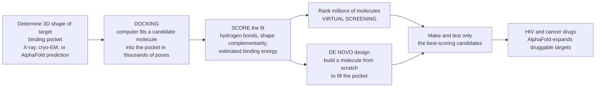

# 🔑 Structure-Based Drug Design and Docking

> [!abstract] TL;DR
> If you can **see the lock, you can design the key.** Structure-based drug design (SBDD) determines the precise **3D atomic shape of a target protein's binding pocket** — using **X-ray crystallography**, **cryo-electron microscopy**, or now **AlphaFold** deep-learning predictions — and then builds molecules **shaped to slot into that pocket** like a hand into a custom glove. The workhorse computational method is **molecular docking**: a computer fits a candidate molecule into the pocket in **thousands of poses and orientations**, then **scores** how well it binds (shape complementarity, hydrogen bonds, estimated binding energy). Run docking across **millions of molecules (virtual screening)** to rank which are worth synthesizing, or **design a molecule from scratch (de novo)** to perfectly complement the pocket. This rational "see-the-target-then-build-the-key" approach produced landmark drugs — **HIV protease inhibitors**, **influenza neuraminidase inhibitors**, and many **kinase-inhibitor cancer drugs** — and the **AlphaFold revolution**, which predicts a protein's shape directly from its sequence, has suddenly made structure-based design possible for a vast number of targets whose shapes were previously unknown.

---

## Intuition

**Analogy FIRST — you have a photograph of a keyhole, so you can machine the perfect key.** Imagine you are a locksmith who has never seen the actual key, but someone hands you a flawless, high-resolution **3D photograph of the inside of the lock** — every ward, every pin, every contour. From that image alone you can machine a key that slides in perfectly, because you can *see exactly what shape it must be.* Structure-based drug design works precisely this way. Scientists first obtain a **3D atomic picture of the target protein's binding pocket** — the "lock" — and then design a small molecule, the "key," **shaped and chemically decorated to fit that pocket snugly.**

Getting that photograph of the lock is itself hard-won. For decades the workhorse was **X-ray crystallography**: grow a crystal of the protein, fire X-rays at it, and reconstruct where every atom sits. **NMR** and, more recently, the **cryo-electron microscopy "resolution revolution"** cracked open harder targets that would not crystallize. And in 2021, **AlphaFold** changed everything — a deep-learning system that **predicts a protein's 3D structure straight from its amino-acid sequence**, handing scientists photographs of countless locks whose shapes had never been solved.

Once you have the lock, the core computational tool is **docking**. The computer takes a candidate molecule and **tries to fit it into the pocket in thousands of orientations and shapes ("poses")** — sliding, rotating, flexing it — and for each pose it **scores the fit**: are the bumps and hollows complementary, do hydrogen-bond donors meet acceptors, is the estimated binding energy favorable? The best-scoring pose is the predicted **binding mode**. Do this for **millions of molecules at once (virtual screening)** and you get a ranked list of which ones to actually make and test in the lab. Even better, instead of fishing through existing molecules you can **grow a molecule from scratch to fill the pocket exactly (de novo design)**. Rather than searching blindly through millions of compounds hoping to get lucky, you *look at the target and rationally engineer the drug.* Seeing the lock lets you design the key.

---

## How It Works

### Core mechanics

1. **Determine the target's 3D structure — get the photograph of the lock.** SBDD begins by obtaining an atomic-resolution model of the target protein and, critically, its **binding site**. Sources: **X-ray crystallography** (the traditional workhorse, best for well-ordered proteins that crystallize), **NMR spectroscopy** (smaller proteins in solution, captures dynamics), **cryo-electron microscopy** (the recent breakthrough for large complexes and membrane proteins that resist crystallization), and **computational prediction** — **homology modeling** (build from a related known structure) and now **AlphaFold** (deep learning that predicts structure from sequence). The quality and *relevance* of this structure — ideally a **co-crystal** with a bound ligand showing the pocket in its drug-binding state — sets a ceiling on everything downstream.
2. **Define the binding pocket.** From the structure, identify the cavity where a drug should bind (often an enzyme's active site or a receptor's ligand pocket), map its shape, its **hydrogen-bond donors/acceptors**, hydrophobic patches, charged residues, and any structured **water molecules**. This is the negative mold the drug must complement.
3. **Docking — the search problem.** Given the pocket and a candidate molecule (the **ligand**), *sample* many **poses**: positions, orientations, and internal conformations (rotatable bonds flexing) of the ligand inside the site. A rigid-receptor docking run may evaluate **thousands to millions of poses per molecule** using genetic algorithms, incremental construction, or systematic/stochastic search. The goal is to find the ligand's true **binding mode**.
4. **Docking — the scoring problem.** For each pose, a **scoring function** estimates how good the fit is — approximating **binding free energy** from shape complementarity, hydrogen bonds, electrostatics, van der Waals contacts, and desolvation. Scoring functions come in three flavors: **force-field-based** (physics: sum of interaction energies), **empirical** (weighted sum of terms fitted to known affinities), and **knowledge-based** (statistical potentials from observed protein-ligand contacts). Scoring is **fast but approximate** — the central compromise of docking.
5. **Virtual screening — rank the library.** Dock a **large compound library** (from thousands to, now, *billions* of make-on-demand molecules) against the pocket, sort by score, and **prioritize the top-ranked** for actual synthesis and assay. This turns an impossible experimental search into a tractable computational triage that enriches the hit rate.
6. **Structure-based design and the redesign cycle.** Beyond screening existing molecules you can **design** them: **de novo** design (assemble a molecule to fit the pocket from scratch), **fragment-based** growing and linking (start from small fragments seen binding, then grow/merge them guided by the structure), and structure-guided **lead optimization** (use **co-crystal structures** of your molecule bound to the target to see *exactly* why it binds and rationally add groups to boost potency and selectivity). This drives the iterative **design → synthesize → crystallize → redesign** cycle at the heart of modern medicinal chemistry.

### Why docking is hard (the honest caveats)

- **Scoring-function inaccuracy.** Docking is generally **good at ranking** (separating plausible binders from non-binders) but **poor at predicting absolute affinity** — it approximates a hugely complex free energy in milliseconds. More rigorous **free-energy methods** (FEP, MD-based) trade speed for accuracy.
- **Protein flexibility and induced fit.** Most fast docking treats the receptor as **rigid**, but real pockets **breathe and reshape** around ligands (induced fit, cryptic pockets). A structure captured without your ligand may present the "wrong" pocket shape.
- **Water and entropy.** Ordered **water molecules** can bridge or block binding, and **entropy** (conformational and solvent) is notoriously hard to estimate — both routinely trip up scoring.

### Flow



---

## Key Concepts

### Secondary (explain to a bright teenager)

- **See the lock, build the key.** If you have a perfect 3D picture of the shape inside a lock, you can make a key that fits. Drugs work like keys that slot into a specific pocket on a protein; SBDD gets the picture of that pocket first, then designs the drug to fit it.
- **How do we get the picture?** Special "cameras" for molecules: **X-ray crystallography** and **cryo-electron microscopy** photograph real proteins atom by atom. Newer AI called **AlphaFold** can even *guess* the shape correctly from the protein's genetic recipe.
- **Docking = trying the key thousands of ways.** A computer takes a candidate molecule and jiggles it into the pocket in **thousands of positions**, then gives each a **score** for how well it fits and sticks.
- **Screen millions, make a few.** Because it's just math, the computer can test **millions of molecules** overnight and hand back a short list of the best — so chemists only bother making the promising ones.
- **It really works.** This approach helped create **HIV drugs** and many **cancer drugs** — real medicines designed by looking at the target instead of guessing.

### Undergraduate (needs some biology / chemistry)

- **The two halves of docking: search and scoring.** *Search* explores the space of ligand **poses** (translation, rotation, and torsional conformations) in the binding site. *Scoring* estimates binding quality for each pose. A docking program is a search algorithm wrapped around a scoring function.
- **Three families of scoring functions.** **Force-field** (physics-based sums of van der Waals + electrostatic energies), **empirical** (regression-fit weighted terms: H-bonds, hydrophobic contact, rotatable-bond penalty), and **knowledge-based** (statistical potentials derived from frequencies of atom-pair contacts in the PDB). Each trades physical rigor against speed and generality.
- **Rigid vs flexible.** Ligand flexibility is now standard; **receptor flexibility** is expensive and often approximated (ensemble docking, soft potentials, induced-fit docking). Ignoring induced fit is a common source of false negatives.
- **Virtual screening and enrichment.** Success is measured not by perfect affinity prediction but by **enrichment** — do the top-ranked few percent of the library capture a disproportionate share of the true binders? Even a noisy score that *ranks* well hugely raises hit rates versus random picking.
- **Structure determination methods matter.** **X-ray** gives static high-resolution snapshots (but a crystal, not a cell); **NMR** captures dynamics of small proteins in solution; **cryo-EM** unlocks large complexes and membrane proteins; **homology models** and **AlphaFold** supply structures where no experiment exists — but a *predicted* pocket must be used with care.
- **Design strategies.** **De novo** design builds molecules to fit a pocket; **fragment-based** discovery grows/links small fragments observed binding; **structure-guided lead optimization** reads co-crystal structures to add groups that gain a hydrogen bond or fill a hydrophobic sub-pocket for extra potency and selectivity.

### Graduate (system-level / thermodynamic)

- **What the score is really approximating.** Binding is governed by **ΔG_bind = ΔH − TΔS**, itself the difference of large opposing terms (protein-ligand interactions gained vs desolvation and configurational entropy lost). Docking scores are crude, fast surrogates for this; the correlation between score and measured **pK_d/pK_i** is real but **noisy** — good for ranking, unreliable for absolute affinity. This motivates a tiered funnel: cheap docking to triage, then rigorous **free-energy perturbation (FEP)** or **MD** on the survivors.
- **The receptor-flexibility problem.** Rigid-receptor docking is a projection onto a single conformer of an ensemble. **Cryptic pockets**, loop rearrangements, and side-chain rotamer changes mean the biologically relevant pocket may never appear in a single crystal. Ensemble/relaxed-complex and induced-fit schemes partially address this at large compute cost.
- **Structured water and desolvation.** Displacing an **ordered water** can pay a favorable entropy but cost enthalpy; predicting which waters to keep, bridge, or displace (WaterMap-style analyses) is decisive for potency yet poorly handled by generic scoring functions.
- **The AlphaFold inflection.** **AlphaFold2 (Jumper et al., 2021)** predicts backbone/side-chain coordinates at near-experimental accuracy from sequence and multiple-sequence alignments via an attention-based network. It **expands druggable structural space** to targets never crystallized — but caveats bite: predicted **side-chain and loop** placement, alternative/holo conformations, and pocket-relevant states can be off, so AlphaFold models often need refinement or experimental validation before high-stakes docking. The interplay of **deep-learning structure prediction**, **generative de novo design**, and **physics-based free-energy methods** now defines the computational frontier.
- **Benchmarks and pitfalls of evaluation.** Retrospective metrics (**RMSD** of predicted vs native pose, **enrichment factor**, **ROC-AUC** on decoy sets like DUD-E) can be gamed by biased decoys and are weak proxies for **prospective** success. Rigorous validation demands prospective virtual screens confirmed by assays and, ideally, co-crystal structures.

---

## Python Demo

```python
# STRUCTURE-BASED DRUG DESIGN AND DOCKING — three quantitative views:
#   (a) DOCKING POSE SEARCH : a candidate is fitted into a simplified 2D binding
#       pocket in thousands of POSES; each is SCORED by shape/chemical
#       complementarity, and the best-scoring pose (the predicted binding mode)
#       is found — including a short greedy refinement (local optimization).
#   (b) SCORE vs TRUE AFFINITY : docking score correlates with real binding
#       affinity but NOISILY — good ranking, poor absolute prediction
#       (the scoring-function limitation).
#   (c) VIRTUAL-SCREENING ENRICHMENT : ranking a library by docking score means
#       the top few percent capture most of the true binders vs random picking.
# All values are illustrative teaching numbers, NOT any real target.
# Educational content, not individual medical advice.
import numpy as np
import matplotlib.pyplot as plt

rng = np.random.default_rng(7)
fig, ax = plt.subplots(1, 3, figsize=(19, 6))

# ---------------------------------------------------------------------------
# (a) DOCKING POSE SEARCH on a simplified binding-pocket score landscape.
# Pose coordinates: p1 = translational offset (A), p2 = orientational coordinate.
# Score is HIGHER for a better fit (a stand-in for negative binding energy).
def dock_score(p1, p2):
    native = 10.0 * np.exp(-((p1 - 0.0)**2 + (p2 - 0.0)**2) / (2 * 0.7**2))   # true binding mode
    decoy1 =  6.5 * np.exp(-((p1 - 2.1)**2 + (p2 - 1.6)**2) / (2 * 0.5**2))    # attractive decoy pose
    decoy2 =  5.5 * np.exp(-((p1 + 1.9)**2 + (p2 + 1.8)**2) / (2 * 0.6**2))    # another decoy
    clash  = -0.15 * (p1**2 + p2**2)                                          # mild steric penalty far out
    return native + decoy1 + decoy2 + clash

grid = np.linspace(-4, 4, 300)
P1, P2 = np.meshgrid(grid, grid)
Z = dock_score(P1, P2)

# The docking SEARCH: sample many random poses (orientations/positions).
n_poses = 500
s1 = rng.uniform(-4, 4, n_poses)
s2 = rng.uniform(-4, 4, n_poses)
sc = dock_score(s1, s2)
best = int(np.argmax(sc))

# Greedy local refinement from the best sampled pose (local optimization).
gp = np.array([s1[best], s2[best]])
traj = [gp.copy()]
step = 0.35
for _ in range(60):
    cur = dock_score(*gp)
    improved = False
    for d in np.array([[1, 0], [-1, 0], [0, 1], [0, -1],
                       [1, 1], [-1, -1], [1, -1], [-1, 1]]) * step:
        cand = gp + d
        if dock_score(*cand) > cur:
            gp, cur, improved = cand, dock_score(*cand), True
    traj.append(gp.copy())
    step *= 0.95
    if not improved:
        break
traj = np.array(traj)

cf = ax[0].contourf(P1, P2, Z, levels=25, cmap="viridis")
ax[0].scatter(s1, s2, s=8, c="white", alpha=0.35, label="sampled poses")
ax[0].plot(traj[:, 0], traj[:, 1], "-o", color="orange", ms=3, lw=1.5,
           label="greedy refinement")
ax[0].scatter([0], [0], marker="*", s=380, c="red", edgecolor="black",
              label="predicted binding mode", zorder=5)
fig.colorbar(cf, ax=ax[0], shrink=0.85, label="docking score (higher = better fit)")
ax[0].set_xlabel("pose coordinate p1 (translation, A)")
ax[0].set_ylabel("pose coordinate p2 (orientation)")
ax[0].set_title("(a) Docking: search thousands of poses,\nscore each, find the best-fitting binding mode")
ax[0].legend(loc="upper left", fontsize=7.5, framealpha=0.9)

# ---------------------------------------------------------------------------
# (b) & (c) share one candidate library of N molecules.
N = 1200
true_pKd = rng.uniform(4.0, 10.0, N)                      # true affinity (higher = stronger)
# Docking score correlates with affinity but with substantial scoring-function noise.
dock = 1.05 * true_pKd + rng.normal(0.0, 1.15, N) + 0.4

# (b) SCORE vs TRUE AFFINITY — good ranking, noisy absolute values.
def spearman(x, y):
    rx = np.argsort(np.argsort(x)).astype(float)
    ry = np.argsort(np.argsort(y)).astype(float)
    return np.corrcoef(rx, ry)[0, 1]

pearson = np.corrcoef(dock, true_pKd)[0, 1]
rho = spearman(dock, true_pKd)
b1, b0 = np.polyfit(true_pKd, dock, 1)
xline = np.linspace(4, 10, 50)

ax[1].scatter(true_pKd, dock, s=12, alpha=0.35, c="#2980b9")
ax[1].plot(xline, b1 * xline + b0, "r-", lw=2.2, label="best-fit trend")
ax[1].set_xlabel("true binding affinity (pKd, higher = stronger)")
ax[1].set_ylabel("docking score")
ax[1].set_title(f"(b) Score vs affinity: real but NOISY\nPearson r = {pearson:.2f}, Spearman rho = {rho:.2f}")
ax[1].legend(loc="upper left", fontsize=9)

# (c) VIRTUAL-SCREENING ENRICHMENT — rank by docking score, recover binders early.
is_binder = (true_pKd >= 7.5).astype(float)              # define the true actives
order = np.argsort(-dock)                                # rank best docking score first
cum_found = np.cumsum(is_binder[order]) / is_binder.sum()
frac_screened = np.arange(1, N + 1) / N

# Enrichment factor at the top 10 percent of the ranked library.
top = max(1, int(0.10 * N))
ef10 = (is_binder[order][:top].mean()) / is_binder.mean()

ax[2].plot(frac_screened * 100, cum_found * 100, color="#c0392b", lw=2.5,
           label="rank by docking score")
ax[2].plot([0, 100], [0, 100], "k--", lw=1.5, label="random picking")
ax[2].axvline(10, color="gray", ls=":", lw=1.2)
ax[2].fill_between(frac_screened * 100, cum_found * 100, frac_screened * 100,
                   alpha=0.12, color="#c0392b")
ax[2].set_xlabel("percent of library screened (ranked)")
ax[2].set_ylabel("percent of true binders found")
ax[2].set_title(f"(c) Virtual-screening enrichment\ntop 10 percent enrichment factor = {ef10:.1f}x")
ax[2].legend(loc="lower right", fontsize=9)

plt.tight_layout()
plt.savefig("structure_based_drug_design_docking.png", dpi=120)
plt.show()

# Console sanity checks
print(f"(a) Best sampled pose score = {sc[best]:.2f}; "
      f"refined pose reached score = {dock_score(*gp):.2f} near native (0,0)")
print(f"(b) Ranking (Spearman rho) = {rho:.2f} is strong even though "
      f"absolute score is noisy (Pearson r = {pearson:.2f})")
print(f"(c) Top 10% of the ranked library captures "
      f"{cum_found[top-1]*100:.0f}% of all true binders "
      f"(enrichment {ef10:.1f}x over random)")
```

**What it shows.** Panel **(a)** makes docking literal: a simplified **binding pocket** becomes a *score landscape*, the search **samples hundreds of poses** (white dots) scattered across positions and orientations, and a short **greedy refinement** (orange path) climbs from the best random pose to the **global optimum** — the red star, the predicted **binding mode**. Note the two **decoy wells**: attractive-looking poses that a weak search or scorer could mistake for the answer. Panel **(b)** exposes the scoring function's core limitation — docking score and true affinity are **genuinely correlated but noisy**: the **Spearman rank correlation stays high** (docking *ranks* molecules well) even while the **Pearson fit is loose** (it predicts *absolute* affinity poorly). Panel **(c)** is why that's still enormously useful: ranking the whole library by docking score means the **top ~10% captures a large majority of the true binders**, an **enrichment of several-fold over random picking** — turning an impossible experimental search into a focused shortlist. Together: *search + score to find the binding mode, accept noisy affinity but trust the ranking, and let enrichment concentrate the real hits.*

---

## Real-World Applications

> **The canonical triumph: HIV protease inhibitors.** When the 3D structure of **HIV-1 protease** — the viral enzyme that cleaves polyproteins into functional pieces — was solved, its symmetric active-site pocket became a template for **rational design**. Medicinal chemists engineered molecules to plug that pocket, mimicking the enzyme's natural substrate transition state. Drugs like **saquinavir, indinavir, and ritonavir** emerged from this structure-guided cycle in record time and, as part of combination therapy, transformed HIV/AIDS from a death sentence into a manageable condition. It remains the textbook proof that seeing the lock lets you design the key.

- **Influenza neuraminidase inhibitors.** **Zanamivir (Relenza)** and **oseltamivir (Tamiflu)** were designed against the crystal structure of the influenza **neuraminidase** active site — a landmark of pocket-complementary, structure-based design.
- **Kinase inhibitors in cancer.** A large fraction of modern **targeted cancer therapies** are ATP-competitive **kinase inhibitors** optimized against co-crystal structures — designing groups that reach selectivity-conferring sub-pockets (e.g., the "gatekeeper" residue) to hit the oncogenic kinase while sparing others.
- **Fragment-based drugs.** **Vemurafenib** (BRAF-mutant melanoma) grew from a small fragment hit into a potent drug through structure-guided elaboration — a flagship for the fragment-to-lead, crystallography-driven approach.
- **Ultra-large virtual screening.** Docking **make-on-demand libraries of hundreds of millions to billions** of molecules (e.g., the Enamine REAL space) against a target pocket now routinely surfaces novel, potent chemotypes that no physical library contained — computational triage at a scale impossible to synthesize blindly.
- **The AlphaFold expansion.** By supplying credible structures for proteins that were never crystallized, **AlphaFold** opens SBDD to previously "structure-dark" targets across the proteome — accelerating early hit discovery, though predicted pockets are validated and refined before high-stakes campaigns.

---

## Common Pitfalls

- **Trusting the docking score as an affinity.** Docking is **good at ranking, poor at absolute affinity**. Reading a raw score as a predicted K_d, or over-interpreting a 0.3 kcal/mol "improvement," invites disappointment. Use docking to *triage*, then confirm survivors with assays or rigorous **free-energy** methods.
- **Ignoring receptor flexibility (induced fit).** Docking into a single **rigid** structure — especially an **apo** (unliganded) one — can miss real binders whose pocket only forms upon binding, or invent binders that fit an artifactual shape. Consider ensembles, cryptic pockets, and holo structures.
- **Forgetting the waters.** Structured **water molecules** can be part of the pocket (bridging H-bonds) or a prize to displace for entropy. Deleting all waters or keeping all of them naively both distort scoring.
- **Docking into a low-quality or wrong-state structure.** A poorly resolved region, a crystallographic artifact, or — for **AlphaFold** models — mis-placed **side chains and loops** or the wrong (apo vs holo, active vs inactive) conformation silently corrupts every pose. Garbage lock, garbage key.
- **Confusing enrichment on decoys with prospective success.** Great retrospective **enrichment factor** or **ROC-AUC** on a biased decoy set does not guarantee real prospective hits. Validate with **assays** and, ideally, a **co-crystal structure** of the predicted binder.
- **Treating de novo output as a finished drug.** A molecule computationally shaped to fill a pocket may be **unsynthesizable** or have terrible **ADMET**. Structure-based design fixes *potency and shape*, not synthesizability, selectivity, or drug-likeness — those still demand medicinal chemistry.

---

## Related Concepts

This note sits in the **Computational and Modern Drug Design** section. It is the **structure-first** half of computational discovery: the broader map of in-silico methods is the subject of the section overview **Computational Drug Design**, and its natural counterpart is **Ligand-Based Design and QSAR**, which predicts activity from the *chemistry of known actives* when **no** target structure is available (structure-based needs the lock; ligand-based works from copies of keys that fit). When docking's noisy scoring is not enough, more rigorous physics takes over in **Molecular Dynamics and Free Energy**, which simulates the flexing pocket and estimates binding free energies far more accurately at much greater cost. The deep-learning wave — generative de novo design, ML scoring, and **AlphaFold** structure prediction — is treated in **AI and Machine Learning in Drug Discovery**. And the physical event docking tries to predict, a small molecule settling into a protein pocket via shape and hydrogen-bond complementarity, is the subject of **Drug Receptor Interactions and Binding**. (These sibling and companion notes are referenced in prose because they share this section or its immediate lineage.)

Anchors elsewhere in the vault (Glob-verified):

- [[Protein_Structure_and_Function]] — the biochemistry of the **target itself**: folds, active sites, and binding pockets are the "lock" that SBDD must first see.
- [[X_Ray_Crystallography_and_Structural_Biology]] — the traditional experimental workhorse that supplies the atomic-resolution structures docking runs against.
- [[Cryo_Electron_Microscopy]] — the "resolution-revolution" method that unlocked large complexes and membrane proteins previously beyond structure-based design.
- [[NMR_and_Magnetic_Resonance_in_Biology]] — solution-state structure determination that captures the **flexibility** rigid docking struggles to model.
- [[Protein_Structure_and_Folding]] — the biophysics of how sequence yields 3D shape, the very problem **AlphaFold** learned to predict.
- [[Computational_Biophysics_and_Molecular_Dynamics]] — the simulation engine behind flexible-receptor docking and rigorous free-energy refinement of docking hits.
- [[Enzymes_as_Drug_Targets]] — enzymes (HIV protease, neuraminidase, kinases) are the classic pockets where structure-based design scored its landmark wins.
- [[The_Drug_Discovery_Pipeline]] — the end-to-end funnel; SBDD and virtual screening act at the **hit discovery** and **lead optimization** stages.
- [[Transformer_Architecture]] — the attention-based deep-learning architecture underlying AlphaFold-style protein-structure prediction that expanded SBDD's reach.

---

## Review Questions

**Secondary**
1. Explain the "see the lock, design the key" analogy. What is the "lock," what is the "key," and what are two ways scientists get a 3D picture of the lock?
2. In your own words, what does a computer do when it "docks" a molecule, and why can it test millions of molecules that chemists could never make by hand?

**Undergraduate**
3. Docking has a **search** problem and a **scoring** problem. Define each, and explain why a docking program is often described as "a search algorithm wrapped around a scoring function."
4. Virtual screening is judged by **enrichment**, not by perfect affinity prediction. Explain why a scoring function that is *noisy at absolute affinity but good at ranking* can still be extremely valuable, using the idea of an enrichment factor.

**Graduate**
5. Binding free energy is ΔG = ΔH − TΔS, a small difference of large opposing terms. Explain three specific reasons — receptor flexibility, ordered water, and entropy — why fast docking scores correlate with measured affinity only noisily, and describe how a tiered funnel (docking then FEP/MD) mitigates this.
6. AlphaFold supplies structures for targets never crystallized. Argue both the opportunity and the risks of running structure-based virtual screens against a *predicted* structure, naming at least two failure modes (e.g., side-chain/loop accuracy, apo vs holo conformation) and how you would validate before committing synthesis resources.

---

## Sources

- Anderson AC. "The process of structure-based drug design." *Chemistry & Biology* 2003;10(9):787–797 — the canonical description of the iterative structure-based design cycle.
- Jumper J, Evans R, Pritzel A, et al. "Highly accurate protein structure prediction with AlphaFold." *Nature* 2021;596:583–589 — the deep-learning breakthrough expanding druggable structural space.
- Kitchen DB, Decornez H, Furr JR, Bajorath J. "Docking and scoring in virtual screening for drug discovery: methods and applications." *Nature Reviews Drug Discovery* 2004;3:935–949 — search/scoring methods and the limitations of scoring functions.
- Leach AR. *Molecular Modelling: Principles and Applications*, 2nd ed., Pearson — standard reference for docking, scoring functions, and molecular simulation.
- Kuntz ID. "Structure-based strategies for drug design and discovery." *Science* 1992;257:1078–1082 — foundational articulation of the structure-based, complementarity-driven approach.

---

#pharmacology #structure-based-design #molecular-docking #virtual-screening #alphafold
