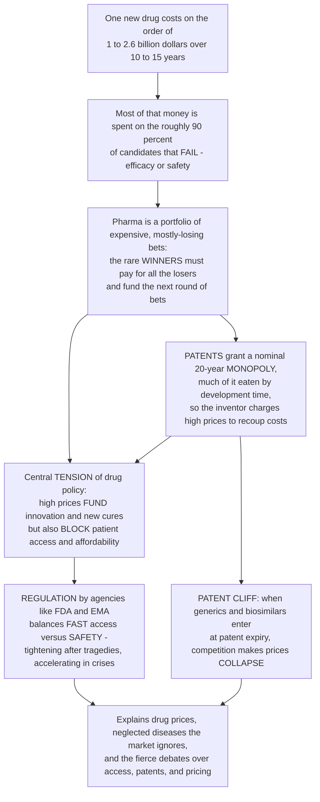

# 💊 Drug Development Economics and Regulation

> [!abstract] TL;DR
> Why do new medicines cost so much? Because bringing **one** drug to market is a **billion-dollar-plus, 10-to-15-year bet** — and most of that money is spent on the roughly **90% of candidates that FAIL** along the way. A pharma company is really running a **portfolio of expensive, mostly-losing bets**, so the rare winners must pay for all the losers *and* fund the next round of gambles. To protect that investment, drugs get **patents** — a temporary monopoly (nominally ~20 years, but much of it eaten by development time) during which only the inventor can sell the drug, charging high prices to recoup costs before **generics** are allowed in and prices collapse (the "patent cliff"). This creates the central, unresolved **tension** of pharmaceutical policy: high prices *fund the innovation that produces new cures*, but high prices also *put drugs out of reach for patients who need them*. Layered on top is **regulation** — agencies like the **FDA** and **EMA** that must balance getting effective drugs to patients *fast* against ensuring they are *safe*, a balance that tightens after tragedies and loosens during crises. Understanding the money and the rules behind medicines explains why drugs are priced as they are, why some diseases get ignored, and the fierce debates over access, patents, and pricing. *Educational science content, not individual medical or dosing advice.*

---

## Intuition

**Analogy FIRST — a venture capitalist funding a graveyard.** Imagine a venture fund where **9 out of every 10 startups you back go bankrupt**, each failure costs tens or hundreds of millions, and even the *winners* take **10 to 15 years** to pay off. To survive, the fund must charge the rare survivors enough to cover the entire graveyard of failures *plus* a decade of tied-up capital *plus* seed money for the next batch of gambles. That is exactly the pharmaceutical business. The "startups" are drug candidates; the "bankruptcies" are the molecules that turn out not to work or not to be safe; and the rare "unicorn" is the approved medicine that must, single-handedly, pay for everything that died trying.

Now add two more twists that a normal venture fund does not face. **First, a temporary monopoly.** Because anyone could otherwise copy the winning molecule for pennies, society grants the inventor a **patent** — a roughly 20-year exclusive right to sell it. But the patent clock starts ticking *during development*, so by the time the drug actually launches, often only **8-ish years of effective exclusivity** remain. During that window the company charges high prices to recoup its billion-dollar bet; the moment the patent expires, **generic** copies flood in and the price falls off a cliff, sometimes by 80-90%. **Second, a referee.** Because a bad drug can kill people, a government regulator — the **FDA** in the US, the **EMA** in Europe — stands between the company and the market, weighing *benefit against risk* and deciding whether the drug may be sold at all.

Out of this collision of brutal economics and necessary regulation falls the central **dilemma of modern medicine**: the very high prices that reward and finance innovation are the same high prices that lock patients out of the cures that innovation produces — a genuine ethical and economic problem with no clean answer. It is why life-saving drugs can cost more than a house, why diseases of the poor get neglected by a market that cannot profit from them, and why the balance between *fast access* and *proven safety* is fought over every time a tragedy tightens the rules or a pandemic speeds them up.

---

## How It Works

### Core Mechanics

1. **The cost and time.** Estimates vary, but the most-cited figure (DiMasi, Grabowski & Hansen, 2016) puts the **capitalized cost per approved drug at ~$2.6 billion**, of which roughly **$1.4 billion is out-of-pocket** and the rest is the **time cost of capital** over a **10-to-15-year** horizon. Other analyses (e.g. Wouters et al., 2020) find a wide range ($0.3-$4.5 billion) that varies enormously by therapeutic area — but all agree the number is *very large*.

2. **Attrition is the real cost driver.** Because about **90% of drugs entering human trials fail** (see *The Drug Discovery Pipeline* and *Clinical Trials and Drug Approval*), most money is spent on **candidates that never earn a cent**. The winner does not just pay for itself; it pays for the whole graveyard. Failures cluster at **Phase 2** (efficacy) and **Phase 3** (large, expensive, confirmatory trials) — the worst place to fail because it is the most costly.

3. **Pharma as a portfolio of bets.** No single drug is a sure thing, so companies run a **portfolio**: many shots, most of which lose, a few **blockbusters** that earn billions a year and carry everything else. This is why the industry is dominated by risk management and why a single late-stage failure can wipe out a company's valuation.

4. **Eroom's law — it is getting *harder*.** "Eroom" is "Moore" spelled backwards: whereas computing gets cheaper, drug R&D productivity has *fallen*, with the inflation-adjusted cost per new drug roughly **doubling every ~9 years** for decades (Scannell et al., 2012). Proposed causes include the **"better than the Beatles" problem** (each new drug must beat an ever-improving back-catalogue of cheap generics), the **cautious regulator**, and diminishing low-hanging fruit.

5. **Patents — the incentive.** A **patent** grants a ~20-year **monopoly** on the molecule, letting the inventor charge prices far above manufacturing cost to recoup R&D. But because the clock starts at *filing* (early in development), the **effective market exclusivity** after launch is typically only **~8-12 years**. **Data exclusivity** and patent-term extensions partly compensate. This is textbook *[[Monopoly]]* economics applied to medicine.

6. **The patent cliff — the collapse.** When exclusivity expires, **generics** (for small molecules) and **biosimilars** (for biologics) enter via **abbreviated approval pathways** — a generic need only prove **bioequivalence**, not repeat full efficacy trials. Competition drops the price by **80-90%** within a year or two; the originator's revenue falls off a **cliff**.

7. **The innovation-access tension.** High monopoly prices are simultaneously the **reward that finances the next cure** and the **barrier that denies today's cure to patients who cannot pay**. Tools that try to manage this tension include **value-based pricing**, **price negotiation and controls** (aggressive in most of Europe, historically limited in the US), **pharmacoeconomics** (cost-effectiveness measured in **QALYs** and **ICERs**, as bodies like the UK's **NICE** do), and **insurance/reimbursement** rules. None dissolves the dilemma; they only reposition it.

8. **Regulation — speed versus safety.** Agencies (**FDA**, **EMA**, PMDA, etc.) must balance **fast access** (getting effective drugs to suffering patients) against **safety** (protecting them from harm). The balance **tightens after disasters** (the **thalidomide** tragedy birthed modern efficacy-and-safety regulation via the 1962 Kefauver-Harris Amendment) and **loosens/accelerates in crises** (HIV/AIDS activism forced faster review in the late 1980s; **COVID-19 Emergency Use Authorizations** compressed timelines). Expedited routes — **breakthrough**, **fast-track**, **accelerated approval**, **priority review** — trade speed for heavier post-market obligations, backed by ongoing **pharmacovigilance** (see *Drug Safety, Pharmacovigilance and Adverse Effects*).

9. **Neglected diseases and market failure.** The market underserves diseases of the poor (malaria, tuberculosis, neglected tropical diseases) and **rare/orphan** conditions where too few patients exist to recoup costs — a classic *[[Public_Goods]]*-style **market failure**. Policy responds with **orphan-drug acts**, priority-review vouchers, prizes, and public-private partnerships. Global access adds **TRIPS**, **compulsory licensing**, and tiered pricing across countries (a form of *[[Price_Discrimination]]*).

### Flow / Architecture



---

## Key Concepts

### Secondary Level

- **New drugs are hugely expensive bets.** Making one medicine costs on the order of **a billion dollars or more** and takes **10-15 years**. About **9 out of 10** drugs that reach human testing *fail* — and the one that succeeds has to pay for all the failures. That is the biggest reason medicines cost so much.
- **Patents = a temporary monopoly.** When a company invents a drug, it gets a **patent**: for about 20 years, only *it* can sell that drug. That lets it charge high prices to get its money back before others are allowed to copy it.
- **Generics crash the price.** When the patent runs out, other companies make cheap copies called **generics**. Prices then fall dramatically — often by 80-90%. The sudden drop in the original maker's sales is called the **patent cliff**.
- **The big dilemma.** High prices *pay for* inventing new cures — but high prices also *keep those cures away* from patients who cannot afford them. There is no easy answer; it is a real trade-off between rewarding innovation and giving people access.
- **Regulators are the referees.** Government agencies like the **FDA** (US) and **EMA** (Europe) decide whether a drug is safe and effective enough to be sold. They try to get good drugs out **fast** while keeping people **safe** — and they make the rules stricter after a disaster and faster during an emergency like a pandemic.
- **Some diseases get ignored.** If a disease mostly affects poor people, or is very rare, companies can't make money on it, so they often don't develop drugs for it — which is why governments create special incentives.

### Undergraduate Level

- **The cost-of-failure structure.** The ~$2.6 billion *capitalized* cost per approved drug (DiMasi 2016) breaks into ~**$1.4 billion out-of-pocket** plus the **time cost of capital** over the long timeline. The out-of-pocket portion is itself dominated by the **cost of failed candidates** — most spending buys drugs that never launch.
- **Where attrition bites.** Success probabilities **multiply** across phases, so overall Phase-1-to-approval success is only **~10%**. The **Phase 2** efficacy gate is the great killer; **Phase 3** is the great expense. Failing late is catastrophic — you have spent nearly everything before learning the drug does not work.
- **Effective exclusivity vs patent term.** A patent's ~20-year term is measured from **filing**, early in R&D. After a 10-15 year development, only **~8-12 years** of *effective market exclusivity* remain to recoup costs — which is why companies price aggressively during the window.
- **Data exclusivity vs patents.** Distinct from patents, **regulatory data exclusivity** (e.g. 5 years for small molecules, 12 for US biologics) blocks generic reliance on the originator's trial data even if patents are weak — a second layer of protection.
- **The abbreviated pathways.** A **generic** proves **bioequivalence** (same active ingredient, same exposure) and skips repeating efficacy trials — the reason generics are cheap. A **biosimilar** (a copy of a large, complex biologic) needs a tailored **comparability** program because biologics cannot be copied exactly.
- **Pharmacoeconomics.** **Cost-effectiveness analysis** compares the added cost of a drug to the added health it buys, measured in **QALYs** (quality-adjusted life-years). The **ICER** (incremental cost-effectiveness ratio, cost per QALY gained) is compared to a willingness-to-pay threshold — the machinery bodies like the UK's **NICE** use to decide reimbursement.
- **Regulation tightens and loosens.** **Thalidomide** (late 1950s-early 1960s) caused birth defects and triggered the **1962 Kefauver-Harris Amendment**, which for the first time required proof of *efficacy*, not just safety. Conversely, **HIV/AIDS activism** and **COVID-19** pushed regulators toward faster, **accelerated** and **emergency-use** pathways.
- **Market failure for neglected disease.** Where patients are poor or few, expected revenue cannot cover R&D, so private R&D under-invests — a genuine **market failure** addressed by **orphan-drug acts**, priority-review vouchers, prizes, advance market commitments, and product-development partnerships.

### Graduate Level

- **The capitalized-cost model.** DiMasi's headline number is an **expected cost per approved drug**: sum over pipeline stages of (expected candidates entering a stage) x (per-candidate cost), then **capitalized** forward at a real cost of capital (~10.5%) to the launch date. Two multipliers inflate the naive "single clean run" cost: the **attrition multiplier** (you fund ~1/0.1 = 10 Phase-1 entrants per approval) and the **capitalization multiplier** (~1.8x for money tied up a decade). Critics (Prasad & Mailankody; Wouters et al.) note the estimate is sensitive to the discount rate, the assumed failure rate, whether public/tax-subsidised research is counted, and huge cross-therapeutic variance.
- **Eroom's law and its drivers.** Scannell et al. (2012) documented an ~9-year halving of new drugs per inflation-adjusted R&D dollar. Candidate causes: the **"better than the Beatles" problem** (a growing back-catalogue of cheap, effective generics raises the efficacy bar for every new entrant), the **"cautious regulator"** (rising evidentiary demands), the **"throw money at it" tendency**, and the **"basic research/brute force" bias**. Whether genomics-guided target validation and AI-driven discovery finally bend the curve is an open, actively debated question.
- **Optimal exclusivity as a policy dial.** Patent length is a **social trade-off**: longer exclusivity raises the *ex ante* incentive to innovate but prolongs *ex post* deadweight loss from monopoly pricing (lost consumer surplus, unmet demand). The socially optimal term balances dynamic efficiency (more future drugs) against static efficiency (more access to existing drugs) — the core tension of intellectual-property economics.
- **Monopoly pricing and welfare.** Under patent, the firm prices where marginal revenue equals marginal cost, well above the near-zero marginal cost of manufacturing, capturing producer surplus and creating **deadweight loss** — the patients who value the drug above cost but below price and go untreated. Generic entry restores competitive pricing and (mostly) eliminates the deadweight loss, transferring surplus back to patients — the welfare content of the "patent cliff."
- **Value-based and differential pricing.** In theory, **value-based pricing** sets price at the drug's incremental health value (its ICER at the threshold), aligning price with benefit. **International price discrimination** (tiered pricing, higher in rich markets) can, in principle, be *welfare-improving* — funding fixed R&D costs from those who can pay while widening access where they cannot — but is politically fraught and vulnerable to **parallel importation/arbitrage**.
- **Accelerated approval and the surrogate gamble.** Expedited pathways lower the evidentiary bar (often a **surrogate endpoint**) in exchange for speed and mandated confirmatory trials. This is a **regulatory option** with real cost: confirmatory trials sometimes fail (or are never completed), and a surrogate can move favourably while patients do worse — the reason accelerated approvals can be, and are, withdrawn.
- **Rare-harm detection and the regulatory lifecycle.** By the **rule of three**, a pre-approval trial of *n* patients cannot rule out harms rarer than ~3/n — so safety regulation is intrinsically a **post-market**, population-scale, **pharmacovigilance** problem. Approval is a **benefit-risk verdict on the evidence available**, not a proof of safety, which is why the regulatory relationship continues for the drug's whole market life.
- **Global access, TRIPS, and neglected disease.** The **WTO TRIPS** agreement globalised patent protection; the **Doha Declaration** preserved **compulsory licensing** for public-health emergencies (used for HIV antiretrovirals). For neglected tropical diseases the fundamental problem is that **private return is decoupled from social value**, requiring **push** (grants, tax credits) and **pull** (prizes, advance market commitments, priority-review vouchers) mechanisms to realign incentives.

---

## Python Demo

```python
# Drug Development Economics and Regulation -- four quantitative views:
#   (a) COST PER APPROVED DRUG: one clean run vs attrition-loaded out-of-pocket
#       vs fully capitalized -- illustrating the ~$1-2.6 billion figures.
#   (b) COST OF FAILURE: at each stage, spend on the eventual WINNER vs spend
#       burned on FAILURES (most money buys drugs that never launch).
#   (c) THE PATENT CLIFF: revenue over time -- flat during development, high under
#       patent exclusivity, then collapsing when generics enter at expiry.
#   (d) INNOVATION vs ACCESS: as price rises, patients able to afford (access)
#       FALLS while revenue funding R&D (innovation) peaks -- the central tension.
# Illustrative teaching values consistent with the literature (DiMasi 2016),
# NOT exact figures for any one drug. Educational content, not medical advice.
import numpy as np
import matplotlib.pyplot as plt

# ---------------------------------------------------------------------------
# Shared pipeline model: per-candidate out-of-pocket cost ($M) and success prob
stages   = ["Discovery+\nPreclinical", "Phase 1", "Phase 2", "Phase 3", "Regulatory\nreview"]
cost_c   = np.array([5.0,   25.0,  60.0,  255.0, 40.0])   # $M per candidate at each stage
p_next   = np.array([0.40,  0.63,  0.31,  0.58,  0.85])   # success prob to next stage
t_mid    = np.array([2.0,   6.5,   8.5,   11.0,  12.5])   # yr when spend occurs
r, T     = 0.11, 14.0                                     # cost of capital; launch year

# candidates entering each stage to yield exactly ONE approval
cum_fwd  = np.cumprod(p_next[::-1])[::-1]      # success from stage i to the end
entering = 1.0 / cum_fwd                        # expected entrants per approval
overall  = np.prod(p_next)

single_run   = cost_c.sum()                                    # one clean pass
oop_attrit   = (entering * cost_c).sum()                       # attrition-loaded
capitalized  = (entering * cost_c * (1 + r) ** (T - t_mid)).sum()  # + cost of capital

fig, ax = plt.subplots(2, 2, figsize=(15, 11))

# --- (a) cost per approved drug: three escalating bars ---------------------
labels_a = ["One clean run\n(single success)", "Attrition-loaded\nout-of-pocket",
            "Fully capitalized\n(+ cost of capital)"]
vals_a   = [single_run, oop_attrit, capitalized]
bars = ax[0, 0].bar(labels_a, vals_a, color=["#94a3b8", "#2563eb", "#7c3aed"],
                    edgecolor="black", linewidth=0.6)
for b, v in zip(bars, vals_a):
    ax[0, 0].text(b.get_x() + b.get_width()/2, v + 40, f"${v/1000:.2f}B",
                  ha="center", fontsize=11, fontweight="bold")
ax[0, 0].set_ylabel("Cost per approved drug ($M)")
ax[0, 0].set_title("(a) Why a drug costs ~$1-2.6B:\nfailures and cost-of-capital dominate")
ax[0, 0].set_ylim(0, capitalized * 1.25)

# --- (b) cost of failure, stage by stage ----------------------------------
winner_cost  = cost_c.copy()                       # the winner passes once per stage
failure_cost = (entering - 1.0) * cost_c           # everyone else = pure failure spend
x = np.arange(len(stages))
ax[0, 1].bar(x, winner_cost,  color="#059669", label="Spent on the eventual winner")
ax[0, 1].bar(x, failure_cost, bottom=winner_cost, color="#dc2626",
             label="Burned on candidates that FAIL")
ax[0, 1].set_xticks(x); ax[0, 1].set_xticklabels(stages, fontsize=8)
ax[0, 1].set_ylabel("Expected spend per approved drug ($M)")
fail_share = failure_cost.sum() / oop_attrit
ax[0, 1].set_title(f"(b) Cost of failure: ~{fail_share:.0%} of out-of-pocket\n"
                   "spend buys drugs that never launch")
ax[0, 1].legend(fontsize=9)

# --- (c) the patent cliff --------------------------------------------------
t = np.linspace(0, 26, 1301)
peak = 5.0                                   # peak annual revenue ($B/yr)
launch, expiry = 12.0, 20.0                  # patent filed at t=0, 20-yr term
rev = np.zeros_like(t)
ramp = (t >= launch) & (t < expiry)
rev[ramp] = peak * (1 - np.exp(-(t[ramp] - launch) / 1.5))
gen = t >= expiry
rev[gen] = peak * (0.15 + 0.85 * np.exp(-(t[gen] - expiry) / 0.8))  # generic collapse
ax[1, 0].plot(t, rev, color="#0f766e", lw=2.5)
ax[1, 0].axvspan(0, launch,       color="#94a3b8", alpha=0.18, label="Development (no revenue)")
ax[1, 0].axvspan(launch, expiry,  color="#22c55e", alpha=0.15, label="Patent exclusivity")
ax[1, 0].axvspan(expiry, 26,      color="#f87171", alpha=0.15, label="Generic era")
ax[1, 0].axvline(expiry, color="#b91c1c", ls="--", lw=1.5)
ax[1, 0].annotate("PATENT CLIFF\ngenerics enter,\nprice collapses",
                  xy=(expiry, peak*0.9), xytext=(expiry - 7.5, peak*0.55),
                  arrowprops=dict(arrowstyle="->", color="#b91c1c"), fontsize=9,
                  color="#b91c1c", fontweight="bold")
ax[1, 0].annotate(f"effective exclusivity\n~{expiry-launch:.0f} yrs of 20-yr term",
                  xy=(16, peak*1.0), xytext=(13.2, peak*1.12), fontsize=8)
ax[1, 0].set_xlabel("Years since patent filing")
ax[1, 0].set_ylabel("Annual revenue ($B/yr)")
ax[1, 0].set_title("(c) The patent cliff:\ndevelopment eats the clock, generics end the party")
ax[1, 0].legend(fontsize=8, loc="upper right"); ax[1, 0].set_ylim(0, peak*1.25)

# --- (d) innovation vs access trade-off -----------------------------------
Q0, pmax = 100.0, 10.0                        # market size; choke price ($k/patient)
price = np.linspace(0, pmax, 400)
access  = Q0 * np.clip(1 - price / pmax, 0, 1)   # patients able to afford (demand)
revenue = price * access                          # dollars available to fund R&D
p_star  = price[np.argmax(revenue)]               # revenue-maximizing price
axd = ax[1, 1]
l1, = axd.plot(price, access, color="#2563eb", lw=2.5, label="Patients able to afford (ACCESS)")
axd.set_xlabel("Price per patient ($k)")
axd.set_ylabel("Patients able to afford", color="#2563eb")
axd.tick_params(axis="y", labelcolor="#2563eb")
axr = axd.twinx()
l2, = axr.plot(price, revenue, color="#c026d3", lw=2.5, ls="--",
               label="Revenue to fund R&D (INNOVATION)")
axr.set_ylabel("Revenue funding innovation ($k)", color="#c026d3")
axr.tick_params(axis="y", labelcolor="#c026d3")
axr.axvline(p_star, color="#c026d3", ls=":", lw=1.5)
axr.annotate(f"revenue-max price\n${p_star:.1f}k", xy=(p_star, revenue.max()),
             xytext=(p_star + 0.6, revenue.max()*0.7),
             arrowprops=dict(arrowstyle="->", color="#c026d3"), fontsize=8)
axd.annotate("access-max\n(low price)", xy=(0.3, Q0*0.95), fontsize=8, color="#2563eb")
axd.set_title("(d) Innovation vs access tension:\nthe price that funds R&D is not the price that maximizes access")
axd.legend(handles=[l1, l2], loc="center right", fontsize=8)

plt.tight_layout()
plt.savefig("drug_development_economics_and_regulation.png", dpi=120)
plt.show()

# --- console summary ------------------------------------------------------
print(f"Overall Phase-1-to-approval success : {overall*100:.1f}%  (~1 in {1/overall:.0f})")
print(f"Candidates entering each stage      : {np.round(entering,1).tolist()}")
print(f"One clean run                       : ${single_run/1000:.2f}B")
print(f"Attrition-loaded out-of-pocket      : ${oop_attrit/1000:.2f}B")
print(f"Fully capitalized                   : ${capitalized/1000:.2f}B")
print(f"Share of out-of-pocket on failures  : {fail_share*100:.0f}%")
print(f"Effective exclusivity               : {expiry-launch:.0f} of 20 patent years")
print(f"Revenue-maximizing price            : ${p_star:.1f}k per patient")
```

**What it shows.** Panel **(a)** is the anatomy of the "$1-2.6 billion" headline: a single **clean run** through all stages costs only a few hundred million, but funding the **~10 candidates you must enter to get one approval** multiplies that to roughly **$1.4B out-of-pocket**, and **capitalizing** a decade of tied-up money at the cost of capital pushes it toward **~$2.5B** — most of the cost is *failure* and *time*, not the winning molecule. Panel **(b)** makes the cost-of-failure concrete: at every stage the red "burned on failures" block dwarfs the green "spent on the winner," and roughly **70% of all out-of-pocket spend** buys drugs that never launch. Panel **(c)** is the **patent cliff**: revenue is zero through the ~12-year development, ramps up during the shrunken window of patent exclusivity, then **collapses** when generics enter at expiry — visually explaining why companies price high while they can. Panel **(d)** is the **innovation-access dilemma** in one picture: the number of patients who can afford the drug (blue, *access*) falls as price rises, while the revenue that funds future R&D (magenta, *innovation*) peaks at an intermediate price — so the price society would choose for **access** and the price that maximizes **innovation funding** are simply not the same, which is the whole policy fight.

---

## Real-World Applications

> **Example — the Lipitor patent cliff.** Pfizer's atorvastatin (Lipitor) was the best-selling drug in history, earning well over **$10 billion a year** at its peak under patent. When its US patent expired in **2011**, generic atorvastatin entered and the price fell by roughly **80-90%** within a couple of years; Pfizer's Lipitor revenue collapsed almost overnight. It is the textbook illustration of the patent cliff and of *why* the exclusivity window drives pricing behaviour.

> **Example — Sovaldi and the innovation-access dilemma.** Gilead's sofosbuvir (Sovaldi), a genuine **cure** for hepatitis C, launched at **~$84,000 for a 12-week course** ($1,000/pill). It was highly *cost-effective* by QALY logic (curing a disease that otherwise causes liver failure and transplant) yet unaffordable at population scale — US Medicaid and prison systems rationed it. Sovaldi is the canonical case where a high price is simultaneously justified by value *and* a barrier to access — the tension made concrete.

> **Example — the thalidomide tragedy and modern regulation.** In the late 1950s, thalidomide (a sedative also used for morning sickness) caused thousands of severe birth defects worldwide. In the US, FDA reviewer **Frances Kelsey** famously withheld approval; the disaster still drove the **1962 Kefauver-Harris Amendment**, which for the first time required proof of **efficacy** and stricter safety testing. It is the archetype of regulation *tightening* after catastrophe.

> **Example — HIV/AIDS activism and accelerated approval.** In the late 1980s, ACT UP and other activists protested that FDA caution was letting patients die while effective drugs waited. The pressure produced faster review and the **accelerated-approval** pathway (1992), letting drugs reach dying patients on surrogate endpoints with confirmatory trials to follow — the archetype of regulation *loosening* under a crisis of unmet need. **COVID-19 Emergency Use Authorizations** repeated the pattern decades later.

> **Example — orphan drugs and neglected tropical disease.** The US **Orphan Drug Act (1983)** offered tax credits, fee waivers, and 7 years of exclusivity for rare-disease drugs — and dramatically increased their development, though it also enabled very high prices for tiny patient populations. At the other extreme, **malaria and tuberculosis** drugs are developed largely through **public-private partnerships** (e.g. the Medicines for Malaria Venture) precisely because the private market, seeing no profit, will not — the market failure the incentives exist to correct.

---

## Common Pitfalls

- **"The pill costs pennies, so the price is pure greed."** The marginal manufacturing cost is indeed tiny, but the price is trying to recoup the **~$1-2.6 billion sunk into R&D** — most of it spent on the **failures** that this one survivor must pay for. Judging price against manufacturing cost alone ignores the entire cost-of-failure structure of the industry.
- **Treating the ~$2.6B figure as settled fact.** It is a **capitalized, model-dependent estimate** highly sensitive to the assumed failure rate, discount rate, and whether tax-subsidised or publicly funded research is counted. Reputable analyses span from a few hundred million to several billion (Wouters 2020). Cite it as an *estimate with a wide range*, not a constant.
- **Confusing patent term with effective exclusivity.** A ~20-year patent is *not* 20 years of monopoly sales: the clock starts at filing, and development consumes most of it, leaving typically **~8-12 years** post-launch. Arguments about "shortening patents" must reckon with how little effective exclusivity already remains.
- **Assuming high prices always fund innovation.** Monopoly revenue *can* fund R&D, but it can also fund buybacks, marketing, or "evergreening" (minor tweaks to extend exclusivity without new benefit). High price is a *necessary-but-not-sufficient* and *imperfect* proxy for innovation investment; the link is real but leaky.
- **Believing approval means the drug is safe.** Approval is a **benefit-risk verdict on limited evidence**. Rare and long-latency harms (the **rule of three**: a trial of *n* cannot exclude harms rarer than ~3/n) surface only in **post-market pharmacovigilance** (see *Drug Safety, Pharmacovigilance and Adverse Effects*) — occasionally forcing withdrawals (Vioxx).
- **Faster is always better.** Accelerating approval saves lives when the drug works, but the **thalidomide** and surrogate-endpoint failures show the cost of moving too fast. Speed-versus-safety is a genuine trade-off with casualties on *both* sides; "just approve it faster" ignores the safety half.
- **Ignoring the neglected-disease market failure.** Assuming "the market will develop whatever is needed" is wrong where patients are poor or few — the private return is decoupled from social value, so drugs simply do not get made without deliberate **push/pull incentives**. This is a structural *market failure*, not a temporary gap.
- **Assuming price controls have no downside.** Aggressive price negotiation lowers cost and widens access *today*, but in principle can reduce the *future* pipeline by cutting expected returns. Whether real-world controls meaningfully dampen innovation is empirically contested — but pretending the trade-off does not exist is as naive as pretending prices are pure greed.

---

## Related Concepts

Within this **Safety, Personalization and Frontiers** section, this note supplies the *money-and-rules* frame that the neighbouring notes assume: **The Reach and Future of Pharmacology** looks ahead to where these economic and regulatory forces are driving the field (precision medicine, AI-designed drugs, new modalities), while **Drug Safety, Pharmacovigilance and Adverse Effects** is the post-market safety machinery that regulation mandates and that this note explains the *why* of. Upstream, **The Drug Discovery Pipeline** documents the brutal ~90% attrition that *is* the cost driver quantified here; **Clinical Trials and Drug Approval** details the expensive Phase 1-2-3 gauntlet and the FDA/EMA approval step whose economics and expedited pathways this note dissects; and **Pharmacology and Drug Discovery Overview** is the vault's master map into which this economics-and-policy note plugs. (These sibling notes are referenced in prose because they share this vault.)

Cross-vault anchors (Glob-verified):

- [[Monopoly]] — the market-structure model behind patents: a patent *is* a legally granted temporary monopoly, with the monopoly pricing and deadweight loss this note applies to medicines.
- [[Public_Goods]] — the market-failure logic explaining why the private market under-invests in vaccines and neglected-disease drugs, motivating orphan-drug acts and public-private partnerships.
- [[Price_Discrimination]] — the economics of tiered/differential drug pricing across countries and payers, a key (and contested) tool for balancing R&D recovery against global access.
- [[Evidence_Based_Medicine_and_Clinical_Trials]] — the clinical-trial evidence standard whose cost and rigor drive both the price tag and the regulator's benefit-risk verdict.
- [[Justice_in_Health_and_Resource_Allocation]] — the bioethics of who gets scarce, expensive treatment: the fairness dimension of the innovation-access tension and pharmacoeconomic rationing (QALYs, NICE).
- [[Global_Health_and_Health_Systems]] — the health-systems and global-access context (TRIPS, compulsory licensing, low-income-country access) in which drug pricing and regulation play out worldwide.

---

## Review Questions

1. **(Secondary)** Explain, in your own words, why a single new medicine can cost around a billion dollars to develop when the pill itself costs pennies to make. Use the idea that "the winner pays for the failures."
2. **(Secondary/Undergraduate)** What is a "patent cliff," and why does a drug's price often drop by 80-90% when its patent expires? Why does the company charge high prices *before* that happens?
3. **(Undergraduate)** A patent lasts ~20 years, yet companies complain they have far less time to recoup costs. Explain the difference between **patent term** and **effective market exclusivity**, and why development time is the reason.
4. **(Undergraduate)** Describe the innovation-access tension. Why can the same high price be defended as "funding future cures" *and* attacked as "denying patients access"? Use a real example (e.g. Sovaldi).
5. **(Graduate)** The DiMasi ~$2.6B figure combines an attrition multiplier and a capitalization multiplier. Explain what each represents, why the out-of-pocket figure is closer to ~$1.4B, and give two reasons critics argue the headline number is misleading.
6. **(Graduate)** Regulation "tightens after tragedies and loosens in crises." Contrast the thalidomide-driven 1962 reforms with HIV/AIDS-era accelerated approval, and explain the safety-versus-speed trade-off — including the specific risk that expedited, surrogate-endpoint approval introduces.

---

## Sources

- DiMasi JA, Grabowski HG, Hansen RW. "Innovation in the pharmaceutical industry: New estimates of R&D costs." *Journal of Health Economics* 2016;47:20-33 — the ~$2.6 billion capitalized-cost estimate and its attrition/capitalization structure.
- Scannell JW, Blanckley A, Boldon H, Warrington B. "Diagnosing the decline in pharmaceutical R&D efficiency." *Nature Reviews Drug Discovery* 2012;11:191-200 — Eroom's law and its proposed causes.
- Kesselheim AS, Avorn J, Sarpatwari A. "The high cost of prescription drugs in the United States: Origins and prospects for reform." *JAMA* 2016;316(8):858-871 — patents, exclusivity, generics, and the pricing/access debate.
- Wouters OJ, McKee M, Luyten J. "Estimated research and development investment needed to bring a new medicine to market, 2009-2018." *JAMA* 2020;323(9):844-853 — an independent, wide-range re-estimate and critique of R&D cost figures.
- Rang HP, Ritter JM, Flower RJ, Henderson G. *Rang & Dale's Pharmacology*, "Drug Discovery and Development" chapter, Elsevier — textbook overview of development economics, regulation, patents, and generics.

---

#pharmacology #drug-economics #FDA-regulation #patents #drug-pricing
