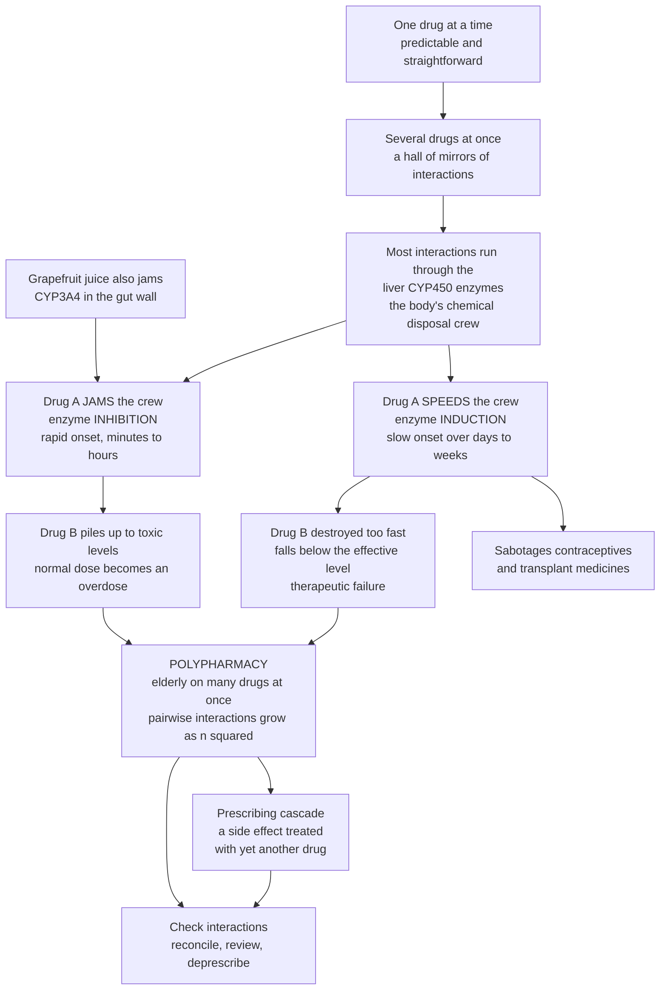

# 💊 Drug Metabolism, Interactions, and Polypharmacy

> [!abstract] TL;DR
> Taking **one** drug is straightforward; taking **several at once** opens a hall of mirrors where medicines interfere with each other — and the most common way they collide is through the **liver's drug-processing enzymes**, the **cytochrome P450 (CYP450)** family that chemically breaks drugs down. One drug can **jam** this disposal crew (**enzyme inhibition**), so a second drug it normally clears piles up to **toxic** levels — a normal dose becomes an overdose. The opposite is **enzyme induction**: one drug **speeds up** the crew, so a second drug is destroyed too fast and **stops working** (this is how rifampin or St John's Wort can sabotage contraceptives and transplant medicines). Even **grapefruit juice** jams these enzymes. The danger explodes under **polypharmacy** — many medicines at once, common in the elderly — because the number of possible **pairwise interactions grows combinatorially**, side effects stack up, and a **prescribing cascade** treats one drug's side effect with yet another drug. Understanding metabolism and the inhibition/induction mechanisms of interactions is one of the most practical, life-saving skills in all of medicine.
>
> *Educational science note — not individual medical or dosing advice.*

---

## Intuition

**Analogy — one traveller versus a crowded airport with one overworked security crew.** Sending a single traveller (one drug) through the airport called *your body* is predictable: they arrive, get processed, and leave on schedule. Send a **dozen travellers at once** and you enter a **hall of mirrors** — each one can trip up the others in ways nobody planned.

The critical bottleneck is the **liver's chemical disposal crew**: the **cytochrome P450 (CYP450)** enzymes whose job is to grab drugs, chemically dismantle them, and tag them for removal. Now picture the trap:

- **One drug JAMS the crew (inhibition).** Drug A gums up the enzymes. Drug B, which the crew normally clears steadily, now has nowhere to go — so it **backs up and piles higher and higher into the toxic range**. Nothing changed about Drug B's dose; the exit just closed. **Grapefruit juice** does exactly this — it famously jams the gut's CYP3A4 and lets certain drugs surge to dangerous levels.
- **One drug SPEEDS UP the crew (induction).** Drug A makes the liver build **extra** enzymes. Now the crew is so fast that Drug B is shredded before it can work — it **falls below the level that helps**. This is how some drugs quietly **sabotage the birth-control pill** or an **organ-transplant medicine**, causing an unplanned pregnancy or a rejected graft.

There is a second, non-metabolic way drugs collide — **pharmacodynamic** interactions, where two drugs push the *same* physiological button. Two sedatives together do not just add; they can **synergize** into dangerous over-sedation.

Now scale up. **Polypharmacy** — a patient, often elderly, on many medicines at once (sometimes a dozen or more) — is where this becomes an epidemic-level problem. Each new pill does not add risk *linearly*; the number of pairs that could clash grows **combinatorially**, side effects accumulate, and doctors sometimes prescribe a new drug to treat the *side effect* of an old one — a **prescribing cascade**. This is why pharmacists obsessively run **interaction checks**: most real-world drug disasters are not exotic — they are two ordinary drugs meeting at the liver's disposal crew.

---

## How It Works

### Core mechanics

1. **Metabolism sets the stage.** The liver biotransforms most drugs in two waves. **Phase I** reactions (oxidation, reduction, hydrolysis) are dominated by the **CYP superfamily** — especially **CYP3A4** (the workhorse handling roughly half of all drugs), **CYP2D6**, and **CYP2C9/2C19**. **Phase II** reactions **conjugate** the drug (glucuronidation, sulfation, acetylation) to a water-soluble handle for excretion. **First-pass metabolism** removes much of an oral dose before it reaches circulation; **prodrugs** are *activated* by metabolism; some metabolites are themselves **active or toxic**.
2. **Enzyme inhibition raises a partner drug's level.** If drug A blocks a CYP that clears drug B, B's clearance falls and its concentration climbs — **rapid onset** (minutes to hours, as soon as the inhibitor is present). If B has a narrow therapeutic window, this tips it into **toxicity**. Classic culprits: grapefruit juice, azole antifungals, macrolide antibiotics, ritonavir.
3. **Enzyme induction lowers a partner drug's level.** If drug A makes the liver synthesize *more* CYP enzyme, drug B is cleared faster and its level falls toward **therapeutic failure** — **slow onset** (days to weeks, because it takes time to build and later degrade the extra enzyme). Classic inducers: rifampin, carbamazepine, phenytoin, St John's Wort.
4. **Other pharmacokinetic collisions.** Interactions also occur in **absorption** (antacids binding a drug in the gut), **plasma-protein-binding displacement**, and **renal/transporter excretion** — notably the efflux pump **P-glycoprotein (P-gp)**.
5. **Pharmacodynamic interactions** act at the target or physiology, not the concentration: **additive/synergistic** (two sedatives; two QT-prolonging drugs raising arrhythmia risk) or **antagonistic** (one drug blunting another's effect).
6. **Polypharmacy multiplies the risk.** With *n* drugs, the number of possible **pairwise** interactions is *n choose 2* — it grows roughly as *n squared*. Add cumulative side-effect burden (e.g. **anticholinergic** load), the **prescribing cascade**, reduced adherence, and **inappropriate prescribing** (flagged by tools like the **Beers criteria**), and the elderly — with altered PK/PD and reduced physiological reserve — become especially vulnerable. The countermeasure is **medication reconciliation, review, and deprescribing**.

### From one drug to a hall of mirrors



---

## Key Concepts

### Secondary (foundations)
- **The liver is the disposal crew.** Its enzymes chemically break drugs down so the body can throw them out.
- **Interaction = drugs interfering with each other.** The most common route is through those liver enzymes.
- **Jam vs speed up.** A drug that *jams* the enzymes makes another drug **pile up** (danger of overdose); a drug that *speeds them up* makes another drug **vanish too fast** (it stops working).
- **Grapefruit really matters.** Grapefruit juice jams a key liver/gut enzyme and can push some drugs to dangerous levels.
- **Polypharmacy.** Taking **many** medicines at once — common in older adults — multiplies the chance that two of them clash.
- **Prescribing cascade.** Treating one drug's side effect with a *new* drug, instead of stopping the first.

### Undergraduate (mechanisms and parameters)
- **Phase I vs Phase II metabolism.** Phase I (CYP-mediated oxidation/reduction/hydrolysis) exposes a reactive group; Phase II conjugates the drug to a water-soluble handle for excretion.
- **The CYP450 stars.** **CYP3A4** (largest share of drug metabolism), **CYP2D6**, **CYP2C9/2C19** — the enzymes at the heart of most interactions.
- **Inhibition vs induction.** Inhibition: fast onset, *raises* co-substrate levels toward toxicity (grapefruit, ketoconazole, clarithromycin). Induction: slow onset, *lowers* co-substrate levels toward failure (rifampin, carbamazepine, St John's Wort).
- **Pharmacokinetic vs pharmacodynamic interactions.** PK interactions change a drug's **concentration**; PD interactions change its **effect** at the target (additive, synergistic, antagonistic).
- **The therapeutic window is the stakes.** Narrow-window drugs (warfarin, digoxin, lithium, immunosuppressants) are where interactions turn into harm.
- **Combinatorial risk.** Possible pairwise interactions among *n* drugs = *n choose 2*; risk of at least one interaction rises steeply with drug count.
- **Beers criteria / STOPP-START.** Explicit lists of potentially inappropriate medications, especially in older adults.

### Graduate (mechanistic and clinical nuance)
- **Mechanism-based (irreversible) inhibition** vs **reversible competitive inhibition** — irreversible ("suicide") inhibitors (e.g. certain macrolides) require enzyme resynthesis to recover, prolonging the interaction beyond the inhibitor's own half-life.
- **Induction machinery.** Nuclear receptors **PXR** and **CAR** (and **AhR**) sense inducers and upregulate CYP3A4, CYP2B6, and drug transporters — explaining the days-long lag for induction to build and wane.
- **Transporter-mediated interactions.** **P-glycoprotein (P-gp)**, OATPs, and OCTs govern absorption, distribution, and biliary/renal excretion; many "CYP3A4" interactions are really combined enzyme + transporter effects.
- **Inter-individual variability.** **Pharmacogenomic** CYP polymorphisms create poor/intermediate/extensive/ultra-rapid **metabolizer** phenotypes; a "weak" inhibitor may be clinically major in an intermediate metabolizer. Age, hepatic/renal disease, and diet further shift metabolism.
- **Anticholinergic and sedative burden.** Cumulative scores quantify additive PD toxicity across a polypharmacy regimen (falls, delirium, cognitive decline).
- **Deprescribing frameworks.** Structured withdrawal of low-benefit/high-risk drugs; requires understanding withdrawal effects and unmasking of previously suppressed conditions.

---

## Python Demo

```python
# Drug metabolism, interactions, and polypharmacy.
# (a) How a CYP450 INHIBITOR or INDUCER pushes a drug out of its therapeutic window.
# (b) Why polypharmacy is dangerous: pairwise interactions grow combinatorially (n choose 2).
# (c) Cumulative probability of at least one clinically significant interaction vs drug count.
# numpy + matplotlib only.
import numpy as np
import matplotlib.pyplot as plt
from math import comb

# ---------------------------------------------------------------
# (a) ENZYME INHIBITION / INDUCTION reshaping a drug's exposure
#     One-compartment oral model (Bateman function):
#     C(t) = F*D*ka / (Vd*(ka-ke)) * (exp(-ke*t) - exp(-ka*t))
#     Inhibition -> smaller ke (drug lingers, piles up).
#     Induction  -> larger  ke (drug cleared too fast).
# ---------------------------------------------------------------
F, D, Vd, ka = 0.8, 100.0, 35.0, 1.5      # bioavailability, dose(mg), Vd(L), absorption rate(1/h)
t = np.linspace(0, 24, 1000)

def bateman(ke):
    return (F * D * ka) / (Vd * (ka - ke)) * (np.exp(-ke * t) - np.exp(-ka * t))

ke_norm, ke_inhib, ke_induc = 0.15, 0.05, 0.45   # normal / inhibited / induced elimination
C_norm, C_inhib, C_induc = bateman(ke_norm), bateman(ke_inhib), bateman(ke_induc)

# Therapeutic window (illustrative plasma concentrations, mg/L)
min_effective, toxic_threshold = 1.0, 3.0

# ---------------------------------------------------------------
# (b) Combinatorial explosion of pairwise interactions: n choose 2
# ---------------------------------------------------------------
n_drugs = np.arange(1, 16)
pairs = np.array([comb(n, 2) for n in n_drugs])

# ---------------------------------------------------------------
# (c) Probability of >=1 clinically significant interaction.
#     Assume each drug PAIR independently has probability p of interacting:
#     P(>=1) = 1 - (1 - p)^(pairs)
# ---------------------------------------------------------------
p = 0.06
risk = 1 - (1 - p) ** pairs

# ------------------------------ Plot ------------------------------
fig, ax = plt.subplots(1, 3, figsize=(18, 5))

# (a) inhibitor / normal / inducer
ax[0].axhspan(min_effective, toxic_threshold, color="green", alpha=0.15, label="Therapeutic window")
ax[0].axhline(toxic_threshold, color="red", ls="--", lw=1)
ax[0].axhline(min_effective, color="orange", ls="--", lw=1)
ax[0].plot(t, C_inhib, color="crimson", lw=2.2, label="+ Inhibitor (jams crew -> toxic)")
ax[0].plot(t, C_norm,  color="black",   lw=2.2, label="Normal (in window)")
ax[0].plot(t, C_induc, color="teal",    lw=2.2, label="+ Inducer (speeds crew -> fails)")
ax[0].fill_between(t, toxic_threshold, C_inhib, where=(C_inhib > toxic_threshold),
                   color="crimson", alpha=0.20)
ax[0].set_title("(a) Interaction pushes a drug out of its window")
ax[0].set_xlabel("Time (h)"); ax[0].set_ylabel("Plasma conc. (mg/L)")
ax[0].legend(fontsize=8); ax[0].grid(alpha=0.3)

# (b) pairwise interactions grow as n choose 2
ax[1].bar(n_drugs, pairs, color="steelblue")
ax[1].plot(n_drugs, pairs, color="darkred", lw=1.5, marker="o", ms=3)
for n in (5, 10, 15):
    ax[1].annotate(f"{comb(n,2)} pairs", (n, comb(n, 2)),
                   textcoords="offset points", xytext=(-8, 8), fontsize=8, color="darkred")
ax[1].set_title("(b) Possible pairwise interactions = n choose 2")
ax[1].set_xlabel("Number of drugs taken"); ax[1].set_ylabel("Possible interacting pairs")
ax[1].grid(alpha=0.3, axis="y")

# (c) cumulative interaction probability
ax[2].plot(n_drugs, 100 * risk, color="purple", lw=2.2, marker="s", ms=4)
ax[2].axhline(50, color="gray", ls=":", lw=1)
ax[2].fill_between(n_drugs, 0, 100 * risk, color="purple", alpha=0.12)
ax[2].set_title("(c) Risk of >=1 significant interaction")
ax[2].set_xlabel("Number of drugs taken")
ax[2].set_ylabel("Probability of an interaction (%)")
ax[2].set_ylim(0, 100); ax[2].grid(alpha=0.3)

plt.tight_layout()
plt.show()

# ---- Console summary ----
print(f"Peak conc  normal    : {C_norm.max():.2f} mg/L  (window {min_effective}-{toxic_threshold})")
print(f"Peak conc  +inhibitor: {C_inhib.max():.2f} mg/L  -> {'TOXIC' if C_inhib.max() > toxic_threshold else 'ok'}")
print(f"Peak conc  +inducer  : {C_induc.max():.2f} mg/L  -> {'SUBTHERAPEUTIC' if C_induc.max() < min_effective else 'ok'}")
for n in (2, 5, 10, 15):
    print(f"{n:2d} drugs -> {comb(n,2):3d} possible pairs, P(>=1 interaction) = {100*(1-(1-p)**comb(n,2)):.0f}%")
```

**What the plots show.** Panel **(a)** is the whole interaction story in one picture: the black **normal** curve sits inside the green **therapeutic window**, but adding an **inhibitor** (crimson) slows clearance so the drug **climbs into the toxic zone**, while adding an **inducer** (teal) clears it so fast it **sinks below the minimum effective level** and stops working. Panel **(b)** shows why polypharmacy is combinatorially dangerous — going from 5 to 15 drugs takes the number of possible interacting pairs from 10 to **105** (an *n²*-style explosion, not a gentle line). Panel **(c)** converts that into cumulative **probability of at least one** clinically significant interaction, which rockets past 50% well before a patient's medication list looks unusual for an older adult.

---

## Real-World Applications

- **Grapefruit juice and statins/calcium-channel blockers.** Grapefruit irreversibly inhibits intestinal **CYP3A4**, raising the bioavailability of simvastatin, some dihydropyridines, and immunosuppressants — the textbook diet-driven interaction printed on drug labels.
- **Rifampin or St John's Wort sabotaging the pill and transplant drugs.** Both are potent **CYP3A4 inducers**; they lower plasma levels of **oral contraceptives** (risking unintended pregnancy) and **ciclosporin/tacrolimus** (risking transplant rejection) — a slow-onset, easily missed failure.
- **Warfarin — the interaction magnet.** With a narrow window and CYP2C9 metabolism, warfarin's effect swings with dozens of co-drugs and foods; small metabolic shifts translate directly into bleeding or clotting, which is why it is monitored by INR.
- **QT-prolongation stacking (pharmacodynamic).** Combining two QT-prolonging drugs (certain antiarrhythmics, antipsychotics, macrolides, some antiemetics) additively raises the risk of the arrhythmia torsades de pointes — no metabolism needed, just shared physiology.
- **Geriatric polypharmacy and the prescribing cascade.** An older adult on a calcium-channel blocker develops ankle edema, is prescribed a diuretic for it, which causes gout, treated with another drug — a cascade that **medication review and deprescribing** (guided by Beers/STOPP criteria) is designed to unwind.
- **Clinical decision support.** EHR **interaction checkers** and **medication reconciliation** at every care transition are the frontline defense; pharmacogenomic panels increasingly flag CYP2D6/2C19 metabolizer status to predict who is most vulnerable.

---

## Common Pitfalls

- **Assuming "natural" means safe.** **St John's Wort** and other herbal/supplement products are among the most potent enzyme inducers; patients rarely report them, and clinicians rarely ask — a classic hidden cause of contraceptive or transplant-drug failure.
- **Forgetting the induction time lag.** Because induction requires **new enzyme synthesis**, a co-drug's levels drift down over **days to weeks** after an inducer starts — and drift *up* again for weeks after it stops. Checking a level too early misses it.
- **Watching only the drugs, not the food.** Grapefruit, cruciferous vegetables, tyramine-rich foods (with MAO inhibitors), and even the *timing* of meals can be full-blown interactions.
- **Treating polypharmacy risk as linear.** Each added drug does not add one unit of risk; the pairwise-interaction count grows like *n²*, so "just one more pill" is deceptively costly on a long list.
- **The prescribing cascade blind spot.** New symptoms are reflexively treated as new diseases rather than as **adverse effects** of existing drugs — always ask "could a current medication cause this?" before adding another.
- **Ignoring the metabolizer phenotype.** A "minor" inhibitor can be clinically major in a **poor or intermediate metabolizer**; population-average interaction ratings do not fit every individual.
- **Total vs free concentration confusion.** Protein-binding-displacement interactions transiently raise *free* drug even when *total* measured concentration looks unchanged — misleading for narrow-window drugs.

---

## Related Concepts

This note sits in the **Safety, Personalization, and Frontiers** section and is the clinical payoff of the vault's pharmacokinetics thread. It deepens **Pharmacokinetics (ADME)** — where metabolism (the M) and enzyme induction/inhibition are first introduced — by turning that single-drug biotransformation story into the multi-drug problem of collisions; the CYP enzymes here are the same catalysts framed in **Enzymes as Drug Targets** (an enzyme can be both a target *and* the disposal machinery). Its siblings in this section complete the safety picture: **Drug Safety, Pharmacovigilance, and Adverse Effects** covers how interaction harms are detected and reported; **Pharmacogenomics and Personalized Dosing** explains the genetic CYP variability that makes one person's minor interaction another's overdose; and **Toxicology and Poisoning** picks up where an interaction ends — when a drug piles up past the toxic threshold.

Verified cross-vault links:

- [[Pharmacology/01_Principles_of_Pharmacology/Pharmacokinetics_ADME|Pharmacokinetics (ADME)]] — the quantitative backbone; metabolism and clearance are the parameters interactions perturb.
- [[Pharmacology/02_Molecular_Targets_and_Mechanisms/Enzymes_as_Drug_Targets|Enzymes as Drug Targets]] — CYP enzymes as catalysts; the same inhibition mechanisms used therapeutically also cause interactions.
- [[Clinical_Medicine/03_Metabolic_Endocrine_and_Renal/Liver_and_Gastrointestinal_Disease|Liver and Gastrointestinal Disease]] — the liver is the principal site of biotransformation; hepatic impairment slows metabolism and amplifies interactions.
- [[Clinical_Medicine/03_Metabolic_Endocrine_and_Renal/Renal_Pathophysiology_and_Kidney_Disease|Renal Pathophysiology and Kidney Disease]] — the kidneys and transporters (P-gp) govern excretion; reduced clearance is another route to drug accumulation.
- [[Clinical_Medicine/06_Clinical_Reasoning_and_Modern_Medicine/Precision_Medicine_and_Genomics_in_the_Clinic|Precision Medicine and Genomics in the Clinic]] — pharmacogenomic CYP metabolizer status predicts who is most vulnerable to a given interaction.
- [[Clinical_Medicine/06_Clinical_Reasoning_and_Modern_Medicine/Diagnostic_Reasoning_and_Clinical_Decision_Making|Diagnostic Reasoning and Clinical Decision Making]] — interaction checkers and medication reconciliation are clinical-decision-support tools for managing these risks.
- [[Chemistry/06_Biochemistry/Enzyme_Kinetics_and_Catalysis|Enzyme Kinetics and Catalysis]] — competitive vs irreversible inhibition and Michaelis-Menten saturation explain interaction magnitude and duration.
- [[Biology/01_Chemistry_of_Life/Enzymes_and_Catalysis|Enzymes and Catalysis]] — the fundamental biology of enzyme activity, induction, and inhibition underlying CYP behavior.
- [[Biology/09_Human_Physiology_and_Anatomy/The_Digestive_and_Excretory_Systems|The Digestive and Excretory Systems]] — the liver (metabolism) and kidney (excretion) physiology that interactions exploit.
- [[Health_Nutrition_and_Longevity/05_Aging_and_Longevity/Hallmarks_of_Aging|Hallmarks of Aging]] — declining organ reserve and altered PK/PD explain why older adults are the population most harmed by polypharmacy.

---

## Review Questions

**Secondary**
1. In plain terms, what does the liver's "disposal crew" of enzymes do to a drug, and why does it matter if a second drug **jams** that crew?
2. Explain the difference between a drug that makes another drug **pile up to dangerous levels** and one that makes another drug **stop working**.
3. What is **polypharmacy**, and give one reason why taking many medicines at once is riskier than taking a few.

**Undergraduate**
4. Contrast **enzyme inhibition** and **enzyme induction** in terms of *direction* of effect on a co-substrate's blood level, *speed of onset*, and give one real drug/food example of each.
5. A patient on a stable warfarin dose starts an antibiotic that inhibits CYP2C9. Predict what happens to the warfarin concentration-time curve and the clinical consequence.
6. Distinguish a **pharmacokinetic** from a **pharmacodynamic** interaction, and explain why two QT-prolonging drugs are dangerous together even though neither changes the other's concentration.

**Graduate**
7. For *n* drugs, the number of possible pairwise interactions is *n choose 2*. Explain why this makes polypharmacy risk grow roughly as *n²*, and how a **prescribing cascade** compounds the problem beyond raw combinatorics.
8. Why does an **irreversible (mechanism-based)** CYP inhibitor produce an interaction that outlasts the inhibitor's own plasma half-life, whereas a **reversible competitive** inhibitor's effect tracks its concentration? Reference enzyme resynthesis.
9. A "weak" CYP2D6 inhibitor causes a major interaction in one patient but a negligible one in another on the same drugs. Using **pharmacogenomic metabolizer phenotypes**, explain the discrepancy and how you would personalize the plan.

---

## Sources

- Ritter, J. M. et al. *Rang & Dale's Pharmacology* — chapters on **Drug Metabolism** and **Drug Interactions**. Elsevier.
- Katzung, B. G. *Basic and Clinical Pharmacology* — chapter on **Drug Biotransformation**. McGraw-Hill.
- Brunton, L. L. et al. *Goodman & Gilman's The Pharmacological Basis of Therapeutics* — sections on drug metabolism and drug interactions. McGraw-Hill.
- Masnoon, N. et al. (2017). *What is polypharmacy? A systematic review of definitions.* **BMC Geriatrics** 17:230.
- U.S. FDA. *Drug Development and Drug Interactions: Table of Substrates, Inhibitors and Inducers* (CYP-based interaction classification).

---

#pharmacology #drug-interactions #CYP450 #polypharmacy #drug-metabolism
