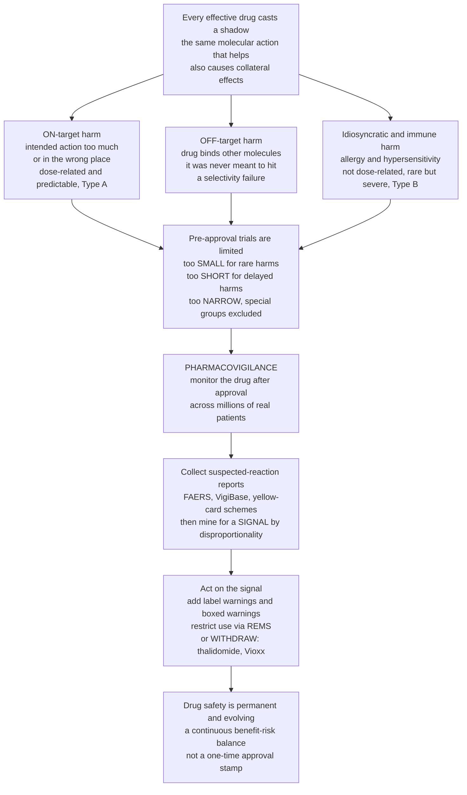

# 🛡️ Drug Safety, Pharmacovigilance and Adverse Effects

> [!abstract] TL;DR
> No drug is purely a cure — **every effective drug casts a shadow of unwanted effects**, because the same molecular meddling that heals also causes collateral damage elsewhere. Those **adverse drug reactions (ADRs)** come from two sources: hitting the intended target *too much* or in the *wrong place* (**on-target**, dose-related, predictable — **Type A**), or accidentally binding *other* molecules the drug was never meant to touch (**off-target**), plus unpredictable immune and **idiosyncratic** reactions (**Type B**). The crucial reality is that clinical trials, however rigorous, are **too small, too short, and too narrow** to catch everything: a few-thousand-patient trial simply cannot detect a harm that strikes 1 in 50,000, or one that appears only after years, or one that hits the elderly and pregnant patients the trial excluded. So the safety story does not end at approval — it is just beginning. **Pharmacovigilance** is the worldwide detective work of monitoring drugs *after* they reach millions of real patients: collecting suspected-reaction reports, mining databases for a hidden pattern (a **signal**), and acting when a drug proves more dangerous than the trials revealed — adding warnings, restricting use, or withdrawing it entirely, as happened with **thalidomide** and **Vioxx**. Drug safety is a permanent, evolving responsibility, not a one-time approval stamp. *Educational science content, not individual medical or dosing advice.*

---

## Intuition

**Analogy — every medicine casts a shadow.** Imagine a locksmith's master key cut to open one specific lock in a building. Even a perfectly cut key does two unwanted things. First, if you turn it too hard or leave it in too long, it can jam or break the very lock it was meant to open — that is the *on-target* harm: the right action taken to excess or in the wrong place. Second, because real buildings have thousands of locks with similar mechanisms, your key will inevitably rattle open a few doors you never intended to touch — that is the *off-target* harm: the key fitting locks it was never designed for. There is no such thing as a key that opens *only* its lock and interacts with *nothing* else. A drug is exactly this master key loose inside the body's millions of molecular locks: the more doors it can open, the more unintended ones it will.

Now the second half of the analogy. Before that key ships, the manufacturer tests it on a few hundred sample locks — but the building has *fifty thousand* locks, and some faults only show up on the rare unusual lock, or only after years of daily turning. A test on a few hundred locks *cannot* find a fault that appears in 1 lock out of 50,000. So the responsible locksmith does not stop watching once the key ships. They run a **hotline**: every locksmith in the world who notices a jammed or wrongly-opened door files a report, a central office **mines those reports for a pattern** (a cluster of the same failure = a **signal**), and when the evidence mounts they act — stamp a warning on the key, restrict who may buy it, or recall it entirely. That hotline-and-recall system is **pharmacovigilance**: the recognition that you only learn a key's — or a drug's — full behaviour by watching it work across the whole world, forever.

---

## How It Works

### Core Mechanics

1. **Side effect vs adverse event vs ADR.** A **side effect** is any effect other than the intended one (some are even useful — aspirin's blood-thinning). An **adverse event (AE)** is any harm that occurs *during* treatment, whether or not the drug caused it. An **adverse drug reaction (ADR)** is the narrower, causally-attributed harm: an unwanted, harmful response *caused by* the drug at normal doses. Pharmacovigilance lives on the bridge from "a bad thing happened" (AE) to "the drug did it" (ADR) — a **causality-assessment** problem.

2. **On-target harm — the primary pharmacology, exaggerated or misplaced.** Most everyday ADRs are simply *too much of the intended action*, or the same action in the *wrong tissue*. An anticoagulant thins blood on purpose — too much, and the patient bleeds. A blood-pressure drug lowers pressure — too much, and they faint. These are **dose-related, predictable, and mechanistically obvious** extensions of what the drug *does*: the flip side of pharmacodynamics and imperfect [selectivity](Dose_Response_and_Therapeutic_Index). This is the core of **Type A** ("Augmented") reactions.

3. **Off-target harm — a selectivity failure.** No drug binds *only* its intended target. It also binds *unintended* molecules with structural resemblance, producing effects unrelated to the therapeutic goal — antihistamines that also block muscarinic receptors and cause dry mouth, or a kinase inhibitor that hits a second kinase and stresses the heart. Off-target harm is a **failure of selectivity**, the price of an imperfect key.

4. **Idiosyncratic and immune-mediated harm — the unpredictable.** Some reactions have *nothing* to do with the dose or the known pharmacology: **drug allergies** and **hypersensitivity** (see the immunology of these reactions), severe skin reactions, and rare organ toxicity that strikes a genetically or immunologically susceptible minority. These **Type B** ("Bizarre") reactions are typically **not dose-related, hard to predict, rarer, but often more severe or fatal** — and precisely the kind that trials of a few thousand people miss.

5. **The Rawlins–Thompson A–F classification.** The classic scheme sorts ADRs by mechanism and behaviour: **Type A** (Augmented — dose-related, predictable, common, low mortality), **Type B** (Bizarre — idiosyncratic/immune, dose-independent, uncommon, high mortality), **Type C** (Chronic — from cumulative long-term use), **Type D** (Delayed — appearing years later, e.g. teratogenesis, carcinogenesis), **Type E** (End-of-treatment — withdrawal/rebound effects), and **Type F** (Failure of therapy, often via interaction). Newer frameworks (Aronson & Ferner's **DoTS**: Dose-relatedness, Timing, Susceptibility) add nuance the letter scheme flattens.

6. **Why pre-approval trials cannot be the whole story.** Trials are structurally limited in three ways: **too SMALL** (a few thousand patients cannot detect a 1-in-10,000 harm — the *rule of three* says zero events in *n* patients only rules out rates above ~3/n), **too SHORT** (months of follow-up miss delayed and chronic harms), and **too NARROW** (they routinely exclude the elderly, children, pregnant women, and the multi-morbid polypharmacy patients who take the drug in the real world). The full safety profile therefore *emerges only after approval*.

7. **Pharmacovigilance — detect, assess, prevent.** Post-market safety runs on a pipeline. **Spontaneous reporting systems** collect suspected-ADR reports from clinicians and patients (the FDA's **FAERS**, the WHO's global **VigiBase**, national **yellow-card** schemes) — cheap and broad, but hobbled by **under-reporting** and no denominator. **Signal detection** statistically mines those reports for **disproportionality** — a drug–event pair reported far more often than background would predict (measures like the **PRR**, **ROR**, or Bayesian **BCPNN/EBGM**). A flagged **signal** then undergoes **causality assessment** and, increasingly, confirmation against **active surveillance** and **real-world data** (electronic health records, claims). Confirmed risks feed **risk management** — updated labels, **boxed ("black-box") warnings**, restricted distribution and **REMS** programs, or, at the limit, **withdrawal**.

8. **Benefit–risk is an ongoing balance.** Approval is a *snapshot* judgement that benefit outweighed known risk on the evidence available. New signals can tip that balance, so regulators continuously re-weigh it — and **Phase IV** post-marketing studies, medication-error monitoring, and patient-safety systems keep the calculation live. Safety is a *process*, not a stamp.

### Flow / Architecture



---

## Key Concepts

### Secondary Level

- **Every drug has side effects.** The same chemistry that makes a drug work also causes unwanted effects — there is no such thing as a drug that does *only* the one thing you want.
- **Two sources of harm.** Either the drug does its intended job **too strongly or in the wrong place** (on-target), or it accidentally **affects other things in the body** it was not meant to (off-target). A third kind, **allergy**, is a rare, unpredictable immune reaction.
- **An adverse drug reaction (ADR)** is harm caused *by* a medicine taken normally.
- **Trials are too small to catch everything.** Testing a drug on a few thousand people cannot reveal a dangerous effect that hits, say, 1 person in 50,000 — or one that only appears after years of use.
- **Pharmacovigilance is the safety watch.** After a drug is approved and used by millions, doctors and patients **report bad reactions**, experts **look for patterns**, and if a drug turns out to be more dangerous than expected they **add warnings, restrict it, or pull it from the market** (as happened with **thalidomide** and **Vioxx**).
- **Why it matters.** Drug safety is a **permanent job**, not a one-time approval — we only learn a drug's *full* safety story by watching it in the real world.

### Undergraduate Level

- **Terminology precision.** **Side effect** (any non-intended effect) ⊂ **adverse event** (any harm during treatment, cause unknown) → **ADR** (harm *causally attributed* to the drug). Moving from AE to ADR requires **causality assessment** (e.g. WHO-UMC categories, Naranjo algorithm).
- **Mechanistic split.** **On-target** ADRs = exaggerated/mislocated primary pharmacology (dose-related, predictable). **Off-target** ADRs = binding of unintended molecules (a selectivity failure). **Idiosyncratic/immune** ADRs = host-dependent, often not dose-related.
- **Rawlins–Thompson A–F.** **Type A** Augmented (common, dose-related, predictable, low fatality); **Type B** Bizarre (rare, dose-independent, immune/idiosyncratic, higher fatality — drug allergy, anaphylaxis, severe cutaneous reactions); **C** Chronic; **D** Delayed (teratogens, carcinogens); **E** End-of-use (withdrawal/rebound); **F** Failure of efficacy (often interaction-driven).
- **The three limits of trials.** Too **small** (rule of three: 0 events in *n* only bounds rate < ~3/n), too **short** (misses chronic/delayed harm), too **narrow** (excludes elderly, paediatric, pregnant, renal/hepatic-impaired, polypharmacy patients) — so post-market surveillance is unavoidable.
- **Spontaneous reporting systems.** FDA **FAERS**, WHO **VigiBase**, UK **Yellow Card** — voluntary, broad, but limited by **under-reporting**, **reporting bias** (stimulated/Weber effect), and **no denominator** (you know the numerator of reports, not how many people took the drug).
- **Signal detection by disproportionality.** Compare observed vs expected reporting for a drug–event pair: **PRR** (Proportional Reporting Ratio), **ROR** (Reporting Odds Ratio), or Bayesian shrinkage measures (**BCPNN** IC, **MGPS** EBGM). A common flag: PRR ≥ 2, with χ² ≥ 4 and ≥ 3 cases.
- **Risk management toolkit.** Label updates, **boxed/black-box warnings**, contraindications, dose caps, **REMS** (Risk Evaluation and Mitigation Strategies) with restricted distribution or mandatory monitoring, **Dear Doctor** letters, and — last resort — **market withdrawal**. Complemented by **Phase IV** studies and **PASS** (post-authorisation safety studies).

### Graduate Level

- **The statistics of rare harms make Phase IV inevitable.** Probability of observing ≥1 case of a harm with per-patient rate *p* in *n* patients is 1 − (1−p)^n ≈ 1 − e^(−np). To have 95% power to see at least one event you need roughly n ≈ 3/p (equivalently ln 0.05 / ln(1−p)). A 3,000-patient trial that observes **zero** events, by the **rule of three**, can only assert the true rate is below ~1/1,000 — utterly blind to a 1-in-50,000 catastrophe. Rare-harm detection is *intrinsically* a large-population, post-market problem.
- **Disproportionality is hypothesis-generating, not confirmatory.** PRR/ROR/EBGM flag *associations* in a spontaneous database riddled with confounding by indication, **notoriety/Weber effects** (reporting spikes after media attention), duplicate reports, missing denominators, and **masking** (a strong signal for one drug hides others in the same class). Bayesian methods (BCPNN, MGPS) add **shrinkage** to tame the false positives that plague low-count cells; but every signal still requires causality assessment and, ideally, confirmation in **active surveillance** (Sentinel-style distributed EHR/claims networks with proper cohorts, self-controlled case series, or case-control designs).
- **Causality assessment is probabilistic and contested.** Dechallenge/rechallenge, temporal plausibility, biological mechanism, and alternative-cause exclusion feed structured tools (WHO-UMC, Naranjo, Bradford-Hill-style reasoning), but inter-rater agreement is famously poor — which is why *aggregate* signals beat single anecdotes.
- **Idiosyncratic ADRs and pharmacogenomic susceptibility.** Type B reactions increasingly resolve into **HLA-linked** immune mechanisms (HLA-B\*57:01 and abacavir hypersensitivity; HLA-B\*15:02 and carbamazepine Stevens–Johnson syndrome) and metabolism variants — the bridge to personalised dosing and pre-emptive genotyping.
- **Benefit–risk as a dynamic, quantitative decision.** Structured frameworks (BRAT, MCDA, PrOACT-URL) formalise the balance regulators strike; a favourable snapshot at approval can invert as denominators grow and signals mature. **Withdrawals** are the visible failures of that balance — thalidomide (1961, teratogenic phocomelia — the disaster that *created* modern pharmacovigilance and the 1962 Kefauver–Harris amendments), **rofecoxib/Vioxx** (2004, ~30,000+ excess cardiovascular events estimated before withdrawal), cerivastatin (rhabdomyolysis), terfenadine (QT/torsades via drug interaction) — each a lesson that reshaped surveillance.
- **Under-reporting undermines everything downstream.** Only a small, non-random fraction of true ADRs are ever reported; the fraction varies by drug age, severity, and publicity. Signal-detection thresholds must therefore be read as **relative alarms within a biased stream**, not absolute incidence — the reason active, denominator-bearing real-world evidence is the field's future.

---

## Python Demo

```python
# Drug Safety & Pharmacovigilance -- two quantitative pillars of post-market safety:
#   (a) RARE-EVENT DETECTION LIMITS: probability a trial of size n observes at least
#       one case of a harm occurring at rate p -- shows why few-thousand-patient
#       trials are blind to rare ADRs, and the "rule of three" upper bound on a
#       harm rate when zero events are seen.
#   (b) SIGNAL DETECTION: pharmacovigilance disproportionality (PRR) mining --
#       most drug-event pairs sit at background noise near PRR = 1, while a true
#       adverse association SPIKES above the signalling threshold.
#   (c) ADR CLASSIFICATION: Type A (dose-related / on-target) vs Type B
#       (idiosyncratic / immune) profiled across their defining properties.
# Educational simulation with stylized-but-realistic numbers -- not real safety data.
import numpy as np
import matplotlib.pyplot as plt

rng = np.random.default_rng(2026)

# ---- (a) Rare-event detection: P(observe >= 1 case) = 1 - (1 - p)^n ----------
n = np.arange(1, 200_001)
rates = {"1 in 100": 1/100, "1 in 1,000": 1/1_000,
         "1 in 10,000": 1/10_000, "1 in 50,000": 1/50_000}
p_detect = {label: 1.0 - (1.0 - p)**n for label, p in rates.items()}
TRIAL_N = 3_000                       # typical pre-approval trial size
# Rule of three: with 0 events in n patients, upper 95% bound on true rate ~ 3/n
rule_of_three_n = np.array([500, 1_000, 3_000, 10_000, 30_000, 100_000])
upper_bound = 3.0 / rule_of_three_n   # rates NOT excluded

# ---- (b) Signal detection via disproportionality (PRR) ----------------------
# Simulate a spontaneous-report database: many innocuous drug-event pairs (noise)
# plus one TRUE adverse association. PRR = [a/(a+b)] / [c/(c+d)].
N_PAIRS = 400
total_reports = 60_000                # reports for THIS drug
other_reports = 900_000               # all OTHER drugs (background)
# Background event fraction for each event term (how often it is reported at all)
bg_frac = rng.uniform(0.002, 0.05, N_PAIRS)
c = rng.poisson(bg_frac * other_reports)               # event with other drugs
d = other_reports - c
# For innocuous pairs, true reporting rate with drug == background (RR = 1)
a = rng.poisson(bg_frac * total_reports)               # event with THIS drug
b = total_reports - a
# Inject ONE true signal: a specific event reported ~4x more than background
sig = 0
a[sig] = rng.poisson(4.0 * bg_frac[sig] * total_reports)
b[sig] = total_reports - a[sig]
# PRR with 0.5 continuity correction to avoid divide-by-zero
prr = ((a + 0.5)/(a + b + 1.0)) / ((c + 0.5)/(c + d + 1.0))
PRR_THRESHOLD = 2.0
flagged = prr >= PRR_THRESHOLD

# ---- (c) ADR classification: Type A vs Type B profiles ----------------------
props = ["Frequency\n(common)", "Dose-\nrelated", "Predictable", "Detected in\ntrials",
         "Case\nfatality"]
type_A = [9, 9, 9, 8, 2]     # Augmented / on-target: common, dose-driven, predictable
type_B = [2, 1, 2, 2, 8]     # Bizarre / idiosyncratic: rare, dose-independent, deadlier

# ---- Plot -------------------------------------------------------------------
fig, ax = plt.subplots(2, 2, figsize=(14, 10))

# Panel (a): detection probability vs trial size
for label, y in p_detect.items():
    ax[0, 0].plot(n, y, lw=2, label=label)
ax[0, 0].axvline(TRIAL_N, color="black", ls="--", lw=1.5)
ax[0, 0].annotate("typical trial\n~3,000 patients", xy=(TRIAL_N, 0.05),
                  xytext=(12_000, 0.30),
                  arrowprops=dict(arrowstyle="->"), fontsize=8)
ax[0, 0].set_xscale("log")
ax[0, 0].set_xlabel("Trial size n (patients, log scale)")
ax[0, 0].set_ylabel("P(observe at least one case)")
ax[0, 0].set_title("Why trials MISS rare harms\nP = 1 - (1 - p)^n")
ax[0, 0].legend(fontsize=8, loc="lower right"); ax[0, 0].grid(alpha=0.3)

# Panel (b): rule of three -- harm rates a zero-event trial CANNOT rule out
ax[0, 1].bar([str(x) for x in rule_of_three_n], upper_bound,
             color="#dc2626", alpha=0.85)
for i, v in enumerate(upper_bound):
    ax[0, 1].text(i, v * 1.15, f"1 in {int(round(1/v)):,}", ha="center", fontsize=8)
ax[0, 1].set_yscale("log")
ax[0, 1].set_xlabel("Patients in trial with ZERO events observed")
ax[0, 1].set_ylabel("Upper 95% bound on true rate (3/n)")
ax[0, 1].set_title("Rule of three: what a clean trial\nstill cannot exclude")
ax[0, 1].grid(alpha=0.3, axis="y")

# Panel (c): disproportionality signal detection
idx = np.arange(N_PAIRS)
ax[1, 0].scatter(idx[~flagged], prr[~flagged], s=12, color="#6b7280",
                 alpha=0.6, label="Background noise (RR ~ 1)")
ax[1, 0].scatter(idx[flagged], prr[flagged], s=70, color="#dc2626",
                 edgecolor="black", zorder=3, label="Flagged signal")
ax[1, 0].axhline(PRR_THRESHOLD, color="#7c3aed", ls="--", lw=1.8,
                 label=f"Signalling threshold PRR = {PRR_THRESHOLD}")
ax[1, 0].annotate("TRUE adverse\nassociation", xy=(sig, prr[sig]),
                  xytext=(60, prr[sig] - 0.6),
                  arrowprops=dict(arrowstyle="->", color="#dc2626"), fontsize=8)
ax[1, 0].set_xlabel("Drug-event pair (index)")
ax[1, 0].set_ylabel("Proportional Reporting Ratio (PRR)")
ax[1, 0].set_title("Signal detection: one real spike\nabove a sea of reporting noise")
ax[1, 0].legend(fontsize=7, loc="upper right"); ax[1, 0].grid(alpha=0.3)

# Panel (d): Type A vs Type B ADR profiles
x = np.arange(len(props)); w = 0.38
ax[1, 1].bar(x - w/2, type_A, w, color="#2563eb", alpha=0.85,
             label="Type A (Augmented / on-target)")
ax[1, 1].bar(x + w/2, type_B, w, color="#f59e0b", alpha=0.9,
             label="Type B (Bizarre / idiosyncratic)")
ax[1, 1].set_xticks(x); ax[1, 1].set_xticklabels(props, fontsize=7.5)
ax[1, 1].set_ylabel("Relative score (0-10)")
ax[1, 1].set_title("ADR classification\nType A: common & predictable | "
                   "Type B: rare but deadlier")
ax[1, 1].legend(fontsize=8, loc="upper right"); ax[1, 1].set_ylim(0, 11)

plt.tight_layout()
plt.savefig("drug_safety_pharmacovigilance.png", dpi=120)

# ---- Console summary --------------------------------------------------------
p_rare = 1/50_000
print(f"P(>=1 case of a 1-in-50,000 harm) in a {TRIAL_N}-patient trial : "
      f"{1 - (1 - p_rare)**TRIAL_N:.3f}")
print(f"Patients needed for 95% chance to see >=1 such case            : "
      f"{int(np.ceil(np.log(0.05)/np.log(1 - p_rare))):,}")
print(f"Rule of three: 0 events in 3,000 patients bounds rate below    : "
      f"1 in {int(round(3_000/3)):,}")
print(f"True signal PRR = {prr[sig]:.2f}   |   pairs flagged >= {PRR_THRESHOLD}: "
      f"{int(flagged.sum())} of {N_PAIRS}")
```

**What it shows.** Panel (a) is the core reason approval is not the end: the probability of a trial even *seeing* a rare harm collapses as the harm gets rarer — at the typical ~3,000-patient trial size, a 1-in-50,000 catastrophe is essentially invisible (P ≈ 0.06), and you would need on the order of **150,000 patients** just for a 95% chance of catching a single case. Panel (b) turns that into the **rule of three**: a trial that observes *zero* events of some harm can only promise the true rate is below ~3/n — a spotless 3,000-patient trial still cannot rule out a 1-in-1,000 risk. Panel (c) is pharmacovigilance in action: hundreds of innocuous drug–event pairs scatter as **noise around PRR = 1**, while one genuine adverse association **spikes above the signalling threshold** — exactly the disproportionality pattern that flags a drug for investigation across FAERS or VigiBase. Panel (d) contrasts the two great ADR families: **Type A** reactions are common, dose-related, and predictable (so trials usually catch them), while **Type B** reactions are rare and dose-independent but disproportionately *fatal* — the ones that slip past trials and surface only under post-market surveillance.

---

## Real-World Applications

> **Example — thalidomide, the disaster that built the system.** Marketed in the late 1950s for morning sickness, thalidomide caused thousands of cases of severe limb malformation (phocomelia) in babies before the pattern was recognised — a **Type D delayed/teratogenic** harm no small trial could have foreseen. The catastrophe directly created modern drug regulation: the 1962 **Kefauver–Harris Amendment** in the US (mandating proof of efficacy *and* safety) and the founding of systematic **pharmacovigilance** and the WHO Programme for International Drug Monitoring. It is the origin story of the entire field.

> **Example — rofecoxib (Vioxx) and the statistics of rare-but-common harm.** Approved in 1999 as a COX-2 anti-inflammatory that spared the stomach, Vioxx was **withdrawn in 2004** when post-market data (APPROVe trial and epidemiology) revealed increased heart attacks and strokes. Because the excess cardiovascular risk was individually *modest* but the drug was taken by **millions**, the absolute harm was enormous — an estimated tens of thousands of excess events. It is the textbook demonstration that a signal too infrequent to be certain in pre-approval trials becomes both detectable and devastating only across a real-world population.

> **Example — FAERS and VigiBase signal mining.** The FDA's **FAERS** and the WHO Uppsala Monitoring Centre's **VigiBase** (the global database, tens of millions of reports) run continuous **disproportionality analysis** — PRR, ROR, and Bayesian BCPNN/EBGM — to surface drug–event pairs reported far above background. Signals like these have flagged everything from newer antidiabetic and antipsychotic risks to vaccine-safety questions, each then triaged into causality assessment and, when warranted, label changes.

> **Example — REMS and boxed warnings instead of withdrawal.** Not every risk means removal. **Isotretinoin** (severe acne) is highly teratogenic, so instead of banning it the FDA imposed the **iPLEDGE REMS** — mandatory pregnancy testing, registration, and controlled dispensing — keeping a valuable drug available while managing its worst harm. **Clozapine** (treatment-resistant schizophrenia) carries a boxed warning and mandatory blood-count monitoring for agranulocytosis. These are pharmacovigilance turning a detected signal into a *managed* risk.

> **Example — HLA screening pre-empts idiosyncratic Type B harm.** Post-market pharmacogenomic work linked severe hypersensitivity to specific immune genotypes — **HLA-B\*57:01** with abacavir, **HLA-B\*15:02** with carbamazepine-induced Stevens–Johnson syndrome. Pre-emptive **genotyping** now prevents these idiosyncratic reactions before the first dose — a direct bridge from pharmacovigilance signal to personalised dosing.

---

## Common Pitfalls

- **Reading "approved" as "safe."** Approval means benefit outweighed *known* risk on *limited* evidence — not that the drug is harmless. The rarest and most delayed harms are, by construction, undiscovered at launch. Treat every newly-marketed drug as still-under-observation.
- **Confusing an adverse *event* with an adverse *reaction*.** A heart attack during treatment is an adverse *event*; whether the *drug* caused it is a separate, hard **causality** question. Sloppily equating the two either invents false safety scares or excuses real harms.
- **Trusting a single spontaneous report — or dismissing all of them.** One report proves almost nothing (confounding, coincidence, recall bias); but a *disproportionate cluster* is a genuine signal. The value of spontaneous reporting is **aggregate pattern**, not the anecdote.
- **Forgetting under-reporting and the missing denominator.** Spontaneous systems capture only a small, biased fraction of true ADRs and have **no denominator** (you know reports, not exposures). Never read a raw report count or even a PRR as an incidence rate — it is a *relative alarm within a biased stream*.
- **The Weber / notoriety effect.** Media attention or a label change spikes reporting for a drug, creating an artefactual "signal" that reflects *reporting behaviour*, not new biology. Disproportionality must be interpreted against these temporal artefacts.
- **Assuming all ADRs are dose-related.** Type A reactions scale with dose and are predictable — but **Type B idiosyncratic/immune** reactions (allergy, anaphylaxis, severe skin reactions) are dose-*independent* and cannot be dosed-around. Lowering the dose does not prevent an allergy.
- **Over-generalising trial safety to excluded populations.** A drug studied in fit middle-aged adults may behave very differently in the elderly, pregnant, paediatric, renally-impaired, or polypharmacy patients who actually take it — the "too narrow" limitation. Real-world safety must be re-established, not assumed.
- **Treating benefit–risk as fixed at approval.** The balance is *dynamic*: as denominators grow and signals mature, a once-favourable verdict can invert. Safety monitoring that stops at launch defeats the entire purpose of pharmacovigilance.

---

## Related Concepts

This note opens the vault's final section on **safety, personalisation, and frontiers**, and frames the notes that follow it. *Dose-Response and Therapeutic Index* supplies the quantitative backbone — the narrow therapeutic window is *why* on-target ADRs happen and why some drugs need blood-level monitoring; adverse effects are the flip side of that dose–response curve. *Clinical Trials and Drug Approval* explains the pre-approval evidence whose structural limits (too small, short, and narrow) make post-market surveillance necessary, and its Phase IV stage *is* pharmacovigilance. *Drug Metabolism, Interactions and Polypharmacy* covers a major mechanistic source of ADRs — drug–drug interactions and altered clearance (Type F failures and interaction-driven toxicity). *Pharmacogenomics and Personalized Dosing* explains the genetic susceptibility behind idiosyncratic Type B reactions (HLA associations) and how genotyping pre-empts them. *Toxicology and Poisoning* is the science of harm at higher exposures that underlies the severe end of the ADR spectrum. (These sibling notes live in this Pharmacology vault.)

Verified cross-vault links:

- [[Evidence_Based_Medicine_and_Clinical_Trials]] — the RCT and evidence-hierarchy machinery whose statistical limits (power, sample size, rule of three) explain why pre-approval trials cannot detect rare or delayed harms, and how post-market real-world evidence complements them.
- [[Hypersensitivity_Allergy_and_Immunodeficiency]] — the immunology of Type B reactions: drug allergy, anaphylaxis, and hypersensitivity mechanisms that are unpredictable and dose-independent.
- [[Public_Health_and_Epidemiology]] — the population-surveillance, disproportionality, and observational-study methods that pharmacovigilance borrows to detect and confirm safety signals across millions of patients.
- [[Environmental_Health_and_Toxicology]] — the dose-makes-the-poison and exposure-response foundation shared with toxicology, and the severe end of the harm spectrum.
- [[Medical_Testing_and_Diagnostics]] — the therapeutic drug monitoring and diagnostic testing that keep narrow-window drugs safe and detect emerging organ toxicity.
- [[Common_Probability_Distributions]] — the binomial/Poisson mathematics behind rare-event detection, the rule of three, and disproportionality signal statistics.

---

## Review Questions

1. **(Secondary)** Explain, using the master-key analogy, why even a well-designed drug produces unwanted effects. Distinguish an "on-target" from an "off-target" side effect in plain language.
2. **(Secondary)** A new drug passed its trials with no serious side effects, yet a warning is added two years after approval. How is this possible, and what system caught the problem?
3. **(Undergraduate)** Contrast **Type A** and **Type B** adverse drug reactions across dose-relatedness, predictability, frequency, and severity. Why are Type B reactions the ones most likely to escape pre-approval trials?
4. **(Undergraduate)** State the three structural limitations of pre-approval trials (small, short, narrow) and give a concrete example of a harm each limitation would miss. How does spontaneous reporting address these — and what are its own weaknesses?
5. **(Graduate)** A 3,000-patient trial reports zero cases of a serious liver injury. Using the rule of three and the formula P = 1 − (1 − p)^n, explain precisely what rate of harm this trial can and cannot rule out, and why detecting a 1-in-50,000 harm is intrinsically a post-market problem.
6. **(Graduate)** A disproportionality analysis flags a drug–event pair with PRR = 5 in FAERS. Explain why this is a *hypothesis*, not a conclusion: name three confounders or artefacts (e.g. Weber effect, confounding by indication, under-reporting/no denominator) and describe how active surveillance would confirm or refute the signal.

---

## Sources

- Aronson, J. K., & Ferner, R. E. (2003). "Joining the DoTS: new approach to classifying adverse drug reactions." *BMJ*, 327(7425), 1222–1225 — the Dose–Timing–Susceptibility classification refining the A–F scheme.
- Edwards, I. R., & Aronson, J. K. (2000). "Adverse drug reactions: definitions, diagnosis, and management." *The Lancet*, 356(9237), 1255–1259 — the standard reference on ADR definitions, types, and causality.
- World Health Organization. *The Importance of Pharmacovigilance: Safety Monitoring of Medicinal Products* — the foundational WHO overview of post-market drug safety and the international monitoring programme.
- Ritter, J. M., Flower, R., Henderson, G., et al. *Rang & Dale's Pharmacology* — chapter on Adverse Drug Reactions and drug toxicity (Type A/B, mechanisms, pharmacovigilance).
- U.S. Food and Drug Administration. *FAERS (FDA Adverse Event Reporting System)* and *Postmarketing Surveillance / REMS* — the operational US pharmacovigilance and risk-management framework.

---

#pharmacology #drug-safety #pharmacovigilance #adverse-effects #post-market-surveillance
