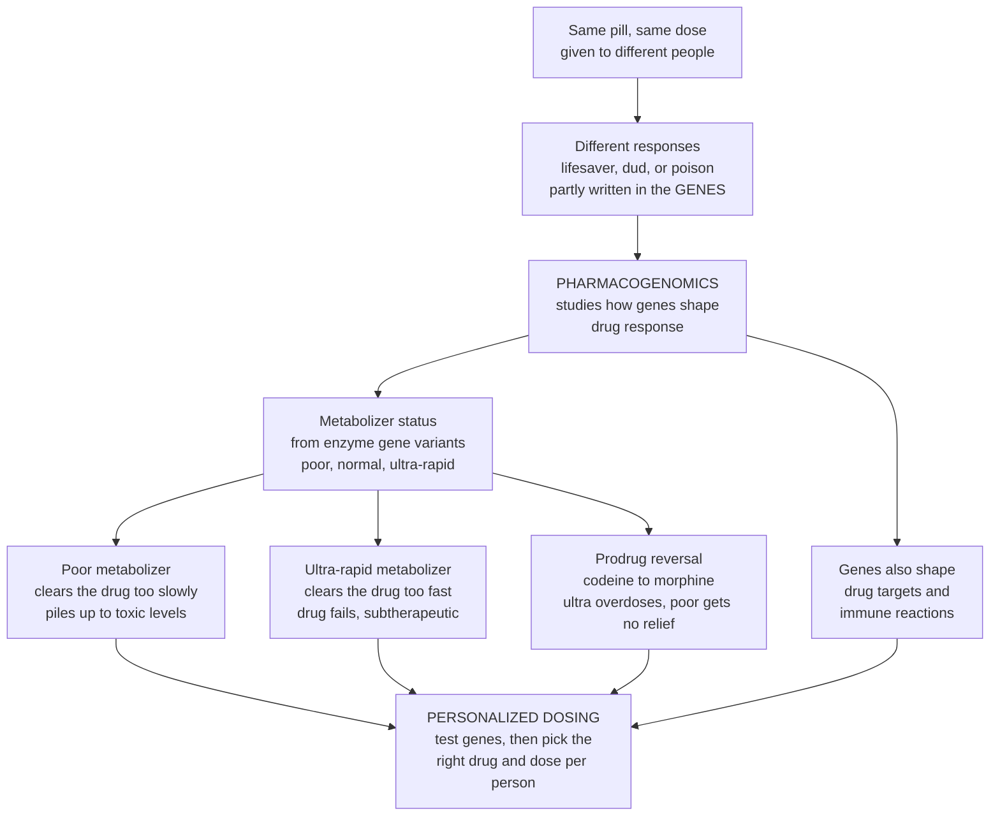

# 🧬 Pharmacogenomics and Personalized Dosing

> [!abstract] TL;DR
> **Pharmacogenomics** is the study of how a person's **genes** shape their response to a drug — and **personalized dosing** is the payoff: test the genes, then choose the right drug and the right dose *for that individual*. The flagship mechanism is **drug metabolism**: the liver enzymes that break drugs down (chiefly the **CYP450** family) come in genetic variants, so people are born **poor**, **normal**, **rapid**, or **ultra-rapid metabolizers**. Give everyone the same standard dose and the outcomes diverge — a **poor metabolizer** clears the drug too slowly and it climbs to **toxic** levels, while an **ultra-rapid metabolizer** destroys it before it can work. For a **prodrug** the logic *flips* (codeine only relieves pain once **CYP2D6** turns it into morphine, so ultra-rapid metabolizers risk a fatal overdose and poor metabolizers get nothing). Genes also shape **drug targets** (a tumour responds to a targeted drug only if it carries the matching mutation) and can trigger **catastrophic immune reactions** (some HLA variants predict life-threatening skin reactions, so we now test *before* prescribing). This is precision medicine applied to prescribing — already routine for a growing list of drugs and a central frontier of safe, effective therapy.
>
> *Educational science note — not individual medical or dosing advice.*

---

## Intuition

**Analogy — the same pill can be a lifesaver, a dud, or a poison, and a big reason is written in your genes.** Picture handing the *exact same tablet at the exact same dose* to three people. For the first it works perfectly. For the second it does nothing at all. For the third it is dangerous. They did nothing different — the difference is in their **DNA**.

Think of each drug as cargo that has to be **processed by a factory** (the liver's metabolizing enzymes) before it leaves the body. People are born with factories of different speeds:

- A **poor metabolizer** runs a slow, single-lane factory. Cargo backs up, so a *standard* delivery **piles up to toxic levels** — the same dose that is safe for others becomes an overdose.
- An **ultra-rapid metabolizer** runs a turbo, multi-lane factory. Cargo is shredded so fast the drug **never reaches a working level** — it just fails.
- A **normal metabolizer** sits in between, which is who the "one dose fits all" label was written for.

Now the crucial twist for a **prodrug** — a drug shipped as an *inactive* form that the factory must **switch on**. Here the logic reverses: the ultra-rapid factory makes *too much* active drug (**codeine → morphine** can become a fatal overdose), and the slow factory makes almost none (no pain relief). Genes also decide whether a tumour even *has the lock* a targeted drug is a key for, and whether a patient's immune system will violently reject a drug. **Pharmacogenomics** reads this genetic instruction sheet in advance so we can pick the right drug and dial the dose to each person's biology — instead of prescribing blind and finding out the hard way.

---

## How It Works

### Core mechanics

1. **Two axes of genetic variation.** Genes affect drug response along two lines. **Pharmacokinetic genes** control *how much drug reaches the target* — the enzymes and transporters that absorb, metabolize, and excrete the drug. **Pharmacodynamic genes** control *how the body responds* — the receptors and targets the drug acts on. Metabolism is the dominant, best-characterized axis.
2. **Enzyme polymorphisms create metabolizer phenotypes.** Drug-metabolizing enzymes — above all the **cytochrome P450** family (**CYP2D6, CYP2C19, CYP2C9, CYP3A5**) plus **TPMT, DPYD, UGT1A1** — are encoded by highly variable genes. Your pair of alleles (**diplotype**) sets your enzyme activity, sorting you into **poor (PM)**, **intermediate (IM)**, **normal (NM)**, **rapid**, or **ultra-rapid (UM)** metabolizer classes.
3. **Same dose, divergent exposure.** For a drug the enzyme *inactivates*, low activity means slow clearance and **drug accumulation to toxic levels** at a standard dose; high activity means the drug is **cleared before it can work** (subtherapeutic). The therapeutic window is the same for everyone — but where each person's concentration-time curve lands inside it is genotype-dependent.
4. **The prodrug reversal.** When the drug arrives **inactive** and the enzyme must *activate* it, the direction flips: **ultra-rapid metabolizers overproduce** the active form (overdose risk), **poor metabolizers underproduce** it (treatment failure). **Codeine → morphine** (CYP2D6), **clopidogrel** activation (CYP2C19), and **tamoxifen → endoxifen** (CYP2D6) are the textbook cases.
5. **Targets and immune reactions.** Beyond metabolism, **drug-target variants** decide whether a drug engages its receptor, and — in oncology — **tumour (somatic) mutations** decide whether a targeted therapy has anything to bind (a germline-vs-somatic distinction). Separately, certain **HLA variants** predict catastrophic idiosyncratic reactions (**HLA-B\*57:01 → abacavir hypersensitivity**, **HLA-B\*15:02 → carbamazepine Stevens-Johnson syndrome**), so testing precedes prescribing.
6. **Test, then treat.** The clinical action is **genotype-guided dose adjustment or drug selection**: scale the dose to the person's clearance, or switch to a drug that bypasses the affected pathway — implemented via **CPIC** guidelines and **FDA** pharmacogenomic label biomarkers.

### From one dose to personalized dosing



---

## Key Concepts

### Secondary (foundations)
- **Same pill, different people.** The same drug at the same dose can help one person, do nothing for another, and harm a third — and a major reason is **genetic**, not psychological.
- **Metabolizer speed is inherited.** The liver enzymes that break drugs down come in gene variants, so people are born **slow (poor)**, **normal**, or **fast (ultra-rapid)** metabolizers of a given drug.
- **Slow factory overflows, fast factory shreds.** A **poor metabolizer** lets a standard dose build up toward **toxic** levels; an **ultra-rapid metabolizer** clears it so fast it **never works**.
- **Prodrugs flip the story.** Some drugs are shipped **inactive** and must be switched on — codeine only relieves pain after the body turns it into morphine, which is exactly why it is dangerously unpredictable across people.
- **Test-then-treat.** Reading a patient's genes first lets a clinician choose the right drug and the right dose *for them* — the essence of **personalized dosing**.

### Undergraduate (mechanisms and parameters)
- **Two gene axes.** **Pharmacokinetic** genes (metabolizing enzymes, transporters like **SLCO1B1**, **ABCB1/P-gp**) govern how much drug reaches the target; **pharmacodynamic** genes (receptors, **VKORC1** for warfarin) govern the body's response at that target.
- **The CYP450 workhorses.** **CYP2D6** (~25% of clinical drugs; codeine, tamoxifen, many antidepressants), **CYP2C19** (clopidogrel, PPIs), **CYP2C9 + VKORC1** (warfarin) — plus **TPMT/NUDT15** (thiopurines), **DPYD** (5-FU/capecitabine), **UGT1A1** (irinotecan).
- **Metabolizer classification.** Diplotype → phenotype: **PM** (0 functional alleles) → accumulation and toxicity; **IM** (1 allele); **NM** (2 alleles, the label default); **UM** (gene duplication) → subtherapeutic exposure for a normal drug.
- **Exposure follows clearance.** Steady-state exposure scales as $C_{ss} \propto \dfrac{F \cdot D}{CL \cdot \tau}$, and $CL = k_e \cdot V_d$. Halve enzyme activity and you roughly halve $CL$, **doubling** exposure at a fixed dose — potentially across the toxicity line.
- **Genotype-guided dose adjustment.** Restore a PM to the therapeutic window by **cutting the dose** (or lengthening the interval); restore a UM by **raising the dose** or switching drugs — scaling dose to the person's clearance.
- **HLA hypersensitivity predictors.** **HLA-B\*57:01** (abacavir), **HLA-B\*15:02** (carbamazepine SJS/TEN), **HLA-B\*58:01** (allopurinol) — pre-prescription testing prevents catastrophic, immune-mediated reactions.

### Graduate (clinical nuance and implementation)
- **Prodrug pharmacokinetics.** For a prodrug, the **active-metabolite** exposure rises with the activating enzyme's activity. Codeine analgesia (and its respiratory-depression risk) tracks **CYP2D6 activity**; the FDA black-box warning against codeine in children followed a CYP2D6-UM fatality — a direct link into drug safety and pharmacovigilance.
- **Somatic vs germline in oncology.** Precision oncology matches **targeted therapy** to **tumour** genotype (**EGFR** exon-19/L858R, **HER2** amplification, **BRAF** V600E, **KRAS** G12C). These are somatic mutations in the tumour, distinct from inherited germline PGx, and are read out by tissue or **liquid-biopsy ctDNA** — connecting this note to anticancer and immunomodulatory pharmacology.
- **Phenoconversion.** A genotypic NM taking a potent **CYP2D6 inhibitor** (fluoxetine, paroxetine) behaves phenotypically as a PM. Drug-drug interactions and polypharmacy can override genotype — genotype predicts *capacity*, co-medications set *actual* activity.
- **Implementation models.** **Reactive** testing orders a single-gene test when a specific drug is prescribed; **preemptive** testing runs a multi-gene **panel** once and stores it in the record for lifetime decision support (Vanderbilt PREDICT, Mayo RIGHT). Falling genotyping cost is shifting practice toward preemptive panels.
- **Guidelines and labels.** **CPIC** publishes drug-gene prescribing guidelines; the **FDA Table of Pharmacogenomic Biomarkers** and the Dutch **DPWG** dose tables operationalize them. **Therapeutic drug monitoring** complements genotype by measuring actual concentrations.
- **Limits.** Response is often **polygenic** and modulated by non-genetic factors (age, organ function, disease, interactions); **ancestry-diversity gaps** in reference data and **polygenic-score portability** across populations constrain accuracy and equity.

---

## Python Demo

```python
# Pharmacogenomics & personalized dosing: how metabolizer genotype reshapes drug
# exposure at a FIXED dose, how genotype-guided dose adjustment restores the
# therapeutic window, the prodrug reversal, and CYP2D6 phenotype frequencies.
# numpy + matplotlib only.
import numpy as np
import matplotlib.pyplot as plt

# ---- One-compartment oral PK (Bateman function) ----
def bateman(t, F, D, ka, ke, Vd):
    """Plasma concentration after a single oral dose (one-compartment model)."""
    return (F * D * ka) / (Vd * (ka - ke)) * (np.exp(-ke * t) - np.exp(-ka * t))

def multidose(t, F, D, ka, ke, Vd, tau, n):
    """Superpose n oral doses given every tau hours (linear PK)."""
    C = np.zeros_like(t)
    for i in range(n):
        t0 = i * tau
        m = t >= t0
        C[m] += bateman(t[m] - t0, F, D, ka, ke, Vd)
    return C

# ---- Shared parameters (illustrative units) ----
F, Vd, ka = 0.8, 35.0, 1.0      # bioavailability, volume of distribution (L), absorption rate (1/h)
D_std = 100.0                    # standard dose (mg)
tau, n_doses = 12.0, 10          # a dose every 12 h, 10 doses
ke_normal = 0.12                 # elimination rate of a NORMAL metabolizer (1/h)

# Relative enzyme activity by metabolizer phenotype -> scales elimination rate ke.
# Drug is INACTIVATED by the enzyme: more activity = faster clearance = lower level.
activity = {"Poor (PM)": 0.35, "Normal (NM)": 1.00, "Ultra-rapid (UM)": 2.60}
colors   = {"Poor (PM)": "#d93025", "Normal (NM)": "#1a73e8", "Ultra-rapid (UM)": "#188038"}

win_low, win_high = 1.0, 4.0     # therapeutic window (mg/L, illustrative)
t = np.linspace(0.001, 120, 3000)

fig, ax = plt.subplots(2, 2, figsize=(14, 10))
fig.suptitle("Pharmacogenomics & Personalized Dosing (CYP2D6-style enzyme)",
             fontsize=13, fontweight="bold")

# ---------- (a) SAME dose for everyone -> exposure diverges ----------
a = ax[0, 0]
for name, act in activity.items():
    ke = ke_normal * act
    C = multidose(t, F, D_std, ka, ke, Vd, tau, n_doses)
    css = F * D_std / (ke * Vd * tau)           # average steady-state concentration
    a.plot(t, C, color=colors[name], lw=2,
           label=f"{name}: t-half={np.log(2)/ke:.1f} h, Css~{css:.2f}")
a.axhspan(win_low, win_high, color="green", alpha=0.12, label="Therapeutic window")
a.set_title("(a) SAME 100 mg every 12 h\nPM piles up to toxic, UM stays subtherapeutic")
a.set_xlabel("Time (h)"); a.set_ylabel("Plasma conc. (mg/L)")
a.legend(fontsize=8); a.grid(alpha=0.3)

# ---------- (b) Genotype-guided dose adjustment -> all in window ----------
b = ax[0, 1]
for name, act in activity.items():
    ke = ke_normal * act
    D_guided = D_std * (ke / ke_normal)         # match the NORMAL metabolizer's exposure
    C = multidose(t, F, D_guided, ka, ke, Vd, tau, n_doses)
    b.plot(t, C, color=colors[name], lw=2, label=f"{name}: dose={D_guided:.0f} mg")
b.axhspan(win_low, win_high, color="green", alpha=0.12, label="Therapeutic window")
b.set_title("(b) Genotype-GUIDED dosing\ntest genes, then scale the dose per person")
b.set_xlabel("Time (h)"); b.set_ylabel("Plasma conc. (mg/L)")
b.legend(fontsize=8); b.grid(alpha=0.3)

# ---------- (c) PRODRUG reversal: active metabolite scales WITH enzyme activity ----------
# e.g. codeine -> morphine via CYP2D6. Poor = little active drug (no relief),
# ultra-rapid = too much active drug (overdose). Shared shape, amplitude ~ activity.
c = ax[1, 0]
kf, km = 1.2, 0.20                               # formation & elimination of active metabolite (1/h)
shape = np.exp(-km * t) - np.exp(-kf * t)
shape = shape / shape.max()                      # normalize peak to 1
amp = {"Poor (PM)": 0.20, "Normal (NM)": 0.70, "Ultra-rapid (UM)": 1.60}
eff_line, tox_line = 0.30, 1.20                  # effective & toxic active-drug thresholds
for name in activity:
    c.plot(t, amp[name] * shape, color=colors[name], lw=2, label=name)
c.axhline(eff_line, color="gray", ls="--", lw=1, label="min effective")
c.axhline(tox_line, color="red", ls="--", lw=1, label="toxic threshold")
c.set_title("(c) PRODRUG flip: codeine to morphine\nUM overdoses, PM gets no relief")
c.set_xlabel("Time (h)"); c.set_ylabel("Active metabolite (relative)")
c.legend(fontsize=8); c.grid(alpha=0.3)

# ---------- (d) Population frequencies of CYP2D6 metabolizer phenotypes ----------
d = ax[1, 1]
phenos = ["Poor\n(PM)", "Intermediate\n(IM)", "Normal\n(NM)", "Ultra-rapid\n(UM)"]
freq   = [7, 12, 78, 3]                          # approx. European %, illustrative
bar_colors = ["#d93025", "#f9a825", "#1a73e8", "#188038"]
d.bar(phenos, freq, color=bar_colors, edgecolor="black")
for i, f in enumerate(freq):
    d.text(i, f + 1, f"{f}%", ha="center", fontsize=9)
d.set_title("(d) CYP2D6 phenotype frequencies\na population is a mix of metabolizer types")
d.set_ylabel("Approx. share of population (%)")
d.set_ylim(0, 90); d.grid(alpha=0.3, axis="y")

plt.tight_layout()
plt.show()

# ---- Console summary ----
print("Fixed 100 mg every 12 h -- average steady-state exposure by phenotype")
for name, act in activity.items():
    ke = ke_normal * act
    css = F * D_std / (ke * Vd * tau)
    flag = "TOXIC" if css > win_high else ("sub-therapeutic" if css < win_low else "in window")
    print(f"  {name:16s} ke={ke:.3f}/h  Css~{css:.2f} mg/L  -> {flag}")
```

**What the plots show.** Panel **(a)** gives everyone the *same* 100 mg every 12 h: the **poor metabolizer** accumulates a plateau that climbs *above* the therapeutic window (toxic), while the **ultra-rapid metabolizer** clears the drug so fast it never rises into the window (subtherapeutic) — one dose, three very different outcomes. Panel **(b)** applies **genotype-guided dosing**: scaling each dose to the person's clearance parks all three phenotypes inside the window — the concrete meaning of *personalized dosing*. Panel **(c)** shows the **prodrug reversal**: because the enzyme *activates* the drug, the active-metabolite curve now scales *up* with enzyme activity, so the **UM overshoots the toxic line** (codeine-to-morphine overdose) while the **PM never reaches the effective line** (no relief). Panel **(d)** reminds us that any population is a **mixture** of metabolizer phenotypes — which is exactly why a single fixed dose cannot fit everyone.

---

## Real-World Applications

- **Codeine and children (CYP2D6).** Because codeine relieves pain only after CYP2D6 converts it to morphine, **ultra-rapid metabolizers** can generate dangerous morphine spikes. Following post-tonsillectomy fatalities in UM children, the FDA issued a black-box warning; CPIC advises avoiding codeine in PMs (ineffective) and UMs (unsafe) — a pharmacogenomic driver of drug-safety policy.
- **Clopidogrel after coronary stents (CYP2C19).** PMs cannot activate this antiplatelet prodrug, raising stent-thrombosis risk; guidelines switch PMs to prasugrel or ticagrelor, which do not depend on CYP2C19. Point-of-care genotyping is used at catheterization labs in populations with high PM frequency.
- **Warfarin dosing (CYP2C9 + VKORC1).** Genotype at the metabolizing enzyme *and* the drug target feeds validated dosing algorithms that shorten time-to-stable INR and reduce bleeding, especially at dose extremes — a two-axis (PK + PD) example.
- **Thiopurines and 5-FU chemotherapy (TPMT/NUDT15, DPYD).** Loss-of-function carriers accumulate toxic metabolites; upfront genotyping with dose reduction prevents life-threatening myelosuppression (thiopurines) and severe fluoropyrimidine toxicity — the EMA now mandates DPYD testing before 5-FU/capecitabine.
- **Abacavir hypersensitivity (HLA-B\*57:01).** Universal pre-prescription screening in HIV care drove hypersensitivity reactions from several percent to near zero — the clearest single-test PGx public-health win, and a template for HLA-guided prescribing.
- **Preemptive PGx panels.** Health systems genotype a multi-gene panel once and store it in the electronic record, firing decision-support alerts at the moment of prescribing so the right drug and dose are chosen before the first dose is ever given.

---

## Common Pitfalls

- **Confusing genotype with phenotype (phenoconversion).** A genotypic normal metabolizer on a strong CYP inhibitor (e.g. fluoxetine) *acts* like a poor metabolizer. Genotype sets **capacity**; co-medications and disease set **actual activity** — always reconcile the two before adjusting a dose.
- **Applying one population's allele frequencies to another.** PM and UM frequencies differ dramatically by ancestry (CYP2C19 PM ~30% in East Asians vs ~2% in Europeans; CYP2D6 UM elevated in some North-East African groups). European-derived tables can systematically misclassify patients — a diversity-gap equity problem.
- **Forgetting the prodrug reversal.** Assuming "poor metabolizer = high drug level = toxic" is only true for drugs the enzyme *inactivates*. For a **prodrug**, poor metabolizers get **too little** active drug and ultra-rapid metabolizers get **too much** — the opposite risk direction.
- **Missing CYP2D6 copy-number variation.** CYP2D6 has whole-gene deletions and duplications; SNP-only assays without copy-number calling can misclassify UMs as normal and vice versa, sending dosing the wrong way.
- **Treating single genes as the whole story.** Most drug response is **polygenic** and shaped by age, organ function, adherence, and interactions. Genotype narrows uncertainty; it rarely eliminates it — pair it with therapeutic drug monitoring for narrow-window drugs.
- **Confusing somatic and germline variants in oncology.** A tumour (somatic) mutation guides targeted-drug choice but carries no inherited risk; a germline variant affects every cell and family members. The clinical implications diverge sharply.

---

## Related Concepts

This note takes the **pharmacology and dosing** view of a topic that this vault also develops from two other angles, so it is deliberately complementary rather than duplicative. Within the **Pharmacology** vault it builds directly on *Pharmacokinetics (ADME)* — clearance, half-life, and the concentration-time curve are exactly the machinery a metabolizer variant perturbs — and on *Drug Metabolism, Interactions and Polypharmacy*, whose CYP induction and inhibition are the environmental counterpart to genetic variation (together they produce phenoconversion). It feeds *Drug Safety, Pharmacovigilance and Adverse Effects* (many idiosyncratic and dose-dependent adverse events are genotype-linked), extends *Anticancer and Immunomodulatory Drugs* (tumour-genotype-matched targeted therapy and DPYD/TPMT dosing), and is a headline case in *The Reach and Future of Pharmacology*.

Verified cross-vault links:

- [[Genetics/05_Human_and_Medical_Genetics/Pharmacogenomics_and_Personalized_Medicine|Pharmacogenomics and Personalized Medicine]] — the **genetics-side** companion: allele nomenclature, CPIC phenotype classification, and the molecular biology of the variant alleles this note doses around.
- [[Clinical_Medicine/06_Clinical_Reasoning_and_Modern_Medicine/Precision_Medicine_and_Genomics_in_the_Clinic|Precision Medicine and Genomics in the Clinic]] — the **bedside** view: how genotype-guided prescribing fits diagnostic reasoning and clinical decision support.
- [[Genetics/05_Human_and_Medical_Genetics/Human_Genome_and_Genetic_Variation|Human Genome and Genetic Variation]] — SNPs, copy-number variation, and allele frequencies are the raw material that makes people poor or ultra-rapid metabolizers.
- [[Genetics/05_Human_and_Medical_Genetics/Complex_Trait_Genetics_and_GWAS|Complex Trait Genetics and GWAS]] — why much drug response is **polygenic**, motivating polygenic scores and explaining the limits of single-gene PGx.
- [[Clinical_Medicine/01_Foundations_of_Disease_and_Pathophysiology/Genetic_and_Congenital_Disease|Genetic and Congenital Disease]] — the same inherited-variation framework that underlies genetic disease also underlies inherited differences in drug handling.
- [[Biology/13_Biotechnology_and_Genomics/Genomics_and_Bioinformatics|Genomics and Bioinformatics]] — the sequencing and genotyping technology, and the falling cost, that make preemptive PGx panels feasible.

---

## Review Questions

**Secondary**
1. Three people take the identical pill at the identical dose: it saves one, does nothing for another, and harms the third. Using the "factory" analogy, explain how genes can produce all three outcomes.
2. What is a **poor metabolizer**, and why can a *standard* dose become an overdose for such a person when the drug is one the enzyme breaks down?
3. Codeine only works after the body converts it to morphine. Explain why an **ultra-rapid metabolizer** could be endangered by codeine while a **poor metabolizer** gets no pain relief.

**Undergraduate**
4. For a drug the enzyme *inactivates*, show why halving a person's clearance roughly **doubles** their steady-state exposure at a fixed dose, and describe the genotype-guided dose change that would return them to the therapeutic window.
5. Contrast the two axes of pharmacogenomic variation — **pharmacokinetic** (e.g. CYP2C9) and **pharmacodynamic** (e.g. VKORC1) — using warfarin as the example, and explain why both are needed to dose it well.
6. What is **phenoconversion**, and why can a genotypic normal metabolizer on fluoxetine behave like a poor metabolizer? What does this imply for interpreting a PGx report?

**Graduate**
7. You are choosing between **reactive** single-gene testing and **preemptive** multi-gene panel testing for a hospital. Argue the trade-offs in cost, clinical yield, decision-support integration, and equity, and state which you would deploy and why.
8. A lung-cancer patient's tumour carries an **EGFR L858R** mutation (somatic) and the patient is also a **CYP2D6 poor metabolizer** (germline). Explain how the somatic and germline findings drive *different* decisions, and why conflating them is dangerous.
9. Polygenic scores for drug response show reduced accuracy in non-European populations. Explain the causes (LD structure, causal-variant frequency, training-cohort composition) and two concrete steps to make genotype-guided dosing more equitable.

---

## Sources

- [Roden, D.M. et al. (2019). "Pharmacogenomics." *The Lancet* 394, 521–532.](https://doi.org/10.1016/S0140-6736(19)31276-0)
- [Relling, M.V. & Evans, W.E. (2015). "Pharmacogenomics in the clinic." *Nature* 526, 343–350.](https://doi.org/10.1038/nature15817)
- [Weinshilboum, R. (2003). "Inheritance and drug response." *New England Journal of Medicine* 348, 529–537.](https://doi.org/10.1056/NEJMra020021)
- [CPIC — Clinical Pharmacogenetics Implementation Consortium: Guidelines](https://cpicpgx.org/guidelines/)
- [FDA Table of Pharmacogenomic Biomarkers in Drug Labeling](https://www.fda.gov/drugs/science-and-research-drugs/table-pharmacogenomic-biomarkers-drug-labeling)

---

#pharmacology #pharmacogenomics #personalized-dosing #CYP450 #precision-medicine
