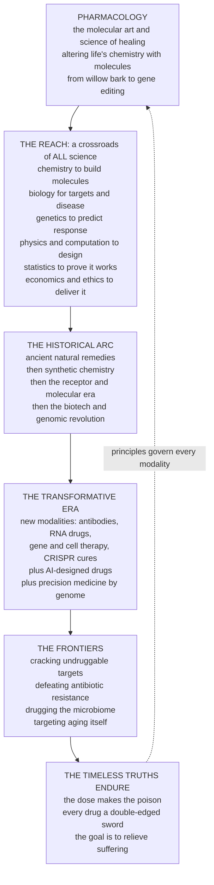

# 🔮 The Reach and Future of Pharmacology

> [!abstract] TL;DR
> **Pharmacology** is the molecular **art and science of healing** — the deliberate use of chemistry to alter the living machinery of the body. It is one of civilization's oldest and most consequential projects, running in an unbroken line from an ancient healer chewing **willow bark** for pain (which became **aspirin**) and brewing **foxglove** for a failing heart (which became **digitalis**), to designer proteins and gene-editing cures that fix inherited disease at its DNA root. What makes the field extraordinary is its **reach**: it sits at the crossroads of *all* science — it borrows **chemistry** to build molecules, **biology** to understand targets, **genetics** to predict who responds, **physics and computation** to simulate and design, **statistics** to prove drugs actually work, and **economics and ethics** to bring them to the world. And it is now living through its **most transformative era**. The toolkit is exploding beyond the small-molecule pill into new **modalities** — **antibodies**, **RNA drugs**, **gene and cell therapies**, and **CRISPR** genome editing that can *cure* rather than merely treat. **AI** is compressing decade-long molecular searches into months and designing structures no chemist imagined. **Precision medicine** is tailoring drugs to each person's genome. Grand frontiers beckon: cracking the **"undruggable"** targets, defeating **antibiotic resistance**, drugging the **microbiome**, and targeting **aging** itself. Yet beneath the dazzle the timeless truths endure — *the dose still makes the poison*, *every drug is still a double-edged sword*, and *the goal is still to relieve suffering*. This is the **capstone** of the vault: a step back to marvel at pharmacology's vast reach and its accelerating future — the ongoing human project of learning to heal ourselves, molecule by molecule.
>
> *Educational science note — not individual medical or dosing advice.*

---

## Intuition

**Analogy FIRST — humanity's oldest workshop, now handed a set of impossible new tools.** Step all the way back and look at what pharmacology *is*. For as long as there have been humans, there have been people searching the world for **substances that heal** — a shaman testing which leaf calms a fever, a village healer learning that willow bark eases pain and that a certain purple flower steadies a racing heart. For most of that history it was a craft of **trial, error, and luck**: you found the medicine in a plant, you had no idea *why* it worked, and the line between remedy and poison was learned in blood. That patient, dangerous, hopeful search — to bend the body's chemistry toward health using molecules — is the deepest root of pharmacology, and it is one of the most consequential things our species has ever attempted.

Now imagine that same ancient workshop, but every wall has been knocked out to reveal that it opens onto **every other room in the house of science**. To make a molecule you walk into the **chemistry** room; to know what it should hit, the **biology** room of receptors and disease; to predict who it will help or harm, the **genetics** room; to design and simulate it, the **physics and computation** room; to *prove* it works, the **statistics** room of clinical trials; and to actually deliver it to a suffering person, the **economics, policy, and ethics** rooms. Pharmacology is not a single discipline standing alone — it is the great **convergence point** where all of these pour together and become *medicine*. That is its reach.

**And the tools on the workbench have suddenly, breathtakingly multiplied.** For a century the tool was essentially one thing: a small **pill** — a little molecule swallowed to nudge one target. Today the same bench holds astonishing new instruments. **Antibody** drugs, exquisitely shaped proteins grown to grab one villain. **RNA drugs** that reprogram the cell's own instructions — the technology behind the COVID vaccines. **Gene and cell therapies** that don't manage a disease but *cure* it, and **CRISPR** genome editing that walks up to a broken gene and rewrites the misspelling that causes an inherited illness — fixing the disease at its **source**. Meanwhile **AI** reads the entire ocean of chemistry and *dreams up* molecules no human drew, collapsing searches that took a decade into months. And **precision medicine** hands each patient a therapy matched to their own genome instead of one-dose-fits-all. The frontier ahead is just as staggering: targets long declared **"undruggable,"** the arms race against **antibiotic-resistant** bacteria, the trillions of microbes of the **microbiome** as a new drug target, and the audacious idea of drugging **aging itself**.

Yet here is the quiet, humbling truth of this whole survey: **the ancient laws still hold.** No matter how dazzling the modality, *the dose still makes the poison* — Paracelsus's five-hundred-year-old rule governs a CRISPR therapy exactly as it governed willow bark. Every drug, from the newest gene editor to the oldest herb, is still a **double-edged sword** that must earn its place on the razor's edge between benefit and harm. And the entire enterprise, for all its molecular fireworks, still exists for the same reason the first healer went looking in the forest: **to relieve suffering.** This note steps back to see both at once — the vast reach and the dazzling future *and* the timeless principles beneath — and to recognize pharmacology for what it is: the ever-accelerating human project of learning to heal ourselves, one molecule at a time.

---

## How It Works

### The reach — pharmacology as the convergence of all science

Pharmacology is fundamentally an **integrative, applied science**: it does not so much own a body of knowledge as *braid together* everyone else's into working medicine. Trace a single approved drug backward and you touch nearly every field in the vault.

1. **Chemistry** — the molecule itself: its synthesis, its shape, its functional groups, the medicinal-chemistry tuning of potency, selectivity, and drug-likeness. Without chemistry there is no drug.
2. **Biology** — the *target* and the *disease*: physiology, the receptor or enzyme or pathway that is broken, and the mechanism a drug must correct. Biology tells you **what** to hit.
3. **Genetics and genomics** — both a source of new targets (genome-wide association, functional genomics) and the reason people respond differently (**pharmacogenomics**), plus the raw material of gene therapy itself.
4. **Physics and computation** — the machinery of modern design: molecular simulation, structure prediction, docking, and AI-driven generation that explore a chemical space too vast to search by hand.
5. **Statistics and epidemiology** — the only way to *know* a drug works and is safe: randomized controlled trials, evidence synthesis, and post-market surveillance. Evidence is what separates medicine from folklore.
6. **Medicine** — the point of it all: turning a molecule into a therapy delivered to a patient with a specific illness.
7. **Economics, policy, and ethics** — the often-decisive final rooms: who develops the drug, whether it is affordable, whether trials were fair, and who actually gets access.

### The historical arc — four great eras

Pharmacology's power grew in leaps, each unlocking a new *kind* of drug:

- **The ancient / natural-products era.** Medicine came from nature and was found by trial and error — **willow bark → aspirin (salicylate)**, **foxglove → digitalis (digoxin)**, **cinchona bark → quinine**, **opium poppy → morphine**. Effective, but blind: no one knew the mechanism.
- **The alkaloid and synthetic-chemistry era (19th–early 20th c.).** Chemists learned to *isolate* the active molecule (morphine from opium) and then to *build* new ones (aspirin, the sulfonamides, Ehrlich's "magic bullet" ideal of selective toxicity). Medicine became **rational chemistry**.
- **The receptor / molecular era (mid–late 20th c.).** The discovery that drugs act on specific **molecular targets** — receptors, enzymes, channels — turned discovery from luck into *design against a mechanism*. Beta-blockers, H2-antagonists, statins, and SSRIs were born here.
- **The biotech and genomic revolution (late 20th c. onward).** Recombinant proteins (insulin), **monoclonal antibodies**, the sequenced human genome, and then **nucleic-acid**, **gene**, and **cell** therapies. Medicine gained the power not only to *block* biology but to *rewrite* it.

### The frontiers — where pharmacology is heading

- **The modality expansion.** The single biggest shift: medicine is escaping the small-molecule pill. **Biologics and antibodies** target things pills cannot; **nucleic-acid drugs** (antisense, **siRNA**, **mRNA**) reprogram gene expression; **gene and cell therapies** and **CRISPR** editing *cure* genetic disease at its root; and **targeted protein degraders** (PROTACs, molecular glues) destroy disease proteins rather than merely inhibiting them — cracking targets once called **"undruggable."**
- **AI and computational design.** Generative models invent novel molecules, and structure predictors like **AlphaFold** hand designers the shape of nearly every protein target, compressing the slowest, most failure-prone early stages of discovery.
- **Precision / personalized pharmacology.** **Pharmacogenomics** matches drug and dose to a patient's genome, replacing one-size-fits-all prescribing with therapy tuned to the individual.
- **Grand challenges.** **Antimicrobial resistance** (a genuine arms race against evolving pathogens); the **microbiome** as a manipulable drug target; **neurodegeneration and aging** — the emerging science of **geroscience** that asks whether we can drug the aging process itself; and better **drug delivery** to put molecules exactly where they are needed.

### The enduring principles

Beneath all of it, the field's first laws persist. **"The dose makes the poison"** governs every modality. Every drug remains a **double-edged sword** — a balance of efficacy and safety that must be earned through rigorous evidence and honest benefit–risk judgment. And the primacy of **patient welfare**, alongside the unsolved problems of **cost, access, ethics, and equity**, keeps pharmacology a *human* enterprise, not merely a technical one.

### The reach, the arc, the frontier, and the constants



*Read it as a spiral, not a ladder: the reach and the historical arc feed the transformative era, which opens onto the frontiers — and the timeless truths loop back to govern the whole, from the oldest herb to the newest gene editor.*

---

## Key Concepts

### Secondary (explain to a bright teenager)

- **What pharmacology really is.** It is the science of using *molecules* to change how the body works — to heal it. People have searched for healing substances since ancient times: willow bark for pain became **aspirin**; a flower called foxglove became a **heart medicine**.
- **It needs every other science.** To make a drug you need **chemistry** (to build the molecule), **biology** (to know what to fix), **genetics** (to know who it helps), **computers** (to design it), **math/statistics** (to prove it works), and **economics** (to get it to people). Pharmacology is where all of them meet.
- **The toolkit is exploding.** For a long time medicine was mostly a **pill**. Now we also have **antibodies** (special proteins), **RNA drugs**, and even **gene editing** that can *fix a broken gene* and cure a disease at its source.
- **AI is changing the game.** Computers can now read enormous amounts of chemistry and even *invent brand-new molecules*, making the search for medicines much faster.
- **The old rules still hold.** "**The dose makes the poison**" means the *same* substance can heal or kill depending on how much — and this is true even for the fanciest new drugs. Every medicine is a **double-edged sword**, and the whole point is always to **relieve suffering**.

### Undergraduate (needs some science background)

- **Pharmacology as an integrative discipline.** It is *applied* science: it synthesizes medicinal chemistry, molecular and systems biology, genetics/genomics, computation, and biostatistics into therapeutics. A drug program is a relay across all of these, and it fails if any leg fails.
- **The four eras and what each unlocked.** Natural products (found, not designed) → synthetic chemistry (isolate then build; selective toxicity) → the receptor/molecular era (design against a defined target) → the biotech/genomic revolution (proteins, then rewriting biology). Each era added a new *class of drug*, not just new drugs.
- **Modality as the master variable of the new era.** A **modality** is the *kind* of molecule: small molecule, peptide, **antibody/biologic**, **nucleic-acid** (antisense, siRNA, mRNA), **gene/cell therapy**, **protein degrader**. Modality choice determines what targets are reachable, how the drug is delivered, and its economics. The frontier is largely a *modality* story: escaping the constraints of the pill.
- **"Undruggable" and how new modalities crack it.** Many disease-critical proteins (transcription factors, scaffolding proteins, flat protein–protein interfaces) have no pocket for a small molecule. Biologics, degraders (**PROTACs**/molecular glues), and nucleic-acid drugs that act *upstream* on the gene bypass the missing pocket entirely.
- **Precision pharmacology.** **Pharmacogenomics** (e.g. **CYP2D6/2C19** metabolizer status, **TPMT**, **HLA-B\*57:01**) individualizes drug and dose; combined with molecular diagnostics it shifts prescribing from population averages toward the specific patient.
- **The grand challenges as *evolutionary* and *systems* problems.** **Antimicrobial resistance** is Darwinian evolution in fast-forward — an arms race medicine can lose. The **microbiome** reframes the body as an ecosystem to be modulated. **Aging** (geroscience) reframes many diseases as symptoms of one underlying process worth targeting directly.

### Graduate (system-level and reflective)

- **Why the field is *integrative by necessity*, not by choice.** Attrition in drug development is dominated by *late* failures for **efficacy** and **safety** — precisely the failures that arise when biology (wrong target), chemistry (poor drug-likeness), genetics (unanticipated variability), and statistics (underpowered or biased evidence) are not fully integrated. The reach across disciplines is what *reduces* attrition; siloed thinking is what causes it.
- **The modality expansion as a change in the *rules of druggability*.** Small-molecule druggability is a statement about *pockets*; the new modalities change the *addressable target space* itself. Antibodies open the extracellular and cell-surface proteome; oligonucleotides and gene therapy move the point of intervention *upstream* to RNA and DNA (any sequence-defined target becomes reachable); degraders convert "occupancy" pharmacology into "event-driven" catalytic removal. The consequence is that the classic **druggable genome** is being renegotiated modality by modality.
- **AI's real and bounded contribution.** Generative design and structure prediction genuinely compress the *early, exploratory* stages and expand the searchable chemical space, but they do **not** repeal biology or clinical uncertainty: models are only as good as sparse, biased data; they generalize poorly to novel chemotypes; and every prediction remains a hypothesis requiring wet-lab and clinical validation. AI shifts *where* and *how fast* discovery happens, not *whether* efficacy and safety must still be proven.
- **The economics and equity problem as a first-order scientific constraint.** Per-approval costs on the order of **US\$1–2.6 billion**, dominated by failure, plus the extraordinary price of gene/cell therapies (single-dose "cures" priced in the millions), make **access, reimbursement, and equity** not a footnote but a determinant of which diseases get drugged at all — hence persistent under-investment in **neglected and rare diseases** and in **new antibiotics** (whose responsible-use economics are structurally broken).
- **The dialectic of dazzle and constancy.** The intellectually honest capstone claim is *both*: pharmacology is in a genuinely revolutionary phase (curative genetic medicine is not hype), *and* its foundational principles are undisturbed. A CRISPR therapy still has a therapeutic window, still shows dose-dependent off-target and immune toxicity, still requires rigorous benefit–risk evaluation, and still exists to relieve suffering. Mastery of the field is holding the innovation and the invariants in the same hand.
- **Pharmacology as an unfinished, accelerating project.** The right stance is neither triumphalism nor cynicism but *momentum*: an expanding toolkit meeting an expanding understanding of disease, bounded by evolution (resistance), biology (delivery, the blood–brain barrier, undruggable targets), and society (cost, access, ethics) — a project centuries old and visibly speeding up.

---

## Python Demo

```python
# The sweep and future of pharmacology in three panels:
#   (a) THE MODALITY-EXPANSION ARC : how the *kind* of drug has widened over ~a
#       century -- a stacked-area timeline of the approved-drug toolkit, from
#       natural products and small molecules, to biologics/antibodies, to
#       nucleic-acid and gene/cell/CRISPR therapies. The toolkit widens.
#   (b) THE FRONTIER OUTLOOK : two converging trends of the transformative era --
#       AI compressing early discovery TIME (falling), while advanced (gene/cell/
#       RNA) therapy approvals per year RISE. The pace accelerates.
#   (c) THE CROSS-DISCIPLINARY REACH : a schematic radar of how deeply
#       pharmacology draws on chemistry, biology, genetics, physics/computation,
#       statistics, and economics -- the crossroads-of-all-science idea.
# All numbers are illustrative teaching values (orders of magnitude / trends),
# not a dataset. numpy + matplotlib only. Educational content, not medical advice.
import numpy as np
import matplotlib.pyplot as plt

# =====================================================================
# (a) MODALITY-EXPANSION ARC  -- stacked composition of the drug toolkit
# =====================================================================
eras = np.array([1900, 1920, 1940, 1960, 1980, 2000, 2020, 2040])
# rows = modality categories; each column is one era's approximate share
natural   = np.array([0.85, 0.70, 0.45, 0.30, 0.20, 0.12, 0.08, 0.05])  # plant/natural
small_mol = np.array([0.15, 0.30, 0.55, 0.68, 0.72, 0.62, 0.50, 0.38])  # synthetic pills
biologics = np.array([0.00, 0.00, 0.00, 0.02, 0.08, 0.24, 0.30, 0.30])  # antibodies/proteins
nucleic   = np.array([0.00, 0.00, 0.00, 0.00, 0.00, 0.02, 0.08, 0.15])  # RNA/antisense/siRNA
gene_cell = np.array([0.00, 0.00, 0.00, 0.00, 0.00, 0.00, 0.04, 0.12])  # gene/cell/CRISPR
stack = np.vstack([natural, small_mol, biologics, nucleic, gene_cell])
stack = stack / stack.sum(axis=0)          # normalise each era to 100%
labels = ["Natural products", "Small molecules", "Biologics / antibodies",
          "Nucleic-acid drugs", "Gene / cell / CRISPR"]
colors = ["#6E8B3D", "#2980B9", "#C0392B", "#8E44AD", "#F39C12"]

# =====================================================================
# (b) FRONTIER OUTLOOK  -- AI compresses discovery time; advanced-therapy
#     approvals accelerate. Two trends, twin y-axes.
# =====================================================================
yr = np.arange(2000, 2041)
# early-discovery time to a candidate (years): slow decline, then AI-accelerated
disc_time = 5.0 * np.exp(-0.045 * (yr - 2000)) + 1.2
# advanced-therapy (gene/cell/RNA) approvals per year: slow then exponential-ish
adv_appr = 0.6 * np.exp(0.14 * (yr - 2000))
adv_appr = np.clip(adv_appr, 0, 45)

# =====================================================================
# (c) CROSS-DISCIPLINARY REACH  -- schematic radar (0-10 "depth of reliance")
# =====================================================================
axes_lbl = ["Chemistry", "Biology", "Genetics",
            "Physics &\nComputation", "Statistics", "Economics\n& Ethics"]
reach = np.array([9.5, 9.0, 8.0, 8.5, 9.0, 7.5])
ang = np.linspace(0, 2*np.pi, len(axes_lbl), endpoint=False)
ang_c = np.concatenate([ang, ang[:1]])          # close the loop
reach_c = np.concatenate([reach, reach[:1]])

# =====================================================================
# PLOT
# =====================================================================
fig = plt.figure(figsize=(18, 5.4))
ax1 = fig.add_subplot(1, 3, 1)
ax2 = fig.add_subplot(1, 3, 2)
ax3 = fig.add_subplot(1, 3, 3, projection="polar")

# --- (a) modality-expansion stacked area ---
ax1.stackplot(eras, stack, labels=labels, colors=colors, alpha=0.9)
ax1.axvline(2026, color="black", ls=":", lw=1.2)
ax1.text(2027, 0.03, "today", fontsize=8, rotation=90, va="bottom")
ax1.set_xlim(1900, 2040)
ax1.set_ylim(0, 1)
ax1.set_xlabel("Era")
ax1.set_ylabel("Share of the drug toolkit")
ax1.set_title("(a) The modality-expansion arc:\nfrom the pill to gene editing")
ax1.legend(loc="lower left", fontsize=7.2, framealpha=0.9)

# --- (b) frontier outlook (twin axes) ---
l1 = ax2.plot(yr, disc_time, color="#2980B9", lw=2.4,
              label="Early-discovery time to candidate (yrs)")
ax2.set_xlabel("Year")
ax2.set_ylabel("Years to a candidate", color="#2980B9")
ax2.tick_params(axis="y", labelcolor="#2980B9")
ax2.set_ylim(0, 6)
ax2.axvline(2026, color="black", ls=":", lw=1.2)
ax2b = ax2.twinx()
l2 = ax2b.plot(yr, adv_appr, color="#C0392B", lw=2.4,
               label="Advanced-therapy approvals / year")
ax2b.set_ylabel("Gene/cell/RNA approvals per year", color="#C0392B")
ax2b.tick_params(axis="y", labelcolor="#C0392B")
ax2b.set_ylim(0, 48)
ax2.set_title("(b) The frontier outlook:\nAI speeds discovery, cures accelerate")
lns = l1 + l2
ax2.legend(lns, [ln.get_label() for ln in lns], loc="center left", fontsize=7.6)

# --- (c) cross-disciplinary reach radar ---
ax3.plot(ang_c, reach_c, color="#16A085", lw=2.2)
ax3.fill(ang_c, reach_c, color="#16A085", alpha=0.25)
ax3.set_xticks(ang)
ax3.set_xticklabels(axes_lbl, fontsize=8)
ax3.set_ylim(0, 10)
ax3.set_yticks([2, 4, 6, 8, 10])
ax3.set_yticklabels(["2", "4", "6", "8", "10"], fontsize=7, color="grey")
ax3.set_title("(c) The reach: a crossroads\nof all science", pad=18)

plt.tight_layout()
plt.savefig("reach_and_future_of_pharmacology.png", dpi=120)
plt.show()

# --- console summary ---
print("(a) Toolkit in 1900: mostly natural products "
      f"({natural[0]*100:.0f}%); by 2040 (proj): "
      f"nucleic-acid + gene/cell = {(nucleic[-1]+gene_cell[-1])*100:.0f}% of the toolkit.")
print(f"(b) Early-discovery time: {disc_time[0]:.1f} yrs (2000) -> "
      f"{disc_time[-1]:.1f} yrs (2040 proj); advanced-therapy approvals/yr: "
      f"{adv_appr[0]:.1f} -> {adv_appr[-1]:.0f}.")
print(f"(c) Cross-disciplinary reach (0-10): mean {reach.mean():.1f} across "
      f"{len(axes_lbl)} fields -- pharmacology leans hard on all of them.")
```

**What the plots show.** Panel **(a)** is the **modality-expansion arc** — the single most important trend of the modern era made visual. A century ago the drug toolkit was almost entirely **natural products** found by trial and error; synthetic **small molecules** then dominated for decades; and only recently have **biologics/antibodies** taken a large share and **nucleic-acid** and **gene/cell/CRISPR** therapies appeared and begun to grow. The point is not the exact percentages but the **widening**: pharmacology is no longer one kind of drug but many, and the newest slivers are the ones that can *cure* rather than merely treat. Panel **(b)** is the **frontier outlook** — two signatures of the transformative era converging: the *time* to find an early candidate **falling** as AI compresses discovery, while *advanced-therapy approvals per year* **rise** steeply. Faster discovery meeting a rising tide of curative modalities is the shape of acceleration. Panel **(c)** is the **reach** — a schematic radar showing that pharmacology draws deeply and roughly evenly on **chemistry, biology, genetics, physics/computation, statistics, and economics**; the near-full hexagon is the whole thesis of the note in one shape: pharmacology is the crossroads where all of science becomes medicine. (All values are illustrative teaching trends, chosen to convey direction and magnitude, not to report a precise dataset.)

---

## Real-World Applications

> **From willow bark to a CRISPR cure — the arc in five real drugs.** The reach and future of pharmacology are not abstractions; they are legible in specific medicines. **Aspirin** began as **willow bark** chewed for pain and fever for millennia, was isolated as salicylate, then synthesized by Bayer in 1897 — the natural-products-to-synthetic-chemistry era in one molecule. **Digitalis (digoxin)**, still used for the heart, came from the **foxglove** plant that William Withering studied in 1785. **Insulin**, first extracted from animal pancreas in 1921 and now made by recombinant biotechnology, opened the biologics era. **Monoclonal antibodies** (Köhler and Milstein's 1975 method) gave us hundreds of targeted protein drugs — trastuzumab for breast cancer, checkpoint inhibitors for melanoma. And **Casgevy (exa-cel)**, approved in 2023, is a **CRISPR** gene-editing therapy that treats sickle-cell disease by editing a patient's own blood stem cells — a *cure* aimed at the genetic root. Five drugs, one continuous line, from a chewed twig to a rewritten genome.

- **RNA drugs go mainstream.** The **mRNA COVID-19 vaccines** (2020) were pharmacology's most visible proof-of-concept for the nucleic-acid modality at planetary scale, while **siRNA** drugs (patisiran, inclisiran) and **antisense** oligonucleotides (nusinersen for spinal muscular atrophy) show RNA medicine treating previously intractable disease — the frontier reaching the clinic.
- **Cracking "undruggable" targets.** For decades **KRAS**, a cancer driver, had no drug-able pocket; **sotorasib** (2021) finally hit a mutant form, and **PROTAC** degraders now aim to *destroy* targets like androgen receptor rather than merely block them — the new-modality assault on the undruggable.
- **AI-designed and AI-accelerated candidates.** Companies such as Insilico Medicine, Exscientia, and Recursion have moved generatively designed or AI-prioritized molecules into **clinical trials**, and the halicin antibiotic was surfaced by a neural network — early but real milestones for computational discovery.
- **Precision pharmacology in daily practice.** **HLA-B\*57:01** testing before abacavir, **TPMT/NUDT15** before thiopurines, and **CYP2C19** status guiding clopidogrel are routine pharmacogenomic decisions that individualize therapy — precision medicine already at the bedside.
- **The antibiotic-resistance arms race.** The rise of MRSA, carbapenem-resistant Enterobacteriaceae, and drug-resistant tuberculosis, against a thin new-antibiotic pipeline, is pharmacology's clearest reminder that biology (evolution) and economics (broken antibiotic incentives) still bound the field — a frontier where we can lose ground.
- **Drugging aging (geroscience).** Trials of **senolytics**, metformin (the TAME trial), and rapamycin analogues test the audacious idea that targeting the aging process itself could delay many diseases at once — the most speculative and most consequential frontier.

---

## Common Pitfalls

- **Mistaking new modalities for new principles.** A gene therapy or CRISPR cure is a spectacular *tool*, but it does **not** escape the fundamentals: it still has a therapeutic window, dose-dependent and off-target toxicity, immune responses, and a benefit–risk balance that must be proven. "Curative" does not mean "consequence-free." *The dose still makes the poison.*
- **Hype-cycle credulity about AI.** Treating AI as a discovery oracle ignores that models are only as good as sparse, biased data, generalize poorly to novel chemistry, and produce hypotheses that **still require wet-lab and clinical validation**. AI shifts where and how fast discovery happens; it does not repeal efficacy and safety testing.
- **Assuming a validated target guarantees a drug.** Biology can identify a perfect target that no modality can safely reach — the persistent "undruggable" problem. Target validation is necessary, not sufficient; **druggability and delivery** kill many mechanistically sound ideas.
- **Ignoring economics and equity.** A brilliant molecule that costs millions per dose, or that treats a disease too rare or too poor to fund, may never reach the people who need it. **Access, cost, and equity** are not afterthoughts; they determine which diseases get drugged at all — a structural reason antibiotics and neglected diseases are under-served.
- **Underestimating evolution.** Antimicrobial (and anticancer) resistance means the target *fights back*. Static thinking — "we have a cure" — loses to a population that adapts. Resistance management is a permanent, dynamic problem, not a solved one.
- **Techno-triumphalism *or* cynicism.** Both extremes fail. The honest reading is that pharmacology is *genuinely* revolutionary now **and** bounded by timeless constraints; declaring victory (or declaring the whole enterprise broken) both misread the evidence.
- **Reading this as medical advice.** This capstone surveys the *science and future of the field* at an educational level. It is **not** guidance for any individual's treatment, dosing, or choice of therapy, which always depends on a qualified clinician and a specific patient.

---

## Related Concepts

This is the **capstone of the Pharmacology vault** — the synthesis toward which the other five sections build — so it references them in prose rather than as a link dump. The vault opens with the *Pharmacology and Drug Discovery Overview* (the two-pillar map of pharmacodynamics and pharmacokinetics, and "the dose makes the poison"), which this note closes by returning to those first laws. Section 05's *AI and Machine Learning in Drug Discovery* is the engine behind the "AI-designed drugs" frontier surveyed here; section 02's *Nucleic Acid Therapeutics* details the RNA/antisense/siRNA/mRNA modality that panel (a) shows rising; and the planned section-06 siblings — *Pharmacogenomics and Personalized Dosing* (the precision-medicine frontier) and *Drug Development Economics and Regulation* (the access, cost, and equity constraints) — are referenced here in prose as companions to this capstone. The *Antimicrobial and Antiviral Agents* note (section 03) is the drug-class home of the resistance arms-race discussed above. These are prose references to notes within the Pharmacology vault.

**Verified links — other Pharmacology sections and other vaults:**

- [[Pharmacology/01_Principles_of_Pharmacology/Pharmacology_and_Drug_Discovery_Overview|Pharmacology and Drug Discovery Overview]] — the vault's entry point; this capstone is its mirror, returning to the two pillars and the first laws after the tour of frontiers.
- [[Pharmacology/01_Principles_of_Pharmacology/Dose_Response_and_Therapeutic_Index|Dose-Response and Therapeutic Index]] — the quantitative form of "the dose makes the poison" and the double-edged-sword balance of efficacy and safety that governs *every* modality here.
- [[Pharmacology/02_Molecular_Targets_and_Mechanisms/Drug_Targets_and_the_Druggable_Genome|Drug Targets and the Druggable Genome]] — the "druggable" boundary that the new modalities renegotiate by cracking previously undruggable targets.
- [[Pharmacology/02_Molecular_Targets_and_Mechanisms/Antibodies_and_Biologics|Antibodies and Biologics]] — the biologics modality whose rising share is the first great expansion beyond the small-molecule pill.
- [[Pharmacology/02_Molecular_Targets_and_Mechanisms/Nucleic_Acid_Therapeutics|Nucleic Acid Therapeutics]] — the RNA/antisense/siRNA/mRNA modality reprogramming gene expression, a core piece of the modality-expansion arc.
- [[Pharmacology/01_Principles_of_Pharmacology/Routes_of_Administration_and_Drug_Delivery|Routes of Administration and Drug Delivery]] — the "better delivery" frontier: getting new modalities to the right place (including the blood–brain barrier problem).
- [[Pharmacology/04_Drug_Discovery_Pipeline/The_Drug_Discovery_Pipeline|The Drug Discovery Pipeline]] — the target-to-approval funnel whose early stages AI compresses and whose economics bound the whole field.
- [[Pharmacology/05_Computational_and_Modern_Drug_Design/AI_and_Machine_Learning_in_Drug_Discovery|AI and Machine Learning in Drug Discovery]] — the computational engine behind the "AI-designed drugs" frontier, with AlphaFold and generative molecular design.
- [[Clinical_Medicine/06_Clinical_Reasoning_and_Modern_Medicine/The_Reach_and_Future_of_Clinical_Medicine|The Reach and Future of Clinical Medicine]] — the sibling capstone from the clinical side: pharmacology supplies the molecular tools that clinical medicine deploys at the bedside.
- [[Clinical_Medicine/06_Clinical_Reasoning_and_Modern_Medicine/Precision_Medicine_and_Genomics_in_the_Clinic|Precision Medicine and Genomics in the Clinic]] — genome-matched, mechanism-targeted prescribing: the precision-pharmacology frontier realized in the clinic.
- [[Genetics/05_Human_and_Medical_Genetics/Gene_Therapy_and_CRISPR|Gene Therapy and CRISPR]] — the genetic-engineering basis of the gene/cell/CRISPR modality that can cure inherited disease at its DNA root.
- [[Health_Nutrition_and_Longevity/05_Aging_and_Longevity/Longevity_Interventions_and_the_Future_of_Aging|Longevity Interventions and the Future of Aging]] — the geroscience frontier: senolytics and other attempts to drug the aging process itself.
- [[Health_Nutrition_and_Longevity/06_Public_Health_and_Prevention/The_Future_of_Health_and_Medicine|The Future of Health and Medicine]] — the population-and-prevention view of where medicine (and its drugs) are heading.
- [[History_of_Science/04_Life_Mind_and_Earth_Sciences/Germ_Theory_and_Modern_Medicine|Germ Theory and Modern Medicine]] — the historical emergence of scientific medicine, the soil from which the synthetic-chemistry and antibiotic eras grew.
- [[AI-ML/02_Deep_Learning/Fundamentals/Neural_Network_Basics|Neural Network Basics]] — the deep-learning foundation of the generative and predictive models now accelerating drug discovery.

---

## Review Questions

**Secondary**
1. In your own words, what *is* pharmacology, and why is the story of **willow bark → aspirin** a good example of how the field began? What is "the dose makes the poison"?
2. Name three different *kinds* of drug (modalities) beyond the ordinary pill, and say one thing that is new or powerful about each.
3. Why might a **gene-editing** therapy that "cures" a disease still need to be tested carefully and still count as a "double-edged sword"?

**Undergraduate**
4. Pharmacology is called a "crossroads of all science." Choose *four* fields (e.g. chemistry, biology, genetics, statistics, computation, economics) and explain concretely what each contributes to turning an idea into an approved drug.
5. Trace the four historical eras of pharmacology (natural products → synthetic chemistry → receptor/molecular → biotech/genomic) and explain what *new class of drug* each era unlocked.
6. What does "undruggable" mean, and how do at least two new modalities (e.g. antibodies, nucleic-acid drugs, protein degraders) make previously undruggable targets reachable?

**Graduate**
7. Argue the capstone's central claim: pharmacology is simultaneously in a genuinely revolutionary phase *and* governed by unchanged first principles. Use one new modality (e.g. CRISPR or mRNA) to show *both* how it is transformative *and* how the dose–response, therapeutic-window, and benefit–risk laws still apply.
8. Most drug-development attrition is *late* and driven by efficacy and safety. Explain how the *integrative reach* of pharmacology (across biology, chemistry, genetics, and statistics) is what reduces that attrition, and where AI does and does not change the picture.
9. Beyond the science, why are **economics, access, and equity** first-order constraints on the future of pharmacology — not afterthoughts? Illustrate with the structural problems of (a) million-dollar gene therapies and (b) the broken incentives for new antibiotics amid rising resistance.

---

## Sources

- Ritter, J. M., Flower, R., Henderson, G., et al. *Rang and Dale's Pharmacology* (9th ed.). Elsevier — including its closing chapters on the future directions and new modalities of the field.
- Drews, J. (2000). "Drug Discovery: A Historical Perspective." *Science* 287(5460): 1960–1964 — the arc from natural products to molecular-target pharmacology.
- Mullard, A. (2020). "The drug-maker's guide to the galaxy" and related *Nature Reviews Drug Discovery* new-modality reviews — surveys of biologics, nucleic-acid, gene/cell, and degrader modalities.
- Vamathevan, J., Clark, D., Czodrowski, P., et al. (2019). "Applications of machine learning in drug discovery and development." *Nature Reviews Drug Discovery* 18(6): 463–477.
- DiMasi, J. A., Grabowski, H. G., & Hansen, R. W. (2016). "Innovation in the pharmaceutical industry: New estimates of R&D costs." *Journal of Health Economics* 47: 20–33 — the economics and attrition that bound the field.

---

#pharmacology #future-of-medicine #new-modalities #gene-therapy #drug-discovery
