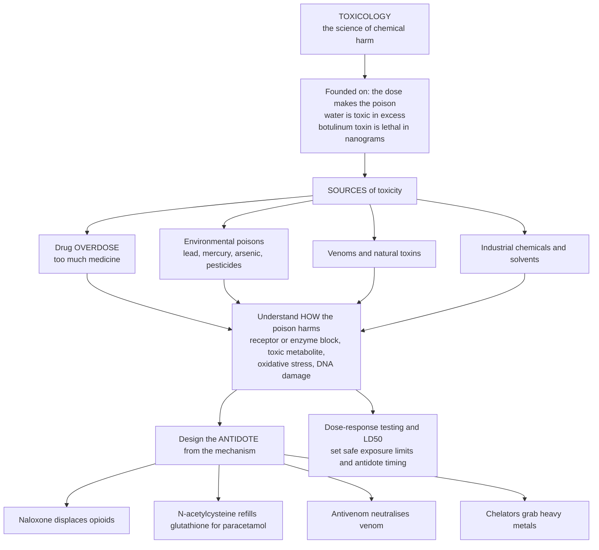

# ☠️ Toxicology and Poisoning

> [!abstract] TL;DR
> **Toxicology** is pharmacology's dark twin — the science of how chemicals **harm** living things — and it rests on the oldest principle in the field: **the dose makes the poison**. Nothing is purely safe or purely toxic; water kills in gallons and botulinum toxin kills in nanograms, so what matters is *dose*. Toxicology studies the full spectrum of chemical harm — drug **overdoses**, environmental poisons (lead, mercury, pesticides), **venoms**, and industrial chemicals — and asks two questions: *how* does a poison damage the body, and *how much* exposure is safe (the **dose-response**, the **LD50**, the threshold). Its most beautiful payoff is the **antidote**: understand a poison's mechanism and you can often design a rescue — **naloxone** knocks opioids off their receptors, **N-acetylcysteine** rescues paracetamol overdose by refilling the liver's depleted defenses, **antivenoms** neutralize snake toxins, and **chelators** grab and remove heavy metals. Poisoning is where pharmacology meets emergency medicine, forensic science, and environmental protection — the completion of the picture of drugs as dose-dependent double-edged swords.

---

## Intuition

**Analogy — "the dose makes the poison."** Coined by the Renaissance physician Paracelsus around 1538 and still exactly true, this is the founding law of toxicology: there are no safe substances and no poisonous substances, only safe and poisonous *doses*. Drink water by the gallon fast enough and it dilutes your blood salts until your brain swells; breathe pure oxygen at high pressure and it damages your lungs; yet botulinum toxin, the deadliest molecule known, erases wrinkles in microgram specks. Every chemical lives on a dose axis, harmless at the low end and lethal at the high end — the only question is *where* the harm begins.

Now flip the coin. If toxicology is the science of how chemicals harm, then its life-saving mirror image is the **antidote** — a treatment that specifically counters a poison's mechanism. This is the deep, satisfying logic of the field: **if you understand exactly *how* a poison harms, you can often design the rescue.** An opioid overdose kills by over-stimulating brain receptors that switch off breathing; **naloxone** is a molecule shaped to physically shove the opioid off those receptors and restore breath within seconds. A paracetamol (acetaminophen) overdose destroys the liver by generating a toxic byproduct that burns through the liver's chemical shield; **N-acetylcysteine** refills that shield before the damage becomes irreversible. A snakebite injects enzymes that dissolve tissue and clot blood; **antivenom** is antibodies raised to bind and neutralize exactly those toxins. Lead and mercury jam essential enzymes; **chelators** are molecular claws that grab the metal atoms and carry them out in the urine. Understand the harm, and the cure often follows from it — which is why toxicology completes pharmacology, turning the study of how chemicals hurt us into the science of how to save people who have been hurt.

---

## How It Works

### Core Mechanics

1. **The fundamental law — dose-response.** Toxicity is not a property, it is a *relationship* between dose and effect. Plot the fraction of a population harmed against dose and you get a rising **S-curve**; below a **threshold** almost no one is harmed, above it almost everyone is. This is the same sigmoid used throughout pharmacology, now measuring damage instead of benefit — the quantitative face of "the dose makes the poison."
2. **Measuring potency of harm.** The classic single number is the **LD50** — the *median lethal dose*, the dose that kills half a test population (a highly toxic substance has a tiny LD50, its curve shoved far left). Softer, more useful cousins are the **TD50** (median *toxic* dose, half show a defined adverse effect) and the **NOAEL** (No Observed Adverse Effect Level — the highest dose at which nothing harmful is seen), which anchors safe-exposure limits.
3. **Routes and duration matter.** The same chemical behaves differently swallowed, inhaled, injected, or absorbed through skin, and differently over time: **acute** exposure is a single large hit (an overdose, a gas leak), while **chronic** exposure is small doses accumulating for months or years (lead in old paint, mercury in fish) — often with entirely different target organs and symptoms.
4. **Branches — where poisons come from.** Clinical toxicology handles **drug overdose and poisoning** (therapeutic drugs taken in excess); **environmental / occupational** toxicology handles heavy **metals** (lead, mercury, arsenic), pesticides, solvents, and air pollutants; and there are the **natural toxins and venoms**, plus **forensic** toxicology, which reconstructs what killed someone from the chemistry left behind.
5. **Mechanisms — how poisons actually harm.** A short list covers most: (a) **receptor / enzyme disruption** — organophosphate pesticides irreversibly inhibit *acetylcholinesterase* so acetylcholine floods synapses, and *cyanide* blocks cytochrome c oxidase, halting the mitochondrial electron transport chain so cells cannot use oxygen; (b) **reactive / toxic metabolites** — paracetamol is converted by the liver into **NAPQI**, which depletes protective glutathione and then attacks liver cells; (c) **oxidative stress**; (d) **DNA damage / carcinogenesis**; and (e) **target-organ toxicity** — the liver, kidney, brain, and heart absorb most of the harm because they are where drugs concentrate and metabolize.
6. **The rational counter — antidotes and treatment.** General management is decontamination (limit further absorption), **supportive care** (keep the airway, breathing, and circulation going while the body clears the poison), and enhancing elimination. Layered on top are **specific antidotes** that exploit the known mechanism: **naloxone** (opioid-receptor antagonist), **N-acetylcysteine** (glutathione precursor, for paracetamol), **atropine plus pralidoxime** (for organophosphates), **flumazenil** (benzodiazepines), **antivenoms**, and **chelators** such as EDTA and dimercaprol (heavy metals). Each is a piece of mechanistic reasoning turned into a drug.
7. **Testing and regulation.** Toxicity is assessed in preclinical dose-ranging studies, and exposure limits are set by **risk assessment** = dose-response *combined with* likely exposure, then divided by conservative safety factors — the same logic that underlies drug safety limits and environmental chemical regulation.

### Flow / Architecture



---

## Key Concepts

**Secondary (the big picture).** Toxicology is the study of how chemicals harm the body — and its golden rule is **the dose makes the poison**: anything can be safe in a small amount and deadly in a large one (even water). Poisons come from lots of places — too much of a medicine (an **overdose**), metals like lead and mercury, pesticides, snake **venom**, and industrial chemicals. Scientists measure how poisonous something is with the **LD50**, the dose that would be lethal to half of a group. The wonderful flip side is the **antidote**: a specific treatment that fights a particular poison. If doctors know exactly how a poison works, they can often reverse it — **naloxone** instantly wakes up someone who has overdosed on opioids by pushing the drug off its target; **N-acetylcysteine** saves the liver after a paracetamol overdose; **antivenom** cancels snake venom; and **chelators** are molecules that grab poisonous metals and remove them from the body.

**Undergraduate (the machinery).** Toxicology quantifies harm as a **dose-response** relationship: the cumulative fraction of a population showing an all-or-none endpoint (toxicity, death) traces a sigmoid in log-dose, summarized by the **LD50 / TD50** (median lethal / toxic dose) and bounded below by the **NOAEL** (threshold). **Potency of harm** (how far left the curve sits) is separate from the **route** (oral, inhaled, dermal, parenteral — each with different bioavailability) and the **duration** (acute single-dose vs chronic accumulation, which often hit different target organs). Toxic **mechanisms** organize the field: **receptor/enzyme inhibition** (organophosphates → acetylcholinesterase; cyanide → cytochrome c oxidase / the electron transport chain), **bioactivation to reactive metabolites** (paracetamol → **NAPQI** via CYP2E1, depleting **glutathione** and causing centrilobular hepatic necrosis — the leading cause of acute liver failure in the West), **oxidative stress**, **genotoxicity/carcinogenesis**, and **target-organ toxicity** (hepato-, nephro-, neuro-, cardiotoxicity). **Antidote logic** flows directly from mechanism: competitive receptor antagonism (**naloxone** for opioids, **flumazenil** for benzodiazepines), substrate/cofactor repletion (**N-acetylcysteine** replenishing glutathione), physiological or enzymatic counter-measures (**atropine** blocking muscarinic overload plus **pralidoxime** reactivating acetylcholinesterase in organophosphate poisoning), immune neutralization (**antivenoms**), and chelation (**EDTA**, **dimercaprol/BAL**, **DMSA** forming excretable coordination complexes with lead, mercury, arsenic). Overarching management is the **ABC** of decontamination, supportive care, and enhanced elimination, with the specific antidote as the mechanistic bonus.

**Graduate (the subtleties and limits).** The dose-response idealization hides real complications. **Toxicokinetics** governs the *time window* for rescue: an antidote works only while the toxic process is reversible — N-acetylcysteine is near-perfect if given before NAPQI has exhausted glutathione (roughly within 8 hours), and much weaker once hepatocyte necrosis is established, so the treatment nomogram is a race against metabolism, not a fixed dose. **Antidote pharmacokinetic mismatch** is a recurring trap: naloxone's half-life (~30–90 min) is *shorter* than many opioids (methadone, extended-release oxycodone), so a patient reversed once can slide back into respiratory depression — **re-narcotization** — as the antidote clears faster than the poison. **Hormesis** — biphasic dose-response where low doses stimulate or protect while high doses harm — breaks the monotonic curve for essential elements (selenium, iron, copper, vitamins A and D), whose risk curve is **U-shaped**: deficiency harms at the low end, toxicity at the high end, with a safe window between. **Interspecies extrapolation** limits the LD50 (metabolism differs, so a rodent lethal dose is a crude human guide — regulators divide by 10–1000-fold uncertainty factors). **Toxicant interactions** (additive, synergistic, potentiation) mean mixtures are not the sum of parts — ethanol and paracetamol, or ethanol induction of CYP2E1, shifts the toxic threshold. And some antidotes are themselves double-edged: **flumazenil** can precipitate seizures in benzodiazepine-dependent or mixed overdoses, so the mechanistic elegance of "reverse the receptor" must be weighed against the whole clinical picture. Modern **risk assessment** formalizes all of this as *hazard × exposure*, replacing single thresholds with probabilistic benchmark-dose modeling that propagates the uncertainty explicitly.

---

## Python Demo

```python
# Toxicology & antidotes in four pictures (numpy + matplotlib only):
#   (a) DOSE-RESPONSE & LD50 -- toxicity (fraction harmed) vs dose for a HIGHLY toxic
#       substance (curve far left, tiny LD50) vs a LOW-toxicity one (curve far right),
#       marking each LD50 and a NOAEL / safe threshold. "The dose makes the poison."
#   (b) HORMESIS / U-shaped risk -- even a BENEFICIAL substance (an essential nutrient)
#       is harmful when DEFICIENT and harmful when TOXIC, with a safe window between.
#   (c) ANTIDOTE MECHANISM -- N-acetylcysteine (NAC) for paracetamol: cumulative liver
#       injury over time WITH vs WITHOUT the antidote, and the treatment window.
#   (d) TOXICOKINETICS + NALOXONE -- opioid effect (respiratory depression) over time;
#       naloxone slams it down, but its short half-life risks RE-NARCOTIZATION.
import numpy as np
import matplotlib.pyplot as plt

def sigmoid_frac(dose, d50, slope):
    """Cumulative fraction of a population harmed (0..1) at a given dose."""
    return 1.0 / (1.0 + np.exp(-slope * (np.log10(dose) - np.log10(d50))))

fig, ax = plt.subplots(2, 2, figsize=(14, 9.5))

# ---------------- (a) dose-response & LD50 ----------------
dose = np.logspace(-2, 4, 700)                 # mg/kg, log-spaced
tox_high = sigmoid_frac(dose, d50=0.5,   slope=6)   # highly toxic: tiny LD50
tox_low  = sigmoid_frac(dose, d50=800.0, slope=6)   # low toxicity: large LD50
ax[0, 0].plot(dose, tox_high, color="tab:red",  lw=2.4, label="Highly toxic (LD50 = 0.5)")
ax[0, 0].plot(dose, tox_low,  color="tab:blue", lw=2.4, label="Low toxicity (LD50 = 800)")
for d50, col in [(0.5, "tab:red"), (800.0, "tab:blue")]:
    ax[0, 0].axvline(d50, color=col, ls="--", alpha=0.6)
    ax[0, 0].axhline(0.5, color="grey", ls=":", alpha=0.5)
ax[0, 0].axvspan(1e-2, 0.02, color="green", alpha=0.15)
ax[0, 0].text(0.012, 0.75, "NOAEL /\nthreshold", color="green", fontsize=8, ha="center")
ax[0, 0].set_xscale("log")
ax[0, 0].set_xlabel("Dose (mg/kg, log scale)")
ax[0, 0].set_ylabel("Fraction of population harmed")
ax[0, 0].set_title("(a) Dose-response & LD50\n'the dose makes the poison'")
ax[0, 0].legend(loc="center right", fontsize=8)

# ---------------- (b) hormesis: U-shaped risk of an essential nutrient ----------------
d = np.logspace(-1, 3, 700)                    # intake (arbitrary units)
deficiency = sigmoid_frac(d, d50=3.0,  slope=-5)     # harm from too LITTLE (falls with dose)
toxicity   = sigmoid_frac(d, d50=200.0, slope=5)     # harm from too MUCH (rises with dose)
total_risk = deficiency + toxicity
safe_dose  = d[np.argmin(total_risk)]
ax[0, 1].plot(d, deficiency, color="tab:orange", lw=2, ls="--", label="Harm from deficiency")
ax[0, 1].plot(d, toxicity,   color="tab:red",    lw=2, ls="--", label="Harm from toxicity")
ax[0, 1].plot(d, total_risk, color="black",      lw=2.6,        label="Total risk (U-shaped)")
ax[0, 1].axvline(safe_dose, color="tab:green", lw=2)
ax[0, 1].text(safe_dose*1.1, 1.4, f"safe optimum\n~{safe_dose:.0f}", color="tab:green", fontsize=8)
ax[0, 1].set_xscale("log")
ax[0, 1].set_xlabel("Intake of an essential substance (log scale)")
ax[0, 1].set_ylabel("Relative risk of harm")
ax[0, 1].set_title("(b) Hormesis: even good things\nare toxic at high dose")
ax[0, 1].legend(loc="upper center", fontsize=8)

# ---------------- (c) antidote: NAC prevents paracetamol liver injury ----------------
t   = np.linspace(0, 24, 481)                  # hours after overdose
dt  = t[1] - t[0]
tau = 5.0                                       # NAPQI-generating drug decays (h)
napqi_rate = 12.0 * np.exp(-t / tau)            # toxic metabolite produced each hour
t_treat = 6.0                                   # NAC given at hour 6 (within the window)

GSH0, base_synth, nac_synth = 100.0, 1.0, 14.0  # glutathione pool & resynthesis rates
def simulate(with_nac):
    gsh, injury = GSH0, 0.0
    inj_curve = np.empty_like(t)
    for i, ti in enumerate(t):
        synth = nac_synth if (with_nac and ti >= t_treat) else base_synth
        produced = napqi_rate[i] * dt
        detox = min(produced, gsh)              # NAPQI neutralised by available GSH
        gsh = max(0.0, gsh - detox + synth * dt)
        injury += (produced - detox)            # unneutralised NAPQI -> hepatocyte injury
        inj_curve[i] = injury
    return inj_curve
inj_wo, inj_w = simulate(False), simulate(True)
failure = 20.0                                  # threshold: acute liver failure
ax[1, 0].plot(t, inj_wo, color="tab:red",   lw=2.4, label="No antidote")
ax[1, 0].plot(t, inj_w,  color="tab:green", lw=2.4, label="With N-acetylcysteine")
ax[1, 0].axhline(failure, color="darkred", ls=":", lw=1.8, label="Liver-failure threshold")
ax[1, 0].axvline(t_treat, color="tab:green", ls="--", alpha=0.6)
ax[1, 0].text(t_treat + 0.3, 2, "NAC given", color="tab:green", fontsize=8)
ax[1, 0].set_xlabel("Hours after paracetamol overdose")
ax[1, 0].set_ylabel("Cumulative liver injury (a.u.)")
ax[1, 0].set_title("(c) Antidote mechanism\nNAC refills glutathione, halts injury")
ax[1, 0].legend(loc="center right", fontsize=8)

# ---------------- (d) toxicokinetics: naloxone reversal & re-narcotization ----------------
tt   = np.linspace(0, 6, 600)                   # hours
T_op = 4.0                                       # long-acting opioid half-life proxy
opioid_effect = 100.0 * np.exp(-tt / T_op)      # respiratory depression, untreated
t_nal, T_nal, Kd, N0 = 1.0, 0.6, 30.0, 120.0    # naloxone: given at 1 h, SHORT half-life
nal_level = np.where(tt >= t_nal, N0 * np.exp(-(tt - t_nal) / T_nal), 0.0)
active_frac = 1.0 - nal_level / (nal_level + Kd) # fraction of opioid effect still active
eff_treated = opioid_effect * active_frac
apnea = 60.0                                     # danger threshold (respiratory arrest)
ax[1, 1].plot(tt, opioid_effect, color="tab:red",  lw=2.4, label="No antidote")
ax[1, 1].plot(tt, eff_treated,   color="tab:green", lw=2.4, label="Naloxone at 1 h")
ax[1, 1].axhline(apnea, color="darkred", ls=":", lw=1.8, label="Respiratory-arrest threshold")
ax[1, 1].axvline(t_nal, color="tab:green", ls="--", alpha=0.6)
ax[1, 1].annotate("re-narcotization\n(naloxone wears off)", xy=(3.2, 42), xytext=(3.1, 78),
                  fontsize=8, color="darkorange",
                  arrowprops=dict(arrowstyle="->", color="darkorange"))
ax[1, 1].set_xlabel("Hours after overdose")
ax[1, 1].set_ylabel("Opioid effect (respiratory depression)")
ax[1, 1].set_title("(d) Toxicokinetics + naloxone\nreversal, then rebound risk")
ax[1, 1].legend(loc="upper right", fontsize=8)

plt.tight_layout()
plt.show()

print(f"(a) highly-toxic LD50 = 0.5 mg/kg vs low-toxicity LD50 = 800 mg/kg "
      f"({800/0.5:.0f}x difference in potency of harm)")
print(f"(b) U-shaped risk minimised near intake = {safe_dose:.0f} (the safe window)")
print(f"(c) peak injury  no antidote = {inj_wo.max():.1f}  vs  with NAC = {inj_w.max():.1f} "
      f"(threshold {failure:.0f})")
print(f"(d) naloxone drops effect below the arrest threshold, but rebounds toward "
      f"{eff_treated[-1]:.0f} as it clears -> watch for re-narcotization")
```

**What to notice.** *Panel (a)* is "the dose makes the poison" as an equation: two substances, identical curve *shape*, but the highly toxic one's LD50 sits 1600× to the left — potency of harm is just *where* the sigmoid crosses. *Panel (b)* is the graduate twist — an essential nutrient's risk is **U-shaped**: harmful when deficient, harmful when toxic, safe only in a window, which is why "toxic" and "beneficial" are never absolute labels. *Panel (c)* is antidote logic made visible: without N-acetylcysteine the toxic metabolite exhausts glutathione and cumulative liver injury blows past the failure threshold; give NAC inside the window and the same overdose stays safely flat. *Panel (d)* is the toxicokinetic sting in the tail — naloxone crushes the opioid effect below the respiratory-arrest line almost instantly, but because the antidote clears faster than a long-acting opioid, the effect creeps back up (**re-narcotization**), the single most important reason overdose patients are observed rather than sent home after one dose.

---

## Real-World Applications

> **Example — paracetamol (acetaminophen) overdose and N-acetylcysteine.** Paracetamol overdose is the leading cause of acute liver failure in the US and UK. In therapeutic doses the drug is safely conjugated; in overdose those pathways saturate and the enzyme CYP2E1 diverts more drug into the reactive metabolite **NAPQI**, which consumes the liver's **glutathione** and then binds and kills hepatocytes. **N-acetylcysteine** is the mechanistic antidote — it is a cysteine donor that replenishes glutathione (and provides alternative sulfhydryl targets), neutralizing NAPQI. Its effectiveness is exquisitely time-dependent: near-total protection if started within ~8 hours, before glutathione is exhausted, which is why treatment is guided by a timed blood-level nomogram rather than the swallowed dose.

> **Example — opioid overdose and naloxone.** Opioids kill by over-activating mu-opioid receptors in the brainstem, suppressing the drive to breathe. **Naloxone** is a competitive opioid-receptor *antagonist* with higher affinity than most agonists — it physically displaces the opioid and restores breathing within seconds to minutes. It is the backbone of overdose reversal and, as intranasal Narcan, a public-health tool now carried by first responders and bystanders. Its clinical catch is pharmacokinetic: naloxone's short duration means patients who took long-acting opioids (methadone, sustained-release formulations, fentanyl analogues) can relapse into respiratory depression once it wears off — the reason for prolonged observation and sometimes continuous infusion.

> **Example — organophosphate poisoning: atropine plus pralidoxime.** Organophosphate pesticides and nerve agents (sarin) irreversibly inhibit **acetylcholinesterase**, so acetylcholine floods synapses and causes the classic cholinergic crisis (salivation, bronchorrhea, bradycardia, seizures). The two-drug antidote attacks two ends of the mechanism: **atropine** blocks the muscarinic receptors downstream to dry secretions and support the heart, while **pralidoxime** reactivates the poisoned enzyme itself — but only before it "ages" into a permanently bound form, another race against time.

> **Example — heavy-metal poisoning and chelation.** Lead, mercury, and arsenic poison by binding sulfhydryl groups on essential enzymes and, for lead, disrupting heme synthesis and neurodevelopment. **Chelators** — EDTA (calcium disodium), **dimercaprol (BAL)**, and oral **DMSA (succimer)** — are molecules with multiple metal-binding sites that form stable, water-soluble **coordination complexes** with the metal ion, converting a tissue-bound poison into an excretable one cleared by the kidney. This is coordination chemistry deployed as medicine.

> **Example — envenomation and antivenom.** Snake, spider, and scorpion venoms are cocktails of enzymes and toxins (hemotoxins that destroy tissue and clotting, neurotoxins that paralyze). **Antivenom** is a preparation of antibodies (raised in horses or sheep against the specific venom) that bind and neutralize those toxins — the most direct expression of the "understand the harm, build the counter" principle, and the reason antivenoms are species- and region-specific.

---

## Common Pitfalls

- **Thinking substances are "safe" or "toxic" as fixed labels.** They are not — every chemical is both, at different doses. "Non-toxic" always means *at ordinary exposure*; the dose makes the poison, and even water, oxygen, and essential nutrients have a toxic upper end (the U-shaped hormesis curve).
- **Confusing the antidote's half-life with the poison's.** The most dangerous overdose mistake in this note's demo: reversing a long-acting opioid with short-acting naloxone and assuming the job is done. **Re-narcotization** kills patients who were "successfully" treated, which is why observation, not a single dose, is the standard — and the same mismatch logic applies to many antidotes.
- **Missing the treatment window.** Antidotes act on a *process in progress*; once irreversible damage is done, the mechanistic cure loses its power. N-acetylcysteine is near-perfect early and far weaker once hepatic necrosis is established — timing, driven by toxicokinetics, is often more important than dose.
- **Extrapolating LD50 across species as if it were a human number.** Metabolism differs between rodents and humans, so an animal LD50 is a crude ranking, not a human lethal dose — regulators apply large uncertainty factors precisely because the curves are not the same.
- **Treating a specific antidote as harmless.** Antidotes are drugs with their own toxicity and contraindications — **flumazenil** can trigger seizures in benzodiazepine-dependent or mixed overdoses, and aggressive naloxone can precipitate acute withdrawal. The elegant mechanism must always be weighed against the whole patient.
- **Assuming mixtures add up simply.** Toxicant interactions can be synergistic or potentiating; chronic alcohol induces CYP2E1 and lowers the paracetamol dose that becomes hepatotoxic, so a "safe" dose on paper is not safe in every physiology.
- **Reading this as medical or dosing advice.** This note explains the **science** of how chemicals harm and how antidotes are reasoned out. It is educational content, **not** guidance for treating any individual poisoning, overdose, or exposure — real cases are emergencies managed by clinicians and poison-control services.

---

## Related Concepts

**Within this vault (Section 06 and beyond, prose references).** Toxicology is the shadow side of *Dose-Response and Therapeutic Index* — the very same sigmoid and the same "dose makes the poison" law, now measuring the *toxic* half of the curve (TD50, LD50) rather than the therapeutic half. It is the applied clinical face of *Preclinical Development and Toxicology*, which runs animal toxicity studies to find the NOAEL and safety margin before a drug ever reaches a human, and it deepens *Drug Safety, Pharmacovigilance and Adverse Effects*, extending the study of adverse effects to their frank extreme — overdose and poisoning. Its mechanistic core leans on *Drug Metabolism, Interactions and Polypharmacy* (bioactivation to reactive metabolites like NAPQI, and the enzyme induction that shifts toxic thresholds) and on *Analgesics, Anesthetics and Anti-Inflammatory* (opioids and paracetamol, the two most consequential overdose stories in medicine). These are sibling notes within the Pharmacology vault, referenced here in prose.

**Across the vault (Glob-verified links).**

- [[Health_Nutrition_and_Longevity/06_Public_Health_and_Prevention/Environmental_Health_and_Toxicology|Environmental Health and Toxicology]] — the population/environmental view of the same science: chronic exposure to metals, pollutants, and pesticides, and the risk-assessment logic that sets safe limits. This pharmacology note is its overdose-and-antidote complement.
- [[Clinical_Medicine/03_Metabolic_Endocrine_and_Renal/Liver_and_Gastrointestinal_Disease|Liver and Gastrointestinal Disease]] — the target organ of hepatotoxicity: the centrilobular necrosis and acute liver failure that paracetamol/NAPQI causes, and why the liver bears the brunt of drug metabolism gone wrong.
- [[Clinical_Medicine/01_Foundations_of_Disease_and_Pathophysiology/Cellular_Injury_and_Adaptation|Cellular Injury and Adaptation]] — the cell-level mechanisms of poisoning: reactive-oxygen injury, glutathione depletion, ATP failure, and the reversible-to-irreversible transition that defines an antidote's window.
- [[Biology/03_Metabolism_and_Bioenergetics/Oxidative_Phosphorylation|Oxidative Phosphorylation]] — the exact target cyanide poisons: blocking cytochrome c oxidase halts the electron transport chain, so cells cannot use oxygen (histotoxic hypoxia) — a textbook enzyme-inhibition mechanism.
- [[Chemistry/03_Inorganic_Chemistry/Coordination_Chemistry_and_Ligand_Field_Theory|Coordination Chemistry and Ligand Field Theory]] — the chemistry behind chelation therapy: multidentate ligands (EDTA, dimercaprol) form stable coordination complexes with heavy-metal ions, converting a tissue-bound poison into an excretable one.

---

## Review Questions

1. **(Secondary)** Explain "the dose makes the poison" using water or oxygen as an example. Why can something be both a helpful nutrient and a poison?
2. **(Secondary)** What is an antidote, and why does knowing *how* a poison works help doctors design one? Give two examples (opioid overdose and paracetamol overdose) and say what each antidote does.
3. **(Undergraduate)** Define **LD50** and **NOAEL** and explain how each appears on a toxicity dose-response curve. Why does a "highly toxic" substance have a small LD50, and what does that mean about where its curve sits?
4. **(Undergraduate)** Paracetamol is safe in therapeutic doses but destroys the liver in overdose. Walk through the mechanism (saturation → CYP2E1 → NAPQI → glutathione depletion → necrosis) and explain *precisely* how N-acetylcysteine interrupts it and why timing matters so much.
5. **(Graduate)** A patient who overdosed on a long-acting opioid is revived with naloxone and looks fine. Why is discharging them dangerous? Use the concept of **antidote–poison pharmacokinetic mismatch** and re-narcotization in your answer.
6. **(Graduate)** Contrast the **monotonic** toxicity curve of a synthetic poison with the **U-shaped (hormetic)** dose-response of an essential element like selenium. How does hormesis complicate the idea of a single "safe threshold," and what does it imply for setting exposure limits and interpreting the LD50?

---

## Sources

- Klaassen, C. D. (ed.). *Casarett & Doull's Toxicology: The Basic Science of Poisons* (McGraw-Hill) — dose-response, LD50/NOAEL, mechanisms of toxicity, target-organ toxicology, and heavy metals.
- Nelson, L. S. et al. (eds.). *Goldfrank's Toxicologic Emergencies* (McGraw-Hill) — clinical toxicology, overdose management, and specific antidotes (naloxone, N-acetylcysteine, atropine/pralidoxime, chelators, antivenoms).
- Timbrell, J. *Principles of Biochemical Toxicology* (CRC Press) — bioactivation, reactive metabolites (NAPQI), glutathione, and mechanisms at the biochemical level.
- Katzung, B. G. *Basic and Clinical Pharmacology* — chapters on the management of the poisoned patient and specific antidotes.

---

#pharmacology #toxicology #poisoning #antidotes #LD50
