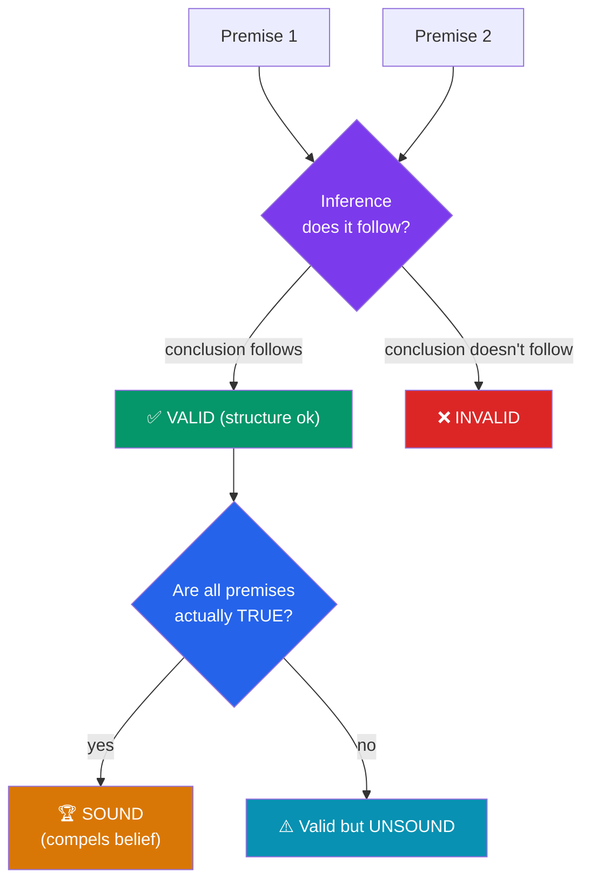

# ⚙️ Arguments and Logic

> [!abstract] TL;DR
> An **argument**, in the logical sense, is a set of statements (**premises**) offered in support of another statement (the **conclusion**) — not a quarrel. Its quality is judged along two independent axes: **validity** (does the conclusion *follow* from the premises?) and **truth** (are the premises actually true?). A **valid** argument whose premises are all true is **sound** — and only sound arguments compel belief. Reasoning comes in three families: **deductive** (conclusion guaranteed if premises hold), **inductive** (conclusion made probable by evidence), and **abductive** (inference to the best explanation). Understanding these distinctions — especially that a valid argument can have a false conclusion and a true conclusion can come from a bad argument — is the single most important skill in philosophy.

## Intuition — analogy first

Think of an argument as **a bridge, and logic as the engineering that checks it**.

A bridge has two ways to fail. First, the *design* can be flawed — the load doesn't actually transfer to the supports, so no matter how good the materials, it collapses. Second, the *materials* can be rotten — a perfect design built from crumbling steel falls anyway. **Validity** is about the design: does the "load" (the truth of the premises) actually transfer to the far side (the conclusion)? **Soundness** requires both: a good design *and* good materials.

This is why the two most common reasoning mistakes are symmetrical. Some people accept a conclusion because the premises are true, without checking that they actually connect (bad design, good materials). Others reject a conclusion because a premise is false, without noticing the reasoning was airtight — meaning if they *fix* the premise, they must accept the conclusion (good design, bad materials). Logic teaches you to inspect the design and the materials **separately**, because a bridge is only trustworthy when both hold.

---

## How It Works — The Anatomy of an Argument

Every argument decomposes into premises and a conclusion, and every argument is then routed through two independent checks — validity (structure) and truth (content) — before it earns the verdict "sound."



The diagram encodes the golden rule: **structure first, then content.** Check whether the conclusion *would* follow *if* the premises were true (validity). Only then ask whether the premises *are* true (soundness). Reversing the order — deciding validity by whether you like the conclusion — is the root of most fallacies (see [[Logical_Fallacies]]).

## Key Concepts

### Premises, Conclusions, and Indicator Words

A **premise** is a statement offered as a reason; a **conclusion** is the statement the premises are meant to support. In natural language they are flagged by **indicator words**:

- **Premise indicators:** *because, since, for, given that, as, follows from*
- **Conclusion indicators:** *therefore, thus, hence, so, it follows that, consequently*

Reconstructing an argument means putting it into **standard form** — premises listed, conclusion last — and often making a **suppressed (enthymematic) premise** explicit. "Socrates is mortal because he's human" hides the premise "All humans are mortal."

### Validity vs. Soundness — the Central Distinction

| Term | Definition | Key feature |
|---|---|---|
| **Valid** | *If* all premises are true, the conclusion *must* be true. Impossible for premises true and conclusion false. | About **form/structure** only |
| **Invalid** | The premises could all be true while the conclusion is false. | Structural failure |
| **Sound** | Valid **and** all premises actually true. | Form **and** content |
| **Unsound** | Either invalid, or has at least one false premise. | |

Crucial consequences that trip up almost everyone:

- **A valid argument can have a false conclusion** — if a premise is false. ("All birds can fly; penguins are birds; therefore penguins can fly" is *valid* but unsound.)
- **A valid argument can have all true parts and still be badly used** — validity is about the *guarantee*, not the current truth-values.
- **A true conclusion does not make an argument good.** "Grass is green; therefore the Earth orbits the Sun" has a true conclusion via a non-argument.

Only **soundness** licenses belief. Validity is necessary but not sufficient.

### Deductive vs. Inductive vs. Abductive

| Type | Relation of premises to conclusion | If premises true, conclusion is... | Example |
|---|---|---|---|
| **Deductive** | Conclusion *contained in* premises | **Guaranteed** (valid) | All men are mortal; Socrates is a man; ∴ Socrates is mortal |
| **Inductive** | Conclusion *generalized/projected* from evidence | **Probable** (strong/weak) | The sun has risen every day; ∴ it will rise tomorrow |
| **Abductive** | Conclusion is the *best explanation* of the data | Plausible, defeasible | The lawn is wet; rain best explains it; ∴ it rained |

- **Deductive** arguments aim at *validity*: the conclusion adds no information beyond the premises (it is **non-ampliative**), which is exactly why it's certain.
- **Inductive** arguments are **ampliative** — they say more than the premises strictly contain, trading certainty for new content. They are graded as **strong** or **weak**, never "valid." A strong inductive argument with true premises is called **cogent**.
- **Abductive** reasoning (inference to the best explanation, C.S. Peirce) is how detectives, doctors, and scientists reason: choose the hypothesis that, if true, would best explain the observations. It is defeasible — a better explanation can overturn it.

> [!note] Validity/soundness vs. strength/cogency
> Use **valid/sound** *only* for deductive arguments and **strong/cogent** *only* for inductive ones. Calling an inductive argument "valid" is a category error.

### The Syllogism

The **categorical syllogism** (Aristotle) is the classic deductive form: two premises and a conclusion, each relating categories via *all*, *some*, *no*.

```
All men are mortal.        (major premise)
Socrates is a man.         (minor premise)
∴ Socrates is mortal.      (conclusion)
```

Validity depends purely on **form**, so we can test it by substitution. "All *M* are *P*; all *S* are *M*; ∴ all *S* are *P*" is valid for *any* categories. But watch the **fallacy of the undistributed middle**: "All dogs are animals; all cats are animals; ∴ all dogs are cats" — invalid, because "animals" never links dogs to cats. The syllogism was the first formal proof that reasoning could be checked *mechanically*, independent of content.

### A Glance at Truth-Functional (Propositional) Logic

Modern logic replaces categories with whole **propositions** (P, Q) combined by **connectives**, each defined by a **truth table**:

| Connective | Symbol | English | True when... |
|---|---|---|---|
| Negation | ¬P | "not P" | P is false |
| Conjunction | P ∧ Q | "P and Q" | both true |
| Disjunction | P ∨ Q | "P or Q" | at least one true |
| Conditional | P → Q | "if P then Q" | false only when P true, Q false |

The **conditional** P → Q is the workhorse of argument. Two valid forms and two fallacies pair up around it:

- **Modus ponens** (valid): P → Q; P; ∴ Q.
- **Modus tollens** (valid): P → Q; ¬Q; ∴ ¬P.
- **Affirming the consequent** (invalid): P → Q; Q; ∴ P. — a formal fallacy.
- **Denying the antecedent** (invalid): P → Q; ¬P; ∴ ¬Q. — a formal fallacy.

Because these forms are purely mechanical, their validity can be *proven* with a truth table, which is why propositional logic underpins mathematics and digital circuits alike. See [[Logical_Fallacies]] for the two fallacies above.

## Arguments & Examples

**Worked case 1 — separating validity from truth.**
> P1: All fish live in water.
> P2: Whales live in water.
> C: Therefore, whales are fish.

Is this valid? *No.* The form is "All F are W; x is W; ∴ x is F" — affirming a shared property doesn't establish category membership (undistributed middle). Notice the conclusion happens to be *false* too, but even if we picked an example where the conclusion were true, the argument would still be **invalid**, because validity is about the guarantee, not the current truth-values. This is the exercise philosophy drills relentlessly: judge the *structure* blind to the *content*.

**Worked case 2 — valid but unsound.**
> P1: If the streets are wet, it rained.
> P2: The streets are wet.
> C: Therefore, it rained.

The *form* is modus ponens — perfectly **valid**. But P1 is **false** (a street cleaner, a burst pipe, or sprinklers also wet streets), so the argument is **unsound** and its conclusion isn't established. The fix is to attack the *premise*, not the logic. Recognizing that the reasoning is valid tells you exactly *where* to push.

**Worked case 3 — the three inference types on one problem.** You come home to a wet lawn.
- *Deductive:* "Whenever the sprinkler runs the lawn gets wet; the sprinkler ran; ∴ the lawn is wet." Certain, but you already needed to know the sprinkler ran.
- *Inductive:* "Every past morning after fog the lawn was damp; there was fog; ∴ it's probably damp today." Probable, ampliative, could fail.
- *Abductive:* "The lawn is wet and so is the car, but the neighbor's dry driveway isn't — rain best explains the pattern; ∴ it rained." The inference that *adds the most understanding*, but defeasible if you learn the sprinkler covers the car too.

The same evidence supports three different *kinds* of conclusion with three different strengths. Knowing which kind you're making tells you how much confidence you're entitled to.

## Common Pitfalls / Misconceptions

- **Confusing validity with truth.** Validity is a property of *structure*; truth is a property of *statements*. An argument can be valid with false premises and a false conclusion, or invalid with all true statements. Always ask "does it *follow*?" separately from "is it *true*?"
- **Thinking a true conclusion vindicates the argument.** Reaching a correct answer by faulty reasoning is luck, not proof. The conclusion of an invalid or unsound argument is simply *unsupported*, even if independently true.
- **Calling inductive arguments "valid" or "invalid."** Induction is graded by *strength* and *cogency*, not validity. Demanding deductive certainty from inductive evidence (e.g., "you can't *prove* the sun will rise") misunderstands the standard.
- **Ignoring suppressed premises.** Most everyday arguments hide a premise. Reconstructing it often reveals the real point of disagreement — or a hidden falsehood doing all the work.

## Related Concepts

- [[_MOC_Phil_Introduction|↑ Section MOC]]
- [[Logical_Fallacies]] — Systematic ways validity and cogency fail, including affirming the consequent
- [[Critical_Thinking_and_Reasoning]] — Applying validity, soundness, and induction as everyday habits
- [[What_Is_Philosophy]] — Argument as philosophy's defining method
- [[The_Branches_of_Philosophy]] — Logic as the branch that underwrites all the others
- Cross-vault: [[_MOC_Mathematics_Master]] (formal/symbolic logic and proof), [[Bayesian_Statistics]] (Mathematics — quantifying inductive strength)

## Review Questions

1. Construct an argument that is **valid but unsound**, and a different one that is **invalid but has a true conclusion**. For each, explain precisely which axis (structure or content) fails and why the conclusion is therefore not established.
2. Distinguish **modus tollens** from **denying the antecedent** using a single conditional (e.g., "If it's a dog, then it's a mammal"). Show one valid inference and one fallacious one, and explain the difference.
3. You observe that a patient has a fever, cough, and fatigue. Give a **deductive**, an **inductive**, and an **abductive** inference you might draw, and explain what degree of confidence each licenses.

## Sources

- Copi, I., Cohen, C., & McMahon, K. (2016). *Introduction to Logic* (14th ed.). Routledge
- Hurley, P. (2018). *A Concise Introduction to Logic* (13th ed.). Cengage
- Aristotle. *Prior Analytics* (the theory of the syllogism), trans. Robin Smith
- Peirce, C.S. (1878). "Deduction, Induction, and Hypothesis." *Popular Science Monthly*

#philosophy #logic #reasoning #argumentation #validity #soundness #deduction #induction
