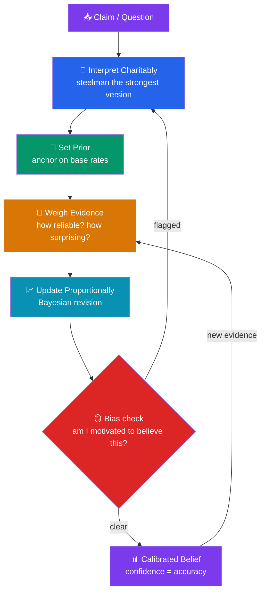

# 🧠 Critical Thinking and Reasoning

> [!abstract] TL;DR
> **Critical thinking** is the disciplined practice of forming and revising beliefs in proportion to reasons and evidence. It is built from a small set of powerful habits: the **principle of charity** and **steelmanning** (engage the strongest version of a view), **Occam's razor** (prefer the simplest adequate explanation), correctly locating the **burden of proof**, and **Bayesian updating** (revising confidence proportionally as evidence arrives, anchored on **base rates**). These tools sit on top of formal logic (see [[Arguments_and_Logic]]) but add what logic alone cannot: **calibration** — matching your confidence to your accuracy — and constant vigilance against the **cognitive biases** that quietly corrupt reasoning from the inside. Critical thinking is less a body of knowledge than a set of trained reflexes, and its central virtue is **intellectual humility**.

## Intuition — analogy first

Think of your beliefs as **a portfolio of investments, and evidence as market news**.

A naive investor holds each stock at 0% or 100% conviction — they either "believe" a company or "reject" it — and they lurch, buying everything after one good headline and dumping it all after one bad one. A skilled investor holds **positions with sized confidence**: 70% here, 20% there. When news arrives, they don't flip; they *update* — nudging the position up or down by how surprising and how reliable the news is, always relative to what they already knew (the **prior**, or base rate). They also protect against their own psychology — the urge to chase what's hot (availability bias) or to hold a loser to avoid admitting a mistake (sunk-cost, confirmation bias).

Critical thinking is exactly this for beliefs. Confidence is a *dial*, not a *switch*. Evidence *moves* the dial; it rarely justifies flipping it. And the biggest threat to the portfolio is not bad data but the investor's own biases — which is why the discipline is half logic, half self-management.

---

## How It Works — The Critical Thinking Loop

Good reasoning runs a cycle: interpret a claim charitably, set a prior confidence anchored on base rates, weigh the evidence for its reliability, update proportionally, and check the whole process for bias before repeating.

Two features distinguish this from mere logic. First, the **bias-check gate**: even a valid inference can be driven by motivated reasoning, so the loop explicitly inspects *why* you find a conclusion attractive. Second, the loop **never terminates in certainty** — beliefs are held as calibrated probabilities, permanently open to the next piece of evidence.

## Key Concepts

### The Principle of Charity and Steelmanning

The **principle of charity** (associated with Donald Davidson and N.L. Wilson) says: when interpreting an argument, attribute the most rational, coherent version consistent with what was said. You engage the position at its *strongest*, not its most vulnerable.

**Steelmanning** is charity turned into a practice: before criticizing a view, restate it so well that its proponent would say "yes, that's exactly what I mean — even better." It is the exact opposite of the **straw man** fallacy (see [[Logical_Fallacies]]). Steelmanning is not concession; it is *strategic*: defeating the strongest version is the only way to actually refute a position, and it protects you from wasting effort on a distortion. A related discipline is the **ideological Turing test** (Bryan Caplan): can you state your opponent's view so convincingly that neutral judges can't tell you're not a believer?

### Occam's Razor (Parsimony)

**Occam's razor** — attributed to the medieval logician **William of Ockham** — advises: *entia non sunt multiplicanda praeter necessitatem* ("entities should not be multiplied beyond necessity"). Among explanations that account equally well for the data, prefer the one with the fewest assumptions or posited entities.

Crucial refinements often missed:
- It is a **tie-breaker among adequate explanations**, not a demand for the *absolutely* simplest theory. A simpler theory that explains *less* does not win.
- It is a **defeasible heuristic**, not a law of nature — reality is sometimes complicated. It shifts the *burden*, saying "don't add complexity without earning it."
- Its modern cousin appears in statistics as penalizing overfitting (e.g., regularization, information criteria).

### Burden of Proof

The **burden of proof** (*onus probandi*) lies on the party making a positive or non-default claim. "The one who asserts must prove." Key points:

- **Absence of disproof is not proof.** "You can't prove it's false" doesn't establish a claim (the **appeal to ignorance** fallacy).
- Extraordinary claims require proportionately strong evidence (Laplace/Sagan) — a direct consequence of Bayesian reasoning: a very low prior needs very strong evidence to shift.
- Shifting the burden onto the skeptic ("prove there are *no* invisible dragons") is a rhetorical trick, not an argument.

### Bayesian Updating and Probabilistic Reasoning

Rational belief is not binary but **graded**, and the mathematically correct way to revise it is **Bayes' theorem**:

$$ P(H \mid E) = \frac{P(E \mid H)\, P(H)}{P(E)} $$

- **P(H)** — the **prior**: your confidence in the hypothesis *before* the evidence (this is the base rate).
- **P(E | H)** — the **likelihood**: how expected the evidence is *if* the hypothesis is true.
- **P(H | E)** — the **posterior**: your updated confidence *after* the evidence.

The single most important lesson is **base-rate anchoring**: how much evidence *moves* you depends heavily on where you *started*. Neglecting the prior — treating a "95% accurate" test as meaning "95% chance you have the disease" — is **base-rate neglect**, one of the most consequential reasoning errors (see the worked example below and [[Cognitive_Biases]]).

| Concept | Meaning | Failure mode |
|---|---|---|
| **Prior / base rate** | Confidence before evidence | Base-rate neglect |
| **Likelihood** | Fit of evidence to hypothesis | Confusing P(E\|H) with P(H\|E) (prosecutor's fallacy) |
| **Posterior** | Updated confidence | Anchoring, insufficient adjustment |
| **Calibration** | Confidence matches long-run accuracy | Overconfidence |

### Calibration and Intellectual Virtue

**Calibration** means that among all the things you're 70% sure of, about 70% turn out true. Most people (and especially experts) are **overconfident** — their 90% confidence intervals capture the truth far less than 90% of the time. Calibration can be *trained* with rapid, honest feedback (a core finding of Philip Tetlock's **Superforecasting** research).

Underlying all of this are the **intellectual virtues**: humility (willingness to be wrong), open-mindedness paired with rigor, honesty about the strength of one's evidence, and the courage to follow an argument where it leads. Critical thinking is as much *character* as *technique*.

### The Interplay of Logic and Cognitive Bias

Formal logic tells you which inferences are *valid*; it says nothing about the **motivated, automatic distortions** that decide which arguments you *bother* to accept. Confirmation bias makes you seek confirming evidence; the availability heuristic inflates vivid risks; the anchoring effect skews your prior. A logically flawless mind running on biased inputs still reaches biased conclusions. Critical thinking therefore adds **debiasing procedures** on top of logic:

- *Consider the opposite* — actively argue the other side (counters confirmation bias).
- *Pre-mortems* — assume your belief is wrong and explain why (counters overconfidence).
- *Reference-class forecasting* — use base rates from similar cases (counters base-rate neglect).
- *Outsource to structure* — checklists and decision rules beat willpower.

See [[Cognitive_Biases]] and [[_MOC_Psychology_Master]] for the full catalogue; the key point is that **awareness of a bias does not remove it — procedure does.**

## Arguments & Examples

**The mammogram problem — base rates in action.** A disease affects **1%** of women in a screened group. A test is **90%** sensitive (catches 90% of real cases) and has a **9%** false-positive rate. A woman tests positive. What's the probability she has the disease? Intuition says ~90%. Bayes says otherwise. Out of 1,000 women:
- 10 have the disease → ~9 test positive (true positives).
- 990 are healthy → ~89 test positive (false positives, 9% of 990).
- Positives total ≈ 98; true positives ≈ 9.
- **P(disease | positive) ≈ 9 / 98 ≈ 9%.**

The correct answer is about **9%, not 90%** — because the low base rate (prior) dominates. Physicians in Gerd Gigerenzer's studies routinely got this wrong by an order of magnitude. This is the concrete cost of ignoring the prior, and the single most valuable habit Bayesian reasoning installs.

**Steelmanning a view you reject (worked practice).** Suppose you think a proposed four-day work week is obviously naive. Instead of attacking the weakest slogan ("people just want to work less"), steelman it: *"Compressing or reducing hours can, in specific knowledge-work contexts, maintain output by cutting low-value meetings and reducing burnout-driven attrition; several trials report stable productivity and lower turnover."* Now you must engage the *actual* empirical claim and its scope conditions. If your objection survives *that*, it's a real objection; if it doesn't, you've learned something. Either way you've avoided the straw man and reasoned honestly.

**Occam's razor as a tie-breaker, not a bludgeon.** Two explanations for a patient's symptoms: (a) one common illness that accounts for all symptoms, or (b) three rare independent conditions that jointly do. If both fit the data equally, prefer (a) — "when you hear hoofbeats, think horses, not zebras." But note the constraint: if the single explanation *fails* to account for a key symptom, parsimony does **not** license ignoring that symptom. The razor breaks *ties*; it does not let you discard evidence to stay simple.

## Common Pitfalls / Misconceptions

- **Treating belief as binary.** "Do you believe X or not?" is often the wrong question. Rational agents hold *degrees* of confidence and update them; demanding certainty invites both dogmatism and false balance.
- **Base-rate neglect.** Focusing on how diagnostic a piece of evidence is while ignoring how rare the hypothesis was to begin with. Always ask "how likely was this *before* I saw the evidence?"
- **Confusing P(E | H) with P(H | E) — the prosecutor's fallacy.** "The DNA match probability is 1 in a million, so there's a 1-in-a-million chance he's innocent" conflates the likelihood with the posterior and ignores the base rate of potential matches.
- **Weaponizing Occam's razor and burden of proof.** "The simpler theory is mine, so I win" and "you can't disprove me, so I'm right" are rhetorical moves, not reasoning. Simplicity breaks ties; the burden falls on the *claimant*.
- **Believing awareness is enough.** Knowing about confirmation bias does not stop you from committing it. Only *procedures* (consider-the-opposite, checklists, seeking disconfirming evidence) reliably help.

## Related Concepts

- [[_MOC_Phil_Introduction|↑ Section MOC]]
- [[Arguments_and_Logic]] — The formal validity/soundness foundation critical thinking builds on
- [[Logical_Fallacies]] — The errors (esp. straw man, appeal to ignorance) these habits guard against
- [[What_Is_Philosophy]] — Critical thinking as the everyday form of the philosophical method
- Cross-vault: [[Cognitive_Biases]] (Psychology) — the systematic errors debiasing procedures counter; [[Bayesian_Statistics]] (Mathematics) — the formal machinery of updating; [[_MOC_Psychology_Master]]

## Review Questions

1. A test for a rare condition (base rate 1%) is 90% sensitive with a 9% false-positive rate. A patient tests positive. Estimate the probability they actually have the condition and explain, using the base rate, why it is far below 90%.
2. Distinguish **steelmanning** from **straw-manning** and explain why steelmanning is *strategically* advantageous even when you are trying to *defeat* a position — not merely a courtesy.
3. Occam's razor and the burden of proof are both often misused as debate-winning trump cards. For each, state the *legitimate* role it plays and describe one way it is commonly abused.

## Sources

- Tetlock, P. & Gardner, D. (2015). *Superforecasting: The Art and Science of Prediction*. Crown
- Gigerenzer, G. (2002). *Calculated Risks: How to Know When Numbers Deceive You*. Simon & Schuster
- Kahneman, D. (2011). *Thinking, Fast and Slow*. Farrar, Straus and Giroux
- Sagan, C. (1995). *The Demon-Haunted World: Science as a Candle in the Dark*. Random House

#philosophy #critical-thinking #reasoning #bayesian #occams-razor #calibration #epistemology
