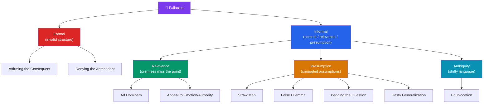

# ⚠️ Logical Fallacies

> [!abstract] TL;DR
> A **fallacy** is a pattern of reasoning that is defective — it appears to support its conclusion but does not. Fallacies split into two families. **Formal fallacies** are broken *structures*: the argument is invalid no matter what it is about (e.g., **affirming the consequent**, **denying the antecedent**). **Informal fallacies** are failures of *content, relevance, or presumption* that logical form alone cannot catch (e.g., **ad hominem**, **straw man**, **false dilemma**, **slippery slope**, **appeal to authority/emotion**, **equivocation**, **begging the question**, **hasty generalization**). Learning to name them is a defensive skill — but the point is not to shout "fallacy!" but to locate *exactly why* an argument fails so it can be repaired or rejected. Many fallacies are the argumentative twins of the cognitive biases that make them persuasive.

## Intuition — analogy first

Think of fallacies as **counterfeit currency in the marketplace of arguments**.

A counterfeit bill *looks* like real money and can buy you things — until someone inspects it. Fallacies are counterfeit reasons: they have the *appearance* of logical support and often succeed in persuading, which is exactly why they survive. And like counterfeits, they come in two grades. Some are crude — the paper is wrong, the structure is plainly invalid (formal fallacies), detectable by anyone who checks the *form*. Others are sophisticated forgeries — the bill's structure is fine, but its *backing* is fraudulent: the premises are irrelevant, question-begging, or trade on an ambiguous word (informal fallacies). You can only catch these by examining *content and context*, not form alone.

The counterfeit analogy carries one more lesson: spotting a counterfeit doesn't make the underlying claim false, just as a forged banknote doesn't mean the item for sale is worthless. An argument can be fallacious and its conclusion still true — you simply haven't been given a good reason to believe it yet (this is the **fallacy fallacy**).

---

## How It Works — Taxonomy of Fallacies

Fallacies divide first by *where* the defect lives — in the structure (formal) or in the content and use (informal). Informal fallacies then subdivide by the *kind* of failure: irrelevant premises, unwarranted presumptions, or trading on ambiguous language.



The split matters practically: **formal fallacies are caught by checking the argument's shape** (translate to P's and Q's — see [[Arguments_and_Logic]]), while **informal fallacies require understanding what the argument is *about* and how it's being *used*** — the same word, the same emotion, the same authority can be legitimate in one context and fallacious in another.

## Key Concepts

### Formal Fallacies

A **formal fallacy** is invalid purely in virtue of its logical form. The two classic conditional fallacies mirror the two valid conditional forms (modus ponens, modus tollens):

**Affirming the Consequent** — invalid:
```
If P then Q.        (If it's raining, the street is wet.)
Q.                  (The street is wet.)
∴ P.                (∴ It's raining.)   ← INVALID: sprinklers also wet the street
```

**Denying the Antecedent** — invalid:
```
If P then Q.        (If it's raining, the street is wet.)
Not P.              (It's not raining.)
∴ Not Q.            (∴ The street is not wet.)   ← INVALID: it could be wet anyway
```

Both fail because a conditional "P → Q" does **not** claim P is the *only* route to Q. Their tell is that they treat a **sufficient** condition as if it were **necessary**. Because they are structural, no amount of true content rescues them.

### Informal Fallacies of Relevance

These offer premises that, however true, do not bear on the conclusion.

- **Ad Hominem** ("to the person"): attacking the arguer instead of the argument. "You can't trust her climate claims — she flies a lot." Whether she's a hypocrite is irrelevant to whether the data are correct. (Legitimate cousin: challenging an *expert witness's* credibility on questions that genuinely turn on testimony.)
- **Appeal to Emotion** (*ad passiones*): substituting fear, pity, or outrage for reasons. "Think of the children!" as a stand-in for an actual argument.
- **Appeal to Authority** (*ad verecundiam*): citing an authority who is *not* an expert in the relevant field, or a *disputed* claim as if settled. Citing a genuine consensus of relevant experts is **not** a fallacy — it's reasonable; the fallacy is misusing authority.
- **Appeal to the People** (*ad populum*) / bandwagon: "Everyone believes it, so it's true."

### Informal Fallacies of Presumption

These smuggle in an unwarranted assumption.

- **Straw Man**: distorting an opponent's view into a weaker version, then refuting *that*. "You want some gun regulation? So you want to disarm all law-abiding citizens." The opposite virtue is **steelmanning** (see [[Critical_Thinking_and_Reasoning]]).
- **False Dilemma** (false dichotomy): presenting two options as exhaustive when more exist. "Either we cut all funding or we go bankrupt."
- **Slippery Slope**: claiming one step inevitably leads to an extreme outcome *without* establishing the causal chain. (Not always fallacious — only when the intermediate links are unsupported.)
- **Begging the Question** (*petitio principii*): assuming the conclusion in the premises; circular reasoning. "God exists because the Bible says so, and the Bible is true because it's God's word." (Note: in logic, "begging the question" means *circular reasoning*, not "raising the question.")
- **Hasty Generalization**: inferring a broad rule from an unrepresentative or too-small sample. "My two flights were late, so this airline is always late." The inductive twin of good sampling gone wrong (see [[Arguments_and_Logic]] on inductive strength).
- **Loaded Question**: a question with a built-in presumption. "Have you stopped cheating on tests?" — either answer concedes the charge.

### Informal Fallacies of Ambiguity

- **Equivocation**: using a word in two different senses within one argument. "A feather is *light*; what is *light* cannot be dark; ∴ a feather cannot be dark." "Light" shifts from *weight* to *brightness*.
- **Amphiboly**: ambiguity from grammar/sentence structure rather than a single word.

### Master Reference Table

| Fallacy | Type | The defect in one line | Quick example |
|---|---|---|---|
| **Affirming the consequent** | Formal | Treats sufficient as necessary | Wet street ⇒ it rained |
| **Denying the antecedent** | Formal | Not-P ⇒ not-Q, but Q has other causes | Not raining ⇒ street is dry |
| **Ad hominem** | Informal (relevance) | Attacks the person, not the claim | "He's a hypocrite, so he's wrong" |
| **Straw man** | Informal (presumption) | Refutes a distorted version | Exaggerate then knock down |
| **False dilemma** | Informal (presumption) | Fake "only two options" | "Us or chaos" |
| **Slippery slope** | Informal (presumption) | Unsupported inevitability chain | "Allow X and society collapses" |
| **Appeal to authority** | Informal (relevance) | Wrong/irrelevant authority | "A celebrity endorses it" |
| **Appeal to emotion** | Informal (relevance) | Feelings replace reasons | "Think of the children!" |
| **Equivocation** | Informal (ambiguity) | Word shifts meaning mid-argument | "light" = weight then brightness |
| **Begging the question** | Informal (presumption) | Conclusion assumed in premise | Circular scripture argument |
| **Hasty generalization** | Informal (presumption) | Too-small/biased sample | "Two bad flights ⇒ always late" |

### Fallacies and Cognitive Biases — the Two-Sided Coin

A fallacy is a defect in an *argument*; a **cognitive bias** is a defect in *thinking* that makes such arguments feel convincing. They are two sides of one coin:

| Fallacy | Enabling bias |
|---|---|
| Hasty generalization | Availability heuristic (vivid cases dominate) |
| Appeal to authority | Authority bias / conformity |
| Confirmation-flavored cherry-picking | Confirmation bias |
| Slippery slope | Affect heuristic, catastrophizing |
| Anecdote-driven persuasion | Base-rate neglect |

This is why naming fallacies is necessary but not sufficient: the bias supplies the *pull* that makes the counterfeit pass. See [[Cognitive_Biases]] and [[_MOC_Psychology_Master]].

## Arguments & Examples

**Diagnosing a real op-ed paragraph.** Consider: *"Professor Lee opposes the new highway. But Lee is a known cyclist who hates cars, so obviously his traffic study is biased. Either we build this highway or our town dies. Do you want our town to die?"* Three fallacies stack up:
1. **Ad hominem / genetic** — discrediting the *study* by pointing at Lee's cycling, which is irrelevant to whether his traffic model is correct.
2. **False dilemma** — "build the highway or the town dies" ignores public transit, phased development, etc.
3. **Loaded question / appeal to emotion** — "Do you want our town to die?" forces fear over analysis.
The correct move is not to declare the *conclusion* false but to note that **no valid reason has yet been given** for it — the highway might still be a good idea, argued honestly.

**The fallacy fallacy (a meta-argument).** Suppose someone argues "Vaccines are safe because a movie star says so." That's an appeal to (irrelevant) authority. But it would be a mistake to conclude "therefore vaccines are *unsafe*." Rejecting a bad argument only removes *that* support; the conclusion's truth must be judged on the actual evidence. Treating a spotted fallacy as disproof of the conclusion is itself the **argument-from-fallacy** fallacy — a favorite trap for people who have just learned the vocabulary.

**Why slippery slope isn't *always* fallacious.** "If we legalize voluntary euthanasia with strict safeguards, involuntary euthanasia will inevitably follow" is fallacious *if* no mechanism links the steps. But "raising interest rates 0.25% now makes a further raise next quarter more likely, because the central bank signals a tightening trajectory" is a *legitimate* incremental argument — the links are causally supported. The lesson: a fallacy label depends on whether the **connecting premises are actually defended**, which is why informal fallacies require judgment, not a checklist.

## Common Pitfalls / Misconceptions

- **The "fallacy fallacy."** Identifying a fallacy shows the *argument* fails, not that its *conclusion* is false. A poorly argued true claim is still true — it just hasn't been supported yet.
- **Fallacy-hunting as a debate weapon.** Naming a fallacy is not a mic-drop. Used to dodge engagement ("that's just a straw man!") it becomes a conversation-stopper. The goal is to *understand and repair* reasoning, not to score points.
- **Assuming every appeal to authority or emotion is fallacious.** Deferring to genuine expert consensus is rational; emotions can be *relevant* (compassion is apt in ethics). The fallacy is when they *replace* reasons or the authority is irrelevant.
- **Confusing "begs the question" with "raises the question."** In logic it means *circular reasoning* — assuming what you set out to prove — not "prompts the question."
- **Treating slippery slope and false dilemma as automatically fallacious.** They are fallacious only when the crucial premises (the causal chain, the exhaustiveness of options) are asserted without support.

## Related Concepts

- [[_MOC_Phil_Introduction|↑ Section MOC]]
- [[Arguments_and_Logic]] — Validity, modus ponens/tollens, and the valid forms these fallacies mimic
- [[Critical_Thinking_and_Reasoning]] — Steelmanning and the principle of charity, the antidotes to straw-manning
- [[What_Is_Philosophy]] — Argument as the discipline these errors corrupt
- Cross-vault: [[Cognitive_Biases]] (Psychology) — the biases that make fallacies persuasive; [[_MOC_Psychology_Master]]

## Review Questions

1. Write out **affirming the consequent** and **denying the antecedent** using the same conditional. Explain, in terms of *sufficient vs. necessary conditions*, exactly why each is invalid.
2. Give a case where an **appeal to authority is legitimate** and one where it is **fallacious**. What single feature distinguishes them?
3. Explain the **"fallacy fallacy."** Then construct a short argument that commits an informal fallacy yet has a true conclusion, and say what a careful reasoner should conclude about that claim.

## Sources

- Copi, I., Cohen, C., & McMahon, K. (2016). *Introduction to Logic* (14th ed.), chs. on informal fallacies. Routledge
- Walton, D. (2008). *Informal Logic: A Pragmatic Approach* (2nd ed.). Cambridge University Press
- Hamblin, C.L. (1970). *Fallacies*. Methuen
- Kahneman, D. (2011). *Thinking, Fast and Slow*. Farrar, Straus and Giroux (biases behind fallacies)

#philosophy #logic #fallacies #critical-thinking #ad-hominem #straw-man #equivocation
