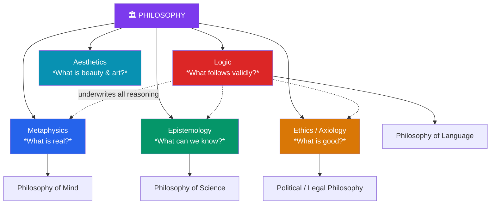

# 🧭 The Branches of Philosophy

> [!abstract] TL;DR
> Philosophy is traditionally divided into a handful of **core branches**, each defined by a fundamental question: **metaphysics** (what is real?), **epistemology** (what can we know?), **ethics** and the broader **axiology** (what should we do and value?), **logic** (what follows from what?), and **aesthetics** (what is beauty and art?). Around this core sits a ring of **"philosophy of X"** fields — of mind, science, language, mathematics, religion, law — which apply philosophical method to the foundations of a particular domain. The branches are not sealed compartments: an ethical claim rests on metaphysical assumptions about persons, an epistemological theory presupposes logic, and every branch is disciplined by argument. This map is the table of contents for the entire subject.

## Intuition — analogy first

Think of philosophy as **a great university and its departments**.

A university has no single subject — it *is* the set of its faculties. Yet the departments are not islands: the medical school leans on chemistry, chemistry leans on physics, physics leans on mathematics, and everyone shares the library. Philosophy is organized the same way. There is no one thing philosophers study; there is a **division of labor** across questions. Metaphysics is the department of *what exists*, epistemology the department of *what we can know about it*, ethics the department of *what to do given both*. And just as a university spawns interdisciplinary institutes (bioethics, cognitive science), philosophy spawns "philosophy of X" fields wherever another discipline hits a conceptual foundation it cannot examine with its own tools.

The crucial point: you cannot fully work in one department without borrowing from the others. Ask "what should I do?" (ethics) and you immediately need "what kind of thing is a person?" (metaphysics) and "how do I know the consequences?" (epistemology). The branches are a *map*, not a set of walls.

---

## How It Works — The Map of the Branches

At the center are the classical branches inherited from **Aristotle**, who first systematically divided knowledge. Radiating outward are the applied "philosophy of X" fields. Logic underwrites all of them, because every branch reasons.

The dotted arrows mark that **logic is not one branch among equals** so much as the connective tissue: metaphysics, epistemology, and ethics all advance by argument, and an argument is only as good as its logic. This is why an introductory sequence pairs "the branches" with logic before anything else.

## Key Concepts

### The Five Core Branches

| Branch | Central Question | Sample Problems | Key Figures |
|---|---|---|---|
| **Metaphysics** | What is ultimately real? | Free will vs. determinism, mind & body, universals, time, personal identity, God | Aristotle, Leibniz, Kant, Kripke |
| **Epistemology** | What can we know, and how? | Definition of knowledge, skepticism, justification, perception, a priori knowledge | Descartes, Hume, Gettier |
| **Ethics (Axiology)** | What should we do / value? | Right & wrong, the good life, duties, virtue, value theory | Aristotle, Kant, Mill |
| **Logic** | What reasoning is valid? | Validity, soundness, formal systems, paradoxes, inference | Aristotle, Frege, Russell |
| **Aesthetics** | What is beauty and art? | Nature of art, taste, the sublime, aesthetic judgment | Kant, Hume, Danto |

**Metaphysics** ("after the *Physics*," from the ordering of Aristotle's works) studies the nature of existence itself — what kinds of things there are and what they are ultimately like. Sub-areas include **ontology** (what exists), **cosmology** (the structure of the world), and questions of causation, possibility, and identity.

**Epistemology** (Greek *episteme*, "knowledge") asks what knowledge is and whether we have any. The classic analysis — knowledge as **justified true belief** — was famously challenged by Edmund Gettier in 1963, launching a still-running research program. See [[Arguments_and_Logic]] for the reasoning tools it relies on.

**Ethics** is often placed under the wider heading **axiology** (the theory of value), which also covers non-moral value (the beautiful, the useful). Ethics itself divides into **metaethics** (what *is* goodness? are moral facts real?), **normative ethics** (which general theory tells us what to do — consequentialism, deontology, virtue ethics?), and **applied ethics** (concrete issues: abortion, AI, war).

**Logic** is the study of correct inference — of what conclusions follow from what premises. Because it is purely formal, it borders mathematics; modern symbolic logic (Frege, Russell) is arguably the deepest advance in the field since Aristotle's syllogistic. See [[Arguments_and_Logic]] and [[Logical_Fallacies]].

**Aesthetics** examines beauty, art, and taste: Is beauty in the object or the eye of the beholder? What makes something art? Can aesthetic judgments be correct or incorrect?

### The "Philosophy of X" Fields

Wherever a special science reaches a question it cannot answer by its own methods, a hybrid field appears:

| Field | Foundational Questions It Examines |
|---|---|
| **Philosophy of Mind** | What is consciousness? Is the mind the brain? Can machines think? |
| **Philosophy of Science** | What makes a theory scientific? What is a law of nature? Is science approaching truth? |
| **Philosophy of Language** | How do words refer to things? What is meaning? |
| **Philosophy of Mathematics** | Do numbers exist? What makes mathematical truths certain? |
| **Political Philosophy** | What legitimizes state authority? What is justice? |
| **Philosophy of Religion** | Does God exist? Is faith rational? The problem of evil |

These are not lesser fields — much of the most active contemporary philosophy happens here, precisely because they interface with live scientific and social questions.

### How the Branches Interconnect

The branches form a **dependency web**, not a hierarchy:

- **Ethics presupposes metaphysics.** Whether you have moral duties may depend on whether you have free will (a metaphysical question).
- **Epistemology presupposes logic.** Any theory of justification uses inference, whose validity is logic's domain.
- **Metaphysics presupposes epistemology.** Claims about what is real are only as good as our means of knowing it — Kant argued we must first ask *what we can know* before asking *what is*.
- **Philosophy of science bridges epistemology and metaphysics.** It asks both *how* we know scientific claims and *what* they say the world contains.

This interconnection is why philosophers resist over-specialization: a serious position in one branch almost always commits you to positions in others.

## Arguments & Examples

**One question, five branches — "Should a self-driving car swerve to kill one to save five?"** A single practical dilemma detonates into every branch at once:

- **Ethics:** Is it right to sacrifice one to save five? (Consequentialism says maybe yes; deontology says using a person as mere means is wrong.)
- **Metaphysics:** Is the car an *agent* that can be responsible, or just a mechanism? Are the passengers and pedestrians *persons* with equal moral status?
- **Epistemology:** How does the car *know* five lives are at stake — how reliable is its perception under uncertainty?
- **Logic:** Does the argument "minimize deaths → swerve" actually follow, or does it smuggle in a hidden premise?
- **Aesthetics** (a stretch, but real in design ethics): does the *way* we frame such choices shape public trust?

No single department can answer the question. That is the practical demonstration of why the branches are a division of labor over one connected problem-space.

**Aristotle's original division (a worked case of mapping knowledge).** Aristotle split knowledge into the **theoretical** (physics, mathematics, "first philosophy"/metaphysics — knowledge for its own sake), the **practical** (ethics, politics — knowledge for action), and the **productive** (rhetoric, poetics — knowledge for making). Almost every modern branch descends from this taxonomy. Notice the method: he did not decree the branches arbitrarily but *derived* them from the different **aims** of inquiry (to know, to act, to make) — an argument, not a stipulation. That is how a good map earns its lines.

**Where a branch was born from a paradox.** Gettier's 1963 two-page paper described cases where someone has a justified true belief that intuitively isn't knowledge (e.g., you correctly believe "someone in the office owns a Ford" because of solid but coincidentally misleading evidence). This tiny counterexample forced epistemology to rebuild its central concept and shows how a whole sub-field can be reorganized by one well-aimed example — the same mechanism you'll meet in [[Arguments_and_Logic]].

## Common Pitfalls / Misconceptions

- **Treating the branches as sealed silos.** They are deeply interdependent; a claim in ethics typically rests on metaphysics and epistemology. The map's lines are for orientation, not walls.
- **Confusing metaphysics with the supernatural.** In philosophy, "metaphysics" means the study of the fundamental nature of reality — including thoroughly naturalistic questions like the nature of time or causation. It is not synonymous with crystals and spirits.
- **Thinking "logic" is optional or merely one topic.** Logic is presupposed by every branch because each reasons from premises to conclusions. It is closer to the grammar of the whole enterprise than to a single chapter.
- **Assuming "philosophy of X" is easier or lesser than X.** Philosophy of physics requires understanding physics *and* the conceptual questions it cannot pose to itself; these hybrid fields are often the most demanding.

## Related Concepts

- [[_MOC_Phil_Introduction|↑ Section MOC]]
- [[What_Is_Philosophy]] — The nature and method of the whole enterprise these branches divide
- [[Arguments_and_Logic]] — The logic branch, and the tool every other branch depends on
- [[Logical_Fallacies]] — How reasoning within any branch can go wrong
- [[_MOC_Metaphysics]] — Deep dive into the branch of "what is real"
- [[_MOC_Epistemology]] — Deep dive into the branch of "what we can know"
- Cross-vault: [[_MOC_Mathematics_Master]] (logic borders mathematics), [[_MOC_Psychology_Master]] (philosophy of mind borders cognitive science)

## Review Questions

1. Explain how a single applied question (e.g., "Is it wrong to lie to a dying patient?") draws on at least three different branches of philosophy. Name each branch and the specific sub-question it contributes.
2. Why might it be said that "logic is not just one branch among the others"? Support your answer by describing the role logic plays in metaphysics and epistemology.
3. What is a "philosophy of X" field, and why do such fields arise? Give one example and state a foundational question it addresses that the parent science cannot answer on its own.

## Sources

- Aristotle. *Metaphysics* (Book VI on the division of the sciences), trans. W.D. Ross
- Russell, B. (1912). *The Problems of Philosophy*. Oxford University Press
- Blackburn, S. (2008). *The Oxford Dictionary of Philosophy* (2nd ed.). Oxford University Press
- Nagel, T. (1987). *What Does It All Mean?*. Oxford University Press

#philosophy #introduction #metaphysics #epistemology #ethics #logic #aesthetics
