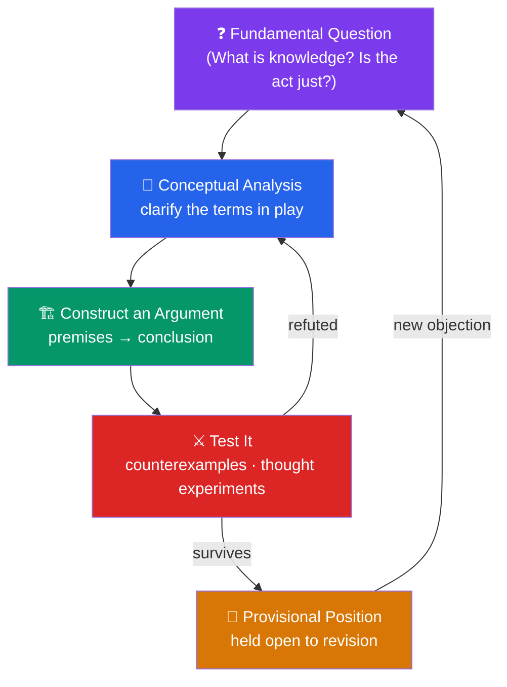

# 🦉 What Is Philosophy?

> [!abstract] TL;DR
> **Philosophy** (Greek *philosophia*, "love of wisdom") is the disciplined, rational investigation of the most fundamental questions about reality, knowledge, value, and reasoning — the questions that no empirical experiment or sacred text can settle by itself. Its method is not observation or revelation but **argument**: making assumptions explicit, analyzing concepts, and testing claims against reasons and counterexamples. It differs from **science** (which tests hypotheses against evidence) and from **religion** (which appeals to faith and authority) by relying on reason alone as its court of appeal. Bertrand Russell argued that philosophy's value lies not in providing definite answers but in enlarging our conception of what is possible and freeing the mind from "the tyranny of custom."

## Intuition — analogy first

Think of philosophy as **the operating system beneath every other discipline**.

When you use a spreadsheet, you don't think about the operating system — the OS is invisible, quietly deciding what counts as a "file," how memory is managed, what an "error" even means. It only becomes visible when something breaks or when you ask a question the application can't answer: *What is a number, really? What makes this proof valid? Is this action right?* Every science runs on assumptions it does not itself examine — physics assumes causation is intelligible, biology assumes "function" is a coherent notion, law assumes there is such a thing as responsibility. Philosophy is the discipline that boots up when you start interrogating the operating system itself.

This is why philosophy has no distinctive subject matter of its own — there is *philosophy of* physics, mind, mathematics, art, law. Its subject is the **presuppositions** of everything else, and its tool is the one thing available to anyone with no laboratory and no scripture: careful reasoning about what follows from what.

---

## How It Works — The Philosophical Method

Philosophy proceeds not by collecting data but by a recurring loop: pose a question, clarify the concepts it uses, construct arguments, hunt for counterexamples, and revise. The **dialectic** — reasoned back-and-forth — is the engine.

The loop never terminates in the way a calculation does. A philosophical "result" is a **well-defended position** — an argument that has survived the strongest objections its critics can raise — not a fact filed away forever. This is why ancient questions remain live: not because no progress is made, but because progress consists in sharper questions, cleaner distinctions, and mapped-out logical space rather than settled decrees.

## Key Concepts

### The Meaning of "Love of Wisdom"

The word *philosophia* is traditionally credited to **Pythagoras**, who reportedly declined to be called *sophos* ("a wise man") and preferred *philosophos* ("a lover of wisdom") — one who *seeks* wisdom without presuming to possess it. This built humility into the enterprise from the start. Philosophy is an activity of pursuit, not a body of doctrine to be memorized.

**Socrates** (470–399 BCE) gave this its sharpest form: *"The unexamined life is not worth living."* His method — the **elenchus** — was to question people who claimed to know what justice, courage, or piety were, exposing contradictions in their beliefs. Socrates claimed to know only that he knew nothing (**Socratic ignorance**), making the recognition of one's own ignorance the beginning of wisdom.

### What Philosophy Actually Does

| Activity | Description | Example |
|---|---|---|
| **Conceptual analysis** | Clarify what a concept means and what it entails | What exactly *is* "free will"? Does it require the ability to have done otherwise? |
| **Questioning assumptions** | Make hidden presuppositions explicit and examine them | Science assumes nature is uniform — but how do we *know* the future will resemble the past? |
| **Constructing arguments** | Build reasoned cases from premises to conclusions | If knowledge is justified true belief, then Gettier cases show that isn't sufficient |
| **Testing with counterexamples** | Find cases that break a proposed definition or principle | "Theft is always wrong" — but stealing bread to prevent starvation? |
| **Drawing distinctions** | Separate ideas that ordinary language conflates | *Necessary* vs. *sufficient*; *cause* vs. *reason*; *a priori* vs. *a posteriori* |

### The Perennial Questions

Certain questions recur across every culture and century because they resist empirical settlement. They map roughly onto the branches (see [[The_Branches_of_Philosophy]]):

- **Metaphysics** — What is ultimately real? Do we have free will? What is time? Is there a God?
- **Epistemology** — What can we know? What distinguishes knowledge from mere opinion? Can we be certain of anything?
- **Ethics** — How should we live? What makes an action right or wrong? What is a good life?
- **Mind** — What is consciousness? How is the mind related to the body?
- **Meaning** — Does life have meaning, and must it be given by something outside us?

### How Philosophy Differs from Science and Religion

| Dimension | Philosophy | Science | Religion |
|---|---|---|---|
| **Method** | Rational argument, analysis | Empirical testing, experiment | Faith, revelation, tradition |
| **Court of appeal** | Reasons anyone can evaluate | Observable evidence | Authority (scripture, prophet, church) |
| **Typical question** | *What is knowledge?* | *What causes disease?* | *What must I do to be saved?* |
| **How disputes resolve** | Better arguments, sharper distinctions | Reproducible data | Doctrine, community consensus |
| **Certainty offered** | Rarely — mostly better questions | Provisional, falsifiable | Often held as absolute |

These are **ideal types**, and the boundaries are porous. Science was once "natural philosophy," and it separated only when questions became answerable by experiment. Many philosophers are religious and many are not; the point is not the *content* of belief but the *warrant*: philosophy insists that a claim be defended by reasons a rational interlocutor could in principle accept, regardless of their faith.

## Arguments & Examples

**Socrates and the *Euthyphro* dilemma (a specimen of philosophical questioning).** Euthyphro claims piety is "what the gods love." Socrates asks: *Is a thing pious because the gods love it, or do the gods love it because it is pious?* If the former, "pious" is arbitrary (the gods could love anything); if the latter, piety is independent of the gods and their love doesn't *define* it. In three questions, a confident definition collapses. This is philosophy in miniature: not disproving that piety exists, but showing that a proposed *account* of it fails, forcing a better one.

**Russell's "The Value of Philosophy" (1912).** In the closing chapter of *The Problems of Philosophy*, Bertrand Russell confronts the practical person's objection: philosophy answers nothing, so what use is it? His reply:

1. **The value is in the questions, not settled answers.** As soon as a subject yields definite knowledge, it stops being philosophy and becomes a science (astronomy split from cosmology, psychology from philosophy of mind). Philosophy is the frontier of inquiry — its unanswered questions are a feature, not a bug.
2. **Philosophy enlarges the self.** The unphilosophical person is "imprisoned in the prejudices derived from common sense, from the habitual beliefs of his age or his nation." Contemplating large questions — Is the universe indifferent? Could things be radically otherwise? — frees the mind from the "tyranny of custom."
3. **It cultivates intellectual humility and openness.** By keeping alive our sense of wonder and showing familiar things as strange, philosophy makes the mind "great," fit to contemplate a universe not built around our small concerns.

> Russell's summary: we study philosophy "not for the sake of any definite answers to its questions, since no definite answers can, as a rule, be known to be true, but rather for the sake of the questions themselves."

**A thought experiment as method: the brain in a vat.** How do you *know* you are reading this on a real screen rather than being a disembodied brain fed electrical signals that simulate a screen? You cannot rule it out by looking harder — every observation would be identical. This isn't idle fantasy; it isolates a real question (see [[Arguments_and_Logic]] and epistemology): *what, if anything, grounds our knowledge of the external world?* Thought experiments are philosophy's laboratory — they test the limits of a concept by imagining the case that stresses it.

## Common Pitfalls / Misconceptions

- **"Philosophy is just opinion — everyone's view is equally valid."** Philosophy is the opposite of "anything goes." An opinion backed by a valid, sound argument outranks a bare assertion. Positions are judged by the quality of the reasons for them, and many candidate answers are decisively refuted.
- **"Philosophy never makes progress."** Whole domains graduated *out* of philosophy once they became empirically tractable — physics, biology, psychology, logic, linguistics. Within philosophy, progress shows as sharper distinctions and eliminated bad options, even when no final answer is reached.
- **"Philosophy is impractical navel-gazing."** The concepts you use daily — rights, evidence, causation, consent, the mind, personal identity — were forged and refined by philosophical work. Debates over AI ethics, medical consent, and free speech are applied philosophy.
- **"Philosophy is the same as religion or self-help."** Both may address life's big questions, but philosophy's authority is *argument open to public scrutiny*, not faith, revelation, or feeling good. It will follow an argument to an uncomfortable conclusion.

## Related Concepts

- [[_MOC_Phil_Introduction|↑ Section MOC]]
- [[The_Branches_of_Philosophy]] — The map of philosophy's sub-fields and their core questions
- [[Arguments_and_Logic]] — The machinery of reasoning that is philosophy's primary tool
- [[Critical_Thinking_and_Reasoning]] — Turning the philosophical method into everyday intellectual habits
- [[_MOC_Ancient_Greek_Philosophy]] — Socrates, Plato, and Aristotle, who founded the enterprise
- Cross-vault: [[Cognitive_Biases]] (Psychology) — the systematic errors that the examined life works against

## Review Questions

1. Explain why Russell claims philosophy is valuable "for the sake of the questions themselves." Do you find his defense persuasive, and what is the strongest objection to it?
2. Using the *Euthyphro* dilemma as your example, describe the difference between *refuting a definition* and *disproving that the thing exists*. Why does this distinction matter for how philosophy makes progress?
3. Pick one perennial question (e.g., free will, the existence of the external world) and explain why it cannot be settled by scientific experiment alone. What kind of work would settling it require?

## Sources

- Russell, B. (1912). *The Problems of Philosophy*, esp. Ch. XV "The Value of Philosophy." Oxford University Press
- Plato. *Euthyphro* and *Apology* (Socratic dialogues), trans. G.M.A. Grube
- Nagel, T. (1987). *What Does It All Mean? A Very Short Introduction to Philosophy*. Oxford University Press
- Blackburn, S. (1999). *Think: A Compelling Introduction to Philosophy*. Oxford University Press

#philosophy #introduction #metaphilosophy #socrates #love-of-wisdom
