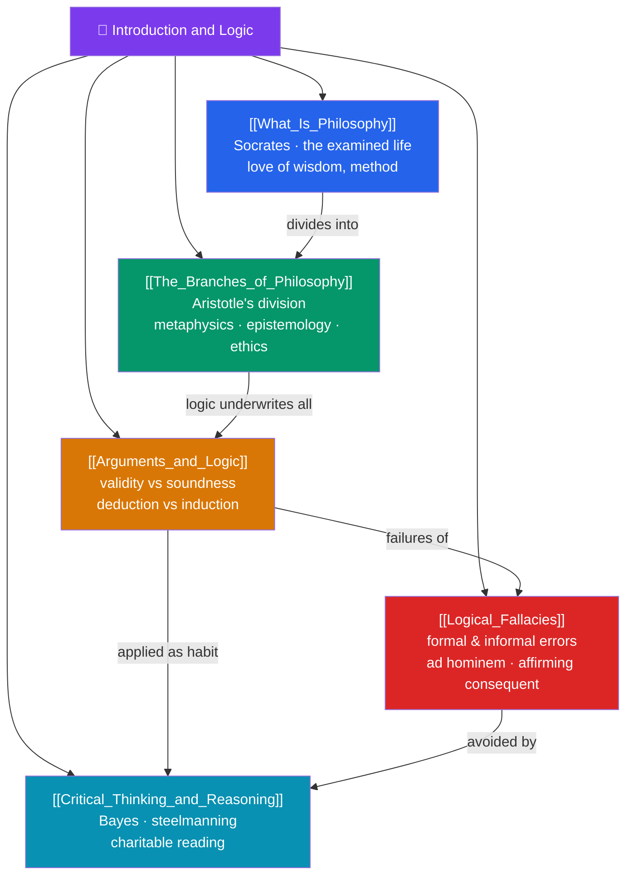

# 🗺️ Introduction and Logic — Map of Content

> [!abstract] What This Section Covers
> Philosophy begins not with answers but with the disciplined asking of questions. This section builds the toolkit every later section relies on: **What Is Philosophy** frames the enterprise itself — the love of wisdom, its method of rational argument, and why examining our assumptions matters; **The Branches of Philosophy** maps the terrain into metaphysics, epistemology, ethics, logic, and aesthetics; **Arguments and Logic** introduces the machinery of reasoning — validity, soundness, and the deduction/induction distinction; **Logical Fallacies** catalogues the formal and informal ways arguments break down; and **Critical Thinking and Reasoning** turns these tools into habits — charitable interpretation, steelmanning, and calibrated Bayesian belief. Together they teach you not what to think but how to think, so every subsequent thinker can be read with rigor.

## Concept Map

## Learning Path

1. [[What_Is_Philosophy]] — What philosophy is and is not, its method of rational argument, and why the examined life is worth living.
2. [[The_Branches_of_Philosophy]] — The classical division into metaphysics, epistemology, ethics, logic, and aesthetics, and how they interlock.
3. [[Arguments_and_Logic]] — Premises and conclusions, validity vs. soundness, and the crucial difference between deductive and inductive inference.
4. [[Logical_Fallacies]] — Formal fallacies (affirming the consequent) and informal fallacies (ad hominem, straw man, equivocation).
5. [[Critical_Thinking_and_Reasoning]] — The principle of charity, steelmanning, cognitive humility, and Bayesian updating on evidence.

## All Notes at a Glance

| Note | Difficulty | What You'll Learn |
|------|------------|-------------------|
| [[What_Is_Philosophy]] | Beginner | Definition, method, the branches, why philosophy differs from science and religion, the value of inquiry |
| [[The_Branches_of_Philosophy]] | Beginner | Metaphysics, epistemology, ethics, logic, aesthetics — the core questions of each |
| [[Arguments_and_Logic]] | Beginner → Intermediate | Premises/conclusions, validity, soundness, deduction vs induction, counterexamples |
| [[Logical_Fallacies]] | Beginner → Intermediate | Formal vs informal fallacies, ad hominem, straw man, false dilemma, equivocation, slippery slope |
| [[Critical_Thinking_and_Reasoning]] | Intermediate | Charitable reading, steelmanning, Bayesian reasoning, base rates, calibration, intellectual virtue |

## Key Questions This Section Answers

- What distinguishes philosophy from science, religion, and mere opinion?
- What makes an argument valid, and how does validity differ from truth?
- Why can a valid argument still be worthless, and when is it sound?
- What is the difference between a formal fallacy and an informal one?
- How should a rational person revise beliefs when new evidence arrives?

## Related Sections

- [[_MOC_Philosophy_Master|↑ Philosophy Master MOC]]
- [[_MOC_Ancient_Greek_Philosophy|→ Ancient Greek Philosophy]]
- Cross-vault: [[_MOC_Mathematics_Master]] (formal logic), [[Cognitive_Biases]] (Psychology), [[Bayesian_Inference]] (AI/ML)

#MOC #Philosophy #PhilIntro
