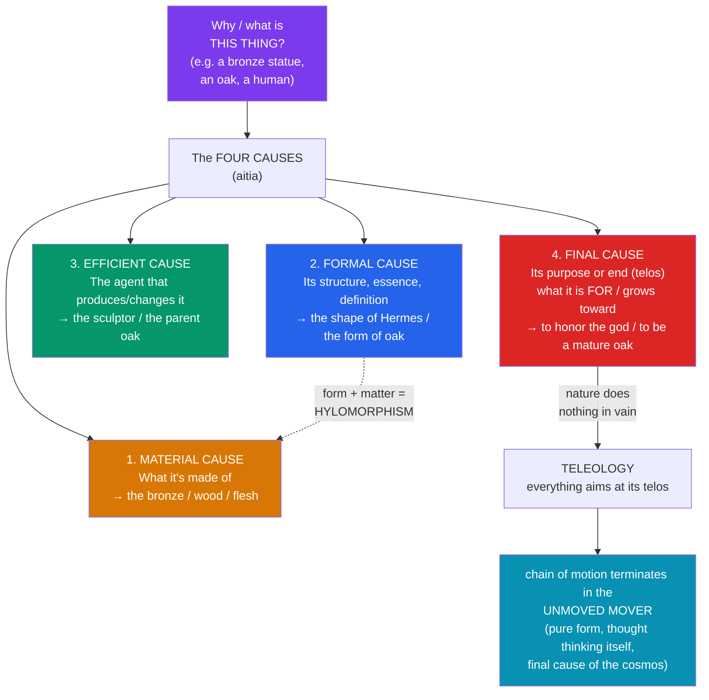

# 🦉 Aristotle

> [!abstract] TL;DR
> Aristotle (384–322 BCE) — Plato's student for twenty years, tutor to Alexander the Great, and founder of the **Lyceum** — is the most systematic philosopher of antiquity, effectively inventing **formal logic**, biology, and the vocabulary of Western metaphysics. Where Plato looked *up* to a separate realm of Forms, Aristotle looked *around*: form exists **in** things (**hylomorphism** = matter + form), and knowledge starts from **observation**. His **four causes** (material, formal, efficient, final) explain why anything is what it is; his **teleology** holds that everything has a natural end (*telos*), culminating in the **Unmoved Mover**. In ethics, the goal of life is **_eudaimonia_** (flourishing), achieved by cultivating virtues understood as a **golden mean** between extremes, guided by practical wisdom (*phronēsis*).

## Intuition — analogy first

Ask "why is this thing an oak tree?" and Plato points you *away* from the tree to a perfect Oak in another realm. Aristotle finds the answer **in the acorn on the ground in front of you**.

An acorn is not yet an oak, but it is not just any lump of matter either — it is an oak *potentially*. Given soil, water, and time, it will unfold into an oak and nothing else; that fully-developed oak is its **end (*telos*)**, already latent as a built-in program. To understand the acorn you must grasp four things: what it's made of (**matter**), the organized structure it takes on (**form**), what set it growing (**efficient cause**), and what it is *for* / growing *toward* (**final cause**). Notice you never had to leave the natural world. Aristotle is the philosopher of the biologist's gaze: the intelligibility of a thing is immanent — in its structure and its characteristic development — not exiled to a heaven of Forms.

---

## How It Works — The Four Causes

Aristotle's master tool for explanation is the doctrine of the **four causes** (*aitia*, better translated "explanatory factors" or "the four *becauses*"). To *fully* explain any substance, you must specify all four. His stock example is a bronze statue.

The **formal** and **final** causes are the most philosophically loaded: the *form* of a thing is its essence (what makes it *that kind* of thing), and for living things the form and the final cause largely coincide — a thing's *telos* is to fully realize its form. This is why Aristotle can say **nature does nothing in vain** and that a mature functioning organism explains the process that produced it.

## Key Concepts

### Hylomorphism: form and matter

Against Plato's **separate** Forms, Aristotle argues that form does not exist apart from things. Every physical **substance** (*ousia*) is a compound of **matter (*hylē*)** and **form (*morphē*)** — hence **hylomorphism**:

- **Matter** is the underlying stuff, the potential to be organized (the bronze, the wood, the body).
- **Form** is the organizing principle, structure, or essence that makes the matter *this* kind of thing (the shape of the statue, the soul of the animal).

Neither exists alone in the physical world: there is no "bronze" without *some* shape, and no statue-shape floating free of material. For living things, the **soul (*psychē*) is the form of the body** — its organizing life-principle and set of capacities (nutrition, perception, thought), not a separable ghost. This dissolves Plato's "two worlds" into one world of formed matter.

### Potentiality and actuality (answering Parmenides)

Aristotle explains **change** — which Parmenides had declared impossible — with the pair **potentiality (*dunamis*)** and **actuality (*energeia/entelecheia*)**. The acorn is *potentially* an oak and *actually* an acorn; change is the passage from potentiality to actuality. This neatly answers Parmenides: change is not being arising from sheer non-being, but a *potential* being made *actual*. It is one of the most consequential moves in metaphysics.

### The four causes and the critique of Plato

Aristotle explicitly reviews his predecessors (in *Metaphysics* I) as having each grasped one or two causes: the [[The_Presocratics|Milesians]] the *material* cause, Anaxagoras the *efficient* (Mind), and Plato the *formal* — but none the *final* cause properly, and Plato erred by making forms *separate*. His famous verdict on his teacher: **"Plato is dear to me, but dearer still is truth."** His central objections to the Theory of Forms:
- **Explanatory idleness.** Separate Forms are "useless" for explaining the being or change of sensibles — they just duplicate the world ("eternal sensibles").
- **The Third Man regress** (which Plato himself had raised).
- **Participation is an empty metaphor** ("to say that Forms are patterns and other things share in them is to use empty words and poetical metaphors").

### Teleology and the Unmoved Mover

Aristotle's physics and biology are **teleological**: natural processes are directed toward ends. But this need not imply a conscious designer — an acorn's *telos* is internal to its nature. At the cosmic scale, the chain of motion (each mover itself moved by another) cannot regress infinitely, so there must be a **first Unmoved Mover (*proton kinoun akinēton*)**: pure form, wholly actual (no unrealized potential), eternal, and immaterial. It causes motion not by pushing but as a **final cause** — as an object of love and desire draws a lover: the heavens move in eternal circles out of "desire" to imitate its perfection. Being pure actuality with nothing better to contemplate than itself, it is **"thought thinking itself" (*noēsis noēseōs*)**. Medieval philosophers (Aquinas, Maimonides, Averroes) identified it with God.

### Virtue ethics: eudaimonia and the golden mean

In the ***Nicomachean Ethics***, Aristotle asks about the highest human good. His answer is **_eudaimonia_** — "happiness," better rendered **flourishing** or **living well** — not a feeling but an **activity**: the excellent, lifelong exercise of our characteristic function.

- **The function argument (*ergon*).** Everything has a function; the good of a thing lies in performing its function well. The distinctively *human* function is **activity of the soul in accordance with reason**. So the human good is rational activity performed **excellently** (in accordance with virtue, *aretē*) over a complete life.
- **Two kinds of virtue.** **Intellectual virtues** (e.g. *sophia*, theoretical wisdom; *phronēsis*, practical wisdom) are taught; **moral/character virtues** (courage, generosity, temperance) are acquired by **habituation (*ethismos*)** — "we become just by doing just acts." Virtue is a stable *disposition (hexis)*, not a one-off act or a mere feeling.
- **The doctrine of the mean.** Each moral virtue is a **mean (*mesotēs*) between two vices**, one of excess and one of deficiency, **relative to us** and determined by reason as **the person of practical wisdom (*phronimos*)** would determine it. The mean is not a bland average but the *right* amount at the right time, toward the right person, for the right reason.

| Sphere of action/feeling | Deficiency (vice) | **Mean (virtue)** | Excess (vice) |
|---|---|---|---|
| Fear and confidence | Cowardice | **Courage** | Rashness |
| Pleasures of the body | Insensibility | **Temperance** | Self-indulgence |
| Giving money | Stinginess | **Generosity** | Prodigality |
| Honor (small scale) | Pusillanimity | **Proper ambition** | Over-ambition |
| Anger | Lack of spirit | **Even temper (patience)** | Irascibility |
| Truth about oneself | Self-deprecation | **Truthfulness** | Boastfulness |

Some actions and feelings (murder, adultery, envy) admit **no mean** — they are wrong in any degree. And the summit of *eudaimonia*, in Book X, is the life of **contemplation (*theōria*)**, the activity most proper to the divine element in us — a partial return toward Platonic intellectualism.

### Syllogistic logic: the invention of formal logic

In the collection later called the **_Organon_** ("instrument"), Aristotle founded **formal logic** — the study of valid inference by *form* alone, regardless of content. His central achievement is the **syllogism**: a deduction in which, given two premises, a conclusion follows necessarily. The stock example:

> All humans are mortal. (major premise)
> Socrates is a human. (minor premise)
> **∴ Socrates is mortal.** (conclusion)

Its validity depends only on the **form** (All M are P; S is M; ∴ S is P), not on the specific terms. Aristotle systematically classified syllogistic **figures and moods**, distinguished **valid from invalid** forms, and set out the foundational **laws of thought** — the **principle of non-contradiction** ("the same thing cannot at the same time belong and not belong to the same thing in the same respect"), which he calls the firmest of all principles, and the **excluded middle**. His logic reigned essentially unchallenged for over two millennia, until the mathematical logic of Frege and Russell in the late 19th century.

### The empiricist break from Plato

The deepest contrast with his teacher is **epistemological method**. Plato distrusts the senses and turns inward/upward to innate Forms; Aristotle holds that **knowledge begins in sense-perception** and rises by **induction (*epagōgē*)** from repeated particulars to universals — famously, "there is nothing in the intellect that was not first in the senses" (the later Scholastic formulation of his view). He was a tireless **empirical observer**, especially in biology (dissections, the *History of Animals*, marine biology on Lesbos), and insisted explanations fit the observed phenomena. Raphael's *School of Athens* captures it: Plato points **up** to the Forms; Aristotle gestures **out** toward the world.

## Arguments & Examples

**The function (*ergon*) argument for the human good.** (1) A thing's good lies in performing its characteristic function well (a good knife cuts well, a good flautist plays well). (2) The function of a human being is what is *distinctive* of humans — not nutrition (shared with plants) or perception (shared with animals) but **rational activity**. (3) Therefore the human good is the *excellent* exercise of rational activity over a complete life — i.e., *eudaimonia* as virtuous rational activity. **Objection:** the inference from "distinctive" to "good for us" is contested — many distinctively human capacities (deception, cruelty) are not obviously part of flourishing.

**Why virtue is a mean (with the archer image).** Vice can miss in many ways, virtue hits in one — "it is possible to fail in many ways, but to succeed in only one" (like an archer who can miss high, low, left, or right, but the target is single). Courage, e.g., is the disposition to feel and act between cowardice (too much fear) and rashness (too little), calibrated by reason. But the mean is **agent-relative**: the right amount of food for an Olympic athlete differs from that for a beginner. This is why virtue requires *phronēsis* — a rule-book cannot specify the mean in advance; the practically wise person perceives it in the particular situation.

**Habituation and the priority of practice (thought experiment).** Unlike sight (which we have by nature, then use), virtue is acquired by **first exercising it**: "we become builders by building and just by doing just acts." A crucial consequence: **moral education is about training desires and emotions**, not just informing the intellect. This is Aristotle's implicit reply to **Socratic intellectualism** (see [[Socrates_and_the_Socratic_Method]]) — knowing the good is not sufficient for doing it, because the appetites can pull against reason (**akrasia**, weakness of will, which Aristotle affirms is real against Socrates' denial).

**The regress argument for the Unmoved Mover.** Everything in motion is moved by something else; if that mover is itself moved, it too needs a mover. An infinite regress of *moved movers* would leave the whole chain unexplained (with no source of motion at all). Therefore there must be a first mover that is *not itself moved* — pure actuality causing motion as a final cause (an object of desire). **Objection:** modern physics (inertia; motion needs no continuous mover) removes the premise that motion requires an ongoing cause, undercutting the argument's physical basis, though its metaphysical form persists in cosmological arguments.

## Common Pitfalls / Misconceptions

- **"The golden mean means always be moderate / average."** The mean is the **right** response, which may be extreme: maximum courage in battle, maximum indignation at atrocity. It is a mean *between vices*, determined by reason and *phronēsis*, not a recipe for lukewarm middling. And some acts (murder, adultery) have no acceptable amount.
- **"Aristotle rejected forms entirely."** He rejected **separate, Platonic** Forms. Form is central to his system — it is just **immanent** (in the matter) rather than transcendent. Hylomorphism keeps form and denies its independent existence.
- **Reading teleology as requiring a designer.** For natural substances, the *telos* is **internal** to the thing's nature (the acorn's oak-hood), not imposed by an external intelligent planner. The Unmoved Mover moves as a *final* cause (an object of desire), not as a *craftsman*.
- **Treating *eudaimonia* as subjective happiness/pleasure.** It is an **objective** condition — living and acting well over a whole life — assessable from the outside, not a mood. "One swallow does not make a summer": a complete life is required, and even fortune (health, friends, resources) plays a role.
- **Thinking the syllogism is all of logic.** Aristotelian term-logic is powerful but limited — it cannot capture relational and multiply-quantified inferences ("every horse is an animal, so every horse's head is an animal's head"), which required the **predicate logic** of Frege (1879). Aristotle founded the discipline; he did not complete it.
- **Assuming his empiricism was fully modern.** He observed superbly but also relied on *a priori* teleological assumptions and made empirical errors (a heavier object falls faster; the heart, not the brain, is the seat of thought). His method mixed observation with metaphysics.

## Related Concepts

- [[_MOC_Ancient_Greek_Philosophy|↑ Section MOC]]
- [[Plato_and_the_Theory_of_Forms]] — Aristotle's teacher, whose separate Forms he rejects (Third Man; "dearer still is truth"); he relocates form *into* things
- [[Socrates_and_the_Socratic_Method]] — Aristotle credits Socrates with inductive arguments and universal definitions, but rejects the intellectualist denial of *akrasia*
- [[The_Presocratics]] — His potentiality/actuality answers Parmenides on change; *Metaphysics* I reads the Presocratics as grasping one cause each
- [[The_Sophists_and_Relativism]] — Aristotle's non-contradiction principle and objective *eudaimonia* stand against Protagorean relativism, though he takes rhetoric seriously (writing the *Rhetoric*)
- Cross-vault: [[_MOC_Logic_Master|Logic]] — Syllogistic logic as the ancestor of formal/propositional logic; [[Cognitive_Biases]] — *akrasia* and habituation in modern moral psychology; [[_MOC_History_Master]] — Alexander the Great and the Hellenistic transition

## Review Questions

1. Lay out the four causes using a concrete example, then explain why the formal and final causes tend to coincide for living things. How does the potentiality/actuality distinction let Aristotle answer Parmenides on the impossibility of change?
2. State the doctrine of the mean precisely, including the roles of habituation and *phronēsis*. Why is "just be moderate" a misreading, and why can't the mean be captured by a fixed rule?
3. Explain Aristotle's chief objections to Plato's Theory of Forms and how hylomorphism is meant to preserve what is right about forms while avoiding those problems.

## Sources

- Aristotle, *Nicomachean Ethics*, trans. Terence Irwin (2nd ed., 1999). Hackett
- Aristotle, *Metaphysics*, trans. C.D.C. Reeve (2016). Hackett
- Barnes, J. (2000). *Aristotle: A Very Short Introduction*. Oxford University Press
- Shields, C. (2007). *Aristotle*. Routledge

#philosophy #ancient-greek #aristotle #four-causes #virtue-ethics
