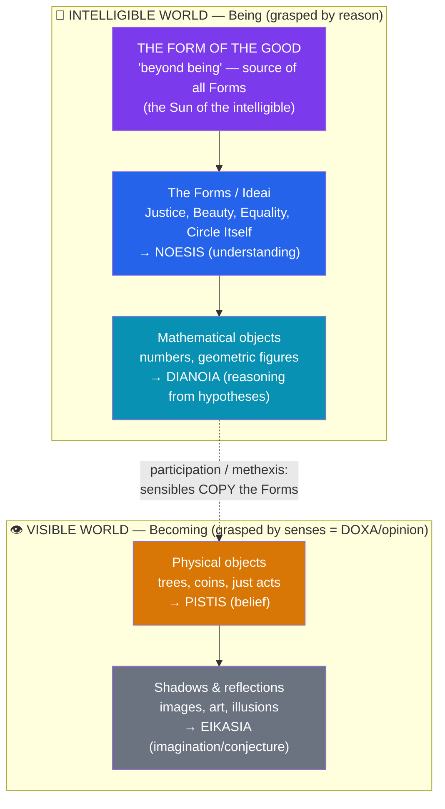

# 🕳️ Plato and the Theory of Forms

> [!abstract] TL;DR
> Plato (c. 428–348 BCE), Socrates' student and founder of the **Academy**, built the first systematic metaphysics on the **Theory of Forms**: beyond the changing, imperfect world of the senses (the realm of **Becoming**) lies a changeless, perfect realm of abstract universals (the **Forms** or *Ideai*) — Beauty Itself, Justice Itself, the Circle Itself — with the **Form of the Good** as their source, "beyond being." Particular things *are* what they are only by **participating** in these Forms. He dramatizes this with the **Divided Line** and the **Allegory of the Cave**, argues that knowledge is **recollection (*anamnesis*)** of Forms the soul knew before birth, divides the soul into three parts (reason, spirit, appetite), and designs the just city of the *Republic* ruled by **philosopher-kings**.

## Intuition — analogy first

Consider the mathematical concept of a **perfect circle**.

No circle you have ever seen is truly one. Every drawn circle, every wheel, every coin is slightly dented, grainy, or off-center; under a microscope its edge is a jagged mess. Yet geometry proves theorems about *the* circle with total precision, and you understand instantly what "circle" means despite never having encountered a flawless instance. So where is the perfect circle? Not on paper, not in any physical object. It seems to exist as an **ideal standard** — one, unchanging, graspable only by thought — that every physical circle merely *approximates*.

Plato's move is to generalize this from geometry to **everything**: not only Circle and Triangle, but Beauty, Justice, Equality, and Goodness are perfect, non-physical, eternal originals of which the sensible world holds only flickering copies. Physical things are like the smeared circles; the Forms are the flawless ideal. To know is to turn away from the copies and grasp the originals with the mind's eye.

---

## How It Works — The Two Worlds and the Divided Line

Plato's metaphysics is a **two-world (or two-realm) theory**, mapped onto a corresponding theory of knowledge. In *Republic* VI he draws the **Divided Line**: a line cut into two unequal parts (the visible and the intelligible), each cut again in the same ratio, giving four grades of reality matched to four states of mind.

As you ascend the line, both the **objects become more real** (from shadows up to Forms) and the **cognition becomes more secure** (from mere conjecture up to genuine understanding). The lower two rungs are **_doxa_ (opinion)**; only the upper two are **_epistēmē_ (knowledge)**. Knowledge and opinion have *different objects*: you cannot have knowledge of the shifting sensible world, only true or false belief.

## Key Concepts

### The Theory of Forms (*Ideai*)

A **Form** is a single, eternal, non-spatial, non-temporal, perfect, and unchanging universal — the one *essence* answering a Socratic "What is X?" question. The Forms solve several problems at once:

- **The One over Many.** Many different beautiful things are all called "beautiful." What do they share? Not a physical feature (a face, a law, and a proof are beautiful in different ways) but participation in the one **Form of Beauty**.
- **The problem of change** (inherited from the [[The_Presocratics|Presocratics]]). Plato accepts **Heraclitus** about the *sensible* world — it is in constant flux, so no stable knowledge of it is possible — and **Parmenides** about *true* reality — the objects of knowledge must be one and changeless. The Forms are that Parmenidean, stable object; the sensibles are the Heraclitean flux. This is his grand synthesis.
- **Standards and predication.** A thing is beautiful *by* Beauty, equal *by* the Equal itself. The Form is both the **cause** of the character in the particular and the **paradigm** it imperfectly imitates.

The relation of particulars to Forms is **participation (*methexis*)** or **imitation (*mimēsis*)** — a metaphor Plato himself worried about (see the Third Man, below).

| Feature | Forms (Being) | Sensible particulars (Becoming) |
|---|---|---|
| Change | Eternal, changeless | Constantly changing, perishable |
| Number | One per kind | Many |
| Access | Reason / intellect (*noēsis*) | Senses (*aisthēsis*) |
| Reality | Fully real | Semi-real (copies) |
| Perfection | Perfect (Beauty *is* beautiful) | Deficient, self-contradictory (a stick equal here, unequal there) |
| Cognitive state | Knowledge (*epistēmē*) | Opinion (*doxa*) |

### The Form of the Good

Above all Forms stands the **Form of the Good** (*Republic* VI–VII), which Plato says is **"beyond being" (*epekeina tēs ousias*)** in dignity and power. Via the **Analogy of the Sun**: as the sun both makes things *visible* and makes them *grow*, the Good both makes the other Forms *knowable* and gives them their *being*. It is the ultimate goal of the philosopher's ascent and the ground of all value and intelligibility — famously difficult, and Plato himself only gestures at it through images.

### The Allegory of the Cave (*Republic* VII)

Plato's most influential image. Prisoners are chained from birth in a cave, facing a wall, able to see only **shadows** cast by objects paraded behind them before a fire. They take the shadows for reality and become experts at predicting them. One prisoner is freed and dragged up:
1. He sees the **fire and the objects** — the shadows were mere images.
2. Dragged out of the cave, he is blinded by the **sun**, then gradually sees real things, and finally the **sun itself** (the Form of the Good).
3. Returning to free the others, he is now blinded *by the darkness*, is mocked as having ruined his eyes, and — Plato's grim allusion to Socrates — they would kill him if they could.

Each level maps onto the Divided Line: shadows (*eikasia*) → physical objects (*pistis*) → Forms (*noēsis*) → the Good (the sun). The allegory dramatizes **education (*paideia*)** as a painful *turning of the soul* from appearances to reality, and the philosopher's political duty to return and govern.

### Anamnesis — knowledge as recollection

If knowledge is of eternal Forms we never met through the senses, how do we acquire it? Plato answers: **we don't acquire it; we recover it.** The soul is immortal and, before birth, contemplated the Forms; learning is **recollection (*anamnesis*)** of what the soul already knew but forgot at birth.

- In the **_Meno_**, Socrates guides an **untutored slave boy** to derive a geometric truth (doubling the area of a square) purely by questioning, supplying no information — evidence, Plato argues, that the boy is *recalling* latent knowledge.
- In the **_Phaedo_**, recollection also grounds an argument for the **immortality of the soul**: since we possess concepts like perfect Equality that no sense-experience could have given us (sensible equals are always deficient), the soul must have known the Form before embodiment.

### The Tripartite Soul (*Republic* IV)

Plato analyzes the soul (*psychē*) into **three parts**, proven distinct by cases of inner conflict (a thirsty person who refuses to drink shows one part desiring while another forbids):

| Part | Greek | Desires | Virtue | Analogy | City class |
|---|---|---|---|---|---|
| **Reason** | *logistikon* | Truth, the good of the whole | **Wisdom** | Charioteer / the head | Guardians (rulers) |
| **Spirit** | *thymoeides* | Honor, victory, righteous anger | **Courage** | Noble horse / the chest | Auxiliaries (soldiers) |
| **Appetite** | *epithymētikon* | Food, drink, sex, money | **Temperance** (moderation) | Unruly horse / the belly | Producers (workers) |

**Justice** in the soul is the fourth virtue: each part **doing its own work** under the rule of reason — inner harmony. In the *Phaedrus*, Plato pictures the soul as a **charioteer (reason)** driving a noble and an unruly horse.

### The *Republic* and the philosopher-king

The *Republic* argues by analogy that **justice in the city mirrors justice in the soul**: a just city has three classes (rulers, soldiers, producers) each doing its proper job. Its most notorious claim: cities will have no rest from evils **"until philosophers rule as kings, or kings genuinely philosophize."** Only those who have ascended to knowledge of the Form of the Good can order the city rightly, because only they know what is *truly* good rather than merely apparent. The rulers are selected by rigorous education (mathematics, then dialectic), live communally without private property, and govern for the good of the whole. Plato thus grounds **political authority in knowledge**, not birth, wealth, or popular vote — an explicit critique of Athenian democracy, which had killed his teacher.

## Arguments & Examples

**The argument from the "One over Many" (why posit Forms at all).** Whenever many particulars share a common predicate ("beautiful," "large," "just"), Plato posits a single Form they participate in. Without it, we cannot explain what the many have in common, why the predicate applies, or how we understand a general term that no single sensible instance fully exhibits. The Form is the required unifying *essence*.

**The argument from the deficiency of sensibles (*Phaedo*).** Two sticks can look equal, yet they are never *perfectly* equal and can appear unequal from another angle — they "fall short" of Equality. But we judge them *as* deficient, which requires already grasping the standard, **Equality Itself**. Since no sense-experience delivers a perfect equal, our concept of it must come from elsewhere — the Form, known by the soul prior to sensation.

**The Meno slave-boy demonstration (thought experiment / *anamnesis*).** Presented as an empirical test: an uneducated boy, asked only questions and shown a diagram, "discovers" that the square on the diagonal has double the area. Since Socrates asserts nothing, the boy must be *recovering* knowledge he already latently possessed. **Objection:** the questions and diagram may smuggle in exactly the information Plato claims was innate — the demonstration arguably shows guided *teaching*, not pure recollection.

**The Third Man Argument (Plato's own self-criticism, *Parmenides*).** Remarkably, Plato raises a devastating **regress** against his own theory (later named by Aristotle): If all large things are large by participating in the Form of Largeness, then Largeness plus the large things form a *new* group of large things — which, by the same rule, requires *another* Form of Largeness to explain *their* largeness, and so on infinitely. If the Form is *itself* an instance of the property it explains (self-predication: Largeness is large), the theory generates an infinite hierarchy of Forms. This aporia drove Plato's late reworking of the theory and Aristotle's outright rejection of separate Forms.

## Common Pitfalls / Misconceptions

- **"Forms are just ideas in our minds."** The opposite: Forms are **mind-independent, objective realities** — they would exist even if no one thought of them. "Idea" translates *idea/eidos* but does not mean a subjective mental image; Platonic Forms are more real than the physical world, not less.
- **Treating the Cave as merely about illusion vs reality.** It is equally about **education as painful reorientation** and the **political duty of the enlightened** to return and rule. The killing of the returned prisoner is a pointed reference to Socrates' fate.
- **Assuming there is a Form of everything, tidily.** Plato is uncertain and even troubled about the *range* of Forms — in the *Parmenides*, the young Socrates hesitates over whether there are Forms of mud, hair, and dirt. The scope of the theory is a genuine problem, not a settled catalogue.
- **Reading the *Republic* as a serious blueprint for a state.** Many scholars take it primarily as an analogy: the city is a "soul writ large," a device for investigating **justice in the individual**. Its authoritarian features (censorship, the "noble lie," abolition of the family for guardians) are real and much criticized, but the dialogue's central question is ethical, not administrative.
- **Confusing *doxa* with knowledge.** For Plato, true belief that happens to be correct is still not knowledge; knowledge requires grasping the Form and being able to give a rational account (*logos*). This "knowledge = true belief + account" discussion in the *Theaetetus* seeds the modern analysis of knowledge.

## Related Concepts

- [[_MOC_Ancient_Greek_Philosophy|↑ Section MOC]]
- [[Socrates_and_the_Socratic_Method]] — Plato's teacher and mouthpiece; the "What is X?" question becomes the search for Forms
- [[The_Presocratics]] — The Forms synthesize Heraclitean flux (sensibles) with Parmenidean permanence (Forms); the theory is deeply Pythagorean
- [[Aristotle]] — Plato's student for 20 years, who rejected *separate* Forms (the Third Man) and relocated form *into* things (hylomorphism)
- [[The_Sophists_and_Relativism]] — The *Republic* and *Theaetetus* are sustained refutations of Protagorean relativism; the Forms give truth an objective anchor
- Cross-vault: [[Cognitive_Biases]] — The Cave as a metaphor for how framing and habit distort perceived reality; [[_MOC_History_Master]] — Athenian democracy Plato critiqued

## Review Questions

1. Explain the Divided Line and how it links four grades of reality to four cognitive states. Why does Plato insist that knowledge and opinion must have *different objects*?
2. Reconstruct the Third Man Argument. What assumption(s) of the Theory of Forms does it exploit, and why is it significant that Plato raises the objection himself in the *Parmenides*?
3. How does the tripartite soul ground Plato's definition of justice, and how does the same structure justify rule by philosopher-kings? What is the strongest objection to grounding political authority in knowledge of the Good?

## Sources

- Plato, *Republic*, trans. G.M.A. Grube, rev. C.D.C. Reeve (1992). Hackett
- Plato, *Meno* and *Phaedo*, trans. in *Five Dialogues* (Grube/Cooper). Hackett
- Fine, G. (2003). *Plato on Knowledge and Forms: Selected Essays*. Oxford University Press
- Kraut, R. (ed.) (1992). *The Cambridge Companion to Plato*. Cambridge University Press

#philosophy #ancient-greek #plato #theory-of-forms #metaphysics
