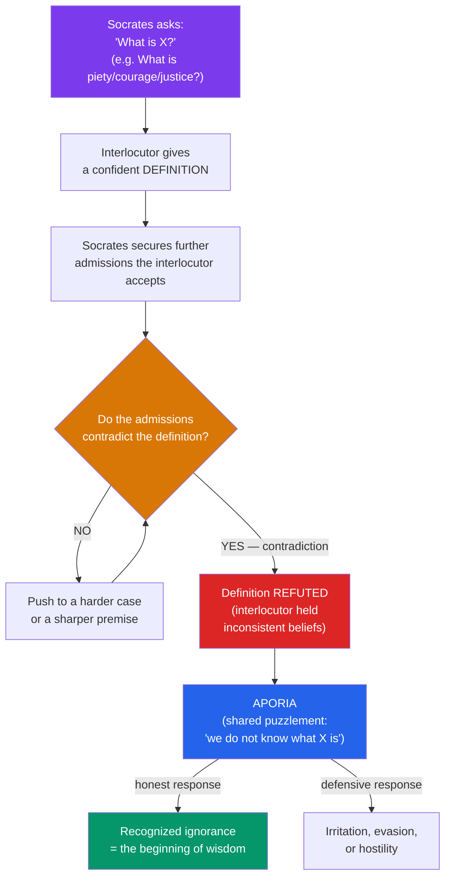

# 🏛️ Socrates and the Socratic Method

> [!abstract] TL;DR
> Socrates (c. 470–399 BCE) wrote nothing, yet redirected philosophy from the cosmos to the human soul — from "what is the world made of?" to "how should one live?" His method, the **_elenchus_** (cross-examination), tests a person's beliefs by drawing out contradictions from their own admissions, usually ending in *aporia* (puzzlement) rather than a positive answer. He professed **Socratic ignorance** ("I know that I know nothing"), insisted the **unexamined life is not worth living**, and held the intellectualist thesis that **virtue is knowledge** (no one does wrong willingly). Tried and executed by Athens for "impiety" and "corrupting the youth," he became philosophy's founding martyr. Because he left no texts, everything we know comes through others — chiefly Plato and Xenophon — creating the **"Socratic problem."**

## Intuition — analogy first

Think of Socrates as a **debugger for beliefs**.

Most people carry a large program of convictions — about justice, courage, love, piety — that has never been run against its own test cases. It compiles ("I know what justice is; it's giving people what they're owed"), and daily life rarely stresses it. Socrates is the relentless test suite. He feeds your definition edge cases: *Should you return a borrowed weapon to a friend who has gone mad?* If "justice is repaying debts," the program crashes. He does not hand you a corrected program; he shows you that the one you were confidently running is broken.

The unsettling part is that Socrates claims **not to have a working version either**. He is not a teacher downloading answers; he is a companion in the debugging, whose one advantage is that he *knows* his program is buggy while you thought yours was finished. Wisdom, for Socrates, begins with an accurate error log.

---

## How It Works — The Elenchus

The *elenchus* is a structured refutation. Socrates rarely asserts a thesis of his own; he asks the interlocutor to define a virtue, then extracts further admissions that turn out to contradict the definition. The aim is not to "win" but to reveal that the interlocutor did not know what they claimed to know.

The method has an implicit epistemology: if a belief conflicts with beliefs the person themselves holds more firmly, it should be given up. Over many rounds, the *elenchus* is meant to prune inconsistent beliefs and move (slowly, without guarantee) toward ones that survive scrutiny.

## Key Concepts

### The turn to ethics — "the human things"

Cicero later said Socrates "called philosophy down from the heavens" and set it in cities and homes. Where the [[The_Presocratics|Presocratics]] asked about the *archē* of nature, Socrates found such inquiry inconclusive and, more importantly, **irrelevant to how one ought to live**. His subject was **ethics**: the definitions of the virtues (*aretē*) — piety (*Euthyphro*), courage (*Laches*), temperance (*Charmides*), justice (*Republic* I), friendship, and the good life.

### Socratic ignorance and the Delphic oracle

The **Oracle of Delphi** declared that no one was wiser than Socrates. Puzzled — since he believed he knew nothing — he cross-examined the reputedly wise (politicians, poets, craftsmen) and found they *thought* they knew things they did not. He concluded the oracle meant this: **he alone was wise in recognizing the extent of his own ignorance.** This is not global skepticism ("nothing can be known") but **epistemic humility** about the great ethical questions. The famous "I know that I know nothing" is a later distillation; the *Apology* says he is wise only in "not thinking he knows what he does not know."

Two inscriptions at Delphi frame his project:
- **"Know thyself" (*gnōthi seauton*)** — self-examination is the philosophical task.
- **"Nothing in excess"** — the pursuit of measured, virtuous living.

### "The unexamined life is not worth living"

At his trial, offered acquittal if he would stop philosophizing, Socrates refuses: **"the unexamined life is not worth living for a human being"** (*Apology* 38a). To live without questioning one's values is, for him, to live sub-humanly — a life fit for cattle, not for a rational soul whose proper work is inquiry and the care of the soul (*psychē*).

### Virtue is knowledge (Socratic intellectualism)

Socrates advances a startling set of linked ethical theses, often called **moral intellectualism**:

1. **Virtue is knowledge.** To be courageous *is* to know what is and is not truly to be feared; to be just is to know what justice is. The virtues may even be **one** (the "unity of the virtues").
2. **No one does wrong willingly** (*oudeis hekōn hamartanei*). All wrongdoing is ignorance — a miscalculation about what is genuinely good for oneself. If you truly knew that an unjust act harmed your soul (the worst harm), you could not choose it. This denies *akrasia* (weakness of will): you cannot knowingly act against your own good.
3. **It is better to suffer injustice than to do it** (*Gorgias*), because doing injustice corrupts the soul, the most valuable thing a person has.

| Thesis | Claim | Radical consequence |
|---|---|---|
| Virtue = knowledge | Being good is a kind of expertise | Virtue is *teachable* / a subject of inquiry |
| No one errs willingly | All vice is ignorance | Punishment should reform, not merely retaliate |
| Unity of the virtues | Courage, justice, etc. are one knowledge | You cannot have one virtue fully without the rest |
| Suffering > doing wrong | Harming the soul is the real harm | The tyrant is the most wretched, not the happiest, of people |

### Socratic irony and the midwife

Socrates habitually feigns not to know while gently exposing that his interlocutor knows even less — **Socratic irony (*eirōneia*)**. In Plato's *Theaetetus* he calls himself a **midwife (*maieutikē*)**: he is himself "barren" of wisdom but helps others give birth to ideas and then tests whether the offspring is sound or a "wind-egg." The method is thus **not** merely destructive; it is midwifery of thought.

### The trial and death (399 BCE)

Charged with **impiety** ("not believing in the gods of the city" and introducing new divinities — his *daimonion*, an inner divine "sign") and **corrupting the youth**, Socrates was tried before an Athenian jury of ~500. The backdrop is political: Athens' humiliating defeat in the Peloponnesian War and the tyranny of the Thirty had involved former associates of Socrates (Critias, Alcibiades). Plato's dramatization spans:
- ***Apology*** — his defense ("apologia"); he refuses to grovel and proposes, provocatively, that he be *rewarded* with free meals; convicted and sentenced to death by hemlock.
- ***Crito*** — in prison, he refuses a chance to escape, arguing (voicing "the Laws of Athens") that it would be unjust to break the city's laws that raised him, even unjust ones — one must persuade or obey.
- ***Phaedo*** — his last day: arguments for the **immortality of the soul**, and his calm death, "the best... wisest and most just" of men, in Plato's closing words.

### The Socratic Problem — Plato vs Xenophon

Socrates wrote nothing, so his views reach us only through others who had their own agendas. This is the **Socratic problem**: which Socrates is historical?

- **Plato** — his most philosophically profound witness, but in the later dialogues "Socrates" becomes a mouthpiece for Plato's *own* developed doctrines (the Theory of Forms, the tripartite soul). Scholars often treat the **early ("Socratic") dialogues** (*Apology, Crito, Euthyphro, Laches, Charmides*) as closer to the historical Socrates and the middle/late ones as Platonic.
- **Xenophon** — a soldier and historian; his *Memorabilia* and *Apology* present a more conventional, practical, moralizing Socrates, less metaphysical. Some find him more reliable, others duller and less philosophically acute.
- **Aristophanes** — the comic playwright's *Clouds* (423 BCE) caricatures Socrates as a sophistic natural philosopher running a "Thinkery," teaching how to make the weaker argument defeat the stronger — a hostile source Socrates himself blames in the *Apology* for prejudicing Athens against him.
- **Aristotle** — later testimony credits the historical Socrates specifically with **inductive arguments and universal definitions**, and pointedly says Socrates did *not* separate the Forms — attributing that step to Plato.

## Arguments & Examples

**The *Euthyphro* dilemma (a live *elenchus*).** Outside the courthouse, Euthyphro claims to know what piety is and defines it as "what the gods love." Socrates asks the decisive question: **Is the pious loved by the gods because it is pious, or is it pious because the gods love it?** If the former, "being loved" is not what *makes* it pious (so the definition fails to give the essence); if the latter, piety is arbitrary divine preference. The dialogue ends in *aporia* — but it has generated a problem (the "Euthyphro dilemma") that still structures debates in ethics and philosophy of religion about whether morality can be grounded in divine command.

**"No one does wrong willingly" (argument).** Everyone desires what is *good for themselves*. Wrongdoing harms the wrongdoer's soul, so it is not good for them. Therefore anyone who does wrong must be *mistaken* about what is good for them — i.e., ignorant. Hence all wrongdoing is involuntary ignorance, not deliberate malice. **Objection (Aristotle):** this ignores *akrasia* — we plainly do act against our better judgment (the dieter who knowingly eats the cake). Aristotle's response is to give the appetites and habituation a role Socrates' pure intellectualism omits. This disagreement launches the whole field of **moral psychology**.

**Why refuse escape? (*Crito*).** Crito urges escape; Socrates argues (1) one must never do injustice, even in return for injustice; (2) breaking the laws that educated and protected him would injure the city and violate an implicit agreement to abide by its judgments; therefore (3) escaping would be unjust, so he must stay. The argument is an early social-contract and civil-obedience text — and remains contested, since it seems to demand obedience even to an unjust death sentence.

## Common Pitfalls / Misconceptions

- **"The Socratic method is just asking a lot of questions."** The modern classroom "Socratic method" (leading students to a pre-planned answer) is nearly the *opposite* of the historical *elenchus*, which is refutative and typically ends in *aporia* with no tidy answer delivered.
- **Taking Socratic ignorance as global skepticism.** He does not claim nothing can be known; he claims that he — and his interlocutors — do not possess the ethical knowledge they think they have. He acts on firm moral convictions (never do injustice) throughout.
- **Reading the *Republic*'s or *Phaedo*'s theories as Socrates' own.** Much of the metaphysics voiced by "Socrates" in Plato's middle dialogues is Platonic. Blending the two erases the Socratic problem.
- **Assuming "virtue is knowledge" means book-learning.** The relevant "knowledge" is practical wisdom about the good — closer to expertise/skill (*technē*) than to memorized facts. Still, the thesis's neglect of emotion and habit is its most criticized feature.
- **"He was condemned purely for free thought."** The charges were religious and moral, but the trial was entangled with post-war Athenian politics and Socrates' association with anti-democratic figures — the picture is more political than a simple science-vs-superstition story.

## Related Concepts

- [[_MOC_Ancient_Greek_Philosophy|↑ Section MOC]]
- [[The_Presocratics]] — The nature-focused inquiry Socrates turned away from toward ethics
- [[The_Sophists_and_Relativism]] — Socrates is often mistaken for a Sophist but opposed them: he took no fees and sought *truth*, not persuasive advantage
- [[Plato_and_the_Theory_of_Forms]] — Plato transforms Socratic "What is X?" questions into a metaphysics of Forms; our main source for Socrates
- [[Aristotle]] — Criticizes Socratic intellectualism by restoring the role of habit, emotion, and weakness of will (*akrasia*)
- Cross-vault: [[Cognitive_Biases]] — Modern moral psychology on *akrasia* and motivated reasoning revisits "no one errs willingly"; [[_MOC_History_Master]] — Athens after the Peloponnesian War

## Review Questions

1. Describe the structure of the *elenchus* and explain why it so often ends in *aporia*. In what sense is a refutation that produces only puzzlement still philosophically valuable?
2. Reconstruct the argument for "no one does wrong willingly," then state Aristotle's objection from *akrasia*. Which side do you find more convincing, and why?
3. What is the "Socratic problem," and why does it make Plato's later dialogues unreliable as evidence for the historical Socrates? How do Xenophon, Aristophanes, and Aristotle each complicate or corroborate the picture?

## Sources

- Plato, *The Trial and Death of Socrates* (*Euthyphro, Apology, Crito, Phaedo*), trans. G.M.A. Grube. Hackett
- Vlastos, G. (1991). *Socrates: Ironist and Moral Philosopher*. Cambridge University Press
- Xenophon, *Memorabilia*, trans. A.L. Bonnette (1994). Cornell University Press
- Brickhouse, T.C. & Smith, N.D. (1994). *Plato's Socrates*. Oxford University Press

#philosophy #ancient-greek #socrates #elenchus #virtue-ethics
