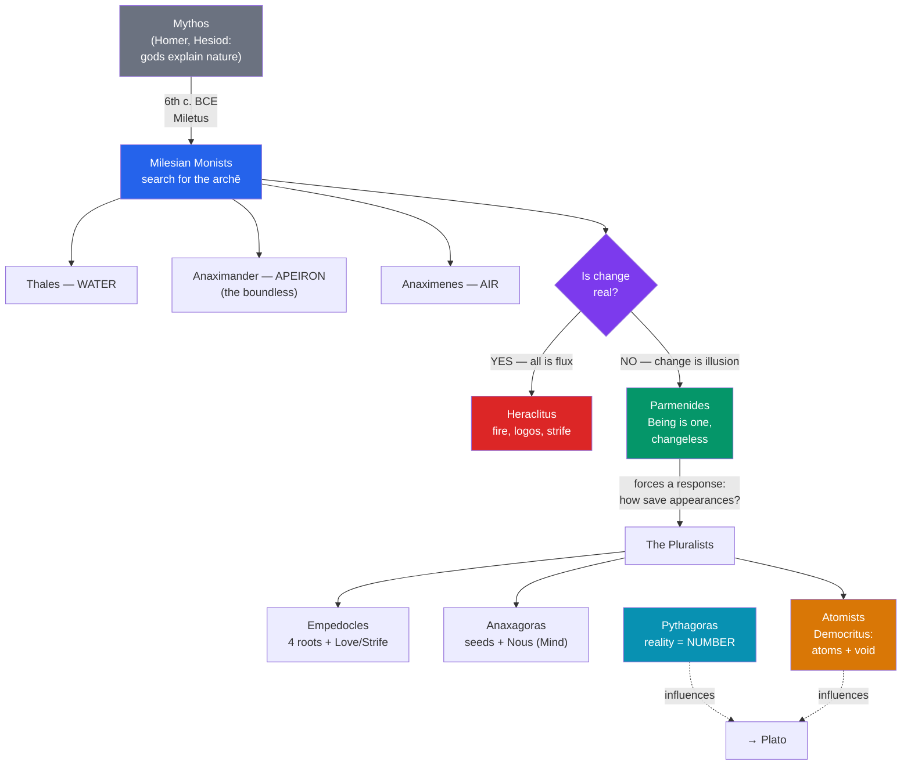

# 🌊 The Presocratics

> [!abstract] TL;DR
> The Presocratics (roughly 6th–5th c. BCE) are the first Western thinkers to explain the cosmos through reasoned natural principles rather than myth — the shift from *mythos* to *logos*. Their central question was the *archē*: the fundamental principle, source, or stuff from which everything arises and by which it is governed. Thales named water, Anaximander the boundless *apeiron*, Heraclitus flux governed by *logos*, Parmenides a single changeless Being, Pythagoras number, and the atomists Leucippus and Democritus indivisible atoms moving in the void. Their disagreement over whether reality is one or many, changing or static, set the agenda that Plato and Aristotle inherited.

## Intuition — analogy first

Imagine you are handed a finished cake and asked, without any recipe, to work out what it is *really* made of.

You could say "it's cake" and stop — that is the mythological answer, treating each thing as its own irreducible kind, explained by naming the god or story behind it. Or you could insist that beneath the frosting, sponge, and filling there must be some smaller set of basic ingredients — flour, eggs, sugar — that recombine into everything on the table. The Presocratics took the second path for the entire universe. They assumed that behind the bewildering variety of things (fire, sea, stone, animals, stars) lies a small number of underlying principles, and that reason alone can reach them.

The genius was not any particular answer — most of their specific claims were wrong — but the *type* of question. "What is the *archē*?" assumes the world is intelligible, unified, and law-governed rather than a chaos of divine whims. Every later science and metaphysics is a refinement of that assumption.

---

## How It Works — From Mythos to Logos

The Presocratics did not form a single school; they form a *conversation*, each reacting to predecessors. The engine driving that conversation is the **problem of the one and the many** and the **problem of change**: how can a single underlying reality produce many different things, and is change real or illusory?

We possess almost none of their writings whole. Nearly everything survives as **fragments** (direct quotations, called *B* fragments in the standard Diels–Kranz edition) and **testimonia** (paraphrases by later authors, *A* fragments), especially Aristotle, Theophrastus, and Simplicius. Interpretation is therefore always partly reconstruction.

## Key Concepts

### The Milesian Monists: the search for the *archē*

The first philosophers came from **Miletus**, a wealthy Ionian trading city. They were **material monists**: they held that one kind of stuff underlies everything.

- **Thales (c. 624–546 BCE)** — traditionally *the* first philosopher. He claimed the *archē* is **water**: everything comes from, and returns to, water; the Earth floats on it. The reasoning matters more than the answer — water is observed to nourish life, take solid, liquid, and gaseous forms, and be ubiquitous. Aristotle reports his dictum that "all things are full of gods," read as an early idea that matter is self-moving. He also allegedly predicted the eclipse of 585 BCE and proved geometric theorems.
- **Anaximander (c. 610–546 BCE)** — Thales' successor. He rejected any *specific* element as the *archē* because each element is limited and opposed by others (fire cannot be basic, or it would consume its opposite, water). Instead the source is the **_apeiron_** — the "boundless" or "indefinite," an eternal, ageless, unlimited reservoir out of which opposites (hot/cold, wet/dry) "separate out." His surviving fragment speaks of things paying "penalty and retribution to each other for their injustice according to the assessment of time" — a cosmic balance-sheet. He also proposed a proto-evolutionary origin of humans from fish-like creatures.
- **Anaximenes (c. 585–525 BCE)** — returned to a definite element, **air (*aēr*)**, but added a *mechanism* of change: **condensation and rarefaction**. Rarefied air becomes fire; condensed, it becomes wind, cloud, water, earth, stone. This is arguably the first quantitative, single-process explanation of qualitative difference.

| Thinker | *Archē* | Key move |
|---|---|---|
| **Thales** | Water | First natural (non-mythic) principle |
| **Anaximander** | *Apeiron* (the boundless) | Abstract, indefinite source; cosmic justice |
| **Anaximenes** | Air | Mechanism of change (condensation/rarefaction) |
| **Heraclitus** | Fire / process | Reality is flux ordered by *logos* |
| **Parmenides** | Being (*to eon*) | Change and plurality are illusion |
| **Pythagoras** | Number | Reality is mathematical structure |
| **Democritus** | Atoms + void | Everything is atoms in empty space |

### Heraclitus of Ephesus (c. 540–480 BCE): flux and *logos*

Nicknamed "the Obscure," Heraclitus wrote in riddling aphorisms. His core doctrine is **universal flux**: everything is in constant change and tension.

- **"You cannot step into the same river twice"** (the *panta rhei*, "all things flow," tradition) — the waters are ever different; identity persists only as a *pattern* through change, not as static substance.
- **The *logos*** — an underlying rational order, law, or ratio that governs all change. It is common to all, yet "men live as though their thinking were private." *Logos* here means both the objective structure of the world and the account of it — a seed of the idea of natural law.
- **Unity of opposites** — "The road up and the road down are one and the same." Opposites are inseparable and define each other; **"strife (*polemos*) is the father of all."** Fire is his favored symbol/*archē* because it persists precisely by constantly consuming and transforming.

### Parmenides of Elea (c. 515–450 BCE): Being is one and changeless

Parmenides is the great antagonist of Heraclitus and, for Plato, the most formidable predecessor. In his philosophical poem, a goddess distinguishes the **Way of Truth** from the **Way of Opinion (*doxa*)**.

His argument, radically, uses **pure logic against the senses**:
1. "What is, is; what is not, is not." You cannot think or speak of *what is not* — non-being is literally unthinkable.
2. Therefore there is no *not-being*, hence no empty space and no "coming to be" (which would require something arising from nothing).
3. Therefore **Being (*to eon*) is ungenerated, imperishable, one, indivisible, and motionless** — a single, complete, unchanging whole. Change, plurality, and time are illusions of the senses.

His pupil **Zeno of Elea (c. 490–430 BCE)** defended this with **paradoxes** meant to show that *motion and plurality* lead to contradiction — the most famous being **Achilles and the tortoise** (Achilles can never overtake a tortoise with a head start, because he must first reach where it was, by which time it has moved on) and the **Dichotomy** (to cross a distance you must first cross half, then half of the rest, ad infinitum). These are the first rigorous arguments by *reductio ad absurdum* and remain live in philosophy of mathematics.

### Pythagoras (c. 570–495 BCE): reality as number

**Pythagoras of Samos** founded a religious-philosophical brotherhood in Croton. The Pythagoreans held that **"all things are number"** — the *archē* is mathematical structure, not a physical stuff. The discovery that **musical harmony corresponds to whole-number ratios** (an octave is 2:1, a fifth 3:2) suggested that the cosmos itself is ordered by number and proportion — the "harmony of the spheres." This lineage — that the deepest truths are mathematical and grasped by reason, not the senses — flows directly into Plato. The Pythagoreans also taught the **transmigration of souls** (*metempsychosis*).

### The Pluralists and the Atomists

Parmenides made naive change philosophically indefensible, so the next generation tried to **save the appearances** — to preserve observable change while honoring his logic that being cannot come from non-being.

- **Empedocles (c. 494–434 BCE)** — proposed **four "roots"** (earth, water, air, fire), later the classical four elements, that never come to be or perish but **mix and separate** under two forces, **Love (attraction)** and **Strife (repulsion)**. Change is rearrangement, not creation.
- **Anaxagoras (c. 500–428 BCE)** — held there is "a portion of everything in everything" (infinitely divisible seeds), set in order by **Nous (Mind)**, the first appeal to an intelligent cosmic ordering principle — praised then criticized by Plato's Socrates for not going far enough.
- **Atomism — Leucippus and Democritus (c. 460–370 BCE)** — the boldest response. Reality consists of an infinite number of **atoms** (*atomos*, "uncuttable"): indivisible, imperishable, differing only in shape, size, position, and arrangement, moving in the **void** (empty space). Crucially, they accepted Parmenides' "what is not" — the void — as *real emptiness*, dissolving his ban on non-being. All qualities (color, taste, warmth) are secondary, arising from atomic arrangement: **"By convention sweet, by convention bitter... in reality atoms and void."** This is a strikingly modern, mechanistic, and non-teleological worldview.

## Arguments & Examples

**Anaximander's argument against a definite *archē*.** If the basic stuff were one of the observable opposites (say fire), it would over time overwhelm and consume its opposite (water), and the balance of the world would be destroyed. Since the world *is* balanced, the source must be neutral between all opposites — hence something indefinite, the *apeiron*. This is an early example of inferring an unobservable theoretical entity from a structural requirement.

**Parmenides' "nothing comes from nothing."** Consider: if Being came into existence, it came either from being (in which case it already was) or from non-being. But "from non-being" is incoherent — non-being is nothing, and nothing cannot be a source. Therefore Being never came to be; it always was. The premise "you cannot think what is not" does the heavy lifting, and Plato later challenges exactly this in the *Sophist*, arguing that non-being can mean *difference* rather than sheer nothingness.

**Zeno's Dichotomy (thought experiment).** To walk from A to B you must first reach the midpoint, then the midpoint of the remainder, and so on without end — an infinite number of tasks in finite time, which Zeno says is impossible; therefore motion is illusory. The modern resolution appeals to the **convergence of infinite series** (½ + ¼ + ⅛ + … = 1), but the paradox productively forced philosophers to distinguish potential from actual infinity.

**Heraclitus vs Parmenides as the founding dichotomy.** These two frame Western metaphysics: **Is ultimate reality change (Becoming) or permanence (Being)?** Plato's answer is a synthesis — a changing sensible world (Heraclitus is right *about the senses*) over an unchanging world of Forms (Parmenides is right *about true reality*). Aristotle's four causes and his analysis of potentiality/actuality are likewise engineered to make change rationally respectable against Parmenides.

## Common Pitfalls / Misconceptions

- **"They were just primitive scientists with wrong guesses."** Their importance is methodological, not empirical. Replacing "Poseidon causes earthquakes" with "earthquakes have a natural cause" is a revolution regardless of the specific mechanism proposed. Judge them by the questions, not the answers.
- **"Presocratic means before Socrates in time."** It is loosely thematic, not strictly chronological. Some "Presocratics" (Democritus, the atomists) were contemporaries of or later than Socrates. The term marks a *style* of inquiry — cosmological and pre-ethical — not a date.
- **Reading Heraclitus as pure chaos.** "All flows" is only half his view. The flux is *ordered* by the *logos*; the world is an "ever-living fire kindling in measures and going out in measures." He is a philosopher of lawful change, not disorder.
- **Assuming we have their books.** We have fragments and hostile or agenda-driven paraphrases (Aristotle often frames predecessors as fumbling toward *his* theory). Confident claims about "what Thales really meant" outrun the evidence.
- **Conflating the *apeiron* with modern "infinity."** Anaximander's boundless is spatially/qualitatively *indefinite and inexhaustible*, an early metaphysical posit, not the rigorous mathematical infinite of Cantor.

## Related Concepts

- [[_MOC_Ancient_Greek_Philosophy|↑ Section MOC]]
- [[The_Sophists_and_Relativism]] — The next generation turned from cosmos to *human* affairs, partly because the Presocratics' conflicting cosmologies bred skepticism
- [[Socrates_and_the_Socratic_Method]] — Socrates redirected philosophy from nature to ethics, calling the older physical inquiry inconclusive
- [[Plato_and_the_Theory_of_Forms]] — Synthesizes Heraclitean flux (the sensible world) with Parmenidean permanence (the Forms); deeply Pythagorean
- [[Aristotle]] — His doctrine of the four causes and potentiality/actuality is built to answer the Parmenidean challenge and to catalogue the Presocratics' "causes"
- Cross-vault: [[_MOC_History_Master]] — Archaic and Classical Greece, the Ionian world; [[_MOC_Mythology_Master]] — the *mythos* the Presocratics reasoned away

## Review Questions

1. Explain what philosophers mean by the *archē*, and contrast Anaximander's choice of the *apeiron* with the Milesian choice of a definite element. Why did Anaximander think a definite element could not be fundamental?
2. Heraclitus and Parmenides give opposite answers to the problem of change. State each position and its core argument, then explain how Plato and Aristotle each tried to reconcile the two.
3. How did the atomists Leucippus and Democritus use Parmenides' own logic while rejecting his conclusion? Specifically, what did they do with the notion of "what is not" (the void)?

## Sources

- Kirk, G.S., Raven, J.E. & Schofield, M. (1983). *The Presocratic Philosophers* (2nd ed.). Cambridge University Press
- Barnes, J. (1982). *The Presocratic Philosophers*. Routledge
- Curd, P. & Graham, D.W. (eds.) (2008). *The Oxford Handbook of Presocratic Philosophy*. Oxford University Press
- Graham, D.W. (2010). *The Texts of Early Greek Philosophy* (2 vols.). Cambridge University Press

#philosophy #ancient-greek #presocratics #metaphysics #arche
