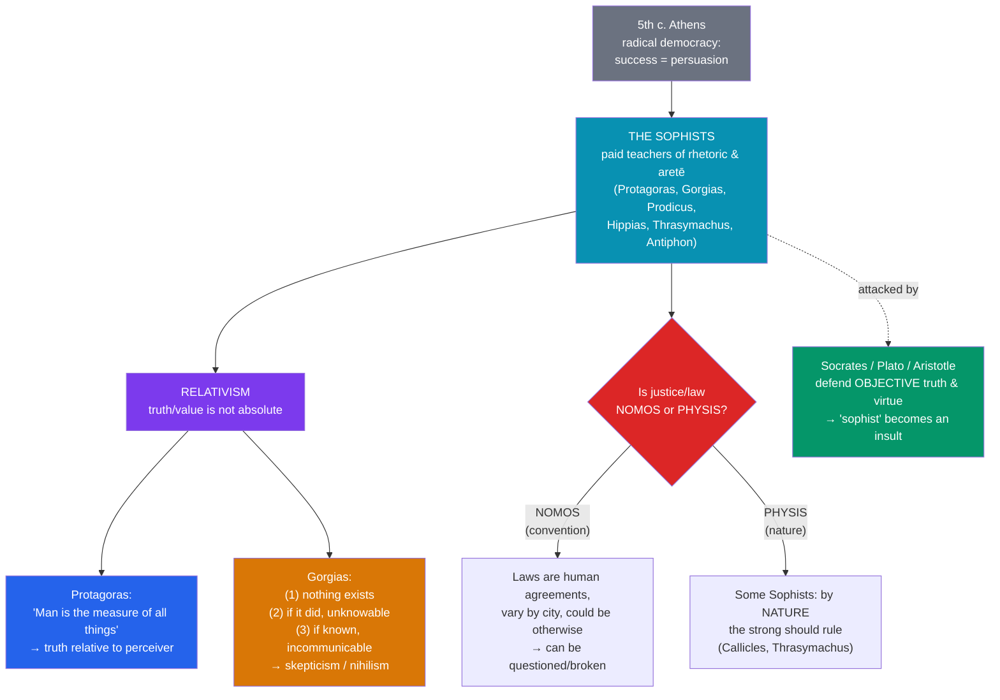

# ⚖️ The Sophists and Relativism

> [!abstract] TL;DR
> The **Sophists** were the first professional teachers of Greece (5th c. BCE) — itinerant experts who, for a fee, taught **rhetoric**, argument, and the skills of political success (*aretē* as civic excellence) to the sons of the wealthy in democratic Athens. Their most famous doctrines are **relativist**: **Protagoras** held that **"man is the measure of all things"** (truth is relative to the perceiver), and **Gorgias** pushed a radical skepticism/nihilism about knowledge and being. They fueled the great debate of **_nomos_ vs _physis_** — whether laws, morals, and justice are mere human **convention** or grounded in **nature**. Plato and Aristotle, defending objective truth and virtue, made "sophist" a term of abuse — a bias that still colors the word "sophistry."

## Intuition — analogy first

Imagine two people tasting the same cup of coffee. One says "it's bitter," the other "it's pleasant." Who is *wrong*?

Protagoras' startling answer is: **neither**. The coffee really *is* bitter-for-the-first-person and pleasant-for-the-second, and there is no further, view-from-nowhere fact about how the coffee "really" tastes independent of any taster. Each person's experience is the measure of what is true *for them*. Now generalize that from coffee to **everything** — including "this law is just," "this god exists," "this act is wrong." That is Protagorean relativism, and you can immediately feel both its appeal (it honors disagreement and diversity; it's humble about absolutes) and its danger (if every view is true-for-its-holder, on what basis can we say slavery, or a lie in court, is *actually* wrong?).

The Sophists were the professionals who could teach you to argue *either side* of any such question persuasively — a superpower in a democracy where lawsuits and assemblies were won by speech. Their critics asked: if you can argue any side, do you care about **truth** at all, or only about **winning**?

---

## How It Works — Nomos vs Physis

The Sophists arose from a real social need. In 5th-century democratic Athens, a citizen's fortune depended on **persuasive public speaking** in the assembly and the law-courts (where you pleaded your own case). The Sophists sold the training. But their reflection on *why* different cities have different laws and gods generated the era's defining question: is human order **conventional** or **natural**?

Crucially, almost everything we know about the Sophists comes **through hostile witnesses** — chiefly Plato, who wrote them as foils for Socrates. Reconstructing their actual positions therefore requires reading against the grain of their critics.

## Key Concepts

### Who the Sophists were

**_Sophistēs_** originally meant "expert" or "sage" (from *sophia*, wisdom) and was not pejorative. The Sophists were a loose group of **itinerant, professional educators**, mostly non-Athenians, who traveled the Greek world giving lectures and private instruction. Their distinctive features:

- **They charged fees** — the first to make a living from teaching wisdom. This scandalized aristocrats (who thought excellence was inborn/inherited) and later Socrates (who taught for free and thought virtue could not be *sold*).
- **They taught *aretē* as practical/civic excellence** — the skills to succeed in public life: rhetoric, argumentation, grammar, and general culture — rather than metaphysics or ethics for its own sake.
- **They were the age's public intellectuals**, versatile polymaths on language, law, and society.

| Sophist | Dates (approx.) | Known for |
|---|---|---|
| **Protagoras** of Abdera | c. 490–420 BCE | "Man is the measure"; relativism; *antilogiae* (opposing arguments); agnosticism about the gods |
| **Gorgias** of Leontini | c. 483–375 BCE | Master rhetorician; *On Not-Being* (nothing exists...); the power of *logos* (speech) |
| **Prodicus** of Ceos | c. 465–395 BCE | Precision of language, fine distinctions between near-synonyms |
| **Hippias** of Elis | c. 460–399 BCE | Polymath; *nomos*/*physis* distinction; self-sufficiency |
| **Thrasymachus** of Chalcedon | c. 459–400 BCE | "Justice is the advantage of the stronger" (*Republic* I) |
| **Antiphon** | 5th c. BCE | *On Truth*: nature's demands vs law's constraints |

### Protagorean relativism: "man is the measure of all things"

Protagoras' most famous fragment (from his lost *Truth*):

> **"Of all things the measure is man (*anthrōpos*): of the things that are, that they are; of the things that are not, that they are not."**

Standard interpretation (following Plato's *Theaetetus*): **whatever seems true to a person is true for that person** — there is no absolute, perceiver-independent truth. "Man" can be read as the **individual** perceiver (the coffee tastes as it tastes to *each*) or, more socially, as the **community/city** (each *polis*'s customs are right for it). This yields:
- **Epistemic relativism** — no belief is *just true*; only true-**for**-someone. Knowledge collapses into perception/appearance.
- **Moral/cultural relativism** — no culture's *nomoi* (laws, customs) are objectively correct; each is valid within its own community.

Protagoras coupled this with a practical program: since there are "**two opposing arguments (*dissoi logoi* / *antilogiae*) on every matter**," the skilled speaker can "**make the weaker argument the stronger**" — i.e., argue any side. On the gods he was a professed **agnostic**: "Concerning the gods, I cannot know whether they exist or not, or what they are like; many things prevent knowledge — the obscurity of the subject and the shortness of human life."

### Gorgias: rhetoric and radical skepticism

**Gorgias** was primarily a virtuoso of **rhetoric**, dazzling audiences with a highly wrought prose style and celebrating the near-magical **power of speech (*logos*)** to shape belief and emotion (his *Encomium of Helen* argues speech is a "powerful lord" that can compel the soul like a drug). His notorious treatise **_On Not-Being_ (or *On Nature*)** advances a three-step skeptical/nihilist argument, often read as a parody of Parmenidean/Eleatic reasoning turned against itself:

1. **Nothing exists.**
2. **Even if something exists, it cannot be known.**
3. **Even if it could be known, it cannot be communicated** (words are not the things they denote).

Whether meant seriously or as a rhetorical *tour de force* demonstrating that argument can "prove" anything, it radicalizes the gap between **speech, thought, and reality** and stands as an early landmark of skepticism.

### Nomos vs Physis (convention vs nature)

The Sophists' encounters with many cultures made vivid that **customs vary**: what is pious in one city is forbidden in another. This generated the era's central social-philosophical antithesis:

- **_Nomos_** — law, custom, convention: human-made, variable, agreed upon (or imposed).
- **_Physis_** — nature: what is fixed, universal, "the way things really are."

The distinction cut in **opposite political directions** depending on who wielded it:
- **Conventionalism / early liberalism** — justice and law are *nomos*, useful human agreements that restrain the strong and protect the weak (a proto-**social-contract** view; some read Protagoras' "Great Speech" in Plato this way — humans need justice to survive together).
- **"Might is right" / immoralism** — some Sophists argued that *by nature (physis)* the strong should dominate, and *nomos* is a trick by which the weak majority shackles the strong. Plato dramatizes this through **Callicles** (*Gorgias*) — "natural justice" is the rule of the superior — and **Thrasymachus** (*Republic* I) — **"justice is nothing but the advantage of the stronger."** Antiphon argued that nature's commands (self-interest, survival) are compulsory and real, while law's are conventional and enforced only by observation.

This debate is the ancestor of every later argument about whether morality and law are **discovered** (natural law, objective ethics) or **invented** (conventionalism, legal positivism, moral relativism).

### The Socratic and Platonic critique

Socrates is often confused with the Sophists — he too questioned tradition, argued cleverly, and hung around the young. **Aristophanes' *Clouds* lumps him in with them.** But the differences are, for Plato, fundamental:

| | Sophists | Socrates |
|---|---|---|
| **Payment** | Charged fees | Took none; died poor |
| **Aim** | Persuasion, winning, worldly success | Truth; care of the soul |
| **Method** | Long display speeches (*epideixis*); teach both sides | Short question-and-answer (*elenchus*); seek *the* answer |
| **On truth** | Relative ("man the measure") | Objective (there *is* a fact about what justice is) |
| **Self-image** | Wise experts who impart *aretē* | "I know that I know nothing" |

Plato's twofold philosophical **refutation of Protagoras** (in the *Theaetetus*) is famous:
- **The self-refutation ("*peritropē*," turning the tables).** If "every belief is true for its holder," and most people believe that **relativism is false**, then *by Protagoras' own standard* it is true-for-them that relativism is false — so the doctrine undermines itself. More sharply: Protagoras cannot claim his own view is *more* true than its denial without abandoning relativism.
- **The expertise objection.** If all appearances are equally true, then no one is wiser than anyone else, and there is no such thing as a **teacher** — which is absurd, since Protagoras charges fees *as an expert*. The very existence of expertise (in medicine, farming, navigation) presupposes that some judgments are better than others.

Plato's whole **Theory of Forms** and Aristotle's **principle of non-contradiction** and objective *eudaimonia* can be read as the constructive answer to sophistic relativism: they re-anchor truth and value in a reality independent of what any individual believes.

## Arguments & Examples

**Herodotus' Persians-vs-Greeks (empirical basis for *nomos*).** The historian Herodotus reports that Darius asked Greeks (who burn their dead) and Callatians (who eat their dead) each to adopt the other's funeral custom; both were horrified. His conclusion — **"custom is king of all"** — is the empirical observation that fed sophistic relativism: since practices vary radically and each people is convinced its own is right, perhaps *nomos*, not *physis*, governs morality. **The relativist reading:** there is no culture-independent standard. **The objectivist reply:** variation in *belief* about right doesn't entail there is no *fact* about right — people also once disagreed about the shape of the Earth.

**The self-refutation of relativism (*peritropē*).** Consider the sentence "**All truth is relative**." Is *that* claim relative or absolute? If absolute, it is self-contradictory (here is one non-relative truth). If merely relative (true only for relativists), then it gives the non-relativist no reason to accept it, and the relativist cannot say the objectivist is *mistaken*. Either way the thesis cannot be asserted as a general truth. This remains the standard objection to global relativism today.

**Thrasymachus in *Republic* I (thought experiment for "might is right").** Thrasymachus argues that in every state the ruling party makes laws to its own advantage and calls obedience "justice"; so "justice" is really just **the interest of the stronger**, and the truly rational person maximizes their own advantage, injustice paying better than justice. Socrates responds that ruling is a **craft (*technē*)** and every craft aims at the good of its *object* (medicine at the patient's health, not the doctor's), so true ruling serves the ruled — and that the unjust soul is internally disordered and therefore wretched. The exchange launches the *Republic*'s entire attempt to show that **justice pays even when unenforced** (the later Ring of Gyges challenge).

**Gorgias' *Encomium of Helen* (rhetoric as power).** Gorgias "defends" Helen of Troy by arguing she cannot be blamed whether she left with Paris by the gods' will, by force, by love, or **by persuasion** — and if by *speech*, she is blameless, because speech is an overpowering force that "drugs and bewitches" the soul. The piece is simultaneously a display of rhetorical skill and a serious thesis about the **coercive psychological power of language** — a theme modern studies of propaganda and persuasion inherit.

## Common Pitfalls / Misconceptions

- **"Sophist just means a fraud or con-artist."** That pejorative sense is the *legacy of Plato's polemic*, not a neutral description. The Sophists were serious, influential thinkers who advanced philosophy of language, relativism, and social theory; many modern scholars regard the anti-sophistic caricature as unfair.
- **Confusing Socrates with the Sophists.** Superficially similar (both interrogate convention, both argue cleverly), they differ on fees, aims, method, and — decisively — on whether truth is objective. Socrates sought *the* truth; the Sophists (on Plato's telling) taught winning.
- **Assuming all Sophists were relativists or immoralists.** They were diverse. Protagoras defended the *value* of law and justice for communal survival; the "might is right" position (Callicles, Thrasymachus) is one strand, not the whole. "Sophist" names a profession and milieu, not a single doctrine.
- **Thinking relativism is obviously refuted (or obviously true).** The *peritropē* targets **global, self-applying** relativism; more careful contemporary relativisms (about taste, or framework-relative truth) try to sidestep it. Conversely, cultural variation alone doesn't *establish* relativism. The debate is live, not closed.
- **Reading "man is the measure" as crude subjectivism about facts.** Its scope and meaning are disputed — individual vs communal "man," perception vs all judgment. Plato's interpretation in the *Theaetetus* is influential but is itself a partisan reconstruction.

## Related Concepts

- [[_MOC_Ancient_Greek_Philosophy|↑ Section MOC]]
- [[Socrates_and_the_Socratic_Method]] — Socrates was the Sophists' great rival and is often mistaken for one; his search for objective definitions answers their relativism
- [[Plato_and_the_Theory_of_Forms]] — The Forms and the *Theaetetus*'s *peritropē* are Plato's systematic refutation of Protagorean relativism
- [[Aristotle]] — His principle of non-contradiction and objective *eudaimonia* oppose relativism, yet he takes rhetoric seriously enough to theorize it (the *Rhetoric*)
- [[The_Presocratics]] — Conflicting Presocratic cosmologies bred the skepticism the Sophists exploited; Gorgias' *On Not-Being* parodies Parmenides
- Cross-vault: [[Cognitive_Biases]] — Modern persuasion, framing, and motivated reasoning echo the sophistic "make the weaker argument stronger"; [[_MOC_History_Master]] — Athenian democracy and the culture of public speech

## Review Questions

1. State Protagoras' "man is the measure" doctrine and distinguish its epistemic and moral-cultural forms. Then reconstruct Plato's *peritropē* (self-refutation) objection. Does it defeat *every* form of relativism, or only some?
2. Explain the *nomos* vs *physis* debate and show how the same distinction was used to *defend* law (Protagoras) and to *attack* it (Thrasymachus/Callicles). Which use do you find more compelling, and why?
3. On what grounds did Plato and Aristotle distinguish Socrates from the Sophists, given their surface similarities? Why should we be cautious in accepting the standard negative portrait of the Sophists?

## Sources

- Plato, *Theaetetus* and *Protagoras*, in *Complete Works*, ed. J.M. Cooper (1997). Hackett
- Kerferd, G.B. (1981). *The Sophistic Movement*. Cambridge University Press
- Guthrie, W.K.C. (1971). *The Sophists* (from *A History of Greek Philosophy*, vol. III). Cambridge University Press
- Gagarin, M. & Woodruff, P. (eds.) (1995). *Early Greek Political Thought from Homer to the Sophists*. Cambridge University Press

#philosophy #ancient-greek #sophists #relativism #nomos-physis
