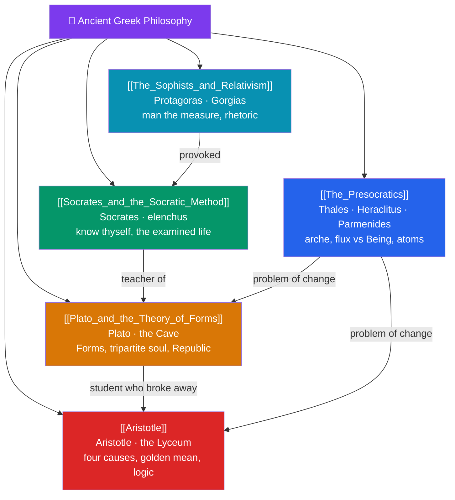

# 🗺️ Ancient Greek Philosophy — Map of Content

> [!abstract] What This Section Covers
> Western philosophy is, in Whitehead's phrase, "footnotes to Plato" — and this section traces where those footnotes begin. **The Presocratics** replace mythology with reasoned cosmology, from Thales' water to Heraclitus' flux, Parmenides' changeless Being, and the atomists' void; **Socrates and the Socratic Method** turns inquiry inward, using the elenchus to expose ignorance in pursuit of the examined life; **Plato and the Theory of Forms** answers Socratic questions with a two-world metaphysics, the allegory of the Cave, the tripartite soul, and the just city of the *Republic*; **Aristotle** brings philosophy back to earth with the four causes, the golden mean, teleology, and the invention of formal logic; and **The Sophists and Relativism** supply the provocative foil — Protagoras' "man is the measure of all things" and the rhetoric Socrates fought. Together they invent metaphysics, ethics, epistemology, and logic in the space of two centuries.

## Concept Map

## Learning Path

1. [[The_Presocratics]] — The first philosophers: Thales, Anaximander, Heraclitus' flux, Parmenides' Being, Pythagoras, and Democritus' atoms.
2. [[The_Sophists_and_Relativism]] — Protagoras, Gorgias, the teaching of rhetoric, and the relativist claim that "man is the measure."
3. [[Socrates_and_the_Socratic_Method]] — The elenchus, Socratic ignorance, virtue as knowledge, and the trial and death recorded by Plato.
4. [[Plato_and_the_Theory_of_Forms]] — The Forms, the divided line, the allegory of the Cave, the tripartite soul, and the ideal *Republic*.
5. [[Aristotle]] — The four causes, hylomorphism, teleology, the golden mean, eudaimonia, and syllogistic logic.

## All Notes at a Glance

| Note | Difficulty | What You'll Learn |
|------|------------|-------------------|
| [[The_Presocratics]] | Beginner → Intermediate | Milesian monists, Heraclitus vs Parmenides, Pythagoreans, Zeno's paradoxes, atomism |
| [[Socrates_and_the_Socratic_Method]] | Beginner | Elenchus, definitional questions, Socratic irony, virtue as knowledge, the *Apology* |
| [[Plato_and_the_Theory_of_Forms]] | Intermediate | Theory of Forms, the Cave, anamnesis, tripartite soul, philosopher-kings, the third man |
| [[Aristotle]] | Intermediate → Advanced | Four causes, form/matter, teleology, virtue and the mean, syllogism, the *Nicomachean Ethics* |
| [[The_Sophists_and_Relativism]] | Beginner → Intermediate | Protagorean relativism, Gorgias' nihilism, nomos vs physis, the rhetoric–philosophy quarrel |

## Key Questions This Section Answers

- How did the Presocratics replace myth with rational explanation of nature?
- What is the Socratic method, and why did Socrates claim to know nothing?
- What are Plato's Forms, and what problem do they solve?
- How does Aristotle's four-cause explanation and golden mean differ from Plato's idealism?
- Is "man the measure of all things" — is truth relative to the perceiver?

## Related Sections

- [[_MOC_Philosophy_Master|↑ Philosophy Master MOC]]
- [[_MOC_Phil_Introduction|← Introduction and Logic]]
- [[_MOC_Hellenistic_Roman_Philosophy|→ Hellenistic and Roman Philosophy]]
- Cross-vault: [[_MOC_History_Master]] (Classical Greece), [[_MOC_Mythology_Master]] (from mythos to logos)

#MOC #Philosophy #AncientGreek
