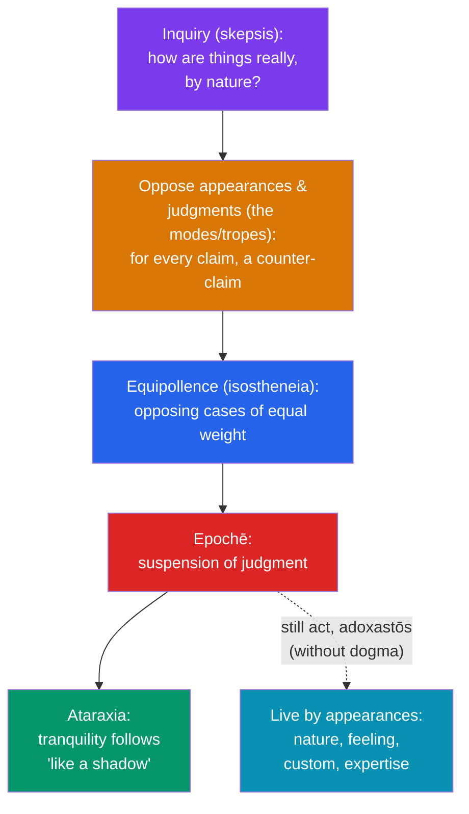

# 🤔 Ancient Skepticism

> [!abstract] TL;DR
> Ancient skepticism (from *skepsis*, "inquiry") comes in two distinct strands. **Pyrrhonism**, tracing to **Pyrrho of Elis** and systematized by **Sextus Empiricus**, sets appearances and arguments in opposition until they balance in *equipollence*, producing ***epochē*** (suspension of judgment), which is unexpectedly followed by ***ataraxia*** (tranquility). Its toolkit is the **ten modes** of Aenesidemus and the **five modes** of Agrippa (the famous regress–circularity–assumption trilemma). **Academic skepticism**, arising inside Plato's own Academy under **Arcesilaus** and **Carneades**, attacked the Stoic claim to certain knowledge and defended acting on the merely "persuasive" or "probable." The key contrast: Pyrrhonists suspend judgment even about whether knowledge is possible and keep inquiring, whereas the Academics were charged with the "negative dogmatism" of asserting that nothing *can* be known.

## Intuition — analogy first

Imagine a **perfectly balanced set of scales**.

Pile evidence and argument onto the left pan — the case that the stick in the water is *bent*. Now pile the opposing case onto the right pan — the argument that it is *straight*. If you are honest and thorough, the skeptic claims, you will find the two pans settle at exactly the same height: neither side wins. This equal weight is *equipollence*. And when the scales hang level, there is nothing to do but let go of the lever — you **suspend judgment**.

Here is the surprising part. The person who *needed* to know whether the stick was really bent was tense, anxious, invested. The moment they stop insisting on an answer the reality-question can't deliver, the tension drains away. Tranquility arrives not by *solving* the puzzle but by *setting it down*. The skeptic still sees the stick, still uses it, still pulls it from the water — they simply stop asserting what it is "in its own nature."

---

## How It Works — From Inquiry to Tranquility

The Pyrrhonist's method is a repeatable pipeline: oppose, balance, suspend, and find peace — while still living by how things *appear*.

Sextus tells the story of the painter **Apelles**, who could not render the foam on a horse's mouth. In frustration he hurled his cleaning-sponge at the panel — and the random splatter produced the foam perfectly. Just so, the skeptic sought tranquility *by settling the questions*, failed, gave up in suspension — and tranquility arrived on its own.

## Key Concepts

### Pyrrho and the Origins

**Pyrrho of Elis** (c. 360–270 BCE) wrote nothing; he is known through his pupil **Timon of Phlius** and a summary preserved by Aristocles (via Eusebius). That summary poses three questions and gives the canonical skeptical answers:

1. **What are things like by nature?** — They are *indeterminate, unstable, and indiscriminable*; no perception or judgment is more true than its opposite.
2. **What attitude should we take toward them?** — Hold no firm opinions; say *ou mallon* ("no more this than that").
3. **What follows for those who do?** — First *aphasia* (non-assertion), then *ataraxia* (tranquility).

### Sextus Empiricus and the Skeptic "Way"

Pyrrhonism was revived by **Aenesidemus** (1st c. BCE), who broke away from an Academy he thought had grown dogmatic. Our richest source is the physician **Sextus Empiricus** (c. 160–210 CE), whose *Outlines of Pyrrhonism* defines the skeptic as an ongoing **inquirer** (*zētētikos*), not a denier. The skeptic's **watchword is a "way"** (*agōgē*), not a doctrine: oppose things until you reach *isostheneia* (equal strength), which forces *epochē*, which is shadowed by *ataraxia*. Crucially the skeptic reports only how things ***appear*** to them ("the honey seems sweet") and refuses any claim about how things ***are*** ("the honey is sweet by nature").

### The Ten Modes of Aenesidemus

Systematic argument-schemas for inducing suspension, all turning on **relativity** — the same object appears differently depending on the perceiver and conditions:

| # | Mode (variation among…) | Example |
|---|---|---|
| 1 | Animals | The same water soothes humans, kills fish |
| 2 | Humans | Food that suits one person sickens another |
| 3 | The senses | A painting looks smooth (sight) yet is ridged (touch) |
| 4 | States/circumstances | Wine tastes sour to the sick, sweet to the well |
| 5 | Positions/distances/places | A tower looks round from afar, square up close |
| 6 | Mixtures | A sound differs in dense vs. thin air |
| 7 | Quantities | A little wine strengthens, much weakens |
| 8 | Relativity | Everything is grasped only *in relation to* something |
| 9 | Frequency | A comet startles; the daily sun does not |
| 10 | Customs, laws, myths | What is pious in one culture is forbidden in another |

### The Five Modes of Agrippa — The Trilemma

A tighter, more abstract set attributed to **Agrippa**, aimed at any attempt to *justify* a claim: **(1) disagreement**, **(2) infinite regress**, **(3) relativity**, **(4) hypothesis** (arbitrary assumption), **(5) circularity**. Their core — the **Agrippan (or Münchhausen) trilemma** — is that every justification must terminate in one of three unacceptable ways: an **infinite regress** of reasons, a **circle** in which the conclusion supports its own premise, or a **dogmatic assumption** simply posited without support. This trilemma remains a live problem in modern epistemology.

### Answering the "Inactivity" Objection

Critics (chiefly Stoics) charged that a skeptic who believes nothing cannot act — the *apraxia* objection. Sextus replies that the skeptic lives *adoxastōs* — "without dogma" but not without guidance — following a **fourfold observance**: the guidance of **nature** (perception, thought), the compulsion of the **feelings** (hunger, thirst), the handing-down of **laws and customs**, and the **instruction of the arts** (crafts). One can cook, vote, and heal by how things appear without asserting their ultimate nature.

### Academic Skepticism

Meanwhile Plato's own **Academy** turned skeptical for roughly two centuries (the "Middle" and "New" Academy):

- **Arcesilaus** (c. 316–241 BCE), head of the Academy, made the Stoics his target. He attacked their linchpin concept, the **cognitive (apprehensive) impression** (*katalēptikē phantasia*) — the Stoic guarantee of a self-certifying true perception — arguing no impression carries such a mark, so nothing can be *cognized* (*akatalēpsia*). His practical criterion for action was **the reasonable** (*eulogon*).
- **Carneades** (214–129 BCE), the Academy's most formidable mind, famously joined a Roman embassy in 155 BCE and argued brilliantly *for* justice one day and *against* it the next, scandalizing Cato. He refined a positive **criterion of action without truth**: the **persuasive/probable impression** (*pithanon*), graded from merely persuasive, to persuasive-and-uncontradicted, to persuasive-uncontradicted-and-tested. This is an early **fallibilist probabilism** — act on what is credible while conceding it may be false.

### Pyrrhonist vs. Academic — The Decisive Difference

| | **Pyrrhonism** | **Academic Skepticism** |
|---|---|---|
| Origin | Pyrrho → Aenesidemus → Sextus | Plato's Academy (Arcesilaus, Carneades) |
| Core stance | Suspend judgment; **keep inquiring** | (As charged) assert that **nothing can be known** |
| Attitude to skepticism itself | Won't even affirm "knowledge is impossible" | Accused of *negative dogmatism* about this |
| Primary aim | *Ataraxia* — a way of life | Dialectical refutation, esp. of the Stoics |
| Criterion for living | Appearances (*phainomena*) | The reasonable / the persuasive (*pithanon*) |

Sextus draws the line sharply: the Academic *dogmatically affirms* that things are inapprehensible, which is itself a knowledge-claim and arguably self-undermining; the Pyrrhonist merely *reports* how things seem and goes on investigating. (Modern scholars note Carneades' probabilism was itself offered undogmatically, so the contrast is partly Sextus's polemic.)

## Arguments & Examples

- **The self-refutation worry, defused.** "You claim nothing can be known — but is *that* known?" The Pyrrhonist sidesteps it: they assert no such thesis. Sextus compares skeptical statements to a **purgative** that flushes itself out along with the humors — the phrase "no more this than that" applies to itself and does not survive as a standing doctrine.
- **The tower and the oar.** A square tower looks round from a distance; an oar looks bent in water. Which is the tower "in itself"? The skeptic: we only ever have *appearances* relative to distance and medium, never a view from nowhere to adjudicate them — so, *epochē*.
- **Carneades' two speeches on justice.** By constructing equally strong cases for and against justice, Carneades demonstrated *isostheneia* in practice and exposed the fragility of confident moral dogmatism — while still recommending we live by the *pithanon*, the persuasive.
- **The Agrippan trilemma in action.** Ask "why believe P?" Answer Q. "Why Q?" Answer R… Either the chain runs forever (regress), loops back to P (circularity), or halts at an unjustified "just because" (assumption). Every knowledge-claim, the skeptic argues, faces this fork — a challenge foundationalists, coherentists, and infinitists still answer today.

## Common Pitfalls / Misconceptions

- **"Skeptics believe nothing and can't function."** They act constantly — on *appearances*, without asserting the underlying reality. Skepticism is a stance toward *dogmatic* claims, not a paralysis.
- **Conflating the two schools.** "Ancient skepticism" is not one thing. Pyrrhonists suspend even the meta-claim "knowledge is impossible"; the Academics (on Sextus's reading) assert it.
- **Modern "skeptic" ≠ ancient skeptic.** Today a "skeptic" is often a debunker who *confidently denies* (ghosts, astrology). The ancient Pyrrhonist denies nothing and affirms nothing — that confidence would itself be dogmatism.
- **Thinking *epochē* is a doctrine.** It is a *state that happens to you* once the arguments balance, not a belief you adopt. You don't decide to suspend; equipollence suspends you.
- **Assuming doubt causes anxiety.** For the Pyrrhonist the causal arrow runs the other way: the search for certainty caused the anxiety; suspending it brings the calm.

## Related Concepts

- [[_MOC_Hellenistic_Roman_Philosophy|↑ Section MOC]]
- [[Stoicism]] — The skeptics' favorite target: Academic attacks on the "cognitive impression" were aimed squarely at Stoic epistemology.
- [[Epicureanism]] — A rival route to *ataraxia*: Epicureans reach tranquility by *holding* the right (atomist) doctrines; skeptics by holding *none*.
- [[Cynicism_and_Neoplatonism]] — The Academy's later Neoplatonic turn reversed its skeptical phase, re-dogmatizing Plato.
- Cross-vault: [[_MOC_Epistemology]] — The Agrippan/Münchhausen trilemma as a founding problem of justification theory.
- Cross-vault: [[_MOC_Ancient_Greek_Philosophy]] — Plato's Academy, whose skeptical centuries produced Arcesilaus and Carneades.
- Cross-vault: [[_MOC_Modern_Contemporary_Philosophy]] — Descartes' methodic doubt and Hume's mitigated skepticism as heirs of the ancient debate.

## Review Questions

1. Trace the Pyrrhonist pipeline from *isostheneia* to *ataraxia*. Why does Sextus insist tranquility arrives "like a shadow" rather than being pursued directly?
2. State the Agrippan trilemma and explain why each of its three horns (regress, circularity, assumption) is supposed to be unacceptable. How is this relevant to modern debates in epistemology?
3. Sextus accuses the Academics of "negative dogmatism." Explain the charge, and assess whether Carneades' theory of the *pithanon* escapes it.

## Sources

- Sextus Empiricus. *Outlines of Scepticism*. Trans. J. Annas & J. Barnes, Cambridge University Press (2000).
- Long, A. A. & Sedley, D. N. (1987). *The Hellenistic Philosophers*, Vol. 1. Cambridge University Press.
- Annas, J. & Barnes, J. (1985). *The Modes of Scepticism: Ancient Texts and Modern Interpretations*. Cambridge University Press.
- Bett, R. (ed.) (2010). *The Cambridge Companion to Ancient Scepticism*. Cambridge University Press.

#philosophy #hellenistic #skepticism #epistemology #epoche
