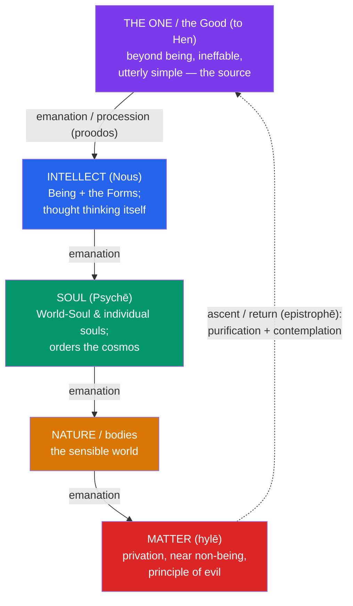

# 🐕 Cynicism and Neoplatonism

> [!abstract] TL;DR
> This note brackets the Hellenistic-Roman era with its two most extreme responses to the question of how to live. **Cynicism**, embodied by **Diogenes of Sinope** (c. 412–323 BCE), strips life down to nature (*kata physin*), rejecting wealth, status, and social convention (*nomos*) through radical self-sufficiency, ascetic training, shameless public living, and fearless truth-telling (*parrhesia*) — Diogenes lived in a jar and, lamp in hand at midday, said he was "looking for an honest man." **Neoplatonism**, founded by **Plotinus** (c. 204–270 CE) in the *Enneads*, moves in the opposite direction: reality overflows (*emanates*) from a single ineffable source, **the One**, through **Intellect** and **Soul** down to matter, and the philosopher's task is the *ascent* of the soul back to mystical union with the One. Neoplatonism profoundly shaped **Augustine** and the whole current of Christian mysticism.

## Intuition — analogy first

Picture a single **vertical axis** with humanity in the middle.

**Diogenes points downward and outward** — toward the ground, the animals, raw nature. His question is: strip away money, titles, manners, shame, property — what is *actually* needed to be a happy human being? His shocking answer is *almost nothing*. Like a dog (the origin of "Cynic," from *kynikos*), he eats, sleeps, and speaks wherever he is, exposing how much of our misery is manufactured by convention we mistake for necessity.

**Plotinus points upward** — toward a source so unified and perfect that everything else is its overflow, the way light streams from the sun or heat radiates from fire without the sun or fire being diminished. His question is: if all this multiplicity flows down from one perfect source, can the soul *climb back up* the stream to its origin?

One philosopher purifies by *subtraction* (shed convention, return to nature); the other by *ascent* (turn inward and upward, return to the One). Between these poles the whole era's search for the good life is stretched taut.

---

## How It Works — Emanation and Return

Neoplatonism's signature structure is a ladder of reality that *proceeds* downward from the One and along which the soul can *revert* upward.

The Cynic axis runs the *other* way: not up toward the One but *down* to nature — a deliberate descent past convention to what the animal body actually requires. Holding the two together shows the era's full range: minimal earthly life at one end, mystical transcendence at the other.

## Key Concepts

### Cynicism — Life According to Nature

**"Cynic"** comes from *kynikos*, "dog-like" — a label Diogenes embraced, praising the dog's shamelessness, self-sufficiency, and honesty. **Antisthenes**, a pupil of Socrates, is often named a forerunner, but **Diogenes of Sinope** is the archetype. Exiled from Sinope (the charge involved "defacing the currency" — *paracharattein to nomisma* — which later became his metaphorical mission: to **"deface the counterfeit coin" of social convention**), he settled in Athens and lived in a large ceramic jar (*pithos*), owning almost nothing.

The Cynic program has a few tightly linked commitments:

- **Nature vs. convention** (*physis* vs. *nomos*) — most human suffering comes from artificial conventions (money, rank, etiquette, shame) mistaken for necessities; the good life follows *nature*.
- **Self-sufficiency** (*autarkeia*) — depend on as little as possible; needs are the leash by which the world controls you.
- **Ascetic training** (*askēsis*) — deliberately practice hardship (embracing cold, hunger, discomfort) to build freedom from it.
- **Shamelessness** (*anaideia*) — performing "natural" acts in public to expose the arbitrariness of shame conventions; provocation as pedagogy.
- **Frank speech** (*parrhesia*) — fearless truth-telling to anyone, regardless of power or offense.

Diogenes also declared himself a *kosmopolitēs*, a **"citizen of the world"** — reportedly the first to use the word — a seed that flowered in Stoic cosmopolitanism. Indeed **Cynicism was the direct parent of Stoicism**: Zeno of Citium studied under the Cynic **Crates of Thebes** (who, with his partner **Hipparchia**, one of antiquity's few recorded women philosophers, gave away a fortune to live the Cynic life). The Stoics called Cynicism "a short cut to virtue."

### Cynic Anecdotes as Arguments

Cynic teaching came less through treatises than through **performed provocations** (*chreiai*, pointed anecdotes) — each a compressed philosophical claim:

| Anecdote | The point it dramatizes |
|---|---|
| Lives in a jar, owns only a cloak, staff, and bag | *Autarkeia* — happiness needs almost nothing |
| Throws away his cup on seeing a boy drink from cupped hands | Even a "necessity" was surplus convention |
| Lamp in daylight: "I am looking for a human being" | Indictment of a crowd that has lost genuine virtue |
| To Alexander the Great: "Stand out of my sunlight" | The self-sufficient sage needs nothing a king can give |
| Plucked chicken tossed into the Academy: "Here is Plato's man" | Mocks abstract definitions ("featherless biped") divorced from life |

### Neoplatonism — The One and Emanation

Four centuries later, **Plotinus** (c. 204–270 CE), who studied under **Ammonius Saccas** in Alexandria and taught in Rome, produced the last great pagan philosophical system. His pupil **Porphyry** edited his writings into the ***Enneads*** ("nines" — six sets of nine treatises). Plotinus reads **Plato** through a mystical lens, positing three primary **hypostases** (levels of reality):

- **The One** (*to Hen*), or the **Good** — utterly transcendent, *beyond being and thought*, without parts or predicates, ineffable. It can be approached only by **negation** (apophatic theology, "not this, not that") or by direct mystical union. It is the ungenerated source of all.
- **Intellect** (*Nous*) — the first emanation: the realm of true **Being** and the **Platonic Forms**, a divine mind whose thought and object are one ("thought thinking itself").
- **Soul** (*Psychē*) — emanating from Nous; the **World-Soul** and individual souls, mediating between the intelligible and the sensible and generating and ordering the physical cosmos (whose lower phase is **Nature**).

**Emanation** (procession, *proodos*) is the key mechanism: lower levels overflow **necessarily and timelessly** from higher ones, *like light from the sun or radiance from a lamp*, without the source being diminished or "choosing" to create. Each successive level is less unified and less perfect, down to **matter** — near non-being, defined by *privation*, and thus (as sheer absence of good and form) the **principle of evil**.

### The Ascent of the Soul (Return)

Because everything proceeds from the One, everything also *yearns back* toward it — the counter-movement of **return / reversion** (*epistrophē*). The human soul, "fallen" into embodiment, can reascend: through moral **purification** (*katharsis*) and the virtues, then turning inward and upward through Soul and Intellect, to a final **mystical union** (*henōsis*) with the One — the *"flight of the alone to the Alone."* Porphyry reports that Plotinus achieved this union four times in the years they were together. Later Neoplatonists diverged on method: **Iamblichus** added ritual **theurgy**; **Proclus** produced the great systematization (*Elements of Theology*) before the emperor Justinian closed the Athenian school in **529 CE**.

### Influence on Augustine and Christian Thought

Neoplatonism became the philosophical vocabulary of much early Christian theology:

- **Augustine of Hippo** (*Confessions*, Book VII) records reading "the books of the Platonists" (*libri Platonicorum* — Plotinus and Porphyry, via Marius Victorinus). They taught him to conceive **God as immaterial** and **evil as the privation of good** (*privatio boni*) rather than a rival substance — decisively freeing him from Manichaean dualism and easing his path to conversion.
- **Pseudo-Dionysius the Areopagite** channeled Neoplatonic **apophatic (negative) theology** and celestial **hierarchy** into Christian mysticism, shaping medieval thought from Aquinas to Eckhart.
- The identification of the transcendent **One/Good with God** echoes through **Boethius**, medieval philosophy, and the Renaissance revival under **Marsilio Ficino**.

## Arguments & Examples

- **Diogenes vs. Alexander.** When the most powerful man in the world offered him anything he wished, Diogenes asked only that Alexander step out of his light. The scene is an argument: the sage's happiness rests on nothing external, so worldly power has *nothing to offer* him — and Alexander's reported reply, "If I were not Alexander, I would be Diogenes," concedes the point.
- **The counterfeit-currency metaphor.** Diogenes turned the crime that exiled him into his mission statement: just as he had "defaced the coinage," philosophy must *deface the counterfeit coin of convention* — testing every social value against nature and refusing the ones that fail.
- **Why the One must be "beyond being."** Plotinus argues that whatever *is* a being is one *particular* thing — bounded, composite, describable. The source of *all* beings and all unity cannot itself be just one more bounded being; it must be **prior to and beyond being**, the sheer unity that lets anything be one thing at all. Hence it is approached only by negation.
- **Evil as privation, not substance.** If the One/Good is the source of all that *is*, evil cannot be a positive rival substance (as the Manichaeans held) — it can only be a *deficiency*, a falling-away from being and good, located at the far, matter-ward end of emanation. Augustine seized on exactly this to solve the problem that had trapped him for years.
- **Two purifications, one goal.** The Cynic purifies by *subtracting convention* to reach nature; the Neoplatonist purifies by *subtracting attachment to the body* to reach the One. Both treat philosophy as *askēsis* — training that transforms the self — not merely as theory.

## Common Pitfalls / Misconceptions

- **"Cynic" = today's cynic (sneering, distrustful pessimist).** The ancient Cynic was a rigorous *moral idealist* practicing virtue through radical simplicity — closer to an ascetic reformer than a jaded skeptic.
- **Cynicism as mere shock or laziness.** The shamelessness was *deliberate pedagogy* backed by demanding physical *askēsis*; it took enormous discipline, not indifference.
- **Reading emanation as deliberate "creation from nothing."** For Plotinus emanation is **necessary, non-volitional, and eternal** — the One does not decide, plan, or act in time. This differs sharply from the Judeo-Christian *creatio ex nihilo*, a difference later Christian Neoplatonists had to renegotiate.
- **Calling Neoplatonism "Plato's own view."** It is a late, systematized, mystical *interpretation* of Plato (fused with Aristotelian and Stoic elements), not Plato's own texts — hence the modern label "**Neo**-Platonism."
- **Treating matter's "evil" as moral malice.** Matter is evil only as *privation* — the outermost thinning of being and good — not as an active malevolent force.

## Related Concepts

- [[_MOC_Hellenistic_Roman_Philosophy|↑ Section MOC]]
- [[Stoicism]] — The direct Cynic heir: Zeno studied under the Cynic Crates, and Cynic *autarkeia* and cosmopolitanism became core Stoic themes.
- [[Epicureanism]] — Shares the Cynic taste for simplicity, but for the opposite reason (minimizing pain rather than defying convention).
- [[Ancient_Skepticism]] — The Academy that turned skeptical was the same Platonic school Neoplatonism later re-dogmatized.
- Cross-vault: [[_MOC_Ancient_Greek_Philosophy]] — Socrates (Cynic ancestor) and Plato (whose Forms Neoplatonism transforms).
- Cross-vault: [[_MOC_Medieval_Philosophy]] — Augustine, Pseudo-Dionysius, and Boethius carry Neoplatonism into Christian thought.
- Cross-vault: [[_MOC_Metaphysics]] — Emanation, the Great Chain of Being, and the One as first principle.

## Review Questions

1. Explain the Cynic distinction between *physis* and *nomos*. Choose two Diogenes anecdotes and show precisely what philosophical claim each is designed to dramatize.
2. Lay out Plotinus's three hypostases and the mechanism of emanation. Why does Plotinus insist the One is "beyond being," and why must matter be the "principle of evil" on this scheme?
3. How did Neoplatonism help Augustine escape Manichaean dualism? Identify the two specific ideas he took from "the books of the Platonists" and explain their theological payoff.

## Sources

- Plotinus. *The Enneads*. Trans. Stephen MacKenna / or Lloyd P. Gerson et al. (Cambridge, 2018).
- Diogenes Laertius. *Lives of Eminent Philosophers*, Book VI (the Cynics). Trans. Pamela Mensch (Oxford, 2018).
- Augustine. *Confessions*, Book VII. Trans. Henry Chadwick, Oxford World's Classics (1991).
- Gerson, L. P. (ed.) (1996). *The Cambridge Companion to Plotinus*. Cambridge University Press.

#philosophy #hellenistic #cynicism #neoplatonism #the-one
