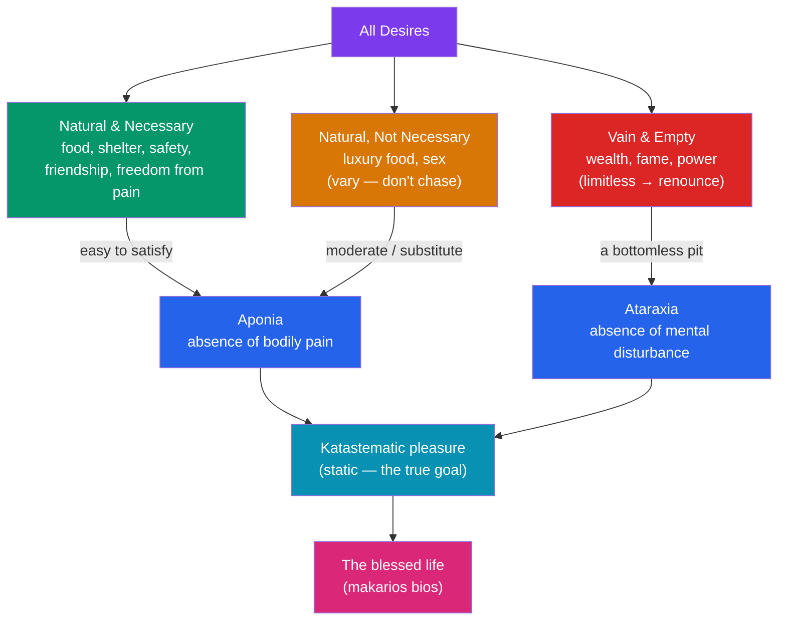

# 🌿 Epicureanism

> [!abstract] TL;DR
> **Epicurus** (341–270 BCE) founded a school in Athens called **the Garden**, teaching that **pleasure is the highest good** — but pleasure *properly understood*. The goal is not indulgence but a stable, tranquil state: ***ataraxia*** (freedom from mental disturbance) and ***aponia*** (freedom from bodily pain). Since the greatest pleasure is simply the *removal of pain*, a simple, friendship-rich life easily secures it. Epicurus was a thoroughgoing **materialist and atomist**: the universe is only atoms and void, the soul dissolves at death, and the gods do not meddle in human affairs. From this physics flows his most famous consolation — **"death is nothing to us"** — and the **tetrapharmakos**, the four-part cure for anxiety. The Roman poet Lucretius immortalized the system in *De Rerum Natura*.

## Intuition — analogy first

Think of pleasure as **quenching thirst**, not as **collecting fine wines**.

When you are parched, a cup of cool water is one of the most intense pleasures imaginable. But notice: the pleasure is the *removal of the thirst*. Once you are no longer thirsty, drinking a rarer, more expensive water cannot make you "more than not-thirsty." It only *varies* the pleasure; it cannot deepen it. The person chasing ever-fancier drinks has misunderstood what pleasure is — and has taken on endless expense, anxiety, and dependence to gain nothing beyond what plain water already gave.

This is the Epicurean move. The ceiling of pleasure is reached the moment pain is removed. Everything past that — luxury, status, wealth, fame — is not "more pleasure" but merely restless *variation*, purchased at the price of the very tranquility pleasure was supposed to deliver. So the shrewdest hedonist lives simply.

---

## How It Works — Desires, Pleasure, and Tranquility

Epicurus sorts desires by whether satisfying them actually removes pain, and routes the mind toward the two stable pleasures that constitute happiness.

## Key Concepts

### The Garden and Its Texts

Around 307/306 BCE Epicurus bought a garden on the outskirts of Athens and made it both a home and a school — famously admitting **women and slaves** as members, radical for the time. Little of his vast output survives directly; our main sources are three letters preserved by **Diogenes Laertius** (to *Herodotus* on physics, to *Pythocles* on astronomy, to *Menoeceus* on ethics), the *Principal Doctrines* (*Kyriai Doxai*), the *Vatican Sayings*, and above all the Latin poem ***De Rerum Natura*** ("On the Nature of Things") by **Lucretius** (c. 99–55 BCE), the fullest surviving exposition.

### Canonic — The Test of Truth

Epicurus was a strict **empiricist**. The criteria of truth are the **senses** (all sensations are true as raw data), **preconceptions** (*prolēpseis* — general concepts built up from repeated experience), and the **feelings** of pleasure and pain, which guide choice and avoidance. Error enters only in our *interpretations* and opinions, not in perception itself.

### Atomism and Materialism

Adopting and revising **Democritus**, Epicurus held that **only atoms and void exist**. Atoms are indivisible, indestructible, infinite in number; void is infinite space. Everything — including the mind and soul — is a temporary configuration of atoms. Crucially, Epicurus added the ***clinamen*** or **"swerve"**: atoms occasionally deviate unpredictably from their straight fall, which (a) explains how collisions and worlds form, and (b) leaves room for **free will** against strict determinism. The soul is corporeal and disperses at death, and the gods, though real and blissful, dwell serenely apart and **never intervene** in the world — removing at a stroke the twin fears of divine punishment and death.

### Hedonism Properly Understood

Pleasure (*hēdonē*) is "the beginning and end of the blessed life" — but Epicurus draws a decisive distinction:

| Type of pleasure | Greek | Nature | Epicurus's verdict |
|---|---|---|---|
| **Kinetic** | *kinetikē hēdonē* | Active, in-process gratification (eating, drinking) | Pleasant, but variable and not the goal |
| **Katastematic** | *katastēmatikē hēdonē* | Static state of being without pain/disturbance | The **true goal**: *aponia* + *ataraxia* |

The highest pleasure is the **complete removal of pain**; once achieved, pleasure "can be varied but not increased." This is why Epicurus, despite being a hedonist, lived on bread, water, and a little cheese, and warned that luxury breeds dependence and fear. **Friendship** (*philia*) he prized above almost all else: *"Of all the things wisdom provides for a blessed life, the greatest by far is friendship."*

### The Tetrapharmakos — The Four-Part Cure

Preserved by the Epicurean **Philodemus**, the *tetrapharmakos* ("four-drug remedy") condenses the first four *Principal Doctrines* into a portable therapy against anxiety:

1. **God is nothing to fear** — the gods are blissful and unconcerned; they neither reward nor punish.
2. **Death is nothing to worry about** — where death is, we are not.
3. **What is good is easy to get** — the pain-removing pleasures (food, shelter, friendship) are cheap and available.
4. **What is terrible is easy to endure** — severe pain is brief; chronic pain is mild and can be outweighed by mental pleasures.

### "Death Is Nothing to Us"

Epicurus's most influential argument (*Letter to Menoeceus*; *Principal Doctrine* 2): *"Death is nothing to us, since when we exist death is not present, and when death is present we do not exist."* Good and evil consist in sensation; death is the **privation of all sensation**; therefore death can be neither good nor bad *for the one who dies* — there is no subject left to be harmed. Lucretius adds the **symmetry argument**: we feel no dread about the infinite time *before* we were born, so it is irrational to dread the symmetric infinity *after* we die.

## Arguments & Examples

- **The hedonic calculus.** Epicurus does not say "always maximize pleasure now." Some pleasures are refused when they bring greater pain (a hangover, debt, ruined health); some pains are chosen for a greater resulting pleasure (a difficult conversation that saves a friendship). Prudence (*phronēsis*), he says, is even more valuable than philosophy itself, because it teaches this weighing.
- **Bread, water, and a pot of cheese.** In a letter Epicurus asks a friend to send "a little pot of cheese, so that I may feast whenever I like." The "feast" of the arch-hedonist is a modest treat — a deliberate rebuttal to the slander (spread by rivals and later moralists) that "epicurean" means gluttony and orgy.
- **The empty pursuit of wealth.** *Principal Doctrine* 15: "Natural wealth is both limited and easy to obtain; the wealth demanded by empty opinion extends without limit." The billionaire anxious about the next billion illustrates a *vain and empty* desire that can never reach *ataraxia*.
- **Answering the fear of death.** To someone terrified of non-existence, the Epicurean replies: name the harm. Pain? There is no sensation. Loss? There is no one left to feel deprived. The fear survives only by smuggling a conscious "you" into a state defined by the absence of any "you."
- ***Lathe biōsas* — "live unnoticed."** Because political ambition breeds fear, rivalry, and dependence on others' opinions, Epicurus advised withdrawing from public life into the tranquil community of friends — the opposite of the Stoic emphasis on civic duty.

## Common Pitfalls / Misconceptions

- **"Epicurean" = gourmet indulgence and luxury.** The exact reverse of Epicurus's own counsel of simplicity. The modern culinary sense is a later distortion of a philosophy that recommended bread and water.
- **Hedonism = "chase maximum intense pleasure."** Epicurus's goal is a *static* absence of pain and anxiety, not a peak of stimulation. Intense pleasures are unstable and often boomerang into pain.
- **"Atheism."** Epicurus did **not** deny the gods; he denied that they *care about or interfere with* us. His target is superstition and the fear it breeds, not the divine as such.
- **The swerve as caprice.** The *clinamen* is not "randomness explains everything." It is a minimal indeterminacy introduced precisely to preserve **agency** within an otherwise mechanistic universe.
- **Treating "death is nothing to us" as denying grief.** The argument concerns whether death harms *the one who dies*. It says little about the survivors' loss — a common point of critique.

## Related Concepts

- [[_MOC_Hellenistic_Roman_Philosophy|↑ Section MOC]]
- [[Stoicism]] — The chief rival: both aim at tranquility, but Stoics ground the good in virtue and a providential cosmos, Epicureans in pleasure and a godless atomic one.
- [[Ancient_Skepticism]] — Shares the target of *ataraxia*, but reaches it by suspending judgment rather than by holding the "correct" atomist doctrines.
- [[Cynicism_and_Neoplatonism]] — Cynic simplicity parallels Epicurean frugality, though for opposite reasons (defying convention vs. minimizing pain).
- Cross-vault: [[_MOC_Ancient_Greek_Philosophy]] — Democritus' atomism, the direct ancestor of Epicurean physics.
- Cross-vault: [[Virtue_Ethics]] — Contrast: Epicureanism makes prudence instrumental to pleasure, not virtue an end in itself.
- Cross-vault: [[_MOC_History_Master]] — Late Republic Rome, the setting of Lucretius' *De Rerum Natura*.

## Review Questions

1. Explain the difference between kinetic and katastematic pleasure. Using this distinction, reconstruct Epicurus's argument that a person who has removed pain cannot become *happier* by acquiring luxuries.
2. State the four lines of the *tetrapharmakos* and match each to one of Epicurus's underlying doctrines (about gods, death, good, and pain). Why does he think this "cure" delivers tranquility?
3. Present the argument "death is nothing to us," then present the strongest objection you can (e.g., the deprivation account of the badness of death). How might an Epicurean reply?

## Sources

- Epicurus. *The Epicurus Reader: Selected Writings and Testimonia*. Trans. B. Inwood & L. P. Gerson, Hackett (1994).
- Lucretius. *On the Nature of Things (De Rerum Natura)*. Trans. Martin Ferguson Smith, Hackett (2001).
- Long, A. A. & Sedley, D. N. (1987). *The Hellenistic Philosophers*, Vol. 1. Cambridge University Press.
- Warren, J. (ed.) (2009). *The Cambridge Companion to Epicureanism*. Cambridge University Press.

#philosophy #hellenistic #epicureanism #hedonism #atomism
