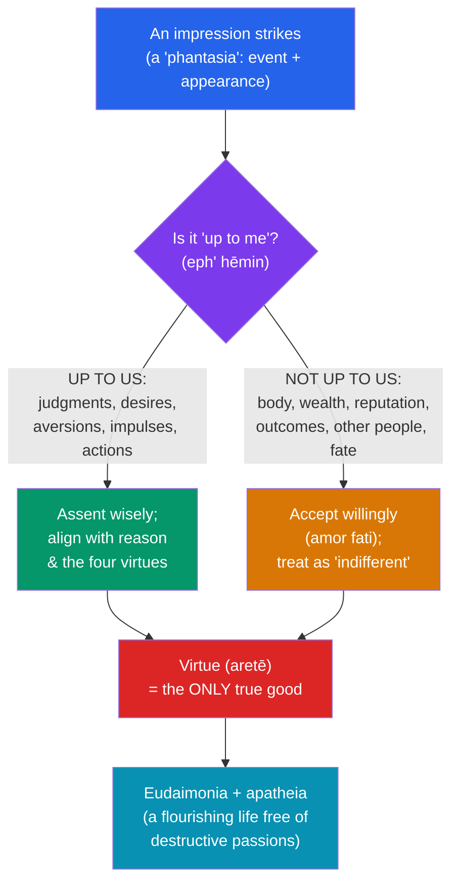

# 🏛️ Stoicism

> [!abstract] TL;DR
> Stoicism, founded by **Zeno of Citium** around 300 BCE at the Stoa Poikile (Painted Porch) in Athens, holds that the good life comes from living "in agreement with nature" — that is, in accordance with reason (the cosmic *Logos*). Its central practical teaching is the **dichotomy of control**: some things are "up to us" (our judgments, desires, and actions) and some are not (bodies, wealth, reputation, outcomes). **Virtue is the only true good**; everything else is an "indifferent." By correcting our judgments we free ourselves from destructive passions (*apatheia*) and accept fate willingly (*amor fati*). Transmitted by three Roman figures — the freed slave **Epictetus**, the statesman **Seneca**, and the emperor **Marcus Aurelius** — Stoicism became a therapy of the soul, and its cognitive core directly seeded modern **[[Cognitive_Behavioral_Therapy]]**.

## Intuition — analogy first

Think of a Stoic as an **archer** aiming at a distant target on a windy day (an analogy the Stoics themselves used).

The archer trains for years, chooses the best arrow, judges the wind, draws, and releases with perfect form. But once the arrow leaves the bow, a sudden gust can carry it off course. The Stoic point: the archer's *goal* was never really "hit the target" — that outcome depends on wind, on the target moving, on a thousand things beyond control. The archer's true good was **shooting well** — doing everything within his power excellently. If he did that and still missed, he has lost nothing that was ever his.

Stoicism relocates your entire sense of success and failure from the *outcome* (not up to you) to the *quality of your own action and judgment* (entirely up to you). You still aim to win, heal, and prosper — you "prefer" those results — but your serenity no longer hangs on them. That single move dissolves most anxiety at its root.

---

## How It Works — The Dichotomy of Control

The engine of Stoic practice is a triage performed on every impression (*phantasia*) that strikes the mind.

Epictetus opens the *Enchiridion* with exactly this division: *"Some things are within our power, while others are not."* Suffering, he argues, comes from staking our well-being on the second category. The cure is to withdraw desire and aversion from externals and invest them only in the excellence of our own responses.

## Key Concepts

### The Three Parts of Philosophy

The Stoics divided philosophy into **logic**, **physics**, and **ethics**, and insisted the three are one system — Chrysippus (the "second founder," c. 279–206 BCE) systematized it. Ethics rests on physics: the universe is a single rational, providential, and deterministic whole pervaded by the *Logos* (divine reason, identified with God, Zeus, fate, and nature). To "live according to nature" therefore means to live according to *reason* — both the reason within us and the reason governing the cosmos.

### Virtue as the Only Good; the Indifferents

For the Stoics, **virtue (*aretē*) is the sole genuine good and vice the sole evil**. Everything else — health, wealth, reputation, pleasure, even life itself — is strictly *indifferent* (*adiaphora*) to happiness. But indifferents are ranked: "**preferred**" (*proēgmena* — health, wealth) and "**dispreferred**" (*apoproēgmena* — sickness, poverty). A sage rationally selects the preferred while knowing his happiness never depends on getting them.

| Category | Greek term | Examples | Bearing on happiness |
|---|---|---|---|
| The Good | *agathon* | Wisdom, justice, courage, temperance (virtue) | The only thing that makes a life good |
| The Bad | *kakon* | Folly, injustice, cowardice, intemperance (vice) | The only thing that makes a life bad |
| Preferred indifferents | *proēgmena* | Health, wealth, reputation, life | Rationally selected, but not *good* |
| Dispreferred indifferents | *apoproēgmena* | Illness, poverty, obscurity, death | Rationally avoided, but not *bad* |

### The Four Cardinal Virtues

Stoic virtue is a single unified excellence with four aspects (any one entails the rest — the **unity of virtue**):

- **Wisdom / Practical Reason** (*phronēsis*) — knowing what is truly good, bad, and indifferent.
- **Courage** (*andreia*) — acting rightly in the face of fear, pain, and death.
- **Justice** (*dikaiosynē*) — giving each their due; fairness and social duty.
- **Temperance / Moderation** (*sōphrosynē*) — self-command over appetite and impulse.

### Passions and *Apatheia*

For the Stoics the destructive **passions** (*pathē* — fear, craving, distress, inflated pleasure) are not brute feelings but **mistaken value-judgments**: to grieve is to have judged that some external loss is a genuine evil. Correcting the judgment dissolves the passion. The sage attains ***apatheia*** — freedom from these *irrational* passions — but this is **not apathy**. The sage retains rational "good feelings" (*eupatheiai*): joy, rational caution, and rational wishing.

### Cosmopolitanism and *Oikeiōsis*

Because all humans share in the *Logos*, each of us is a *kosmopolitēs* — a **"citizen of the world."** The Stoic Hierocles described concentric **circles of concern** (self, family, community, humanity) and urged us to draw the outer circles inward, treating strangers as kin. Marcus Aurelius: reason makes the whole world "a single city."

### *Amor Fati* and the Reserve Clause

The Stoic accepts fate not grudgingly but with love — an attitude later named ***amor fati*** ("love of fate") by Nietzsche, though its substance is pure Epictetus: *"Do not seek to have events happen as you wish, but wish them to happen as they do, and you will go on well."* In action the Stoic adds a **reserve clause** (*hupexhairesis*) — "I will do X, *fate permitting*" — pursuing goals wholeheartedly while pre-accepting any outcome. Pierre Hadot organized Stoic practice into three disciplines: of **desire** (accept fate), **action** (serve the common good), and **assent** (judge impressions correctly).

### The Three Roman Stoics

| Figure | Role | Key work | Signature theme |
|---|---|---|---|
| **Epictetus** (c. 50–135 CE) | Former slave, teacher | *Discourses*, *Enchiridion* (recorded by Arrian) | Dichotomy of control; freedom through discipline |
| **Seneca** (c. 4 BCE–65 CE) | Statesman, adviser to Nero | *Letters to Lucilius*, *On the Shortness of Life* | Time, adversity, *premeditatio malorum* |
| **Marcus Aurelius** (121–180 CE) | Roman emperor | *Meditations* (private notebook, in Greek) | View from above; duty; impermanence |

## Arguments & Examples

- **"Men are disturbed not by things, but by their judgments about things"** (*Enchiridion* 5). This single sentence is the Stoic thesis in miniature and the seed of cognitive therapy: distress is mediated by an evaluative belief, so revising the belief changes the emotion.
- **The reframed misfortunes.** Epictetus: if you kiss your child goodnight, remind yourself she is mortal — not to poison the moment but to hold the loving fact that she was never a possession you owned. When a favorite cup breaks, say "I knew it was breakable." The practice (*premeditatio malorum*, "premeditation of adversities") rehearses loss so it cannot ambush your judgment.
- **The archer / the ball-player.** The Stoics distinguished the *goal* (skopos — hitting the target) from the *aim* (telos — shooting well). You may lose the game and still have played it excellently; only the second was ever yours.
- **Compatibilist freedom — Chrysippus' cylinder.** How can we be responsible if fate is fixed? Chrysippus: give a cylinder a push (external cause) and it rolls *because of its own shape* (internal cause). Fate supplies the push; your character supplies the response. Responsibility lives in the second.
- **The CBT bridge.** Aaron T. Beck's cognitive therapy and Albert Ellis's Rational-Emotive Behavior Therapy (REBT) both explicitly credit Epictetus. Ellis's **ABC model** — an **A**ctivating event, a **B**elief about it, and the emotional **C**onsequence — is a modern restatement of "disturbed by judgments, not things." A missed promotion (A) does not cause despair; the belief "I am worthless without it" (B) does — and B is up to us. See **[[Cognitive_Behavioral_Therapy]]**.

## Common Pitfalls / Misconceptions

- **"Stoic" = emotionless / suppressing feelings.** Wrong twice over. *Apatheia* targets only *irrational* passions grounded in false value-judgments; the sage feels rational joy and love (*eupatheiai*). Bottling up an emotion is the opposite of dissolving the judgment that produces it.
- **Passive resignation / fatalism.** Stoics were vigorously active — generals, statesmen, teachers. The reserve clause means *act fully, then accept the result*, not "do nothing because it's all fated."
- **"Indifferents mean you shouldn't care about health or wealth."** You rationally *prefer* them; you simply refuse to make your happiness hostage to them. Preferring is not the same as valuing as *good*.
- **Confusing the Stoics with "stoic" (lowercase).** The pop-culture "stiff upper lip" is a caricature. Ancient Stoicism is a full system of logic, physics, and ethics, not merely enduring hardship silently.
- **Thinking virtue is a means to tranquility.** Strictly, virtue is chosen for its own sake; *apatheia* and *eudaimonia* are its natural companions, not the payment for it.

## Related Concepts

- [[_MOC_Hellenistic_Roman_Philosophy|↑ Section MOC]]
- [[Epicureanism]] — The great rival school; both seek tranquility but locate the good in pleasure rather than virtue, and reject Stoic providence for atomism.
- [[Ancient_Skepticism]] — Shares the goal of *ataraxia* but reaches it by suspending judgment rather than by right judgment; the Academics were the Stoics' fiercest epistemic critics.
- [[Cynicism_and_Neoplatonism]] — Cynic self-mastery and "life according to nature" is Stoicism's direct ancestor (Zeno studied under the Cynic Crates).
- Cross-vault: [[Cognitive_Behavioral_Therapy]] — The modern clinical descendant of the "disturbed by judgments" thesis (Ellis, Beck).
- Cross-vault: [[Virtue_Ethics]] — Stoic ethics as a eudaimonist, character-centered rival to Aristotelian virtue ethics.
- Cross-vault: [[_MOC_Ancient_Greek_Philosophy]] — Socratic roots; Stoicism as a Socratic school via the Cynics.
- Cross-vault: [[_MOC_History_Master]] — Rome under the Antonines; Marcus Aurelius and the Pax Romana.

## Review Questions

1. State the dichotomy of control and explain, with an example, how it is supposed to reduce anxiety without producing passivity. Where does the "reserve clause" fit?
2. The Stoics call health and wealth "preferred indifferents." Reconcile this with the claim that "virtue is the only good." How can something be worth choosing yet not be good?
3. Epictetus wrote that we are "disturbed not by things but by our judgments about things." Show how this maps onto the ABC model of modern CBT, and explain one way the two frameworks differ in their ultimate aims.

## Sources

- Epictetus. *Discourses, Fragments, Handbook*. Trans. Robin Hard, Oxford World's Classics (2014).
- Marcus Aurelius. *Meditations*. Trans. Robin Hard / or Gregory Hays (Modern Library, 2002).
- Long, A. A. & Sedley, D. N. (1987). *The Hellenistic Philosophers*, Vol. 1. Cambridge University Press.
- Hadot, P. (1998). *The Inner Citadel: The Meditations of Marcus Aurelius*. Harvard University Press.

#philosophy #hellenistic #stoicism #virtue-ethics #dichotomy-of-control
