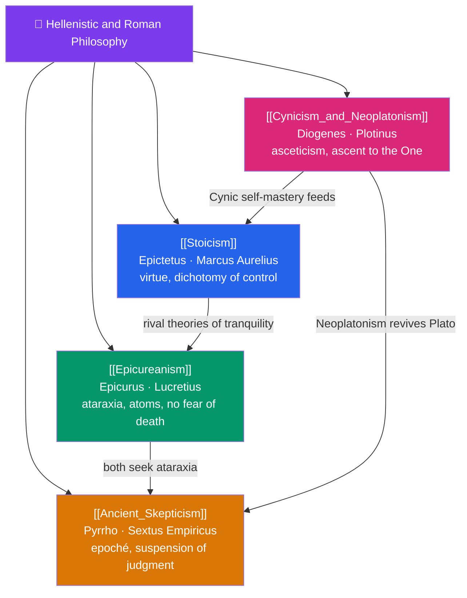

# 🗺️ Hellenistic and Roman Philosophy — Map of Content

> [!abstract] What This Section Covers
> After Aristotle, philosophy's center of gravity shifts from cosmic system-building to the urgent practical question: how should one live to attain tranquility? **Stoicism** locates the good in virtue alone and teaches the dichotomy of control — through Epictetus the freed slave, Seneca the statesman, and Marcus Aurelius the emperor; **Epicureanism** identifies pleasure rightly understood — the absence of pain (*aponia*) and mental disturbance (*ataraxia*) — as the aim, defusing the fear of death and the gods; **Ancient Skepticism** counsels suspension of judgment (*epochē*) as the road to tranquility, from Pyrrho to the Academic skeptics; and **Cynicism and Neoplatonism** bracket the era — Diogenes' radical asceticism and defiance of convention at one end, Plotinus' mystical ascent to the One at the other. These schools turn philosophy into a *therapy of the soul* and a way of life.

## Concept Map

## Learning Path

1. [[Cynicism_and_Neoplatonism]] — Diogenes' provocative asceticism and, centuries later, Plotinus' emanation of all reality from the One.
2. [[Stoicism]] — Logos and living according to nature, the dichotomy of control, virtue as the only good, from Epictetus to Marcus Aurelius.
3. [[Epicureanism]] — Atomism, the pleasures of tranquility, "death is nothing to us," and the Garden community.
4. [[Ancient_Skepticism]] — Pyrrhonian and Academic skepticism, the modes, *epochē*, and how doubt yields peace of mind.

## All Notes at a Glance

| Note | Difficulty | What You'll Learn |
|------|------------|-------------------|
| [[Stoicism]] | Beginner → Intermediate | Dichotomy of control, virtue ethics, cosmopolitanism, *amor fati*, Epictetus, Seneca, Marcus Aurelius |
| [[Epicureanism]] | Beginner → Intermediate | Hedonism properly understood, ataraxia/aponia, the tetrapharmakos, Lucretius, swerve of atoms |
| [[Ancient_Skepticism]] | Intermediate | Pyrrho, the ten modes, Academic skepticism, *epochē*, Sextus Empiricus, tranquility through doubt |
| [[Cynicism_and_Neoplatonism]] | Intermediate → Advanced | Diogenes and nature vs convention; Plotinus' One, Intellect, Soul, emanation and return |

## Key Questions This Section Answers

- What is within our control, and why does the Stoic say only virtue is truly good?
- If pleasure is the goal, why did Epicurus recommend a simple, quiet life?
- How can suspending judgment about everything lead to peace rather than paralysis?
- What did Diogenes' shamelessness try to prove about convention and nature?
- How does Neoplatonism transform Plato's Forms into a mystical hierarchy of being?

## Related Sections

- [[_MOC_Philosophy_Master|↑ Philosophy Master MOC]]
- [[_MOC_Ancient_Greek_Philosophy|← Ancient Greek Philosophy]]
- [[_MOC_Medieval_Philosophy|→ Medieval Philosophy]]
- Cross-vault: [[_MOC_History_Master]] (Rome), [[Virtue_Ethics]] (Ethics), [[_MOC_Psychology_Master]] (Stoic roots of CBT)

#MOC #Philosophy #Hellenistic
