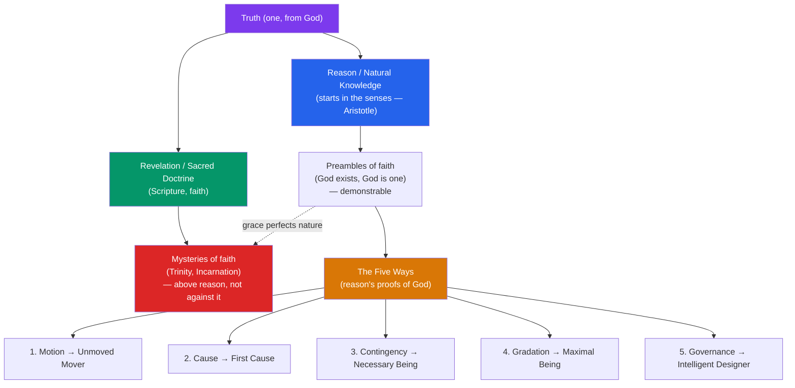

# ⛪ Aquinas and Scholasticism

> [!abstract] TL;DR
> Thomas Aquinas (1225–1274) achieved the grand medieval synthesis: he wove the newly recovered **Aristotle** together with Christian revelation into a single coherent system. His masterwork, the *Summa Theologica*, argues that **faith and reason are complementary**, not rival — reason (grace-perfected nature) can demonstrate some truths about God, while revelation supplies what reason cannot reach. His **Five Ways** (*Quinque Viae*) are five compressed arguments that God exists, drawn from motion, causation, contingency, gradation, and the governance of nature. His **natural law** ethics grounds morality in rational human nature. And the **scholastic method** — disputed questions, objections, and reasoned replies — is the disciplined machinery of the whole enterprise.

## Intuition — analogy first

Think of Aquinas as an **architect renovating a great house with newly delivered materials**.

For centuries the Christian West had built with Platonic/Augustinian stone: God's illumination, the soul's inward ascent, a suspicion of the body and the senses. Then, in the 12th–13th centuries, a truckload of new material arrived — the complete Aristotle, with Arabic commentaries by Avicenna and Averroes (see [[Islamic_and_Jewish_Philosophy]]). Aristotle was empirical, this-worldly, confident that knowledge starts in the senses. Many churchmen saw a threat and tried to ban him.

Aquinas did the opposite. Rather than reject the new materials or bulldoze the old house, he **re-engineered the structure** so Aristotle's this-worldly framework and Christian revelation load-bear together. His guiding principle: **grace does not destroy nature but perfects it** (*gratia non tollit naturam sed perficit*). Reason is not faith's enemy; it is the ground floor on which faith builds the upper stories. The result is not a compromise but a genuinely new architecture — Thomism — that becomes the closest thing the Catholic tradition has to an official philosophy.

---

## How It Works — The Thomistic Synthesis

Aquinas divides the field of truth into what reason can reach and what only revelation supplies, with a large overlap where both agree. Aristotle's metaphysics (act/potency, form/matter, the four causes) provides the machinery; Christian doctrine provides the ends.

## Key Concepts

### The Scholastic Method

Scholasticism is a **method** before it is a set of doctrines — the disciplined technique of the medieval universities (Paris, Oxford, Bologna). Its unit is the *quaestio* (disputed question), staged as a dialectical procedure:

1. **State the question** in yes/no form (*Utrum...* — "Whether God exists").
2. **Objections** (*videtur quod...*): the strongest arguments for the *opposite* of Aquinas' view, stated fairly.
3. **Sed contra** ("On the contrary"): a counter-authority or decisive consideration.
4. **Respondeo** ("I answer that"): Aquinas' own reasoned position (the body of the article).
5. **Replies to objections**: each opening objection answered in turn.

This structure — take the opponent at his strongest, then answer point by point — is intellectually demanding and self-correcting. The *Summa Theologica* (1265–1274, left unfinished) contains over 500 such questions, each with multiple articles. Aquinas also wrote the *Summa contra Gentiles* (a missionary work aimed at non-Christians, relying more on reason than authority) and line-by-line Aristotle commentaries.

### Aristotelian Machinery: Act, Potency, Form, Matter

Aquinas inherits Aristotle's core distinctions and puts them to theological work:

- **Act and potency** — a thing's actuality (what it *is*) versus its potentiality (what it *could become*). Change is the reduction of potency to act. God is **pure act** (*actus purus*), with no unrealized potential.
- **Form and matter (hylomorphism)** — material things are a composite of *form* (the organizing principle) and *matter* (what is organized). The human soul is the *form of the body* — not a separate thing imprisoned in it (a break from Platonic/Augustinian dualism).
- **Essence and existence** — adopting Avicenna, Aquinas holds that in every creature *what it is* differs from *that it is*; only in **God** are essence and existence identical (God's nature *is* to exist — *ipsum esse subsistens*). This grounds the metaphysical gulf between Creator and creature.

### The Five Ways (*Quinque Viae*)

The famous arguments open the *Summa Theologica* (I, q.2, a.3). All are *a posteriori* (from observed effects to God as cause) and each concludes "and this everyone understands to be God." They are **not** a stopwatch of five independent gods but five converging routes to one conclusion.

| # | "Way" | Starts from | Concludes to |
|---|---|---|---|
| 1 | **From Motion** | Things are in motion (change) | An **Unmoved Mover** |
| 2 | **From Efficient Cause** | Nothing causes itself | A **First Cause** |
| 3 | **From Contingency** | Things can be and not-be | A **Necessary Being** |
| 4 | **From Gradation** | Things are more/less good, true, noble | A **maximal source** of perfection |
| 5 | **From Governance** | Unintelligent things act toward ends | An **intelligent Designer** |

Crucial clarifications, routinely misread:
- The regress Aquinas rejects is a **hierarchical (essentially ordered) series** of *simultaneous* causes, not a temporal chain stretching back in time. He explicitly grants (against many contemporaries) that reason *cannot* prove the world had a beginning in time — that is known only by faith. The First Cause sustains the world *now*, at every instant, like a hand holding up a stick that holds up a stone.
- Ways 1–3 are **cosmological**; Way 5 is **teleological** (design); Way 4 (from gradation) is the most Platonic and most contested.

### Natural Law Ethics

Aquinas' ethics (*Summa Theologica* I-II, qq.90–108) grounds morality in **rational human nature**, not in arbitrary divine command. His hierarchy of law:

- **Eternal Law** — God's rational governance of all creation.
- **Natural Law** — the rational creature's *participation* in the eternal law; knowable by reason without revelation.
- **Human (positive) Law** — the particular statutes of states, valid only insofar as they derive from natural law ("an unjust law is no law at all" — a doctrine echoing to Martin Luther King Jr.).
- **Divine Law** — revealed law (Scripture), directing us to our supernatural end.

The **first precept** of natural law: *"good is to be done and pursued, and evil avoided."* From our natural inclinations (to self-preservation, procreation and family, and — distinctively rational — to know the truth about God and live in society), reason derives more specific precepts. Ethics is thus objective and knowable, yet tied to human flourishing (*eudaimonia*), integrating Aristotle's virtue ethics with a Christian final end (the beatific vision).

### The Analogy of Being and Faith Completing Reason

How can we speak of God at all if He infinitely exceeds creatures? Aquinas rejects both **univocity** (words mean the *same* applied to God and creatures — this would collapse God to a creature's level) and pure **equivocation** (words mean something *totally different* — this would make all God-talk empty). His middle path is **analogy**: "God is good" and "the meal is good" are related *proportionally* — goodness in God is the transcendent source of the goodness found, in limited measure, in creatures. This "analogy of being" (*analogia entis*) lets theology say something true about God without pretending to comprehend Him.

On faith and reason, Aquinas' settled position (developed fully in [[Faith_and_Reason]]): the **preambles of faith** (God exists, God is one) can be *demonstrated* by reason; the **mysteries of faith** (Trinity, Incarnation, creation-in-time) are *above* reason but never *against* it, since all truth is one and has one divine source. Faith perfects and completes reason rather than contradicting it.

## Arguments & Examples

**The Second Way, stated carefully (efficient causation):**
> 1. In the observable world we find an order of efficient causes.
> 2. Nothing can be the efficient cause of itself (it would have to exist prior to itself).
> 3. In an *essentially ordered* series of causes acting here and now, there cannot be an infinite regress: remove the first, and you remove the intermediate and the last.
> 4. Therefore there must be a First Efficient Cause, "to which everyone gives the name of God." — *ST* I, q.2, a.3.
> *Key nuance:* Aquinas is not saying "everything has a cause, so the universe has a cause" (that would beg the question about God). He argues about *sustaining* causes operating simultaneously, not a temporal first event.

**Answering the problem of evil (an objection Aquinas states against himself):**
> Objection 1 in *ST* I, q.2, a.3 is precisely the problem of evil: "If God existed, there would be no evil. But there is evil. Therefore God does not exist." Aquinas' reply borrows Augustine: God, being supremely good, "would not allow any evil to exist unless He could draw good out of it." Evil is permitted within a providential order — a defense, not a full theodicy.

**Natural law in action (a worked case):**
> Why is theft wrong on natural-law grounds? Not merely "because God forbids it," but because private property serves the natural human goods of order and provision, and taking another's goods against reasoned justice frustrates the common good. Yet Aquinas also holds that in extreme necessity (a starving man taking bread) the act is *not* theft, because in dire need "all things are common" — showing natural law reasons from ends and circumstances, not rigid rules. — *ST* II-II, q.66.

## Common Pitfalls / Misconceptions

- **"The Five Ways assume an infinite regress in time is impossible."** No. Aquinas explicitly holds reason *cannot* disprove an eternal universe; the regress he blocks is a *simultaneous, hierarchical* one. Confusing the two is the single most common misreading.
- **"The Five Ways are meant to be knock-down proofs that produce belief."** They are compressed *demonstrations of the preambles of faith*, showing God's existence is rationally accessible; Aquinas never thinks they deliver saving faith or a full concept of God.
- **"Natural law = divine command theory."** The reverse. Natural law grounds morality in *rational human nature*; something is not good merely because commanded — it is commanded (in part) because it is good for us.
- **"Aquinas just repeated Aristotle."** He *transforms* Aristotle: adds creation *ex nihilo*, a personal providential God, the real distinction of essence and existence (from Avicenna, not Aristotle), the soul's immortality, and a supernatural end beyond Aristotle's natural happiness.
- **"Faith and reason are two separate, sealed compartments."** For Aquinas they overlap and cooperate; the mysteries are *above* reason, not against it, and reason can defend faith and refute objections to it.

## Related Concepts

- [[_MOC_Medieval_Philosophy|↑ Section MOC]]
- [[Islamic_and_Jewish_Philosophy]] — Aquinas builds directly on Avicenna's essence/existence distinction and contingency argument, while arguing against Averroes on the unicity of the intellect
- [[Augustine_and_Early_Christian_Thought]] — Aquinas reveres Augustine's authority but replaces divine illumination with Aristotelian abstraction and rebalances nature and grace
- [[Faith_and_Reason]] — the fullest development of Aquinas' distinction between the preambles and mysteries of faith
- [[The_Problem_of_Universals]] — Aquinas' *moderate realism* (universals exist in things and are abstracted by the intellect) is a central position in that debate
- Cross-vault: [[_MOC_History_Master]] — the rise of the medieval universities and the 13th-century recovery of Aristotle; [[_MOC_Ethics_and_Moral_Philosophy]] — natural law as a major normative theory

## Review Questions

1. State the Second Way (from efficient causation) precisely. Explain why Aquinas' rejection of an infinite regress applies to an *essentially ordered* series of simultaneous causes and not to a temporal chain — and why this distinction matters for the argument's validity.
2. How does Aquinas' natural law theory ground morality in human nature rather than in bare divine command? Use the first precept and at least one worked example (e.g., theft in necessity).
3. Explain the "analogy of being." Why does Aquinas reject both univocal and purely equivocal God-talk, and what problem is analogy designed to solve?

## Sources

- Aquinas, Thomas. *Summa Theologica* (1265–1274), esp. I, q.2 (the Five Ways) and I-II, qq.90–97 (law); Blackfriars edition / trans. Fathers of the English Dominican Province
- Aquinas, Thomas. *Summa contra Gentiles*, trans. Anton Pegis et al., University of Notre Dame Press
- Kretzmann, N. & Stump, E. (eds.) (1993). *The Cambridge Companion to Aquinas*, Cambridge University Press
- Kenny, Anthony (1969). *The Five Ways: St. Thomas Aquinas' Proofs of God's Existence*, Routledge

#philosophy #medieval-philosophy #aquinas #scholasticism #five-ways #natural-law
