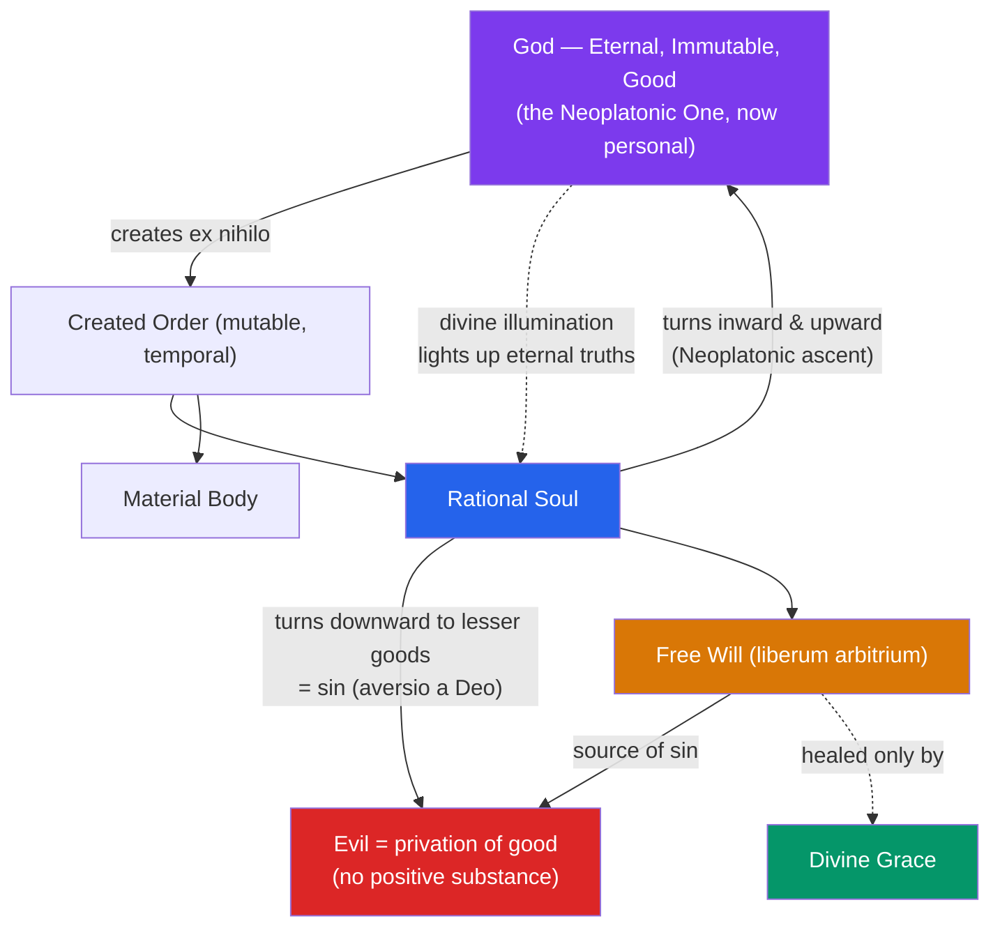

# ✝️ Augustine and Early Christian Thought

> [!abstract] TL;DR
> Augustine of Hippo (354–430 CE) is the bridge between classical antiquity and the Latin Middle Ages. Drawing on **Neoplatonism** to give philosophical shape to Christian doctrine, he reframed evil not as a *thing* but as a **privation** of good, defended human **free will** as the source of sin while insisting on the necessity of divine grace, and turned philosophy inward — his *Confessions* is the first sustained analysis of memory, time, and the self as felt from within. His doctrine of **divine illumination** holds that the mind grasps eternal truths only because God lights them up. For a thousand years, to do Western theology was largely to argue with, or from, Augustine.

## Intuition — analogy first

Think of Augustine's account of evil like **darkness and cold**.

Darkness is not a substance you can bottle; it is simply the absence of light. Cold is not a fluid that flows into a room; it is the absence of heat. You never need a special "source of darkness" to explain a dark room — you only need to explain why the light is missing. Augustine's radical move was to say **evil works exactly this way**: it is not a positive thing God created and forgot to prevent, but a *privatio boni*, a hole where a good should be. A rusting knife, a lie, a cruel act — each is a good thing (steel, speech, will) that has fallen short of what it ought to be.

This single analogy dissolves a problem that had tormented him for years as a Manichaean, where good and evil were two equal cosmic powers at war. Once evil is a *lack* rather than a *rival*, God can be the author of all that exists without being the author of evil — because evil, strictly, does not *exist* as a thing at all.

---

## How It Works — The Augustinian Synthesis

Augustine builds a system by pouring Christian revelation into a Neoplatonic vessel, then correcting the vessel where it clashes with scripture. Plotinus supplies the architecture — a single transcendent source, a hierarchy of being, the soul's ascent inward and upward — but Augustine replaces the impersonal One with a personal, creating God, and the eternal cosmos with a world created *ex nihilo* in time.

The engine of the whole system is **orientation of the will**: to turn the will *upward* toward God (the highest, unchanging good) is love rightly ordered; to turn it *downward*, treating a lesser good (money, sex, praise, self) as if it were the highest, is sin. Evil is never a new thing added to the world — it is always a good thing loved in the wrong order.

## Key Concepts

### Neoplatonism Baptized

Before conversion Augustine read "the books of the Platonists" (Plotinus and Porphyry, via Marius Victorinus). Neoplatonism taught him three things Christianity could use:

- **Immateriality** — God and the soul are non-physical, dissolving the crude Manichaean picture of good and evil as rival *stuffs*.
- **Hierarchy of being** — reality descends from a perfect source through graded levels; the further from the source, the more mutable and deficient.
- **Interiority and ascent** — truth is found by turning inward ("*noli foras ire*" — do not go outward), then upward past the mind to what is above it.

What Neoplatonism *could not* give him: creation from nothing, a personal God who loves, the Incarnation ("the Word became flesh" — the one thing, he says, he did *not* find in the Platonists), and grace. Augustinianism is Neoplatonism corrected at exactly these points.

### The Problem of Evil and the Free-Will Defense

| Position | Source of evil | Problem |
|---|---|---|
| **Manichaeism** (his early view) | An eternal evil principle at war with good | Denies God's omnipotence; makes evil a substance |
| **Augustine's mature view** | Free creatures turning from greater to lesser goods | Preserves God's goodness *and* omnipotence |

Augustine's answer in *On Free Choice of the Will* (*De libero arbitrio*): God gave rational creatures free will because a will that can freely love the good is a greater good than an automaton. That same freedom makes sin *possible*. **Moral evil** therefore originates in creaturely wills (angelic, then human), not in God. **Physical/"natural" evil** (suffering, death) enters as the just consequence of the primal misuse of freedom. Evil is metaphysically **privation** (*privatio boni*): it has no efficient cause, only a *deficient* cause — a will falling away from being toward nothing.

### Original Sin, Free Will, and Grace

Augustine's most contested doctrine emerged in the **Pelagian controversy** (c. 411–430). Pelagius held that humans can achieve righteousness by their own free effort; grace merely assists. Augustine countered that Adam's fall wounded the whole race: humanity became a *massa damnata* whose will, though still free, is now bent toward sin and cannot *of itself* choose God. Hence:

- **Liberum arbitrium** (free choice) survives the Fall — we remain responsible for our acts.
- But **libertas** (true freedom to do the good) is lost until healed by **grace**, which is unearned (gratuitous) and, in his late writings, given by God's inscrutable election (**predestination**).

This tension — genuinely free yet unable to be good without grace — drives medieval and Reformation debate for a millennium.

### Time and Memory in the *Confessions*

Book XI poses the puzzle: if God created *everything*, what was He doing "before" creation? Augustine's answer: **time itself is created** — there is no "before" the world, because "before" is a temporal notion. Then the deeper analysis of time (Book XI, ch. 14–28):

- The past **no longer** exists; the future **not yet**; only the present exists — but the present has no duration (any span divides into a past-part and future-part).
- So how do we measure time at all? Augustine's solution: we measure **the present of the mind** — a *distentio animi*, a "stretching" of the soul. Time exists as **memory** (present of things past), **attention** (present of things present), and **expectation** (present of things future).

Book X's analysis of **memory** (*memoria*) is equally striking: memory is a vast "palace" or "cavern" holding not just images but concepts, truths, even our search for happiness and God. This inward turn — treating the self's own interior as the primary object of philosophical inquiry — is why Augustine is often called the first modern autobiographer and a distant ancestor of Descartes' *cogito* (compare his *si fallor, sum* — "if I am mistaken, I exist").

### Divine Illumination

How does a finite, changeable mind grasp eternal, necessary truths (that 7 + 3 = 10, that justice is good)? Not by abstracting from the senses — the senses give only the mutable. Augustine's answer, adapting Plato's Forms: God, the eternal Truth, **illumines** the mind, so that we see eternal truths *in* the divine light much as the eye sees color *in* physical light. The teacher does not implant truth from outside; the true teacher is **Christ within** (*De Magistro*). This doctrine dominates until Aquinas replaces it with an Aristotelian theory of abstraction (see [[Aquinas_and_Scholasticism]]).

### Two Cities

The *City of God* (*De civitate Dei*, 413–426), written after Rome's sack in 410, distinguishes two "cities" defined by two loves: the **earthly city** (*civitas terrena*), built on love of self "even to contempt of God," and the **City of God** (*civitas Dei*), built on love of God "even to contempt of self." They are intermixed throughout history and separated only at the end. This desacralizes any earthly empire — Rome was never eternal or holy — and provides medieval Christendom its master theology of history and politics.

## Arguments & Examples

**The privation argument (evil is not a substance):**
> 1. Everything God created is good (Genesis; and being *as* being is good).
> 2. Whatever exists, insofar as it exists, is good.
> 3. Therefore evil, if it were a substance, would be a good — a contradiction.
> 4. So evil is not a substance but a *corruption* or *privation* of good in something that is good.
> — *Confessions* VII; *Enchiridion* 11. This blocks the Manichaean dualism at its root: there is no evil *thing* for God to have failed to prevent.

**The problem of measuring time (a worked puzzle):**
> Try to measure a syllable's length. You cannot measure it while it is still sounding (it is incomplete) nor after it has ceased (it is gone). So what is measured? Augustine: the *impression* the sound leaves in the mind as it passes. "It is in you, my mind, that I measure time." Time is measured as a stretching of attention, not as a property of external motion. — *Confessions* XI.27.

**"Grant what you command, and command what you will":** In *Confessions* X.29, Augustine prays *"da quod iubes et iube quod vis."* Pelagius reportedly found this line intolerable — it implies we cannot even obey God's commands without God first granting the ability. This one sentence encapsulates the grace/free-will dispute that would define Augustine's late career.

**Stealing the pears (*Confessions* II):** As a youth Augustine stole pears he did not want and threw them to pigs. Why? He finds no *goal* — he loved the sin *for its own sake*, "the theft itself." This becomes his case study in the perversity of a will that turns from the good with no proportionate motive: sin as sheer disordered love.

## Common Pitfalls / Misconceptions

- **"Augustine was a Neoplatonist."** He *used* Neoplatonism but rejected its impersonal One, its eternal (uncreated) cosmos, its denial of bodily resurrection, and its pride. He is a Christian thinker who transforms his sources, not a syncretist.
- **"Privation theory means evil isn't real or doesn't matter."** Privation is a claim about evil's *metaphysical status* (it is not a substance), not about its seriousness. A privation — blindness, injustice — can be devastatingly real and evil precisely *as* a lack of a due good.
- **"Free will and grace contradict each other."** For Augustine both are affirmed: the will is genuinely free and responsible, yet incapable of choosing God without grace. Later traditions resolve the tension differently, but Augustine holds both.
- **"The two cities = Church vs. State."** No — the City of God is not identical with the visible Church, nor the earthly city with any particular government. They are two *loves* running through all institutions and mixed until the Last Judgment.
- **"Augustine invented original sin from nothing."** He systematized and radicalized readings of Paul (esp. Romans 5) and earlier Fathers; his innovation is the doctrine's *transmission* and the total incapacity of the fallen will, not the bare idea of a Fall.

## Related Concepts

- [[_MOC_Medieval_Philosophy|↑ Section MOC]]
- [[Islamic_and_Jewish_Philosophy]] — The parallel synthesis in the Islamic and Jewish worlds; Avicenna's Neoplatonized Aristotle rhymes with Augustine's Neoplatonized Christianity
- [[Aquinas_and_Scholasticism]] — Aquinas absorbs Augustine's authority but replaces divine illumination with Aristotelian abstraction and rebalances nature and grace
- [[Faith_and_Reason]] — Augustine's *"credo ut intelligam"* ("I believe so that I may understand") is the seed Anselm later grows into *fides quaerens intellectum*
- [[The_Problem_of_Universals]] — Augustine locates Plato's Forms as ideas *in the mind of God*, a move central to later realism
- Cross-vault: [[_MOC_History_Master]] — the fall of Rome (410 CE) and late antiquity that frame the *City of God*; [[_MOC_Mythology_Master]] — Manichaeism as a dualist religious system Augustine abandoned

## Review Questions

1. Explain Augustine's claim that evil is a *privatio boni*. How does this simultaneously defend God's omnipotence and God's goodness against the Manichaean dualism he once held?
2. Reconstruct Augustine's argument in *Confessions* XI that we do not measure time by external motion but by a "stretching of the soul." What is the puzzle about the present that forces this conclusion?
3. State the core of the Pelagian dispute. In what sense does Augustine affirm free will *and* deny that we can choose the good without grace — and why is this not a flat contradiction?

## Sources

- Augustine of Hippo. *Confessions* (c. 397–400), trans. Henry Chadwick, Oxford World's Classics
- Augustine of Hippo. *The City of God against the Pagans* (413–426), trans. R.W. Dyson, Cambridge University Press
- Augustine of Hippo. *On Free Choice of the Will* (*De libero arbitrio*), trans. Thomas Williams, Hackett
- Stump, E. & Kretzmann, N. (eds.) (2001). *The Cambridge Companion to Augustine*, Cambridge University Press

#philosophy #medieval-philosophy #augustine #neoplatonism #problem-of-evil #free-will
