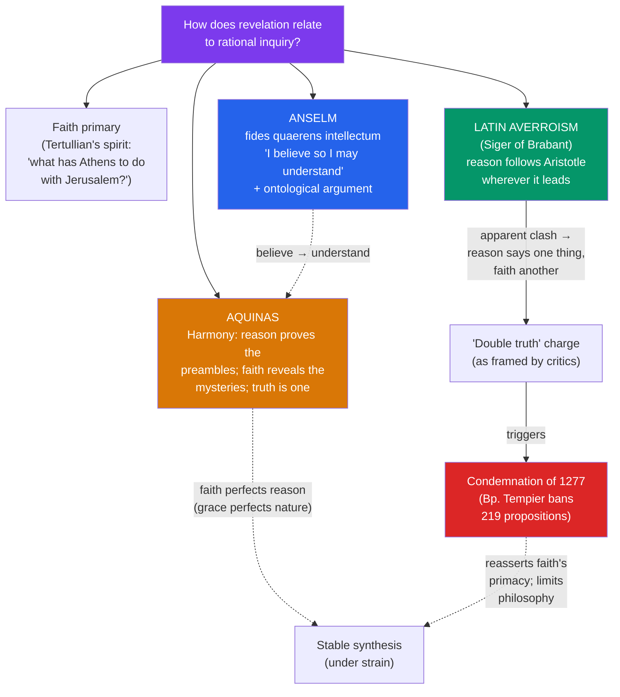

# 🔥 Faith and Reason

> [!abstract] TL;DR
> The defining question of medieval philosophy: how does **revelation** (what God discloses, accepted on faith) relate to **rational inquiry** (what the mind demonstrates on its own)? Positions range from **Anselm**'s confident *"faith seeking understanding"* (*fides quaerens intellectum*) — believing in order to understand, and even proving God's existence *a priori* with the ontological argument — through **Aquinas**' balanced view that reason and faith are distinct but harmonious, to the crisis of **Latin Averroism**, where philosophy's conclusions seemed to contradict the faith, provoking the "**double truth**" charge and the sweeping **Condemnation of 1277**. The whole medieval project is an experiment in holding revealed truth and rational demonstration together — and tracking exactly where the seams begin to strain.

## Intuition — analogy first

Think of faith and reason as **two witnesses testifying about the same event**.

Suppose a crime is reconstructed by (a) a forensic analyst working purely from physical evidence and (b) an eyewitness who was present. If truth is one, their testimonies should ultimately *agree* — the forensics shouldn't contradict what the eyewitness saw, because both are tracking the same reality. Where the analyst can reconstruct events from evidence alone, great; where only the eyewitness saw what happened (say, the victim's dying words), we rely on testimony we cannot independently derive.

The medievals treat **reason** as the forensic analyst (arguing from the evidence of the world) and **revelation** as the eyewitness (God's own testimony, received on faith). The optimistic thesis — Augustine's, Anselm's, Aquinas' — is that the two witnesses *cannot ultimately conflict*, because God is the source of both the world reason studies and the revelation faith receives. Some truths reason can reach alone (God exists); some only the eyewitness reports (the Trinity); the hard cases are where the "analyst" seems to prove something the "eyewitness" flatly denies — and that is where the medieval synthesis is tested to breaking.

---

## How It Works — Models of the Relationship

Medieval thinkers occupy a spectrum from "faith over reason" to "reason autonomous from faith," with the mainstream holding a harmony view. The key variable: *how much can unaided reason establish, and what happens when reason and revelation appear to clash?*

## Key Concepts

### The Inherited Tension: Athens and Jerusalem

The problem predates the Middle Ages. **Tertullian** (c. 155–220) posed the sharp version — *"What has Athens to do with Jerusalem?"* — suspicious that Greek philosophy corrupts the Gospel. **Justin Martyr**, by contrast, saw philosophy as a preparation for Christ (the *logos spermatikos*, seeds of the Word, scattered among the Greeks). **Augustine** set the mainstream medieval tone with *"credo ut intelligam"* — "I believe so that I may understand": faith comes first and *illuminates* reason, but reason then genuinely deepens and orders what faith holds (see [[Augustine_and_Early_Christian_Thought]]). The medieval project inherits this priority of faith *with* a robust confidence in reason's cooperative role.

### Anselm: Faith Seeking Understanding

**Anselm of Canterbury** (1033–1109) gave the program its motto: *fides quaerens intellectum* — "faith seeking understanding." He does not prove in order to believe; he believes, then seeks rational insight into what he already holds: *"I do not seek to understand in order that I may believe, but I believe in order that I may understand."* His method is to show that the content of faith is *rationally luminous* once entered into.

His most famous product is the **ontological argument** (*Proslogion*, 1078) — a bold *a priori* proof of God's existence from the mere *concept* of God:

- God is *"that than which nothing greater can be conceived"* (*id quo maius cogitari nequit*).
- Even the "fool" who denies God (Psalm 14) has this concept *in the understanding*.
- But a being that exists *in reality* is greater than one existing *in the understanding alone*.
- So if "that than which nothing greater can be conceived" existed only in the understanding, we could conceive something greater (the same thing existing in reality) — contradiction.
- Therefore God must exist *in reality*.

The argument is remarkable for deriving existence from a definition alone — no appeal to the world's evidence, unlike Aquinas' *a posteriori* Five Ways (see [[Aquinas_and_Scholasticism]]). It was immediately challenged by the monk **Gaunilo** ("On Behalf of the Fool"), who parodied it with the idea of a "greatest conceivable island" — which surely doesn't exist merely because we can define it. Anselm replied that the argument works *only* for a being whose greatness includes *necessary existence*, which islands lack. The argument was rejected by **Aquinas** (we don't grasp God's essence, so we can't run the proof), revived by **Descartes** and **Leibniz**, demolished by **Kant** ("existence is not a predicate"), and revived again in modal form by **Alvin Plantinga** in the 20th century — a testament to its staying power.

### Aquinas: The Balanced Synthesis

Aquinas gives the most influential settlement (developed fully in [[Aquinas_and_Scholasticism]]). His architecture:

| Category | Examples | Access |
|---|---|---|
| **Preambles of faith** (*praeambula fidei*) | God exists; God is one; the soul is immortal | *Demonstrable by reason* (though also revealed, for those unable or unwilling to follow the arguments) |
| **Mysteries / articles of faith** | Trinity; Incarnation; creation *in time* | *Above reason* — held by faith; reason cannot prove them but can defend them and refute objections |
| **Errors** | Denials of demonstrated truths | *Against reason* — and since truth is one, never truly entailed by faith |

Two load-bearing principles: (1) **all truth is one**, because both reason and revelation come from God, so genuine conflict is *impossible* — an apparent clash signals bad philosophy or misread scripture; (2) **grace perfects nature** — faith completes and elevates reason without abolishing it. Reason has real *autonomy* within its sphere (Aquinas will follow Aristotle's demonstrations), but it is *insufficient* for salvation, which requires revealed truths reason cannot reach.

### Latin Averroism and the "Double Truth"

The recovery of Aristotle via Averroes (see [[Islamic_and_Jewish_Philosophy]]) produced a crisis. Certain arts masters at the University of Paris — above all **Siger of Brabant** (c. 1240–1284) and **Boethius of Dacia** — practiced philosophy "as philosophers": following Aristotelian reasoning to its conclusions *regardless of theology*. Some of those conclusions clashed head-on with the faith:

- The **eternity of the world** (Aristotle) vs. creation in time (Genesis).
- The **unicity of the intellect** (Averroes: one Active Intellect shared by all humanity) vs. individual immortal souls.
- **Determinism** of the heavens vs. divine and human freedom.

Their critics accused them of teaching a **"double truth"** — that something could be *true in philosophy* yet *false in theology* (and vice versa). Whether Siger and Boethius of Dacia actually held this is doubtful; their more careful claim was methodological: *reasoning within natural philosophy* yields a conclusion (e.g., the world is eternal) which they nonetheless *do not assert as true simpliciter*, since faith teaches otherwise, and faith's truth is certain. Boethius of Dacia explicitly says the natural philosopher speaks only about what follows from natural principles, not about what is absolutely true. The "double truth" is thus largely a **polemical construction** by opponents — but it named a real anxiety: that autonomous Aristotelian reason might no longer be safely harmonizable with revelation.

### The Condemnation of 1277

On 7 March 1277, **Étienne Tempier**, Bishop of Paris, condemned **219 propositions** drawn from the Averroist masters (and, in some cases, brushing against theses of Aquinas himself, who had died in 1274). The condemned propositions included the eternity of the world, the unicity of the intellect, astral determinism, and the claim that "there is no more excellent state than to study philosophy." The Condemnation:

- **Reasserted faith's authority** over philosophy and curbed the autonomy of the arts faculty.
- Paradoxically **spurred new science and metaphysics**: by insisting on God's *absolute power* (God could do anything not self-contradictory — e.g., create a vacuum, move the cosmos in a straight line, make multiple worlds — even where Aristotle said it impossible), it loosened Aristotle's grip on physics and, some historians (e.g., Pierre Duhem) argue, opened conceptual space that later fed early-modern science.
- Marked a turning point: the confident high-scholastic synthesis of faith and reason gave way to a later-medieval tendency (Ockham and after — see [[The_Problem_of_Universals]]) to *separate* the domains, trusting reason less in matters of faith and emphasizing God's freedom and the limits of demonstration.

## Arguments & Examples

**Anselm's ontological argument, and Gaunilo's island:**
> **Anselm:** A being than which none greater can be conceived must exist in reality, for a merely conceived one would not be the greatest conceivable. **Gaunilo:** By parity, a "most perfect island" would then have to exist — absurd. **Anselm's reply:** Only a being whose very nature includes *necessary* existence is subject to the argument; contingent things like islands can always be conceived not to exist, so the parody fails. — *Proslogion* 2–4; *Reply to Gaunilo*. (Kant's later objection — that "exists" adds nothing to a concept — targets the crucial premise that real existence is a "greatness"-making feature.)

**Aquinas on why the mysteries are "above" but not "against" reason:**
> It is fitting that some truths about God exceed reason's grasp, for if *nothing* about God surpassed human reason, "the divine would be measured by human capacity." Yet these truths are not irrational: reason cannot *prove* the Trinity, but it can show the objections against it are *not* demonstrative — no one can prove the Trinity impossible. Faith and reason thus never truly contradict, since both derive from the one divine Truth. — *Summa contra Gentiles* I.3–8.

**The double-truth method vs. its caricature:**
> *Caricature (as critics framed it):* "The world is eternal is true in philosophy; the world was created is true in theology." *Boethius of Dacia's actual claim:* "The natural philosopher, reasoning only from natural principles, concludes the world had no natural beginning; but this is a *conditional* conclusion within physics, and I hold as *unconditionally true* that God created the world in time, which faith teaches with certainty." The distinction is between *what follows from a restricted set of principles* and *what is true absolutely* — not two contradictory truths. — *On the Eternity of the World*.

## Common Pitfalls / Misconceptions

- **"Medieval thinkers opposed reason to faith."** The dominant view was *harmony*, not opposition: reason and revelation, both from God, cannot ultimately conflict. Even fideistic voices (Tertullian) are the exception, not the rule.
- **"The ontological argument is obviously fallacious / obviously sound."** It is neither obvious. It has been rejected (Aquinas, Kant) and defended (Descartes, Leibniz, Plantinga's modal version) by first-rate philosophers for 900 years. The live issue is whether existence (or *necessary* existence) can be a great-making property.
- **"Latin Averroists literally believed two contradictory things at once."** Almost certainly not. The "double truth" is largely a label imposed by *critics*; the Averroists' careful position distinguishes conclusions *within* a discipline from unqualified truth, giving faith the final word.
- **"'Faith seeking understanding' means blind belief."** For Anselm and Augustine, faith is the *starting point* that then actively seeks rational insight — belief that *demands* to be understood, not belief that refuses examination.
- **"The Condemnation of 1277 only stifled thought."** It restricted the Averroists, but by emphasizing God's absolute power over Aristotelian necessity it also *liberated* physics and metaphysics from strict Aristotelianism — an ironic stimulus to later scientific imagination.

## Related Concepts

- [[_MOC_Medieval_Philosophy|↑ Section MOC]]
- [[Augustine_and_Early_Christian_Thought]] — the source of *"credo ut intelligam,"* the seed Anselm grows into *fides quaerens intellectum*
- [[Aquinas_and_Scholasticism]] — the fullest harmony model: preambles vs. mysteries, "all truth is one," grace perfecting nature
- [[Islamic_and_Jewish_Philosophy]] — Averroes' genuine harmony thesis, distorted into Latin "double truth"; al-Ghazali's critique of philosophy's reach is a parallel tension
- [[The_Problem_of_Universals]] — Ockham's later separation of reason and faith continues the post-1277 drift away from the confident synthesis
- Cross-vault: [[_MOC_History_Master]] — the medieval universities and the Condemnation of 1277; [[Ontological_Argument]] / [[Philosophy_of_Religion]] — the afterlife of Anselm's proof in modern philosophy

## Review Questions

1. State Anselm's ontological argument step by step. Explain Gaunilo's "lost island" objection and Anselm's reply — and identify which premise Kant's later critique ("existence is not a predicate") targets.
2. Lay out Aquinas' distinction between the *preambles* and the *mysteries* of faith. On his view, why is it *impossible* for a demonstrated rational truth and a genuine article of faith to contradict each other?
3. What did the "double truth" charge allege against the Latin Averroists, and why do most scholars regard it as a caricature? Explain how the Condemnation of 1277 both restricted philosophy and, ironically, may have stimulated later science.

## Sources

- Anselm of Canterbury. *Proslogion*, with *A Reply on Behalf of the Fool* (Gaunilo) and Anselm's *Reply*, trans. M.J. Charlesworth, University of Notre Dame Press
- Aquinas, Thomas. *Summa contra Gentiles*, Book I, chs. 3–9, trans. Anton Pegis, University of Notre Dame Press
- Dales, Richard C. (1990). *Medieval Discussions of the Eternity of the World*, Brill
- Hyman, A., Walsh, J. & Williams, T. (eds.) (2010). *Philosophy in the Middle Ages*, 3rd ed., Hackett (texts of Siger of Brabant, Boethius of Dacia, and the 1277 Condemnation)

#philosophy #medieval-philosophy #faith-and-reason #anselm #ontological-argument #double-truth
