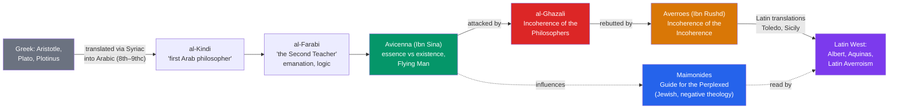

# 🕌 Islamic and Jewish Philosophy

> [!abstract] TL;DR
> Between roughly 800 and 1200 CE, Muslim and Jewish thinkers writing mainly in Arabic preserved, translated, and radically extended Greek philosophy — especially Aristotle — while the Latin West had largely lost it. The Islamic *falsafa* runs from **al-Kindi** and **al-Farabi** to **Avicenna** (Ibn Sina), whose distinction between **essence and existence** and "**Flying Man**" argument reshaped metaphysics, and **Averroes** (Ibn Rushd), the supreme Aristotle commentator who defended the harmony of philosophy and revelation. **Al-Ghazali** mounted a devastating critique in *The Incoherence of the Philosophers*. In the Jewish tradition, **Maimonides**' *Guide for the Perplexed* fused Aristotle with Torah through a rigorous negative theology. This corpus, translated into Latin in the 12th–13th centuries, is the direct fuel for Aquinas and Scholasticism.

## Intuition — analogy first

Think of the medieval Islamic and Jewish philosophers as the **librarians and engineers of a bridge** across a thousand-year river.

On one bank stands classical Greece — Aristotle, Plato, Plotinus. On the far bank, five centuries later, stands the Latin Christian West that will build the universities. In between, in Latin Europe, the river of transmission had nearly run dry: most of Aristotle was simply *unavailable*. It was scholars in Baghdad, Cairo, Córdoba, and Toledo who kept the texts alive — translating Greek into Arabic (often via Syriac), writing commentaries that unpacked every line, and then *engineering new structures* on the old foundations. When those Arabic works were finally rendered into Latin in Spain and Sicily, it was as if a lost civilization's engineering manuals suddenly arrived — and Europe's intellectual boom followed within a generation.

The philosophers here are not mere couriers. Avicenna and Averroes are first-rate original metaphysicians whose innovations Aquinas quotes on nearly every page.

---

## How It Works — Transmission and the Great Debate

Two things are happening at once: a **transmission chain** carrying Aristotle across languages, and an internal **debate** about whether reason (falsafa) or revelation (theology, *kalam*) has the final word.

## Key Concepts

### The Founders: al-Kindi and al-Farabi

**Al-Kindi** (c. 801–873, Baghdad), "the philosopher of the Arabs," sponsored translations and argued that truth from the Greeks and truth from revelation cannot conflict — a first statement of the harmony thesis. He defended (against Aristotle) that the world was **created in time**, siding with theology.

**Al-Farabi** (c. 872–950), called "the Second Teacher" (after Aristotle, "the First"), systematized Aristotelian **logic** and built a Neoplatonic cosmology of **emanation**: from the One (God) proceeds a series of intellects, the last of which — the **Active Intellect** — governs our sublunary world and is what enables human abstract thought. His political philosophy (*The Virtuous City*) reworks Plato's *Republic*: the ideal ruler is prophet-philosopher.

### Avicenna (Ibn Sina, 980–1037): The Central Metaphysician

Avicenna is the giant of Islamic philosophy; his *Kitab al-Shifa* ("Book of Healing") is an encyclopedia of logic, physics, and metaphysics.

**The essence/existence distinction.** Avicenna's signature move: in any created thing, *what it is* (its **essence**, *mahiyya*) is distinct from *that it is* (its **existence**, *wujud*). Consider the essence "horse" (or "triangle"): the definition tells you what a horse is but says nothing about whether any horse exists. Existence is therefore *superadded* to essence — an accident, in his controversial phrase — for everything except one being. In **God alone**, essence and existence are identical: God is *the Necessary Existent* (*wajib al-wujud*), whose very nature is *to be*. Everything else is merely **possible** in itself and receives its existence from another. This yields a powerful **cosmological argument**: the chain of possible beings, each borrowing existence, must terminate in a being whose existence is necessary through itself. (Aquinas' argument from contingency in the Third Way is deeply indebted to this — see [[Aquinas_and_Scholasticism]].)

**The Flying Man.** Avicenna's famous thought experiment for the soul's immateriality and self-awareness: imagine a person created **fully formed but suspended in a void** — floating in air, blindfolded, limbs apart so nothing touches, no sensation whatever, no memory of a body. Would this person affirm anything? Avicenna answers: **yes — he would affirm that he himself exists**, even while denying (or being unable to affirm) that he has a body. Therefore the self one is immediately aware of is *not* identical to the body; the soul is a substance knowable independently of the senses. (Note the striking anticipation of Descartes' *cogito*, six centuries early — though Avicenna's aim is proving the soul's immateriality, not defeating skepticism.)

### The Great Controversy: al-Ghazali vs. Averroes

| Thinker | Work | Core claim |
|---|---|---|
| **Al-Ghazali** (1058–1111) | *Tahafut al-Falasifa* (*The Incoherence of the Philosophers*) | The philosophers' metaphysics is not demonstrated; on three points it is outright unbelief |
| **Averroes** (1126–1198) | *Tahafut al-Tahafut* (*The Incoherence of the Incoherence*) | Al-Ghazali misunderstands Aristotle; philosophy and revelation, rightly read, agree |

**Al-Ghazali**, a jurist and Sufi, argued that Avicenna and al-Farabi had smuggled Greek doctrines contradicting Islam and, worse, presented them as *proven* when they were not. He singled out three as unbelief (*kufr*): (1) the **eternity of the world** (vs. creation in time); (2) that God knows only **universals**, not particulars; (3) the denial of **bodily resurrection**. His most philosophically influential argument is his **critique of causal necessity**: we never *observe* that fire *necessarily* burns cotton — we observe only constant conjunction. What we call causation is God's **habit** (God directly wills each event); miracles are simply God acting otherwise. (This anticipates **Hume** on causation by seven centuries — see cross-links.)

**Averroes**, judge and physician of Córdoba, wrote line-by-line commentaries so authoritative the Latins called him simply **"The Commentator"** (as Aristotle was "The Philosopher"). Against al-Ghazali he defended Aristotle and, in the *Decisive Treatise*, argued that **philosophy and religion are two roads to one truth**: scripture speaks in images for the many; demonstration reaches the same truths for the few; where the literal text seems to contradict demonstrated reason, the text must be read **allegorically**. Latin readers pushed this into the notorious "**double truth**" thesis (see [[Faith_and_Reason]]). His controversial "**unicity of the intellect**" (one shared Active Intellect for all humans) drew fire from Aquinas.

### Maimonides (1138–1204): Jewish Aristotelianism

Moses ben Maimon (the Rambam), born in Córdoba, physician to Saladin's court, wrote the *Guide for the Perplexed* (*Dalalat al-Ha'irin*, in Arabic) for the reader torn between Torah and Aristotelian philosophy.

- **Negative theology (*via negativa*).** We cannot say what God *is*, only what God is *not*. To predicate positive attributes (God is wise, powerful) risks compromising God's absolute unity and likening Him to creatures. Every apparent positive attribute must be read either as a *negation* (God is "living" = not dead/inert) or as a description of God's *actions*, never His essence. This rigorous apophaticism guards divine transcendence.
- **Reconciling reason and Torah.** Like al-Farabi and Avicenna, Maimonides reads scripture philosophically; anthropomorphic descriptions of God ("the hand of the Lord") are metaphors for the unlettered. Yet on the **creation of the world** he sides with revelation over Aristotle: he holds Aristotle did *not* demonstrate the world's eternity, so faith in creation *ex nihilo* remains rationally permissible.
- **Reasons for the commandments (*ta'amei ha-mitzvot*).** The Law is not arbitrary; its precepts have intelligible purposes (moral discipline, uprooting idolatry, social order).

Maimonides was read in Latin (as "Rabbi Moyses") by Aquinas, who adopts both his cautious negative theology and his argument that creation-in-time cannot be *disproved* by reason.

## Arguments & Examples

**Avicenna's contingency argument (compressed):**
> 1. Each thing is, in itself, either *necessary* or merely *possible* in existence.
> 2. A merely possible being does not exist through itself; it needs an external cause to tip it from possibility to actuality.
> 3. An infinite chain of possible beings, each borrowing existence, is *collectively* still merely possible — the whole set still needs a ground.
> 4. Therefore there exists a **Necessary Existent** whose essence *is* existence, grounding all the rest. — *Kitab al-Shifa*, Metaphysics. This is the ancestor of Aquinas' Third Way.

**Al-Ghazali on fire and cotton (occasionalism):**
> "The connection between what is habitually believed to be a cause and what is habitually believed to be an effect is not necessary." When fire meets cotton and the cotton burns, we see two events *together*; we never see a necessary *link*. For all reason shows, God creates the burning directly, on the occasion of the contact. Hence miracles violate no logic — only a habit. — *Tahafut al-Falasifa*, Discussion 17. (Compare Hume, *Enquiry* §7.)

**Averroes' harmony thesis:**
> Demonstrative truth and scriptural truth cannot conflict; where the apparent sense of scripture contradicts what reason has *demonstrated*, the scholar is obligated to interpret the scripture allegorically. Where reason yields only *probable* conclusions, scripture governs. — *Fasl al-Maqal* (*The Decisive Treatise*).

## Common Pitfalls / Misconceptions

- **"Muslims just preserved and passed on Greek texts."** They preserved *and transformed*. The essence/existence distinction, the Necessary Existent, occasionalism, and the unicity of the intellect are original contributions that changed metaphysics permanently.
- **"Averroes literally taught a 'double truth' — one true in philosophy, the opposite true in religion."** He did *not*. Averroes held there is **one truth** reached by two roads. The "double truth" doctrine is a Latin-Averroist caricature (see [[Faith_and_Reason]]); Averroes' actual view is a harmony-plus-allegory thesis.
- **"Al-Ghazali killed philosophy in Islam."** An overstatement. Philosophy continued (e.g., Averroes in the West, Suhrawardi and Mulla Sadra in the East). What declined most sharply was the influence of *Avicennan Peripateticism* in the Sunni core — and al-Ghazali himself uses philosophical logic extensively.
- **"Maimonides was an unqualified rationalist."** His negative theology is rationalist in method but *anti*-rationalist in result: it insists reason cannot capture God's essence at all, and he sides with revelation on creation.
- **"This is a footnote to Christian scholasticism."** Chronologically and causally it is the reverse: Avicenna, Averroes, and Maimonides are *upstream* of Aquinas, who quotes them constantly.

## Related Concepts

- [[_MOC_Medieval_Philosophy|↑ Section MOC]]
- [[Aquinas_and_Scholasticism]] — Aquinas inherits Avicenna's essence/existence distinction and contingency argument, and argues against Averroes' unicity of the intellect
- [[Augustine_and_Early_Christian_Thought]] — a parallel Neoplatonizing synthesis in the Latin/Christian world; emanation cosmology echoes Augustine's hierarchy of being
- [[Faith_and_Reason]] — the "double truth" controversy and Latin Averroism grow directly out of Averroes' harmony thesis
- [[The_Problem_of_Universals]] — Avicenna's account of the essence "considered in itself" (neither universal nor particular) shapes the later realism–nominalism debate
- Cross-vault: [[_MOC_History_Master]] — the Abbasid Baghdad "House of Wisdom" and Islamic Spain (al-Andalus); [[_MOC_Mythology_Master]] — the Abrahamic religious traditions framing these debates

## Review Questions

1. Explain Avicenna's distinction between essence and existence. How does he use it to argue for a "Necessary Existent," and why does he say essence and existence are identical *only* in God?
2. Reconstruct the al-Ghazali / Averroes dispute over causation and the eternity of the world. On what grounds does al-Ghazali charge the philosophers with incoherence, and how does his occasionalism anticipate later empiricist worries about causation?
3. What is Maimonides' negative theology, and what problem about divine unity is it designed to solve? Contrast it with a straightforwardly positive account of God's attributes.

## Sources

- Avicenna (Ibn Sina). *The Metaphysics of The Healing* (*al-Shifa*), trans. Michael E. Marmura, Brigham Young University Press
- Averroes (Ibn Rushd). *The Incoherence of the Incoherence* (*Tahafut al-Tahafut*), trans. Simon van den Bergh; and *The Decisive Treatise*, trans. Charles Butterworth
- Maimonides, Moses. *The Guide of the Perplexed*, trans. Shlomo Pines, University of Chicago Press
- Adamson, P. & Taylor, R.C. (eds.) (2005). *The Cambridge Companion to Arabic Philosophy*, Cambridge University Press

#philosophy #medieval-philosophy #falsafa #avicenna #averroes #maimonides #al-ghazali
