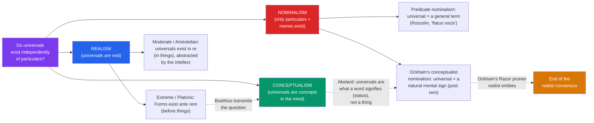

# 🔴 The Problem of Universals

> [!abstract] TL;DR
> Two things can share a feature — this apple and that fire truck are both *red*; Socrates and you are both *human*. The problem of universals asks: **what is the metaphysical status of the shared feature itself?** Does "redness" or "humanity" exist independently of the particular red or human things (**realism**), does only the general *word or concept* exist while reality contains only particulars (**nominalism**), or does the universal exist as a concept in the mind though grounded in things (**conceptualism**)? The medieval debate runs from **Boethius**, who framed it, through **Abelard**'s subtle middle way, to **William of Ockham**, whose thoroughgoing nominalism and famous *razor* (do not multiply entities beyond necessity) dismantled realism and helped end the scholastic consensus.

## Intuition — analogy first

Look at a set of **identical-model coins** minted from the same die.

Each coin is a distinct physical object — you can hold this one, spend that one, lose the third. Now ask: where is *the design*? There is clearly *something* the coins share — the same eagle, the same date, the same denomination. But is "the design" a *further object* over and above the coins?

- A **realist** says yes, in a sense: the design is a real, one-over-many pattern that the coins *instantiate* — remove every coin and the design-type would still be a genuine feature of reality (or at least of the die, or of the mint's plan).
- A **nominalist** says no: there is nothing but the many coins, each with its own physical shape; "the design" is just a *name* we use because the coins closely resemble one another. Reality contains only particulars.
- A **conceptualist** splits the difference: "the design" is a real *concept in our minds* — we genuinely group the coins under one idea — but that concept doesn't float free out in the world as its own object.

Now replace "the design of the coin" with **redness**, **humanity**, **triangularity**, or **justice**, and you have the problem of universals — arguably the deepest metaphysical dispute of the Middle Ages, with stakes reaching into logic, theology, and the theory of science.

---

## How It Works — The Spectrum of Positions

The positions form a spectrum from "universals are fully real, mind-independent objects" to "only individual words exist." The medievals occupy the whole range.

## Key Concepts

### The Question and Its Origin: Porphyry and Boethius

The problem is set by three questions the Neoplatonist **Porphyry** (c. 234–305) raised in his *Isagoge* (introduction to Aristotle's *Categories*) — then deliberately *declined* to answer: concerning genera and species, (1) do they **subsist** (exist independently), or are they only in the mind? (2) if they subsist, are they **corporeal or incorporeal**? (3) do they exist **in** sensible things or **apart** from them?

**Boethius** (c. 477–524), translating and commenting on Porphyry, transmitted these questions to the Latin Middle Ages and gave a nuanced first answer: universals are *collected* from particulars by the mind (so they exist *in* things but are *understood* apart from them). His commentaries were the seedbed; for centuries the whole problem was known simply as "the question Porphyry left open."

### The Three Positions Precisely

| Position | Ontology | Where the universal is | Champions |
|---|---|---|---|
| **Extreme (Platonic) realism** | Universals are mind-independent objects, more real than particulars | *ante rem* — before/apart from things | Plato; early medieval Platonists; (theologically) universals as ideas in God's mind |
| **Moderate (Aristotelian) realism** | Universals are real but exist only *in* particulars; the intellect abstracts them | *in re* / *post rem* (abstracted) | Aristotle, Avicenna, **Aquinas** |
| **Conceptualism** | The universal is a concept in the mind, with a real basis in the resemblance of things | in the mind (*post rem*) | Abelard (arguably); Ockham (as a variety) |
| **Nominalism** | Only particulars exist; "universals" are words/signs | nowhere as objects — only names | Roscelin, **William of Ockham** |

The **theological stakes** are high. Realism supports the reality of shared essences — "human nature" that Christ assumes, the unity of the Church as one Body, the transmission of "original sin" through a shared humanity. Extreme nominalism threatens some of these, which is one reason the debate was never merely academic. It also bears on the doctrine of the Trinity (Roscelin's nominalism led him toward tritheism, and he was condemned in 1092).

### Abelard's Middle Way

**Peter Abelard** (1079–1142) — logician, tragic lover of Héloïse — gave the most sophisticated early treatment. He attacked both his teachers: **Roscelin**'s extreme nominalism (a universal is a mere *flatus vocis*, a "puff of voice") and **William of Champeaux**'s extreme realism (the whole universal essence is present in each individual). Against Champeaux he pressed a decisive objection: if the *same* essence "animal" is wholly in Socrates and wholly in a donkey, then the rational and irrational would be in the same thing at once — absurd.

Abelard's own view: what a general word signifies is not a *thing* (*res*) but a **status** — a *way things are* that grounds our applying one word to many. "Being a human" (the *status* of being human) is not an entity you could stumble over, yet it is not nothing either: it is a real, objective condition that makes "human" true of Socrates and Plato alike. Universality belongs to **words** (only a word is predicated of many), while the *cause* of our universal predication lies in how the things themselves are. This anticipates conceptualism and is a landmark in the philosophy of language.

### Aquinas' Moderate Realism

**Aquinas** (see [[Aquinas_and_Scholasticism]]) offers the classic reconciliation, distinguishing *three* locations of the universal:

1. **Ante rem** (before things) — as an *idea in the mind of God*, the exemplar according to which things are created. (This absorbs the Platonic/Augustinian Forms.)
2. **In re** (in things) — the *common nature* really present in each individual, individuated by matter ("this humanity" in Socrates).
3. **Post rem** (after things) — the *abstracted concept* in the human intellect, which the mind draws out from sensory experience by the agent intellect.

So universals are real (grounded in things and in God) *and* the strict universality — the "one predicated of many" — is a work of the abstracting mind. This is *moderate* realism: it avoids Plato's separate Forms while denying the nominalist claim that nothing general is real.

### William of Ockham and the Razor

**William of Ockham** (c. 1287–1347), the *Venerabilis Inceptor*, pushed nominalism to its rigorous conclusion. His core commitments:

- **Only individuals exist.** Everything real is a particular, fully determinate thing. There are *no* real universal entities, not even the "common natures" the moderate realists posited *in re*. To posit a shared universal thing distinct from the individuals is, he argues, incoherent.
- **Universals are natural mental signs.** A universal is a *concept* (*intentio animae*) that stands for, or is *predicable of*, many individuals — not because it shares a common nature with them, but because it naturally signifies each of them. This is a spare conceptualist nominalism: the generality is entirely on the side of the sign.
- **Ockham's Razor** (*"pluralitas non est ponenda sine necessitate"* — plurality is not to be posited without necessity; also *"frustra fit per plura quod potest fieri per pauciora"*). This principle of parsimony is his weapon: since individual things plus mental/linguistic signs already explain everything we observe (similarity, general knowledge, science), positing *additional* real universals is explanatorily idle — so we should not posit them. (Note: the razor did not originate with Ockham, but he wields it so systematically it bears his name.)

Ockham's program deflates a great deal of scholastic metaphysics — abolishing many "real" categories and relations — and is often taken to mark the beginning of the end of the high-medieval realist consensus, pointing toward the empiricism of the modern age.

## Arguments & Examples

**The "one over many" argument for realism:**
> 1. This apple and that fire truck are *both* red — the very same feature is shared.
> 2. If reality contained only particulars, there would be no *one thing* they share; there would just be two unrelated particulars.
> 3. But our language, science, and thought genuinely group them (all reds, all triangles obey one geometry).
> 4. Therefore there must be a *universal* — one entity present in or shared by many — to ground the sharing. — The realist's core intuition, from Plato's *Parmenides* onward.

**Ockham's nominalist reply (via the razor):**
> The realist explanation over-generates entities. Everything the realist wants to explain — that the apple and truck *resemble* one another, that we truthfully call both "red," that science generalizes — is already explained by (a) the two individual red things and (b) a mental concept RED that naturally signifies each. A *third* thing, "redness itself," does no additional explanatory work. By the razor, do not posit it. Similarity is a primitive fact about individuals, not evidence of a shared universal object.

**Abelard's dilemma against extreme realism (the *status* solution):**
> If the *whole* universal "animal" is present in Socrates and in a donkey, then "rational" (which belongs to the animal-in-Socrates) and "irrational" (belonging to the animal-in-donkey) inhere in one and the same essence — contradiction. So the universal is not a *thing* wholly present in each. Yet naming is not arbitrary: Socrates and Plato share a *status* (being-human) that objectively grounds the word "human." Universality is thus semantic (a property of words/concepts), founded on how the things are. — *Logica 'Ingredientibus'*.

## Common Pitfalls / Misconceptions

- **"Nominalists deny that things really resemble each other."** No. Nominalists affirm resemblance; they deny that resemblance requires a *shared universal entity*. For Ockham the apple and truck really are alike — similarity is a basic feature of individuals, not proof of a "redness" object.
- **"Realism means Platonism / a separate world of Forms."** Extreme realism does; *moderate* (Aristotelian) realism denies separate Forms and locates universals *in* particulars. Aquinas is a realist without a Platonic heaven of Forms.
- **"Ockham's Razor says 'the simplest explanation is true.'"** More precisely: *do not posit more entities than the evidence requires.* It is a rule about ontological economy and explanatory necessity, not a guarantee that reality is simple, and not a claim that simpler theories are automatically correct.
- **"The debate is a purely verbal or trivial dispute."** It structures medieval logic, the semantics of predication, the metaphysics of essence, the theology of shared human nature and the Trinity, and the philosophy of science. Modern debates over properties, natural kinds, and abstract objects are its direct descendants.
- **"Conceptualism and nominalism are the same thing."** They overlap but differ in emphasis: conceptualism foregrounds the *concept in the mind*; strict nominalism can be read as reducing universals to *words/signs*. Ockham is best described as a conceptualist *variety* of nominalism.

## Related Concepts

- [[_MOC_Medieval_Philosophy|↑ Section MOC]]
- [[Aquinas_and_Scholasticism]] — Aquinas' moderate realism is the mature scholastic position that Ockham's nominalism directly challenges
- [[Islamic_and_Jewish_Philosophy]] — Avicenna's doctrine of the essence "considered in itself" (indifferent to being universal or particular) is a key source for the medieval treatment
- [[Augustine_and_Early_Christian_Thought]] — Augustine relocates Plato's Forms as ideas *in the mind of God*, grounding the *ante rem* strand of realism
- [[Faith_and_Reason]] — the theological stakes (shared human nature, original sin, the Trinity) show why this metaphysical debate was never merely academic
- Cross-vault: [[Universals_and_Realism]] (Metaphysics) — the systematic modern treatment of the same problem; [[_MOC_History_Master]] — the 12th-century schools and the rise of the universities

## Review Questions

1. Distinguish extreme realism, moderate realism, conceptualism, and nominalism. For each, state precisely *where* (if anywhere) the universal exists and give a representative medieval champion.
2. Reconstruct Ockham's use of the razor against moderate realism. What explanatory work does the realist claim universals do, and why does Ockham argue that individuals plus mental signs already do that work?
3. Explain Abelard's notion of a *status*. How does it let him reject both Roscelin's "puff of voice" nominalism and William of Champeaux's extreme realism, and why is it seen as an ancestor of conceptualism?

## Sources

- Spade, Paul Vincent (ed. & trans.) (1994). *Five Texts on the Mediaeval Problem of Universals: Porphyry, Boethius, Abelard, Duns Scotus, Ockham*, Hackett
- Ockham, William of. *Ockham: Philosophical Writings*, ed. & trans. Philotheus Boehner, Hackett
- Klima, Gyula. "The Medieval Problem of Universals," *Stanford Encyclopedia of Philosophy*
- Marenbon, John (1997). *The Philosophy of Peter Abelard*, Cambridge University Press

#philosophy #medieval-philosophy #metaphysics #universals #nominalism #ockham #realism
