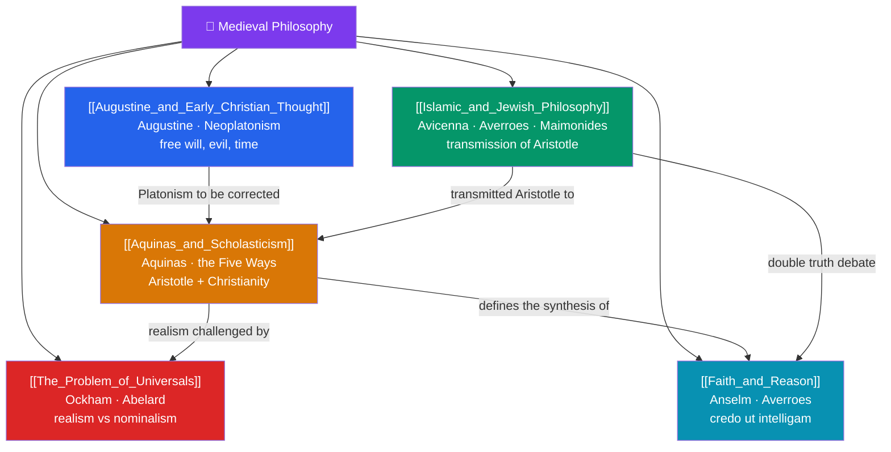

# 🗺️ Medieval Philosophy — Map of Content

> [!abstract] What This Section Covers
> For a thousand years philosophy worked in the service of theology, yet the results were far from unphilosophical — the era refined logic, metaphysics, and the theory of language while wrestling with the relation of revelation to reason. **Augustine and Early Christian Thought** fuses Neoplatonism with scripture, probing free will, evil, memory, and the nature of time; **Islamic and Jewish Philosophy** preserves and extends Aristotle through Avicenna, Averroes, al-Ghazali, and Maimonides, transmitting Greek thought back to the Latin West; **Aquinas and Scholasticism** achieves the grand synthesis of Aristotle and Christianity, arguing for God through the Five Ways; **The Problem of Universals** stages the long debate between realism and nominalism, culminating in Ockham's razor; and **Faith and Reason** examines the medieval synthesis itself — how thinkers held revelation and rational demonstration together, and where the seams began to strain.

## Concept Map

## Learning Path

1. [[Augustine_and_Early_Christian_Thought]] — The Neoplatonic turn, the free-will defense against the problem of evil, and the puzzle of time in the *Confessions*.
2. [[Islamic_and_Jewish_Philosophy]] — Avicenna's essence/existence distinction, Averroes on Aristotle, al-Ghazali's critique, and Maimonides' negative theology.
3. [[Aquinas_and_Scholasticism]] — The scholastic method, the Five Ways, natural law, and the synthesis of Aristotelian science with faith.
4. [[The_Problem_of_Universals]] — Do universals exist? Realism, conceptualism, and Ockham's nominalism with its famous razor.
5. [[Faith_and_Reason]] — Anselm's "faith seeking understanding," the double-truth controversy, and the limits of demonstration.

## All Notes at a Glance

| Note | Difficulty | What You'll Learn |
|------|------------|-------------------|
| [[Augustine_and_Early_Christian_Thought]] | Beginner → Intermediate | Neoplatonism, original sin, free will, the problem of evil, the nature of time, illumination |
| [[Islamic_and_Jewish_Philosophy]] | Intermediate | Avicenna, Averroes, al-Ghazali, Maimonides, essence vs existence, transmission of Aristotle |
| [[Aquinas_and_Scholasticism]] | Intermediate → Advanced | The Five Ways, act/potency, natural law, analogy of being, faith completing reason |
| [[The_Problem_of_Universals]] | Intermediate → Advanced | Realism, nominalism, conceptualism, Abelard, Ockham's razor, the ontology of properties |
| [[Faith_and_Reason]] | Intermediate | Anselm's ontological argument, credo ut intelligam, double truth, the autonomy of reason |

## Key Questions This Section Answers

- If God is good and omnipotent, why does evil exist — and is the will free?
- How did Islamic and Jewish thinkers preserve and transform Aristotle for later Europe?
- Can the existence of God be proved by reason, as Aquinas' Five Ways claim?
- Do universals like "redness" or "humanity" exist independently of particular things?
- Can faith and reason reach the same truths, and what happens when they conflict?

## Related Sections

- [[_MOC_Philosophy_Master|↑ Philosophy Master MOC]]
- [[_MOC_Hellenistic_Roman_Philosophy|← Hellenistic and Roman Philosophy]]
- [[_MOC_Early_Modern_Philosophy|→ Early Modern Philosophy]]
- Cross-vault: [[_MOC_History_Master]] (Middle Ages), [[Universals_and_Realism]] (Metaphysics), [[_MOC_Mythology_Master]] (religious traditions)

#MOC #Philosophy #Medieval
