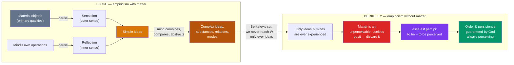

# 🖐️ British Empiricism

> [!abstract] TL;DR
> Where the rationalists trusted reason and innate ideas, the British empiricists insist that **all the mind's content comes from experience**. **John Locke** (1632–1704) opens his *Essay Concerning Human Understanding* (1689) by attacking innate ideas: the newborn mind is a **blank slate** (*tabula rasa*), and every idea enters through **sensation** (outer sense) or **reflection** (inner sense). He distinguishes **primary qualities** (extension, shape, motion — really in objects) from **secondary qualities** (colour, taste, sound — powers to produce sensations in us), and grounds **personal identity** not in the soul but in **continuity of consciousness / memory**. **George Berkeley** (1685–1753) presses empiricism to a startling conclusion: if we only ever experience *ideas*, we have no ground for believing in a mind-independent material world at all. His **subjective idealism** holds that **to be is to be perceived** (*esse est percipi*) — there is no matter, only minds and their ideas, kept in existence and order by the perceiving of God.

## Intuition — analogy first

Imagine the mind at birth as a **freshly wiped whiteboard**. Nothing is written on it — no diagrams of God, no axioms of geometry, no moral rules. Then experience begins to write: the warmth of a hand, the redness of an apple, the sound of a voice. Every concept you will ever have is, ultimately, ink that experience put there or a *combination* the mind builds from that ink. Ask a rationalist where the idea of a triangle comes from and he points *inward*, to reason. Ask Locke and he points *outward and inward-as-sensed* — to seeing triangular things and reflecting on the operations of your own mind. That is empiricism: **no experience, no idea.**

Now take the whiteboard idea seriously and push it until it bites. If *everything you know is an idea in your mind* — if you have never once encountered anything *except* your own perceptions — then what reason do you have to believe there is a solid, colourless, mind-independent *lump of matter* sitting behind the apple, causing your idea of red? You can never step outside your perceptions to check. Berkeley's radical move is to say: **stop positing the lump.** The apple just *is* the collection of ideas — the red, the round, the sweet, the smooth — and to exist is simply to be perceived. Reality does not vanish when you close your eyes only because a greater Perceiver, God, never stops looking.

---

## How It Works — From Experience to Idea (and the Slide into Idealism)

Empiricism is a *pipeline*: the world (or God) supplies experiences, experiences deposit simple ideas, and the mind combines them into everything else. Locke keeps a material world at the far left of the pipe; Berkeley argues the pipe never actually touches it and so removes it.

The single most important junction is the dotted arrow: Locke's own premise — that the *immediate objects* of awareness are always ideas — is the very knife Berkeley uses to sever the material world from the system. Empiricism, taken consistently, threatens to trap the mind inside its own ideas. [[Humes_Skepticism|Hume]] will follow the same logic even further.

## Key Concepts

### Locke: Against Innate Ideas

Book I of Locke's *Essay* is a sustained assault on the rationalist doctrine of **innate ideas** (Descartes' God, self, and mathematical truths "born with" the mind). His arguments:

- **The argument from universal assent fails.** Even supposedly universal principles (e.g. "whatever is, is") are *not* assented to by children and "idiots," who lack the concepts entirely. What is truly innate should be present from the start.
- **Nothing is in the mind it was never conscious of.** To say an idea is "in" the mind but unknown to it empties "innate" of meaning.
- **Better explanation available.** Everything the rationalist calls innate can be accounted for by experience plus the mind's ordinary faculties — so the extra posit is idle.

### Locke: Tabula Rasa, Sensation, and Reflection

The mind is at first "white paper, void of all characters." All ideas derive from two founts of **experience**:

| Source | "Sense" | Yields ideas of | Example |
|--------|---------|-----------------|---------|
| **Sensation** | Outer sense | Qualities of external objects | Colour, sound, warmth, solidity |
| **Reflection** | Inner sense | The mind's own operations | Perceiving, willing, doubting, remembering |

From these come **simple ideas** (unanalysable atoms of experience the mind receives passively). The mind then *actively* compounds, compares, and abstracts them into **complex ideas** — of **substances** (things: gold, a horse), **modes** (properties/actions: a triangle, gratitude), and **relations** (cause, identity). Nothing in the finished structure was not first delivered, in simple form, by sensation or reflection.

### Locke: Primary vs Secondary Qualities

A cornerstone distinction, inherited from Galileo, Boyle, and Descartes:

| | **Primary qualities** | **Secondary qualities** |
|---|----------------------|-------------------------|
| **What they are** | Really *in* the object, inseparable from it | *Powers* in the object to produce sensations in us |
| **Examples** | Extension, shape, size, motion, solidity, number | Colour, sound, taste, smell, warmth |
| **Resemblance** | Our ideas *resemble* the quality in the object | Our ideas do *not* resemble anything in the object |
| **Test** | Persist however you divide the object | Vary with observer and conditions (warm water feels cold to a hot hand) |

The idea of *squareness* pictures a real squareness in the thing; the idea of *red* pictures nothing in the thing — there is only a texture of particles with the *power* to cause "red" in a perceiver. Berkeley will argue this distinction is unstable and collapses.

### Locke: Personal Identity as Continuity of Consciousness

In a famous chapter added to the *Essay*'s second edition, Locke separates the question of *personal* identity from the metaphysics of soul or body:

- **A person is a "thinking intelligent being" that can consider itself as itself across time.**
- What makes me the *same person* over time is not the same soul-substance and not the same body, but **the same continuous consciousness — extended by memory**. "As far as this consciousness can be extended backwards to any past action... so far reaches the identity of that person."
- **Thought experiment**: if the consciousness of a prince entered and informed the body of a cobbler, the resulting man would *be* the prince (same person), though a different man (same cobbler-body). Identity of *person* tracks consciousness, not substance.

This is the founding **memory theory** of personal identity, and its puzzles (the reliability of memory, transitivity, the "brave officer" objection) drive the modern debate.

### Berkeley: Subjective Idealism and *Esse est Percipi*

Berkeley (*A Treatise Concerning the Principles of Human Knowledge*, 1710; *Three Dialogues*, 1713) accepts Locke's empiricism and turns it against Locke's own material world:

- **We perceive only ideas.** Colours, shapes, sounds — all are ideas *in* a mind. We never perceive a "material substratum" over and above the collection of sensible qualities.
- **"To be is to be perceived" (*esse est percipi*).** For a sensible thing, existence just *is* being perceived (or perceivable). An apple is nothing but the bundle of its perceived qualities.
- **The denial of material substance (immaterialism).** The notion of *matter* — an unthinking, unperceived, mind-independent stuff — is not merely unknowable but *incoherent*: to conceive of an object is already to conceive of it as perceived. Matter is a redundant, contradictory posit; discard it. This is **subjective idealism**: only minds (spirits) and their ideas exist.
- **God as the great Perceiver.** Two worries — Does the room vanish when everyone leaves? Why are my ideas orderly and involuntary rather than a private chaos? — get one answer: **God** continuously perceives all things and *causes* the regular, law-like ideas we call the "laws of nature." The stability of the world is the constancy of God's perceiving. (Hence Ronald Knox's limerick and its reply: the tree in the quad continues "since observed by / Yours faithfully, God.")

Berkeley insists this is *common sense*, not skepticism: he saves the reality of tables and trees (they are real bundles of ideas), while eliminating the dubious, never-experienced abstraction called "matter."

## Arguments & Examples

**The lukewarm water (Berkeley's Master Argument against primary qualities).** Locke conceded that secondary qualities like warmth are observer-relative — dip one cold hand and one hot hand into the same tepid basin and it feels hot to one, cold to the other, so warmth cannot be *in* the water. Berkeley presses: the *same relativity* afflicts primary qualities. Size varies with distance, shape with angle, motion with the observer's own motion. If observer-variation shows warmth is mind-dependent, it shows extension and shape are mind-dependent too. So Locke cannot keep primary qualities "in the object" while expelling secondary ones — **all** sensible qualities are ideas, and the material substratum drops out.

**The "brave officer" objection (Thomas Reid, against Locke on identity).** A boy is flogged for stealing an orchard; later he becomes a young officer who *remembers* the flogging; still later he becomes an old general who remembers his first campaign but has *forgotten* the flogging. By Locke's memory criterion: the officer is the same person as the boy (he remembers), and the general is the same person as the officer (he remembers) — but the general is *not* the same person as the boy (no memory). This violates transitivity of identity, a classic problem for the raw memory theory that later refinements (chains of overlapping memory) try to repair.

**Dr. Johnson's stone (and why it misses).** Told of Berkeley's immaterialism, Samuel Johnson kicked a large stone and declared "I refute it *thus*." But Berkeley never denied the stone is real or that kicking it hurts — the pain and resistance are exactly the vivid, involuntary *ideas* God supplies. The kick confirms the *bundle of ideas*; it does not locate the *matter* Berkeley denies. The anecdote is the textbook example of missing an idealist's actual claim.

## Common Pitfalls / Misconceptions

- **"Empiricism denies that reason does anything."** No — the mind *actively* combines, abstracts, and reasons; the claim is only that reason has no *content of its own*: all the raw material is furnished by experience.
- **"Tabula rasa means we're born identical / a behaviourist blank."** Locke grants innate *faculties and dispositions* (the powers of perceiving, comparing, willing). What he denies is innate *ideas and propositions* already written on the slate.
- **"Berkeley thinks the world is imaginary / that trees pop out of existence unseen."** He holds the opposite: trees are perfectly real bundles of ideas, and they persist because **God perceives them continuously**. Idealism is not solipsism and not the denial of a stable public world.
- **"Secondary qualities are 'not real.'"** They are real *powers* in objects to affect us; what Locke denies is that our *idea* of red resembles anything intrinsic to the object, the way our idea of shape does.
- **"Berkeley refuted matter by mere wordplay."** His argument turns on Locke's own empiricist premise — that the immediate objects of awareness are ideas. Given that premise, "unperceived material substratum" is something we could never in principle experience, and Berkeley challenges the empiricist to say what content the word "matter" then has.
- **"Locke solved personal identity."** He *relocated* it (from substance to consciousness) and thereby opened the memory-theory problems — circularity (memory presupposes identity) and transitivity (the brave officer) — that remain live.

## Related Concepts

- [[_MOC_Early_Modern_Philosophy|↑ Section MOC]]
- [[Descartes_and_Rationalism]] — The innate-idea doctrine Locke's Book I is written to destroy
- [[Spinoza_and_Leibniz]] — Continental rationalism; Leibniz replied directly to Locke in his *New Essays on Human Understanding*
- [[Humes_Skepticism]] — Hume completes the empiricist arc, applying the "ideas from experience" rule to causation, induction, and the self
- [[Kant_and_the_Copernican_Turn]] — Kant answers Berkeley and Hume by making the mind *structure* experience rather than passively receive it
- Cross-vault: [[Personal_Identity]] — the memory theory in full; [[Rationalism_vs_Empiricism]] — the axis of this whole section; [[Primary_and_Secondary_Qualities]] (Philosophy of Perception)

## Review Questions

1. Reconstruct Locke's case against innate ideas and explain what the *tabula rasa* metaphor does and does *not* claim. What roles do sensation and reflection play in filling the slate?
2. State Locke's primary/secondary quality distinction with examples, then present Berkeley's "lukewarm water" argument that it cannot be sustained. Why does the collapse of the distinction threaten the very idea of material substance?
3. Explain *esse est percipi* and Berkeley's appeal to God. How does this answer the two objections — that unperceived things would vanish, and that perception would be a private chaos — and why is Dr. Johnson's stone-kick not a refutation?

## Sources

- Locke, J. (1689). *An Essay Concerning Human Understanding*. Ed. Nidditch, Oxford University Press
- Berkeley, G. (1710). *A Treatise Concerning the Principles of Human Knowledge*; (1713) *Three Dialogues between Hylas and Philonous*
- Reid, T. (1785). *Essays on the Intellectual Powers of Man* (the "brave officer" objection)
- Downing, L. (2021). "George Berkeley." *Stanford Encyclopedia of Philosophy*

#philosophy #early-modern #empiricism #locke #berkeley #epistemology
