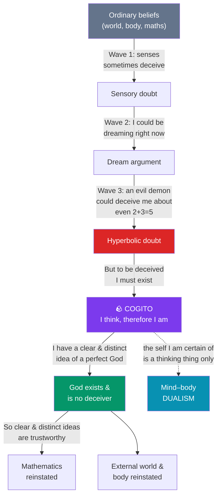

# 🕯️ Descartes and Rationalism

> [!abstract] TL;DR
> René Descartes (1596–1650) opened modern philosophy by asking what could survive the most radical doubt possible. He suspends belief in the senses, in the external world, even in mathematics — imagining an all-powerful **evil demon** deceiving him — and finds one thing that cannot be doubted: that he is doubting, hence thinking, hence existing (*cogito ergo sum*). On this single bedrock he rebuilds knowledge using **clear and distinct ideas**, whose reliability he tries to secure by proving a non-deceiving God. His metaphysics splits reality into two substances — **thinking mind** (*res cogitans*) and **extended body** (*res extensa*) — a **substance dualism** that immediately faces the problem of how two utterly different kinds of thing can causally interact. Descartes is the founder of **rationalism**: the view that reason, not sense experience, is the primary source of substantive knowledge about reality.

## Intuition — analogy first

Imagine you inherit a barrel of apples and suspect some are rotten. The careful move is not to inspect each apple in place — one hidden rotten apple can spoil the rest — but to **empty the barrel completely**, examine every apple in the light, and return only the sound ones. Descartes uses exactly this image. His doubt is not the lazy shrug of the skeptic who says "we can never know anything"; it is a *demolition for the sake of rebuilding*. He tears the whole structure of his beliefs down to the foundations precisely because he wants something that will never need tearing down again.

The second image is architectural. A tower built on sand or mud will eventually lean and crack no matter how carefully the upper storeys are laid. Descartes wants to dig past the sand until his spade strikes **bedrock** — a proposition so solid that nothing, not even an omnipotent deceiver, could shake it. When he hits "I think, therefore I am," he has found his bedrock, and the rest of the *Meditations* is the attempt to raise a cathedral of knowledge on that one indubitable stone. Rationalism, in a sentence, is the bet that the bedrock is found by **reasoning**, never by looking.

---

## How It Works — The Ladder of Doubt and the Climb Back Up

Descartes' *Meditations on First Philosophy* (1641) is structured as a descent into doubt followed by a re-ascent to certainty. Each rung of doubt is a *stronger* skeptical scenario than the last; the *cogito* halts the fall, and God is the pivot that lets him climb back to the external world.

The crucial architecture: **doubt is a method, not a destination**. Descartes is a skeptic only provisionally, in order to defeat skepticism permanently. Everything to the right of the purple *cogito* node depends on it, and the reinstatement of the world (green/teal) depends on the theistic proofs — which is exactly where his critics attack.

## Key Concepts

### Methodic (Hyperbolic) Doubt

Descartes resolves to treat as **false** anything about which the slightest doubt is possible, so that whatever survives will be **absolutely certain**. This is *methodic* doubt (a deliberate procedure) taken to *hyperbolic* extremes (pushed as far as it can logically go). It proceeds in three escalating waves:

| Wave | Skeptical scenario | What it undermines | What survives |
|------|--------------------|--------------------|---------------|
| **1. Sensory illusion** | The senses sometimes deceive (a tower looks round from afar, a stick looks bent in water) | Trust in perception of distant/small things | Beliefs about nearby, obvious things ("I am sitting by the fire") |
| **2. Dream argument** | There is no certain mark distinguishing waking from dreaming | Belief in *any* particular sensory experience of the world | Simple, general natures — shapes, numbers, extension ("2+3=5" even in dreams) |
| **3. Evil demon** | An omnipotent malicious deceiver (*malin génie*) could make even simple maths feel certain while being false | *Everything*, including arithmetic and geometry | Only the fact of my own thinking |

The evil demon is not a claim that such a being exists; it is a **methodological device** — the strongest possible doubt — to test whether *anything* is demon-proof.

### The Cogito

In the *Discourse on Method* (1637) Descartes writes *je pense, donc je suis*; in the *Meditations* the more careful formulation is **"I am, I exist" is necessarily true whenever I assert or conceive it**. The key features:

- **It is self-verifying**: the very act of doubting one's existence *presupposes* a doubter. Even a deceiving demon cannot make me not exist while I am being deceived — deception requires a victim.
- **It is not a syllogism.** "I think, therefore I am" *looks* like an inference from the premise "whatever thinks, exists," but Descartes insists (in reply to objections) that it is grasped by a single act of **intuition**, not derived from a prior general premise. Otherwise it would inherit the demon-vulnerability of any general principle.
- **What is proved is thin.** The certainty covers only that a *thinking thing* exists *right now*. It does not (yet) prove a body, a persistent soul, or an external world.

### Clear and Distinct Ideas — the Criterion of Truth

Reflecting on the *cogito*, Descartes asks: *what made it certain?* His answer: he perceived it **clearly and distinctly**. He then adopts as a general rule that **whatever I perceive clearly and distinctly is true**. "Clear" means present and evident to an attentive mind; "distinct" means sharply separated from all other ideas. This is a criterion of *intellectual* certainty, not vividness of imagination — the point of the **wax argument** (below) is that the mind, not the senses, grasps the essence of things clearly and distinctly.

### The Cartesian Circle

Here lies the most famous objection, pressed by **Antoine Arnauld** and **Marin Mersenne** in the *Objections* appended to the *Meditations*:

- Descartes uses clear and distinct ideas to **prove God exists** (and is no deceiver).
- But he needs **God's non-deception to guarantee** that clear and distinct ideas are reliable.

This looks viciously circular: the guarantee of the method is proved *by* the method. Defenders (and Descartes himself) reply that clear and distinct perceptions are indubitable *while being entertained*; God is needed only to underwrite the *memory* that a past demonstration was sound. Whether this escapes the circle remains debated.

### Innate Ideas and Rationalism

Descartes divides ideas into three kinds: **adventitious** (seemingly from outside — heat, colour), **factitious** (invented by us — a golden mountain), and **innate** (born with the mind — God, substance, the self, and the truths of mathematics). Rationalism's core claim is that the innate, purely intellectual ideas are the ones that yield **certain knowledge of reality**, while the senses only prompt and confuse. This is the program later radicalized by [[Spinoza_and_Leibniz|Spinoza and Leibniz]] and opposed head-on by [[British_Empiricism|the British empiricists]].

### Substance Dualism

Descartes' metaphysics recognizes two finite **substances** (things that can exist independently), each defined by one **principal attribute**:

| | *Res cogitans* (mind) | *Res extensa* (body) |
|---|---|---|
| **Essence** | Thinking (consciousness) | Extension (occupying space) |
| **Properties** | Doubts, wills, imagines, feels | Size, shape, motion, divisibility |
| **Divisible?** | No — the mind is a unity | Yes — matter is infinitely divisible |
| **Known by** | Reflection / intellect | Geometry / measurement |

The **real distinction argument**: I can *clearly and distinctly conceive* my mind existing without my body (the *cogito* proves the mind before the body is reinstated), and whatever can be so conceived can exist apart — therefore mind and body are genuinely *two* substances, not one.

### The Interaction Problem

If mind is unextended and body is extended, **how do they causally interact**? A decision (mental) moves an arm (physical); a pinprick (physical) causes pain (mental). But causation between the wholly non-spatial and the spatial seems unintelligible. **Princess Elisabeth of Bohemia**, in her 1643 correspondence, pressed this brilliantly: how can something with no surface and no location push matter around? Descartes' gesture toward the **pineal gland** as the seat of interaction only relocates the puzzle — it does not explain how the transaction occurs. This is the enduring wound of dualism, and it drives the alternatives of Spinoza (one substance) and Leibniz (pre-established harmony). See [[The_Mind_Body_Problem]].

## Arguments & Examples

**The Wax Argument (Meditation II).** Descartes takes a piece of beeswax fresh from the comb — it has a certain smell, taste, hardness, cold, and a shape that makes a sound when tapped. He holds it to the fire: *every* one of those sensory qualities changes (it melts, loses its scent, becomes hot, liquid, silent). Yet he judges it is *the same wax*. What, then, does he grasp as "the wax"? Not any sensory quality, since all have changed — but rather a *flexible, changeable, extended thing*, grasped by the **intellect alone**, not by sense or imagination. The lesson: even bodies are known more truly by the **understanding** than by the senses. This is rationalism illustrated with a candle.

**The Ontological Argument (Meditation V).** To reinstate the external world, Descartes needs a non-deceiving God, and offers (among others) a version of Anselm's argument: the idea of God is the idea of a *supremely perfect being*; existence is a perfection; therefore existence cannot be separated from the idea of God any more than "having three angles summing to two right angles" can be separated from the idea of a triangle. Critics from Gassendi to Kant reply that **existence is not a predicate** — a perfection you can add or subtract — so the argument fails. (See [[Kant_and_the_Copernican_Turn]] for Kant's demolition.)

**The Interaction Dialogue (Elisabeth, 1643).** Elisabeth: "how the soul of a human being can determine the bodily spirits, in order to bring about voluntary actions (being only a thinking substance)." Descartes' replies retreat to saying the union of mind and body is a *primitive notion* known through living, not through the intellect — effectively conceding that the interaction cannot be *explained*, only *experienced*. The exchange is often cited as the moment dualism's central problem was stated in its sharpest form.

## Common Pitfalls / Misconceptions

- **"The cogito is a syllogism."** Descartes explicitly denies this. If it were an inference from "whatever thinks exists," that general premise would be open to demon-doubt. It is a single intuition performed in the first person.
- **"'I think therefore I am' proves the soul is immortal."** It proves only that *a thinking thing exists now*. **Lichtenberg's** famous objection is that Descartes was entitled only to "there is thinking" (*es denkt*, like *es regnet*, "it rains"), not to a persistent, substantial "I." [[Humes_Skepticism|Hume]] later dissolves the enduring self entirely.
- **"Clear and distinct = feels obvious / vivid."** The criterion is *intellectual* clarity, a property of purely mental perception, not psychological confidence or sensory vividness. A vivid dream is not clear and distinct in Descartes' sense.
- **"Methodic doubt means Descartes was a skeptic."** He is the great *anti*-skeptic; doubt is a tool to reach certainty, discarded the moment it has done its work.
- **"Dualism is obviously the ghost in the machine."** That mocking phrase is **Gilbert Ryle's** (1949) later polemic, not Descartes' view. Descartes held the union of mind and body to be intimate ("not merely as a pilot in a ship"), even if he could not explain it.
- **"Descartes proved the external world exists."** He *argued* for it — but only by leaning on the theistic proofs, whose soundness (and the Cartesian Circle) is exactly what remains contested.

## Related Concepts

- [[_MOC_Early_Modern_Philosophy|↑ Section MOC]]
- [[Spinoza_and_Leibniz]] — Rationalist successors who "fix" dualism by collapsing to one substance (Spinoza) or denying real interaction (Leibniz's pre-established harmony)
- [[British_Empiricism]] — The rival program: Locke and Berkeley deny innate ideas and root all content in experience
- [[Humes_Skepticism]] — Hume turns Descartes' quest for certainty on its head; the "bundle" self dissolves the *res cogitans*
- [[Kant_and_the_Copernican_Turn]] — Kant refutes the ontological argument and reframes the whole rationalism/empiricism dispute
- Cross-vault: [[The_Mind_Body_Problem]] — The interaction problem in full; [[Rationalism_vs_Empiricism]] — the epistemological axis this note sits on; [[_MOC_Physics_Master]] — the mechanistic *res extensa* and the Scientific Revolution

## Review Questions

1. Reconstruct the three waves of methodic doubt and explain why each is *stronger* than the last. Why does the evil demon threaten mathematics when the dream argument does not?
2. Descartes insists the *cogito* is an intuition, not a syllogism. What goes wrong if we treat it as the inference "whatever thinks exists; I think; therefore I exist"? Connect your answer to the hyperbolic doubt of Wave 3.
3. State the interaction problem as Princess Elisabeth posed it. Why does invoking the pineal gland fail to solve it, and how do Spinoza and Leibniz each avoid the problem by rejecting a premise of dualism?

## Sources

- Descartes, R. (1641). *Meditations on First Philosophy* (with *Objections and Replies*). Trans. Cottingham, in *The Philosophical Writings of Descartes*, Cambridge University Press
- Descartes, R. (1637). *Discourse on the Method*
- Shapiro, L. (ed.) (2007). *The Correspondence between Princess Elisabeth of Bohemia and René Descartes*. University of Chicago Press
- Cottingham, J. (1986). *Descartes*. Blackwell

#philosophy #early-modern #rationalism #descartes #epistemology #dualism
