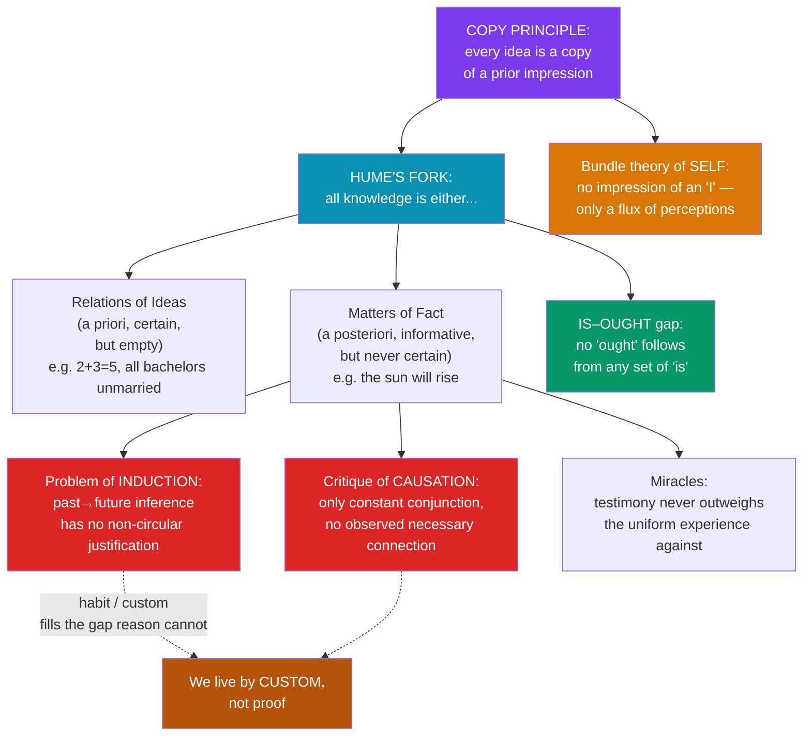

# 🎱 Hume's Skepticism

> [!abstract] TL;DR
> David Hume (1711–1776) takes empiricism to its logical end and finds that much of what we take for knowledge rests on **habit, not reason**. Every idea, he argues, is a faint copy of a prior **impression**; ideas with no traceable impression are empty. **Hume's Fork** splits all knowledge into **relations of ideas** (certain but empty — logic and maths) and **matters of fact** (informative but never certain). From this he derives his most famous results: the **problem of induction** (no reasoning can justify expecting the future to resemble the past); the **critique of causation** (we observe only *constant conjunction* and temporal succession — never a *necessary connection*, which is a projection of the mind's habit); the **bundle theory of the self** (introspection finds only a flux of perceptions, never an enduring "I"); the **is–ought gap** (no set of factual premises can entail a moral conclusion); and skepticism about **miracles** (testimony can never make a miracle more probable than the falsehood of the testimony). Hume's skepticism is the thunderclap that, by his own report, "awoke [Kant] from his dogmatic slumber."

## Intuition — analogy first

Watch a child touch a hot stove *once*. After that, the mere *sight* of a glowing burner makes the child flinch. Ask the child *why* they expect it to burn again and they cannot give you a proof — they just *feel* the expectation, wired in by repetition. Hume's shocking claim is that **the adult scientist is in exactly the same position as the child**. When we say "fire causes heat" or "the sun will rise tomorrow," we are not reporting a rational insight into a necessary link in nature. We are reporting a *habit of mind* built by seeing the two events joined again and again. Strip away the habit and you have only: fire, then heat; fire, then heat; fire, then heat — a list, never a *because*.

Here is the second image. Imagine trying to *see* the causal glue between two billiard balls. You watch the cue ball roll up, touch the red ball, and the red ball moves off. Now — where, in that scene, is the **necessary connection**? You saw ball A move, then contact, then ball B move. You did *not* see any force *compelling* B to move; you saw one thing, then another thing. The "must" you feel is not out there on the table; it is in *you*, a determination of your own imagination produced by having watched a thousand such collisions. Causation, for Hume, is the mind painting its own habit onto the world and then mistaking the paint for a feature of the wall.

---

## How It Works — The Fork and Its Consequences

Hume's whole system falls out of two simple tools: the copy principle (ideas trace to impressions) and the fork (two kinds of knowledge). Everything downstream — induction, causation, the self, the is–ought gap, miracles — is one of these tools applied to a target.

The pattern to notice: Hume is not an *arbitrary* doubter. He is a *consistent empiricist*. He simply asks of each cherished belief, "what impression is it derived from?" and "which fork does it fall under?" — and follows the answers wherever they lead, even into unsettling territory.

## Key Concepts

### Impressions, Ideas, and the Copy Principle

Hume divides all mental contents (*perceptions*) into **impressions** (lively, forceful — sensations, passions, emotions as originally felt) and **ideas** (faint copies of impressions in thinking and memory). The **Copy Principle**: every simple idea is derived from, and resembles, a corresponding simple impression. This gives Hume a *weapon*: when a philosophical term is suspected of being empty (e.g. "substance," "necessary connection," "self"), demand the impression it copies. If none can be produced, the idea is spurious.

### Hume's Fork

All objects of inquiry split into two exhaustive, exclusive kinds:

| | **Relations of Ideas** | **Matters of Fact** |
|---|------------------------|---------------------|
| **Knowability** | *A priori*, by pure thought | *A posteriori*, by experience |
| **Certainty** | Demonstratively certain; denial is a *contradiction* | Never certain; the contrary is always *conceivable* |
| **Content** | Empty of the world (analytic) | Informative about the world |
| **Examples** | Geometry, algebra, "all triangles have three sides" | "The sun will rise," "water boils at 100°C at sea level" |

The fork is a filter: any purported piece of knowledge that fits *neither* prong is, in the famous closing line of the *Enquiry*, fit only for "the flames," for it "can contain nothing but sophistry and illusion."

### The Problem of Induction

We constantly infer from **observed** cases to **unobserved** ones: bread nourished me before, so it will nourish me tomorrow. Hume asks what *justifies* this. The inference relies on a hidden premise — the **Uniformity of Nature** (the future will resemble the past). But how is *that* premise justified?

- **Not by relations of ideas**: a non-uniform future is perfectly *conceivable* (no contradiction in imagining bread that suddenly poisons), so uniformity is not demonstrable.
- **Not by matters of fact**: any argument from experience that "nature has been uniform, therefore it will continue uniform" *already assumes* uniformity — it is **circular**.

So inductive inference has **no rational foundation**. We are psychologically *compelled* to expect the future to resemble the past by **custom/habit**, but this is a fact about our nature, not a proof. This is Hume's most durable problem; see [[The_Problem_of_Induction]].

### The Critique of Causation

Hume applies the Copy Principle to the idea of a **necessary connection** between cause and effect. Examine any causal episode (the billiard balls) as closely as you like and you find only three things:

1. **Contiguity** — cause and effect are near in space/time.
2. **Temporal priority** — the cause precedes the effect.
3. **Constant conjunction** — events of type A have *always* been followed by events of type B.

What you never find is a *fourth* thing: an observed **necessary connection**, a power or *must* linking A to B. The idea of necessity, then, is not copied from anything *in the objects*; it is copied from an impression of **reflection** — the felt **determination of the mind** to pass from the idea of the cause to the idea of the effect after repeated exposure. Hume gives two definitions of "cause": (a) an object followed by another, *where all like objects are followed by like* (the constant-conjunction definition); and (b) an object followed by another, *whose appearance conveys the thought to the other* (the mind-projection definition). Causation "in the objects" reduces to regular succession; the *necessity* is in us.

### The Bundle Theory of the Self

Turn the Copy Principle on the **self**. Descartes' *cogito* assumed a substantial "I." Hume looks for its impression: "when I enter most intimately into what I call *myself*, I always stumble on some particular perception... I never can catch *myself* at any time without a perception, and never can observe any thing but the perception." There is no impression of a simple, persisting self — only a **bundle or collection of different perceptions, in perpetual flux**, "which succeed each other with an inconceivable rapidity." The mind is likened to a **theatre** where perceptions pass — but with no stage and no spectator, only the passing show. Personal identity is thus a *fiction* the imagination constructs from resemblance and causal connection among perceptions. (Hume himself, in an appendix, confessed dissatisfaction with his own account of what unites the bundle.)

### The Is–Ought Gap

In a single famous paragraph of the *Treatise* (Book III), Hume observes that moralists slide, "imperceptibly," from propositions joined by **is** and **is not** to propositions joined by **ought** and **ought not**. But this is a "new relation" that needs explaining: an *ought*-conclusion cannot be validly deduced from premises stating only what *is*. You cannot derive a value from facts alone. This is **Hume's Law** / the **is–ought gap** (and its cousin, the charge of the "naturalistic fallacy"). It does not by itself prove moral skepticism, but it shows morality cannot be *read off* the world by reason; for Hume, moral distinctions are rooted in **sentiment** ("reason is, and ought only to be the slave of the passions").

### Skepticism about Miracles

In *Enquiry* Section X, Hume argues a **wise person proportions belief to evidence**. A miracle is, by definition, a **violation of a law of nature**, and a law of nature is supported by *uniform, exceptionless* experience — the maximum possible evidence. Testimony to a miracle is always weaker than that uniform experience, because human testimony is frequently mistaken or deceptive. Therefore: "*no testimony is sufficient to establish a miracle, unless the testimony be of such a kind, that its falsehood would be more miraculous than the fact which it endeavours to establish.*" One should always believe the *lesser* miracle — that the witnesses erred or lied — rather than the greater. This is an *epistemic* argument (about when belief is warranted), not a metaphysical proof that miracles are impossible.

## Arguments & Examples

**The billiard balls (causation).** Present the cue ball striking the red ball to a superintelligent observer who has *never* seen a collision. Could they *predict* the red ball will move? Hume says no: prior to experience, *any* result is conceivable (the red ball could stay still, fly upward, vanish). Only *repeated observation* of the conjunction breeds the expectation. Necessity is learned, not seen — and even after learning, it is *felt*, not *demonstrated*.

**The circle of induction (formalized).** Let **U** = "nature is uniform." To justify "the sun will rise tomorrow" we need U. To justify U we appeal to the track record: "U has held so far." But moving from "U held in observed cases" to "U holds in unobserved cases" *is itself an inductive inference that presupposes U*. The justification therefore assumes what it sets out to prove. No escape via probability either: probabilistic inference *also* assumes the future resembles the past.

**The missing shade of blue (a candid counterexample).** Hume honestly flags an apparent exception to his own Copy Principle: a person who has seen every shade of blue *except one*, shown the graded spectrum, could arguably *imagine* the missing shade without ever having had its impression. Hume admits the case but judges it too "singular" to overturn the principle — a model of intellectual honesty that shows the empiricist rule is a claimed regularity, not a dogma.

## Common Pitfalls / Misconceptions

- **"Hume denies that causation exists."** He does not deny *regularities* or that we *should* rely on them. He denies that we ever *observe* a necessary connection, and he *relocates* necessity from the world to the mind's habit. Science is safe as *description of constant conjunctions*; what's rejected is the metaphysical "power."
- **"The problem of induction proves induction is irrational, so give it up."** Hume's point is subtler: induction cannot be *rationally justified*, yet it is *natural and unavoidable* — we cannot help reasoning inductively, and doing so is not blameworthy. He is a *naturalist* about belief, not a nihilist. (This "skeptical solution" — custom — is the point Kant found unsatisfying.)
- **"The bundle theory says you don't exist."** It says there is no *simple, unchanging substance* underlying experience — only a connected, flowing bundle of perceptions. Persons are real *as* bundles; what's denied is the Cartesian soul.
- **"The is–ought gap proves there are no moral facts."** It shows values can't be *deduced from* facts by reason alone. Whether that entails anti-realism is a further, contested step; Hume's own answer grounds morality in shared *sentiment*.
- **"Hume proved miracles are impossible."** He argued only that *testimony can never make belief in a miracle rational*, given how evidence should be weighed. It is an argument about *warrant*, not about metaphysical possibility.
- **"Hume's Fork is obviously right."** It is itself contested: Kant's whole project is the claim that there is a *third* category — the **synthetic a priori** — that the fork wrongly excludes (see [[Kant_and_the_Copernican_Turn]]).

## Related Concepts

- [[_MOC_Early_Modern_Philosophy|↑ Section MOC]]
- [[British_Empiricism]] — Locke and Berkeley set up the "ideas from experience" premise Hume drives to its skeptical limit
- [[Descartes_and_Rationalism]] — The *cogito*'s substantial self is exactly what Hume's bundle theory dissolves
- [[Spinoza_and_Leibniz]] — Hume's fork and induction skepticism target the rationalists' *a priori* metaphysics and the Principle of Sufficient Reason
- [[Kant_and_the_Copernican_Turn]] — Kant's response: rescue causation and the self as *a priori conditions* of experience, positing the synthetic a priori against Hume's fork
- Cross-vault: [[The_Problem_of_Induction]] — the induction problem in full (and Popper's later reply); [[Metaethics_and_Moral_Realism]] — the is–ought gap; [[Philosophy_of_Science]] — constant conjunction and laws of nature

## Review Questions

1. Lay out Hume's Fork and use it to explain why the problem of induction arises. Precisely where does the attempted justification of the Uniformity of Nature become circular, and why can't an appeal to probability rescue it?
2. Walk through the billiard-ball analysis of causation. What three features *do* we observe, what fourth feature do we *not*, and from which kind of impression does Hume say the idea of "necessary connection" is actually copied?
3. State the is–ought gap and the bundle theory of the self. For each, explain the popular misreading (that Hume proves moral anti-realism / that Hume denies you exist) and give Hume's more careful actual claim.

## Sources

- Hume, D. (1739–40). *A Treatise of Human Nature*. Ed. Norton & Norton, Oxford University Press
- Hume, D. (1748). *An Enquiry Concerning Human Understanding* (esp. §IV–VII on cause/induction, §X on miracles)
- Hume, D. (1751). *An Enquiry Concerning the Principles of Morals*
- Garrett, D. (2015). *Hume*. Routledge; Millican, P. (2002). *Reading Hume on Human Understanding*, OUP

#philosophy #early-modern #empiricism #skepticism #hume #causation
