# 🌌 Kant and the Copernican Turn

> [!abstract] TL;DR
> Immanuel Kant (1724–1804) ends the rationalism–empiricism war by showing both sides were half right. Rationalists were wrong that reason alone can know reality; empiricists (especially [[Humes_Skepticism|Hume]], who "awoke [Kant] from his dogmatic slumber") were wrong that experience delivers only unstructured impressions. Kant's **Copernican revolution**: instead of assuming the mind conforms to objects, assume **objects conform to the mind** — experience is possible only because the mind actively *structures* incoming data with its own forms. This lets him defend the **synthetic a priori**: judgments that are both *informative about the world* (synthetic) and *known independently of experience* (a priori), such as "7 + 5 = 12" and "every event has a cause" — the very class Hume's Fork denied. **Space and time** are not things but the mind's **forms of intuition**; the **categories** (including causality and substance) are the understanding's rules for organizing experience. The price: we know only **phenomena** (things as they appear, structured by our faculties), never **noumena** (things as they are in themselves). Because reason is also practical, morality gets a rational foundation in the **categorical imperative** (→ [[Deontology_and_Kantian_Ethics]]).

## Intuition — analogy first

Imagine you have worn **rose-tinted glasses** your entire life, glasses that can never be removed. Everything you see is reddish. Now ask: is the redness a feature of the *world*, or of your *glasses*? You cannot answer by looking harder — every look comes *through* the tint. But you *can* say something certain and universal in advance of any particular experience: **whatever I ever see will be reddish.** That is a bold, informative claim about all future experience, and you know it *a priori* — not because the world announced it, but because *you* bring the tint to every seeing.

Kant's revolutionary idea is that the human mind wears exactly such built-in "glasses," except they shape far more than colour. The mind imposes **space and time** on everything it perceives and imposes **causality, substance, unity, plurality** and other categories on everything it thinks. That is why we can know, before checking any particular case, that *every event will have a cause* and that *every object will be in space and time*: not because we have inspected all events (we haven't, and Hume showed we can't), but because these are the **conditions under which the mind can have an experience at all**. The catch, and it is a heavy one, is that we can therefore never know what the world is like *without* the glasses — reality "in itself," the **noumenon**, is permanently behind the tint.

---

## How It Works — The Copernican Turn and the Two-Faculty Machine

Before Kant, philosophers assumed knowledge works when the mind *mirrors* a ready-made world (and then puzzled over how it could fail). Kant inverts the picture: knowledge works because the world we experience is *partly constituted* by the knowing mind. Experience is a *joint product* of raw sensory matter (from the world) and a priori form (from us).

```mermaid
flowchart TD
    subgraph OLD["PRE-KANT: mind conforms to objects"]
        O1["World (ready-made)"] -->|"imprints"| O2["Passive mind mirrors it"]
        O2 -.->|"Hume: then causation & self<br/>can't be justified"| O3["Skepticism"]
    end

    subgraph NEW["KANT'S COPERNICAN TURN: objects conform to mind"]
        N0["Thing-in-itself<br/>(NOUMENON — unknowable)"] -->|"affects us →<br/>raw sensory manifold"| N1["SENSIBILITY<br/>forms of intuition:<br/>SPACE & TIME"]
        N1 -->|"ordered appearances"| N2["UNDERSTANDING<br/>the 12 CATEGORIES:<br/>causality, substance,<br/>unity, ..."]
        N2 --> N3["PHENOMENON<br/>= structured experience<br/>(the only world we know)"]
        N3 -.->|"secures"| N4["Synthetic a priori:<br/>maths & 'every event<br/>has a cause' justified"]
    end

    style O3 fill:#dc2626,color:#fff
    style N0 fill:#334155,color:#fff
    style N1 fill:#2563eb,color:#fff
    style N2 fill:#059669,color:#fff
    style N3 fill:#7c3aed,color:#fff
    style N4 fill:#0891b2,color:#fff
```

The engine has two faculties working in series. **Sensibility** receives the raw manifold and slots it into **space and time**; **understanding** then subsumes it under the **categories**. Kant's slogan captures the cooperation: **"Thoughts without content are empty, intuitions without concepts are blind."** Neither faculty alone yields knowledge — rationalism erred by trusting concepts without intuition; empiricism erred by trusting intuition without acknowledging the concepts the mind supplies.

## Key Concepts

### The Two Distinctions and the Grid They Form

Kant's *Critique of Pure Reason* (1781; 2nd ed. 1787) opens by crossing two distinctions:

- **A priori vs a posteriori** — known *independently of* experience vs known *through* experience.
- **Analytic vs synthetic** — predicate *contained in* the subject ("all bodies are extended") vs predicate *adds* something ("all bodies have weight").

| | **Analytic** | **Synthetic** |
|---|--------------|---------------|
| **A priori** | Trivial, certain ("bachelors are unmarried") | **The battleground — Kant's target** ("7+5=12"; "every event has a cause") |
| **A posteriori** | (empty — an analytic truth needs no experience) | Ordinary empirical facts ("the door is open") |

Hume's Fork recognized only the top-left (relations of ideas ≈ analytic a priori) and bottom-right (matters of fact ≈ synthetic a posteriori). Kant's decisive claim is that the **top-right cell is real and occupied**: there are **synthetic a priori** judgments. The organizing question of the *Critique* is: **"How are synthetic a priori judgments possible?"**

### The Synthetic A Priori

These judgments are *ampliative* (they extend knowledge, unlike analytic truths) yet *necessary and universal* (unlike empirical truths, which are contingent). Kant's leading examples:

- **Mathematics**: "7 + 5 = 12" is synthetic (the concept "12" is not *contained in* the concepts "7," "5," and "+"; you must *construct* the sum in intuition), yet a priori (necessarily true, not learned by counting apples).
- **Pure natural science**: "Every event has a cause" and "in all changes substance is conserved" — universal, necessary, but not analytic.
- **Space and time claims of geometry**: "The straight line between two points is the shortest" is synthetic yet known a priori.

Their possibility is exactly what Hume's skepticism denied — so if Kant can *explain* them, he answers Hume without retreating to dogmatic rationalism.

### The Copernican Revolution

Kant's own analogy: just as **Copernicus** explained the heavens by supposing the *observer* moves rather than the stars, Kant explains a priori knowledge by supposing that **objects of experience conform to our cognition** rather than our cognition passively conforming to objects. If the mind *supplies* space, time, and the categories, then it can know in advance that *every* possible object of experience will bear those forms — because nothing could count as an experience *for us* otherwise. A priori knowledge of experience becomes possible precisely because we are describing the **structure we ourselves impose**.

### Space and Time as Forms of Intuition (Transcendental Aesthetic)

Space and time, Kant argues, are neither mind-independent things (against Newton's absolute space) nor mere relations among things (against Leibniz), but the **a priori forms of sensibility** — the mind's built-in framework for *receiving* any appearance:

- **Space** is the form of *outer* sense (all outer objects are represented as spatial).
- **Time** is the form of *inner* sense (all mental states are represented as temporally successive) and, mediately, of all appearances.
- They are **empirically real** (every object of experience really is spatiotemporal) yet **transcendentally ideal** (space and time do not belong to things-in-themselves). This dual status is the heart of **transcendental idealism**.

### The Categories (Transcendental Analytic)

Sensibility gives ordered *appearances*; the **understanding** makes them into *objects of thought* by applying twelve **pure concepts / categories**, derived from the logical forms of judgment, in four groups:

| Group | Categories |
|-------|-----------|
| **Quantity** | Unity, Plurality, Totality |
| **Quality** | Reality, Negation, Limitation |
| **Relation** | Substance–accident, **Cause–effect**, Community (reciprocity) |
| **Modality** | Possibility, Existence, Necessity |

In the **Transcendental Deduction**, Kant argues these categories are the *necessary conditions* for a unified experience bound together by the "**I think**" that must be able to accompany all my representations (the **transcendental unity of apperception**). This is Kant's direct rescue of **causality** from Hume: "every event has a cause" is not read off nature (Hume was right that it can't be) but is an *a priori rule* the understanding must apply for there to be an objective, ordered experience at all.

### Phenomena vs Noumena — and the Limits of Reason

The cost of the whole solution: the categories and forms apply **only to possible experience**. Therefore we know things only as they **appear** — **phenomena** — never things as they are **in themselves** — **noumena** (the *Ding an sich*). The noumenon is a *limiting concept*: it marks the boundary beyond which knowledge cannot go, not a hidden object we could someday describe.

This boundary lets Kant diagnose the failures of traditional metaphysics. When **reason** tries to apply the categories *beyond* experience — to the soul, the cosmos as a whole, or God — it generates illusion:

- **Paralogisms** — fallacious "proofs" of a substantial, immortal soul (against Descartes' *res cogitans* as a known object).
- **Antinomies** — pairs of equally "provable" contradictory theses about the world (e.g. the universe *has* / *has no* beginning in time), showing reason contradicts itself when it overreaches.
- **The refutation of the ontological argument** — Kant's decisive point that **"existence is not a real predicate"**: adding "exists" to the concept of God adds nothing to its content, so no analysis of the concept can *entail* God's existence. This finishes the argument Descartes and Leibniz relied on (see [[Descartes_and_Rationalism]], [[Spinoza_and_Leibniz]]).

### First Look at the Categorical Imperative

Reason is not only *theoretical* (knowing) but **practical** (acting). In the *Groundwork of the Metaphysics of Morals* (1785), Kant grounds morality not in consequences or sentiment (contra Hume) but in the form of rational law itself. The supreme principle is the **categorical imperative** — a command binding unconditionally, not "if you want X, do Y":

- **Formula of Universal Law**: "Act only according to that maxim whereby you can at the same time will that it should become a universal law."
- **Formula of Humanity**: "Act so as to treat humanity, whether in your own person or another's, always as an *end* and never merely as a *means*."

Morality thus flows from **autonomy** — the rational will legislating law to itself — and the moral "must" turns out to be another product of reason's own structure, parallel to the a priori "must" of causation in the theoretical sphere. This is the seed of **deontological ethics**, developed in [[Deontology_and_Kantian_Ethics]].

## Arguments & Examples

**"7 + 5 = 12" is synthetic (the case against Hume's Fork).** Analyze the concepts "7," "5," and "sum": nowhere in them is the concept "12" *contained* — you can hold all three in mind without thereby thinking "12." To get 12 you must *go beyond* the concepts and **construct** the addition in intuition (e.g. counting on fingers, or on the pure intuition of time). So the judgment *adds* information (synthetic), yet is necessary and known independently of any particular experience (a priori). If even arithmetic is synthetic a priori, Hume's two-pronged fork is incomplete, and the door to answering skepticism is open.

**Answering Hume on causation.** Hume: we never *observe* a necessary connection, so "every event has a cause" is an unjustified habit. Kant: correct — you will never find causation *in* the perceptions. But you don't get it from there. Causation is a **category**, an a priori rule the understanding *must* impose to distinguish an *objective* sequence (a ship drifting downstream — the order is fixed) from a merely *subjective* one (my glance sweeping over a stationary house — the order is up to me). Without the causal rule there would be no objective time-order, hence no experience of *events* at all. The necessity Hume sought is real — but it is the necessity of the *conditions of experience*, not a feature of things-in-themselves.

**The First Antinomy (reason overreaching).** Thesis: "The world has a beginning in time and is bounded in space." Antithesis: "The world has no beginning and no bounds." Kant shows *both* can be given seemingly valid proofs. The lesson is not that one wins, but that the question is *illegitimate*: "the world as a completed whole" is not a possible object of experience, so the categories (which apply only within experience) cannot settle it. The antinomies are Kant's diagnostic that traditional cosmology asks questions reason is structurally unable to answer.

## Common Pitfalls / Misconceptions

- **"Transcendental idealism means the world is all in my head (Berkeley redux)."** Kant sharply distinguishes his view from Berkeley's *subjective* idealism. Appearances are **empirically real** — there really is a public, law-governed spatiotemporal world of objects; it is *transcendentally* ideal only in that its spatiotemporal form is contributed by our sensibility. Kant even offers a *Refutation of Idealism* arguing that inner experience presupposes outer objects.
- **"Noumena are hidden objects we might one day reach with better instruments."** The thing-in-itself is not far away or very small; it is *in principle* outside the conditions of any possible experience. "Noumenon" is a **limiting concept**, marking a boundary, not a target.
- **"A priori means innate ideas (like Descartes/Leibniz)."** Kant's a priori forms are not *ready-made ideas* stocked in the mind; they are **rules and forms of activity** — how the mind *processes* any input. Content still requires experience: "intuitions without concepts are blind," but "concepts without intuitions are empty."
- **"The synthetic a priori just relabels Hume's problem."** It *reframes* it: Kant grants Hume that causation isn't in perception, then argues it is a *condition* of there being ordered perception. Whether this succeeds is debated, but it is a genuine third option, not a verbal trick.
- **"The categorical imperative is the Golden Rule."** It is not "treat others as you'd like to be treated" (which is contingent on your desires). It is a test of the **universalizability** and **rational consistency** of a maxim, independent of any inclination. See [[Deontology_and_Kantian_Ethics]].
- **"Kant proved space is Euclidean / Newtonian physics is a priori true forever."** Kant's specific claims about Euclidean geometry and Newtonian mechanics were undercut by relativity and non-Euclidean geometry. The *structural* thesis (that the mind supplies organizing forms) is what most post-Kantians retain, even while abandoning his particular list.

## Related Concepts

- [[_MOC_Early_Modern_Philosophy|↑ Section MOC]]
- [[Humes_Skepticism]] — The skepticism about causation and induction that Kant's synthetic a priori is engineered to answer
- [[British_Empiricism]] — Kant absorbs the empiricist insistence that knowledge needs sensory content ("intuitions") while rejecting the passive mind
- [[Descartes_and_Rationalism]] — Kant refutes the ontological argument and the paralogism of a *known* thinking substance
- [[Spinoza_and_Leibniz]] — Classed as "dogmatic" rationalism that overreaches the bounds of possible experience; the antinomies target such cosmology
- Cross-vault: [[Deontology_and_Kantian_Ethics]] — the categorical imperative developed in full; [[Rationalism_vs_Empiricism]] — the debate Kant claims to end; [[Philosophy_of_Science]] — the constitution of objectivity and later neo-Kantian views

## Review Questions

1. State Kant's question "How are synthetic a priori judgments possible?" Using "7 + 5 = 12," explain why the judgment is *synthetic* and why it is *a priori*, and why its existence is fatal to Hume's Fork.
2. Explain the Copernican revolution and how it lets Kant answer Hume on causation *without* claiming to perceive necessary connections in nature. What work is done by the distinction between an objective and a subjective time-order?
3. Distinguish phenomena from noumena and explain why the thing-in-itself is a "limiting concept" rather than a hidden object. How do the antinomies and the critique of the ontological argument illustrate what happens when reason ignores this limit?

## Sources

- Kant, I. (1781/1787). *Critique of Pure Reason*. Trans. Guyer & Wood, Cambridge University Press
- Kant, I. (1783). *Prolegomena to Any Future Metaphysics* (the accessible summary, with the "dogmatic slumber" remark)
- Kant, I. (1785). *Groundwork of the Metaphysics of Morals*
- Gardner, S. (1999). *Kant and the Critique of Pure Reason*. Routledge

#philosophy #early-modern #kant #epistemology #metaphysics #transcendental-idealism
