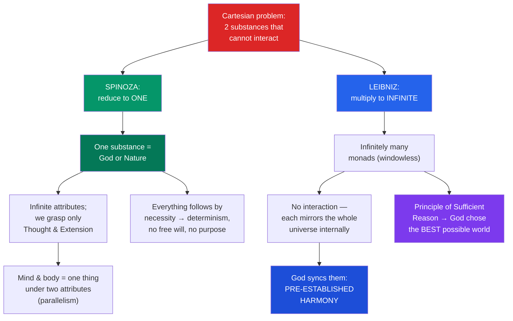

# 🔷 Spinoza and Leibniz

> [!abstract] TL;DR
> Descartes left rationalism with two problems: too many substances (mind vs body) and no way for them to interact. His two great successors solve it in opposite directions. **Baruch Spinoza** (1632–1677) argues there is only *one* substance — infinite, self-caused, identical with the whole of reality: **"God, or Nature" (*Deus sive Natura*)**. Mind and body are not two things but the same thing conceived under two of God's infinite attributes; everything follows from God's nature by strict logical **necessity** (necessitarianism), so free will and cosmic purpose are illusions. **Gottfried Wilhelm Leibniz** (1646–1716) argues instead for *infinitely many* substances — indivisible, immaterial, windowless **monads**, each a self-contained perspective on the universe. They never causally interact; God has set them in **pre-established harmony** like perfectly synchronized clocks. Guided by the **Principle of Sufficient Reason**, God actualized **the best of all possible worlds** — Leibniz's controversial answer (his *theodicy*) to the problem of evil.

## Intuition — analogy first

Picture the ocean. Descartes sees the sea as full of separate things — this wave, that wave, this ship — each a little substance bumping into the others. **Spinoza looks at the same sea and says: there are no separate waves at all.** There is only *the ocean*, and what we call a wave is just the ocean doing something *wave-ish* in one spot for a moment. You and I, a rock, a thought, a galaxy — all of us are momentary swells in a single infinite substance. Nothing is truly independent; everything is a *mode* of the one thing that exists on its own, which Spinoza calls God or Nature. That is **substance monism**.

Now switch the analogy. **Leibniz** looks at reality and sees not one ocean but an *infinity of soap bubbles*, each a tiny sealed sphere. On the inside surface of each bubble the entire universe is painted — every bubble is a complete, private mirror of the whole cosmos from its own angle. Crucially, **the bubbles never touch**. A bubble does not push its neighbours; it has no windows, no doors, no way in or out. Yet the pictures on all the bubbles change in perfect step, as if a divine conductor had wound up an infinity of clocks at the beginning of time so that they would forever chime together without ever being connected. That coordinated dance of windowless mirrors is **pre-established harmony**.

---

## How It Works — One Substance vs Infinitely Many

The two systems are best understood as *rival answers to the same question*: how many substances are there, and how do they relate? The diagram traces each philosopher's move from the shared starting point.

Both are **rationalists**: each claims that the fundamental structure of reality can be deduced *a priori*, by pure reason, from a few self-evident definitions and axioms — Spinoza literally, in the geometric form of Euclid; Leibniz from two master principles (contradiction and sufficient reason).

## Key Concepts

### Spinoza: Substance Monism

Spinoza's *Ethics* (published posthumously, 1677) begins from Descartes' own **definition of substance** — "that which is in itself and conceived through itself," depending on nothing else to exist — and pushes it to a conclusion Descartes flinched from. If a substance is truly self-sufficient, then:

- **There can be only one substance.** Two substances would have to limit and depend on each other, contradicting genuine self-sufficiency. So there is exactly **one infinite substance**.
- **That substance is God — and also Nature.** *Deus sive Natura* ("God, or Nature") identifies God with the totality of reality. This is **pantheism**: God is not a person outside the world who created it, but the immanent, eternal, self-caused (*causa sui*) system that *is* the world. (Contemporaries called it atheism in disguise; Spinoza was excommunicated from Amsterdam's Jewish community in 1656.)
- **Attributes and modes.** The one substance has *infinitely many* **attributes** (ways its essence can be conceived), but human minds grasp only two: **Thought** and **Extension**. Particular things — tables, people, ideas — are **modes**: passing modifications of the one substance, not substances themselves.

### Spinoza: Parallelism and the Mind–Body Solution

Because mind and body are the *same* mode expressed under two attributes, there is no *interaction* to explain (Descartes' problem dissolves): "the order and connection of ideas is the same as the order and connection of things." A thought and its corresponding brain-state are one and the same event described two ways. This is **psychophysical parallelism**, and it is Spinoza's elegant escape from Cartesian dualism.

### Spinoza: Necessitarianism and the Geometric Method

Everything that exists follows from the nature of God with the *same necessity* by which it follows from a triangle's nature that its angles sum to two right angles. Hence:

- **Strict determinism / necessitarianism**: nothing could have been otherwise; the actual world is the only *possible* world.
- **No free will**: freedom is not uncaused choice but *understanding* the necessity of one's own nature — "the free man" acts from adequate ideas, not from an imaginary liberty.
- **No cosmic teleology**: nature acts from necessity, not toward goals; belief in purposes is a human projection (a key target of the *Ethics* Appendix to Part I).
- **The geometric method** (*more geometrico*): the *Ethics* is written as definitions → axioms → propositions → demonstrations (Q.E.D.), modelling metaphysics on Euclid to make its necessity visible on the page. The final aim is ethical: to reach *beatitudo*, blessedness, through the "intellectual love of God" — clear understanding of our place in the one necessary whole.

### Leibniz: Monads

Against Spinoza's single substance, Leibniz (*Monadology*, 1714; *Discourse on Metaphysics*, 1686) posits an infinity of them. A **monad** is:

- **Simple** — without parts, hence indivisible and indestructible (only God can annihilate one). Extended matter is infinitely divisible and so cannot be the ultimate reality; the real building blocks must be *unextended*, mind-like points of force.
- **Windowless** — "monads have no windows through which anything could come in or go out." No monad is causally affected by any other.
- **A living mirror** — each monad *perceives* (represents) the entire universe from its own point of view, with varying clarity. Higher monads (souls, minds) have distinct perception and **apperception** (self-awareness); bare monads perceive confusedly.

### Leibniz: Pre-Established Harmony

If monads never interact, why does the mind's decision to raise an arm coincide with the arm rising? Because **God, at creation, programmed every monad so that their internal states unfold in perfect mutual correspondence** — the famous image of **two clocks** keeping identical time without any connection, each running by its own inner mechanism. Apparent causation is really pre-arranged **concomitance**. This is Leibniz's rival to both Descartes' (mysterious) interaction and Spinoza's parallelism.

### Leibniz: Sufficient Reason, Best Possible World, and Theodicy

Two principles govern Leibniz's system:

| Principle | Statement | Role |
|-----------|-----------|------|
| **Principle of Contradiction** | A proposition cannot be both true and false | Governs *necessary* truths (logic, maths) |
| **Principle of Sufficient Reason (PSR)** | Nothing is so without a reason why it is so rather than otherwise | Governs *contingent* truths (which world exists) |

From the PSR: God, being perfect, had a *sufficient reason* to create — and could only reasonably choose to actualize **the best of all possible worlds** among the infinitely many logically possible ones He surveys in His understanding. This is Leibniz's **theodicy** (a term he coined, *Théodicée*, 1710): a justification of God in the face of evil. Evil exists, but only the *minimum* compatible with the greatest overall goodness, harmony, and variety; a world with *less* evil would have had less good. Note the contrast with Spinoza: for Leibniz the world is **contingent** (God freely chose the best); for Spinoza it is **necessary** (there was no choice and no "best," since nothing could differ).

## Arguments & Examples

**Spinoza's one-substance deduction (Ethics I).** (1) A substance is conceived through itself alone (Def.). (2) If two substances shared an attribute, one could not be conceived without the other — contradicting (1). (3) So no two substances share an attribute. (4) God is defined as substance with *infinite* attributes. (5) An infinite-attribute substance leaves no attribute for any other substance. (6) Therefore only God exists as substance; all else is a mode of God. Whatever one thinks of the premises, the *form* is a strict geometric chain — rationalism in its purest architecture.

**The two-clocks illustration (Leibniz).** Suppose two pendulum clocks always show the same time. Three explanations: (a) they are physically linked (Descartes-style *influence*); (b) a technician constantly adjusts them (occasionalism — God intervenes at each instant); (c) they were built so precisely at the start that they stay in agreement forever with no link and no adjustment. Leibniz argues (c) — **pre-established harmony** — is the most worthy of God: it needs no ongoing miracle and no unintelligible causal transaction.

**Voltaire's *Candide* (1759).** Leibniz's "best of all possible worlds" was savagely mocked after the 1755 Lisbon earthquake killed tens of thousands. Voltaire's Dr. Pangloss, insisting that all is for the best amid catastrophe, is a caricature of optimistic theodicy. The example matters philosophically: it dramatizes the objection that no amount of *a priori* reasoning about God's goodness can be squared with the *empirical* scale of suffering — a tension [[Humes_Skepticism|Hume]] presses in his *Dialogues Concerning Natural Religion*.

## Common Pitfalls / Misconceptions

- **"Spinoza's pantheism is a warm, worshipful nature-mysticism."** His God is impersonal, non-providential, and cannot love you back, cannot answer prayer, and acts from blind necessity, not care. Calling it "God" is precise, not sentimental.
- **"Monads are tiny physical atoms."** They are *immaterial*, unextended, mind-like units of perception and force — closer to points of view than to particles. Matter, for Leibniz, is a *well-founded phenomenon* arising from aggregates of monads, not a fundamental substance.
- **"Pre-established harmony means everything is fated."** It coordinates the monads, but Leibniz still defends contingency and (compatibilist) freedom: God chose *this* world freely, and rational monads act for reasons that *incline without necessitating*. This is the sharp contrast with Spinoza's hard necessitarianism.
- **"'Best of all possible worlds' means this world is perfect / can't be improved locally."** It means the *whole package* is optimal; any individual evil is permitted only because removing it would remove greater goods elsewhere. Local improvement is not the claim.
- **"Both are just Descartes with tweaks."** They reject Descartes' central commitment — the *plurality of finite substances*. Spinoza denies there are many; Leibniz denies any of them are *extended*. Each reworks the very concept of substance.

## Related Concepts

- [[_MOC_Early_Modern_Philosophy|↑ Section MOC]]
- [[Descartes_and_Rationalism]] — The shared starting point; Spinoza and Leibniz each dissolve the interaction problem by rejecting a Cartesian premise
- [[British_Empiricism]] — The opposing program that denies reality can be deduced *a priori* from definitions
- [[Humes_Skepticism]] — Hume's Principle-of-Sufficient-Reason skepticism and his attack on cosmological/design arguments target Leibniz directly
- [[Kant_and_the_Copernican_Turn]] — Kant classes Spinoza and Leibniz as "dogmatic" rationalists who overreach the bounds of possible experience
- Cross-vault: [[The_Problem_of_Evil]] — Leibniz's theodicy in the wider debate; [[Determinism_and_Free_Will]] — Spinoza's necessitarianism; [[_MOC_Mathematics_Master]] — Leibniz as co-inventor of the calculus and the geometric ideal of proof

## Review Questions

1. Explain how Spinoza's single argument for substance monism *dissolves* the Cartesian mind–body interaction problem rather than solving it. What is "parallelism," and how does it differ from Leibniz's pre-established harmony?
2. State the Principle of Sufficient Reason and show how Leibniz moves from it to the claim that this is the best of all possible worlds. How does his commitment to *contingency* distinguish his God's creation from Spinoza's *necessary* Nature?
3. Both philosophers are "rationalists," yet reach almost opposite metaphysics (one substance vs infinitely many). What shared methodological assumption makes both systems possible, and how might an empiricist attack that assumption?

## Sources

- Spinoza, B. (1677). *Ethics* (*Ethica Ordine Geometrico Demonstrata*). Trans. Curley, in *The Collected Works of Spinoza*, Princeton University Press
- Leibniz, G.W. (1714). *Monadology*; (1710) *Theodicy*; (1686) *Discourse on Metaphysics*
- Della Rocca, M. (2008). *Spinoza*. Routledge
- Look, B.C. (2020). "Gottfried Wilhelm Leibniz." *Stanford Encyclopedia of Philosophy*

#philosophy #early-modern #rationalism #metaphysics #spinoza #leibniz
