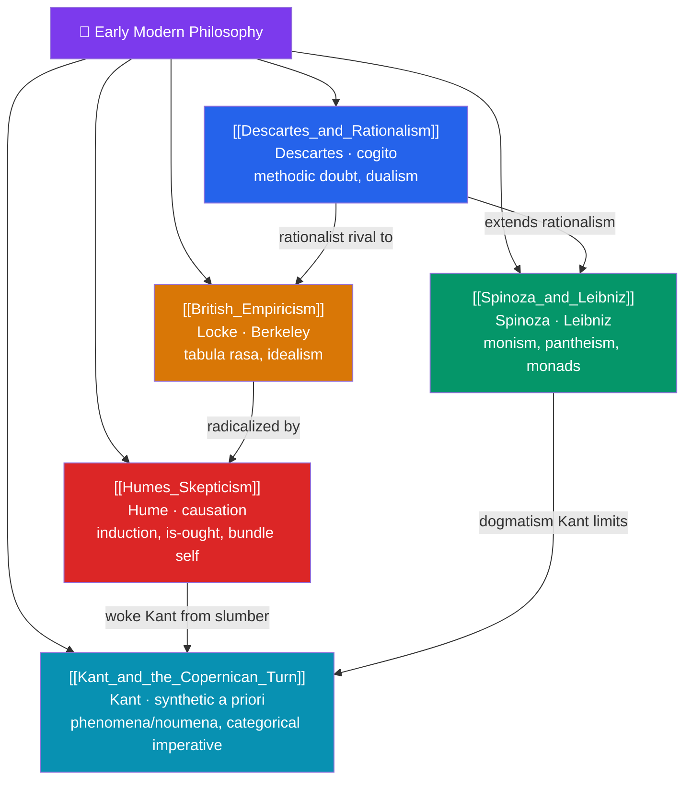

# 🗺️ Early Modern Philosophy — Map of Content

> [!abstract] What This Section Covers
> The Scientific Revolution forces philosophy to rebuild its foundations, and this section follows the two great currents — rationalism and empiricism — to their collision and resolution in Kant. **Descartes and Rationalism** launches modernity with methodic doubt, the *cogito*, and mind-body dualism; **Spinoza and Leibniz** push rationalism to its limits with substance monism and pantheism, and with monads in "the best of all possible worlds"; **British Empiricism** answers that all knowledge comes from experience — Locke's *tabula rasa* and Berkeley's radical idealism; **Hume's Skepticism** draws empiricism's shocking conclusions about causation, induction, the self, and the is–ought gap; and **Kant and the Copernican Turn** synthesizes both traditions, arguing the mind actively structures experience through the categories, distinguishing phenomena from noumena, and grounding morality in the categorical imperative. The arc runs from "I think" to the limits of thought itself.

## Concept Map

## Learning Path

1. [[Descartes_and_Rationalism]] — Methodic doubt, the evil demon, *cogito ergo sum*, clear and distinct ideas, and substance dualism.
2. [[Spinoza_and_Leibniz]] — Spinoza's single substance (God-or-Nature) and Leibniz's monads, pre-established harmony, and theodicy.
3. [[British_Empiricism]] — Locke's rejection of innate ideas and primary/secondary qualities; Berkeley's "to be is to be perceived."
4. [[Humes_Skepticism]] — The problem of induction, causation as constant conjunction, the missing self, and the is–ought gap.
5. [[Kant_and_the_Copernican_Turn]] — The synthetic a priori, space/time as forms of intuition, the categories, phenomena vs noumena, and the categorical imperative.

## All Notes at a Glance

| Note | Difficulty | What You'll Learn |
|------|------------|-------------------|
| [[Descartes_and_Rationalism]] | Intermediate | Methodic doubt, cogito, mind-body dualism, the Cartesian circle, innate ideas |
| [[Spinoza_and_Leibniz]] | Advanced | Substance monism, pantheism, necessitarianism, monads, pre-established harmony, theodicy |
| [[British_Empiricism]] | Intermediate | Tabula rasa, ideas from sensation/reflection, primary/secondary qualities, Berkeley's idealism |
| [[Humes_Skepticism]] | Intermediate → Advanced | Impressions vs ideas, induction, causation, bundle theory of self, is–ought, the fork |
| [[Kant_and_the_Copernican_Turn]] | Advanced | Synthetic a priori, transcendental idealism, categories, phenomena/noumena, categorical imperative |

## Key Questions This Section Answers

- What can I know with certainty if I doubt everything I possibly can?
- Are the mind and body two distinct substances, or one?
- Does all knowledge come from experience, or is some of it built into reason?
- Why can't experience justify our belief that the future will resemble the past?
- How does the mind actively shape the world we experience, according to Kant?

## Related Sections

- [[_MOC_Philosophy_Master|↑ Philosophy Master MOC]]
- [[_MOC_Medieval_Philosophy|← Medieval Philosophy]]
- [[_MOC_Modern_Contemporary_Philosophy|→ Nineteenth and Twentieth Century Philosophy]]
- Cross-vault: [[Rationalism_vs_Empiricism]] (Epistemology), [[The_Mind_Body_Problem]] (Philosophy of Mind), [[_MOC_Physics_Master]] (Scientific Revolution)

#MOC #Philosophy #EarlyModern
