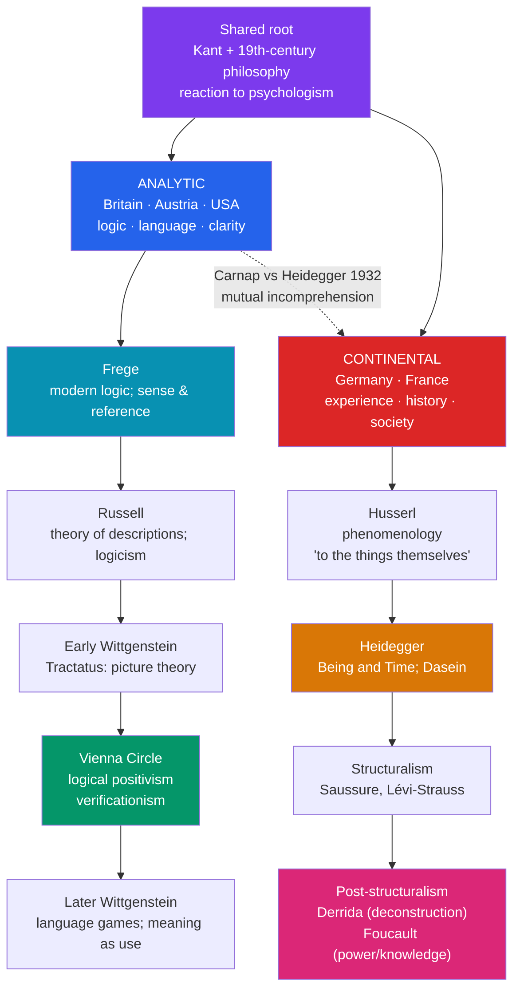

# ✂️ Analytic and Continental Philosophy

> [!abstract] TL;DR
> Twentieth-century philosophy split into two broad traditions that still shape departments today. The **analytic** tradition, rooted in the new logic of **Frege** and **Russell** and the "linguistic turn," prizes clarity, rigorous argument, and piecemeal problem-solving; its arc runs through the early **Wittgenstein**'s *Tractatus* (the picture theory of meaning), the **Vienna Circle**'s logical positivism (**verificationism**, which pronounced metaphysics meaningless), and the later Wittgenstein's **language games** (meaning as use). The **continental** tradition, centered in Germany and France, engages lived experience, history, and society: **Husserl** founded **phenomenology** ("to the things themselves"), **Heidegger**'s *Being and Time* reopened the question of Being through *Dasein*, and later **structuralism and post-structuralism** — **Derrida**'s deconstruction, **Foucault**'s power/knowledge — destabilized the subject and the text. The "divide" is more a difference of **style, method, and canon** than a single doctrine, and both branches descend from Kant.

## Intuition — analogy first

Imagine two brilliant teams sent to understand the same vast, unmapped **city**.

The **analytic** team works like **surveyors and engineers**. They distrust sweeping impressions, so they break the city into blocks, measure each precisely, insist every claim be stated so clearly it can be checked, and refuse to move on until a single intersection is fully understood. Their motto: *get the small things exactly right, and above all get the language right, because most confusion is a measurement error in disguise.*

The **continental** team works like **historians, novelists, and social critics**. They think you cannot understand a city by measuring bricks: you must ask how it came to be, what it is like to *live* there, whose interests its layout serves, and what its architecture conceals. Their motto: *meaning is historical and lived; a map that omits power, time, and experience has missed the point.*

Neither team is simply right. They are answering **different questions with different tools**, and for much of the twentieth century they stopped reading each other's reports — which is the divide in a nutshell.

---

## How It Works — one root, two traditions

Both traditions grow from the same nineteenth-century soil (above all Kant), then diverge in method, home geography, and canon.

## Key Concepts

### The analytic tradition

**Gottlob Frege (1848–1925)** effectively founded modern logic and the "linguistic turn." His *Begriffsschrift* (1879) introduced **quantified predicate logic** (variables, quantifiers, functions), the foundation of all subsequent formal logic. In "**On Sense and Reference**" (1892) he distinguished a term's **reference** (*Bedeutung*, the object picked out) from its **sense** (*Sinn*, the mode of presentation): "the morning star" and "the evening star" share one reference (Venus) but differ in sense — which is why "the morning star is the evening star" is informative rather than trivial. Frege also pursued **logicism**: the reduction of arithmetic to logic (see [[_MOC_Mathematics_Master]]).

**Bertrand Russell (1872–1970)** carried logicism into the monumental *Principia Mathematica* (1910–13, with Whitehead), discovered **Russell's paradox** (the set of all sets that are not members of themselves — a bomb under Frege's system), and made logical **analysis** the method of philosophy. His **theory of descriptions** ("On Denoting," 1905) showed how to handle sentences like "the present King of France is bald": logically regimented, they make an existence claim that is simply *false*, dissolving the puzzle of apparent reference to nonexistent things.

**Early Wittgenstein**: the *Tractatus Logico-Philosophicus* (1921) advances the **picture theory of meaning** — a meaningful proposition is a logical *picture* of a possible state of affairs; "the world is the totality of facts, not of things." What can be said is limited to such factual pictures; logic, ethics, and "the mystical" can be *shown* but not said. The book ends: "**Whereof one cannot speak, thereof one must be silent**" (proposition 7).

**Logical positivism / the Vienna Circle** (*Wiener Kreis*, c. 1924–1936): Moritz Schlick, Rudolf Carnap, Otto Neurath, and others (popularized in English by A.J. Ayer's *Language, Truth and Logic*, 1936) advanced **verificationism**: a non-analytic statement is **cognitively meaningful only if it is empirically verifiable**. The dramatic upshot: metaphysics, theology, and value-statements are literally **meaningless** (ethics reduced to expressions of emotion — *emotivism*). The Circle prized the **analytic/synthetic** distinction and unified science. It fractured with Schlick's murder (1936) and Nazi persecution scattering its members. Its own principle proved self-undermining (the verification principle is neither analytic nor empirically verifiable), and **Quine's "Two Dogmas of Empiricism"** (1951) attacked the analytic/synthetic distinction it relied on.

**Later Wittgenstein**: the posthumous *Philosophical Investigations* (1953) repudiates his own *Tractatus*. Meaning is not picturing but **use**: "the meaning of a word is its use in the language." Language consists of countless **language-games** embedded in **forms of life**; concepts are held together by overlapping **family resemblances**, not strict definitions; the **private language argument** challenges the very idea of purely inner meaning. Philosophy becomes *therapy* — dissolving confusions that arise "when language goes on holiday" — rather than theory-building.

### The continental tradition

**Edmund Husserl (1859–1938)** founded **phenomenology**: the rigorous descriptive study of the structures of consciousness *as experienced*. His watchword — "**to the things themselves**" (*zu den Sachen selbst*) — and his central concept, **intentionality** (consciousness is always consciousness *of* something, inherited from Brentano). His method is the **epoché** or **phenomenological reduction**: *bracketing* the "natural attitude" — suspending the question of whether the world exists — to describe pure experience. Late Husserl introduced the **lifeworld** (*Lebenswelt*), the pre-theoretical world of lived meaning (*The Crisis of the European Sciences*, 1936).

**Martin Heidegger (1889–1976)**, Husserl's student, reoriented phenomenology toward **ontology** in *Being and Time* (*Sein und Zeit*, 1927). He charged the tradition with "forgetting the **question of Being**." His approach analyzes **Dasein** ("being-there") — the entity that we are, for whom its own being is *an issue*. Key ideas: **being-in-the-world**; the distinction between the **ready-to-hand** (*zuhanden*, tools we use unreflectively) and the **present-at-hand** (*vorhanden*, objects we merely stare at); **thrownness** (we find ourselves already situated); the anonymous "**they**" (*das Man*) of inauthentic conformity; and **being-toward-death**, disclosed in **anxiety**, as the route to **authenticity**. (Heidegger's **membership in the Nazi Party** and 1933–34 rectorship at Freiburg are a grave and much-debated stain, sharpened by the *Black Notebooks*; his philosophy must be read with that history in view.)

**Structuralism and post-structuralism** developed this lineage in France:

- **Structuralism** applied Ferdinand de Saussure's linguistics — the **signifier/signified** relation, and the thesis that meaning arises from *differences* within a system rather than from things — to anthropology (**Lévi-Strauss**), literary and cultural analysis (**Barthes**), and psychoanalysis (**Lacan**).
- **Post-structuralism** radicalized and subverted it. **Jacques Derrida (1930–2004)** developed **deconstruction** (*Of Grammatology*, 1967): a critique of the "**metaphysics of presence**" and of **logocentrism**, showing that the hierarchical binary oppositions structuring Western thought (speech/writing, presence/absence, nature/culture) can be destabilized from within; his coinage **différance** marks that meaning is always *differed* and *deferred*, never fully present. **Michel Foucault (1926–1984)** analyzed the entanglement of **power and knowledge** (*pouvoir/savoir*): using **genealogy** and **archaeology**, he argued that "the subject" and forms of knowledge are *produced* by historical **power relations** and **discourses** (*Discipline and Punish*, 1975; *The History of Sexuality*, 1976–).

### Anatomy of the divide

| Dimension | **Analytic** | **Continental** |
|---|---|---|
| Home geography | Britain, US, Austria (then emigration) | Germany, France |
| Method | Logical analysis, argument, clarity, piecemeal | Interpretation, phenomenology, history, system/critique |
| Prizes | Rigor, precision, science-continuity | Lived experience, meaning, social/political depth |
| Prose | Spare, technical, example-driven | Dense, historical, often literary |
| Central figures | Frege, Russell, Wittgenstein, Carnap, Quine | Husserl, Heidegger, Sartre, Derrida, Foucault |
| Attitude to metaphysics | Suspicion; often deflation or elimination | Reinterpretation and transformation |

Both descend from **Kant**; the rift is often dated to a divergence over **psychologism** and to institutional separation in the early 1900s. A symbolic flashpoint is **Carnap's 1932 attack** on Heidegger, ridiculing the sentence "the Nothing itself nothings" (*das Nichts nichtet*) as a meaningless pseudo-proposition — mutual incomprehension made explicit. The 1929 **Davos debate** between Cassirer and Heidegger is another emblem. Crucially, the label "**continental**" was largely coined *by* analytic philosophers as a geographic-stylistic catch-all, and the divide is increasingly seen as porous: pragmatists, the later Wittgenstein, and figures like Rorty straddle it, and contemporary philosophy is more pluralist than the caricature suggests.

## Arguments & Examples

**Russell dissolves "the King of France."** Consider "The present King of France is bald." There is no such king, so the sentence seems to be *about* nothing — yet it is not obviously nonsense, and its negation ("...is not bald") seems equally troubled. Russell's analysis rewrites it as a conjunction: *there exists exactly one present King of France, and he is bald.* Since the existence clause is false, the whole statement is simply **false** (not meaningless, not about a shadowy entity). The philosophical puzzle evaporates once ordinary grammar is replaced by logical form — a textbook demonstration of the **analytic method**.

**Heidegger on the hammer.** You do not encounter a hammer, in the first instance, as an *object* with properties (weight, colour) that you inspect. You encounter it *ready-to-hand* — you simply hammer, the tool "withdrawing" into the seamless activity. Only when it **breaks** does it obtrude as a mere *present-at-hand* thing to be examined. Heidegger's point: the detached, staring subject-observing-object stance beloved of traditional epistemology is a *derivative*, breakdown mode of a more primordial, practical **being-in-the-world**. This is phenomenology reorienting the very starting point of philosophy — and it is why the two traditions can look past each other.

**Verificationism turned on itself.** The Vienna Circle declared: only the analytic or the empirically verifiable is cognitively meaningful. Apply the principle to *itself*: "only the verifiable is meaningful" is neither a truth of logic nor an empirical observation. By its own test it is meaningless — a self-refutation that, together with Quine's assault on the analytic/synthetic distinction, hastened logical positivism's decline and, ironically, softened the border toward pragmatism (see [[Pragmatism]]).

## Common Pitfalls / Misconceptions

- **"Analytic vs continental is a single doctrinal disagreement."** It is primarily a difference of **method, style, canon, and institutional lineage**, not one thesis. Many philosophers resist the label, and both sides share the Kantian inheritance.
- **"Analytic = pro-science and correct; continental = vague and pretentious"** (or the mirror-image sneer). These are tribal caricatures. Continental work is often historically and conceptually demanding; analytic work can be arid and scholastic. Judge arguments, not brands.
- **"The later Wittgenstein just refined the *Tractatus*."** He **repudiated** its picture theory. Early Wittgenstein: meaning is picturing. Later Wittgenstein: meaning is **use** in language-games. It is a reversal, not a tweak.
- **"Deconstruction means 'destroying' texts or 'anything goes.'"** Derridean deconstruction is a *close reading* that exposes tensions and hierarchies *already present* in a text; it is a disciplined critique of the metaphysics of presence, not license for arbitrary interpretation.
- **"Phenomenology is just introspection / psychology."** Husserl distinguished it sharply from empirical psychology; the **epoché** brackets existence to describe the *invariant structures* of experience, not to report contingent mental states.
- **"Foucault reduces everything to a conspiracy of the powerful."** His **power/knowledge** is diffuse, productive, and relational — it *constitutes* subjects and knowledge — not a top-down plot by rulers.

## Related Concepts

- [[Kierkegaard_and_Existentialism]] — Heidegger's existential analytic of *Dasein* is the bridge from phenomenology to existentialism; Sartre draws directly on *Being and Time*.
- [[Nietzsche]] — A decisive influence on the continental side: Heidegger's confrontation with him, Foucault's genealogy, and Derrida all build on Nietzsche.
- [[Pragmatism]] — Parallels analytic concern with meaning and clarity; neopragmatism (Quine, Rorty, Putnam) grew from and reshaped the analytic tradition.
- [[_MOC_Modern_Contemporary_Philosophy]] — Section hub.
- Cross-vault: [[_MOC_Mathematics_Master]] — Frege–Russell logicism, Russell's paradox, and *Principia Mathematica* connect directly to the foundations of mathematics and formal logic; [[_MOC_Philosophy_of_Science]] — logical positivism, verification, and Popper's falsificationism.

## Review Questions

1. Trace the analytic arc from Frege to the later Wittgenstein. Explain Frege's **sense/reference** distinction, the early Wittgenstein's **picture theory**, the Vienna Circle's **verificationism** (and why it is self-undermining), and how the later Wittgenstein's **meaning-as-use** overturns his own earlier view.
2. What did Husserl mean by "to the things themselves" and the **epoché**? How did Heidegger transform phenomenology into an inquiry into **Being**, and what do "ready-to-hand" vs "present-at-hand" and the hammer example illustrate?
3. Is the analytic/continental divide a substantive philosophical disagreement or a matter of style, method, and canon? Support your answer with the Carnap–Heidegger episode and at least one figure who complicates the boundary.

## Sources

- Frege, G. (1892). "On Sense and Reference"; Russell, B. (1905). "On Denoting," *Mind* — collected in *The Frege Reader* (1997) and *Logic and Knowledge* (1956).
- Wittgenstein, L. (1921). *Tractatus Logico-Philosophicus*; (1953) *Philosophical Investigations*, trans. Anscombe et al.
- Heidegger, M. (1927). *Being and Time*. Trans. J. Macquarrie & E. Robinson (1962), Blackwell.
- Glendinning, S. (2006). *The Idea of Continental Philosophy*. Edinburgh University Press.

#philosophy #analytic #continental #logic #phenomenology #wittgenstein #the-divide
