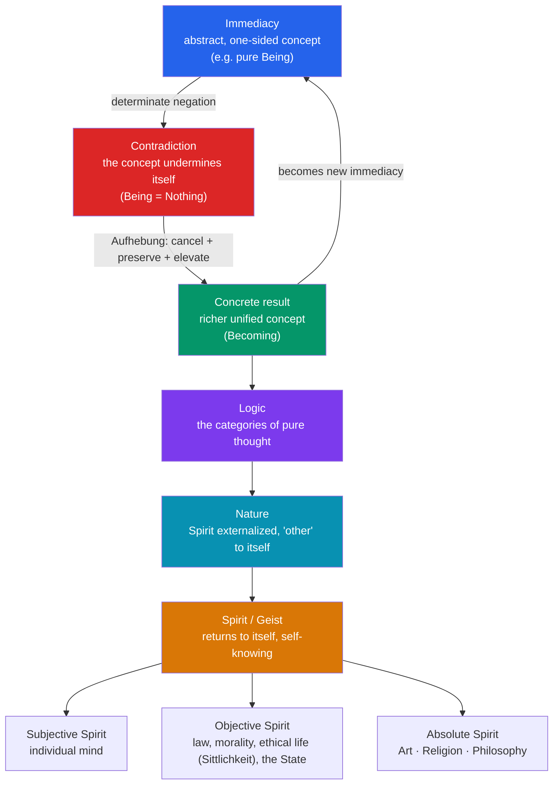

# 🌀 Hegel and German Idealism

> [!abstract] TL;DR
> German Idealism (Fichte, Schelling, Hegel) tried to complete Kant's revolution by abolishing his unknowable "thing-in-itself" and showing that reality is through-and-through intelligible — mind-like, rational, and self-developing. Hegel's **Absolute Idealism** claims that being and thought are ultimately identical: the whole of reality is the self-unfolding of **Geist** (Spirit/Mind) coming to know itself. His engine is the **dialectic** — not a mechanical "thesis–antithesis–synthesis" formula (a label Hegel almost never used) but the immanent movement by which a concept, thought through rigorously, generates its own contradiction and is then *sublated* (**aufgehoben**) into a richer, more concrete concept. The *Phenomenology of Spirit* (1807) stages this as a ladder of consciousness, whose famous **master–slave dialectic** shows that recognition and labour, not domination, produce freedom. World history, for Hegel, is nothing but "the progress of the consciousness of freedom."

## Intuition — analogy first

Think of the dialectic as **debugging a worldview by running it until it crashes — then keeping what the crash taught you.**

You adopt a simple position because it seems obviously true ("all knowledge is just raw sensation"). You take it seriously and push it to its limit. It breaks down from the *inside*: to even point at "this here, now" you already need concepts of "here," "now," and "this" that raw sensation can't supply. The position refutes itself. But you don't return to zero — the failure is *informative*. It tells you precisely what was missing, so the next position is not a fresh guess but a determinate correction that preserves the truth of the old view while cancelling its error. Run this loop long enough and you don't get chaos; you get a spiral that climbs toward an ever more adequate, self-consistent understanding.

Hegel's radical claim is that **reality itself works this way** — that the same self-correcting logic driving your thinking is the logic driving history, institutions, and Spirit's coming-to-self-knowledge. Thought and being are not two separate ballparks; they are one process seen from inside (as thinking) and outside (as being).

---

## How It Works — the dialectical engine and the system of Spirit

The dialectic is a three-moment *movement*, not a three-slot *template*. A category is taken in its immediate abstractness; thought discovers it is one-sided and passes into its opposite; the opposition is resolved by an **Aufhebung** — a German word Hegel exploits because it means at once *to cancel*, *to preserve*, and *to raise up*. The result is more **concrete** (richer in determinations), and it becomes the new starting point.

The single best example of the pure engine is the opening of the *Science of Logic* (1812–16): **Pure Being**, utterly indeterminate, has no property to distinguish it from **Nothing**; the two collapse into each other, and their truth is **Becoming** — the movement of vanishing-into-and-arising-from. Nothing external was added; the contradiction was internal, and its resolution was *determinate* (a specific positive result, not blank negation).

## Key Concepts

### From Kant to the Absolute: the post-Kantian program

Kant argued that the mind actively structures experience but left an unknowable **thing-in-itself** (noumenon) behind appearances (see [[Kant_and_the_Copernican_Turn]]). The idealists found this incoherent: to *think* the limit "we can't know X" is already to have thought X, so the limit is not a wall but a moment to be surpassed. Each thinker removed the thing-in-itself differently.

| Thinker | Dates | Signature idea | Move beyond Kant |
|---|---|---|---|
| **J.G. Fichte** | 1762–1814 | The self-positing **I** (*Ich*) that posits itself and the not-I | Subjective idealism: derive the world from the activity of the ego |
| **F.W.J. Schelling** | 1775–1854 | Philosophy of Nature; the **Absolute** as the identity of subject and object | Nature and mind are two "potencies" of one Absolute |
| **G.W.F. Hegel** | 1770–1831 | **Absolute Idealism**; Spirit knows itself through history | The Absolute is not a static identity but a *result* — "the True is the whole" |

Hegel's slogan **"substance is also subject"** (*Phenomenology*, Preface) captures the break: the Absolute is not an inert stuff underlying appearances but a *process* that develops, differentiates, and returns to itself. Reality is subject-like — it comes to self-consciousness. This is why it is *idealism* (reality is intrinsically intelligible, mind-like) and *absolute* (it comprehends the whole, leaving no unknowable remainder).

### The dialectic, properly understood

The textbook triad "thesis–antithesis–synthesis" is a genuine distortion. Hegel used those three terms together only rarely; the schema derives from Fichte and was popularized as a Hegel summary by **Heinrich Moritz Chalybäus** (1837). The distortion matters because it makes the dialectic sound like a mechanical recipe applied *from outside*. For Hegel it is:

- **Immanent** — the movement arises from the content's own internal tensions, not from an external rule.
- **Determinate negation** — negation always yields a *specific* positive result (the negation of Being is not blank void but *Nothing*, whose truth is *Becoming*). This is the heart of it: "the negative is just as much positive."
- **Sublation (Aufhebung)** — each stage is cancelled *as sufficient* yet preserved *as a moment* of the richer whole.
- **Toward the concrete** — the *abstract* (thin, isolated) gives way to the *concrete* (thick, richly mediated). Hegel inverts ordinary usage: "the concrete" is the most fully determined, not the most tangible.

### Geist (Spirit) and its shapes

**Geist** — translatable as *Spirit* or *Mind* — is Hegel's name for rational self-conscious activity, understood as fundamentally *collective and historical*, not merely private. Spirit externalizes itself in **Nature** and in human institutions, then recognizes itself in them. Its three great domains:

- **Subjective Spirit** — the individual mind (anthropology, phenomenology, psychology).
- **Objective Spirit** — Spirit made real in the shared world: abstract right, morality (*Moralität*), and above all **ethical life** (*Sittlichkeit*) — family, civil society, and the rational **State**. Here freedom becomes actual in institutions.
- **Absolute Spirit** — Spirit grasping itself as Spirit, in **art** (sensuous form), **religion** (representational form), and **philosophy** (conceptual form, the highest).

### The *Phenomenology of Spirit* (1807)

Hegel's first major book stages a "ladder" that consciousness must climb, each rung a "shape of consciousness" that tests its own criterion of knowledge, finds it inadequate, and is driven onward. The route runs: **sense-certainty → perception → understanding → self-consciousness → reason → Spirit → religion → absolute knowing.** A crucial device is the phenomenological "**we**" — the philosophical observer who watches each shape refute itself *by its own standard*, so no external criticism is imposed. The book is the "highway of despair" along which consciousness sheds its illusions.

### The master–slave dialectic (Lordship and Bondage)

The pivotal passage of the *Phenomenology*. Two self-consciousnesses meet; each needs **recognition** (*Anerkennung*) from the other to be certain of itself. A **life-and-death struggle** ensues. One combatant, from fear of death — "the absolute master" — submits: the **bondsman** (slave). The other, having risked life, becomes the **lord** (master). Then comes the dialectical reversal:

- The lord's supposed victory is hollow: he is recognized only by a *dependent* consciousness, so the recognition is worthless; and he becomes dependent on the bondsman's labour for his own enjoyment.
- The **bondsman**, by contrast, transforms the world through **work**. In shaping objects he sees his own agency reflected back, and through the discipline of labour and the confrontation with the fear of death he achieves genuine independence and self-consciousness.

The lesson: freedom and selfhood are won through recognition and formative labour, not through domination. This passage became one of the most consequential in modern thought, feeding directly into [[Marx_and_Critical_Theory]] (labour, class), Kojève's influential 1930s lectures, Fanon on colonialism, and de Beauvoir on the Self and the Other.

### History as the unfolding of freedom

"The **history of the world** is none other than the progress of the consciousness of freedom" (*Lectures on the Philosophy of History*). Hegel sketches a broad arc: the Oriental world knew that *one* is free (the despot); the Greek and Roman world, that *some* are free; the Germanic-Christian world grasps in principle that *all* are free. History is not random — it is Spirit becoming conscious of, and actualizing, freedom.

Individuals mostly pursue private passions, yet the rational pattern still advances through them: this is the **cunning of reason** (*List der Vernunft*). "World-historical individuals" like Caesar or Napoleon chase personal ambition but unwittingly serve Spirit's larger aim, then are discarded. Freedom is not mere caprice but *rational* self-determination realized in the institutions of a rational State — which is why Hegel writes, provocatively, "**what is rational is actual; and what is actual is rational**" (*Philosophy of Right*, 1821). Philosophy comes late — it understands an age only once it is complete: "the owl of Minerva spreads its wings only with the falling of the dusk."

## Arguments & Examples

**The self-refutation of sense-certainty (Phenomenology).** Claim: the richest, most immediate knowledge is bare sensory "this, here, now," untainted by concepts. Test it: write down what "now" is — "now is night." Read it at noon; it is false. The truth of "now" was never *this* moment but a *universal* that persists through many moments. The same holds for "here" and "this." So the most concrete-seeming knowledge secretly depends on universals (concepts) — sense-certainty *becomes* perception. The position was refuted by its own criterion, and the negation was determinate: it told us exactly what was missing.

**Why the dialectic is not relativism.** A crude reading says "everything contains its opposite, so anything goes." Hegel's actual claim is the reverse: because each negation is *determinate*, the sequence is *constrained* — Being can only pass into Nothing and thence into Becoming, not into anything whatever. The movement is rule-governed by the content itself, which is why Hegel thinks it yields a single systematic science rather than a free-for-all.

**Recognition in ordinary life.** The master–slave structure is visible wherever esteem is sought from those one has rendered powerless or servile: the tyrant surrounded by yes-men gets recognition that, precisely because it is coerced, cannot satisfy. Genuine self-worth requires recognition from a free equal — a thought that grounds later theories of mutual recognition (Honneth) and of rights.

## Common Pitfalls / Misconceptions

- **"Hegel's method is thesis–antithesis–synthesis."** He almost never uses those words as a triad; the formula is Fichtean/Chalybäus and obscures *determinate negation* and *sublation*. Treat it as a warning sign, not a summary.
- **"Absolute Idealism means mind creates matter, or the universe is a big cosmic mind."** It is not Berkeleyan subjective idealism (see [[British_Empiricism]]) nor a spooky world-soul. The core claim is that reality is *thoroughly intelligible* — that the structure of the real and the structure of thought coincide, so nothing is in-principle unknowable.
- **"'The actual is rational' means Hegel endorsed the Prussian status quo / whatever exists is good."** Hegel distinguishes the merely *existent* (contingent, transient) from the *actual* (*wirklich* — what expresses the rational essence). Much that exists is *not* actual in his technical sense, so the slogan is not a blanket blessing of the present.
- **"History has a guaranteed happy ending / 'end of history.'"** Hegel claims history is *comprehensible* as the development of freedom, not that it is over or that suffering is redeemed — he calls history a "slaughter-bench." The "end" is a logical culmination in self-comprehension, not a date.
- **"The master wins."** The whole point is the reversal: the *bondsman*, through labour and the confrontation with death, is on the path to freedom.

## Related Concepts

- [[Kant_and_the_Copernican_Turn]] — The transcendental turn and the "thing-in-itself" that the idealists set out to abolish; Hegel's direct point of departure.
- [[Marx_and_Critical_Theory]] — Marx inverts Hegel into materialism, turning the dialectic "right side up" and reworking labour and alienation from the master–slave analysis.
- [[Kierkegaard_and_Existentialism]] — Kierkegaard's revolt: the "System" has no room for the existing individual, subjectivity, and choice.
- [[Nietzsche]] — Another repudiation of grand rational teleology, replacing Spirit's progress with will to power and genealogy.
- [[_MOC_Modern_Contemporary_Philosophy]] — Section hub for nineteenth- and twentieth-century philosophy.
- Cross-vault: [[_MOC_History_Master]] — The industrial age, revolutions, and the philosophies of history Hegel's model influenced.

## Review Questions

1. Explain why "thesis–antithesis–synthesis" is a misleading summary of Hegel's dialectic. In your answer, define **determinate negation** and **Aufhebung**, and use the Being–Nothing–Becoming example to show how the movement is internal rather than externally imposed.
2. Reconstruct the master–slave dialectic. Why does the lord's victory prove self-undermining, and by what route does the bondsman achieve independent self-consciousness? Name one later thinker who repurposed this analysis and how.
3. What does Hegel mean by claiming that world history is "the progress of the consciousness of freedom"? Explain the "cunning of reason" and clarify why "the actual is rational" is *not* an endorsement of everything that happens to exist.

## Sources

- Hegel, G.W.F. (1807). *Phenomenology of Spirit*. Trans. A.V. Miller (1977), Oxford University Press.
- Hegel, G.W.F. (1821). *Elements of the Philosophy of Right*. Ed. A.W. Wood, trans. H.B. Nisbet (1991), Cambridge University Press.
- Beiser, F. (2005). *Hegel*. Routledge (Routledge Philosophers series).
- Pinkard, T. (2000). *Hegel: A Biography*. Cambridge University Press.

#philosophy #german-idealism #hegel #dialectic #geist #metaphysics
