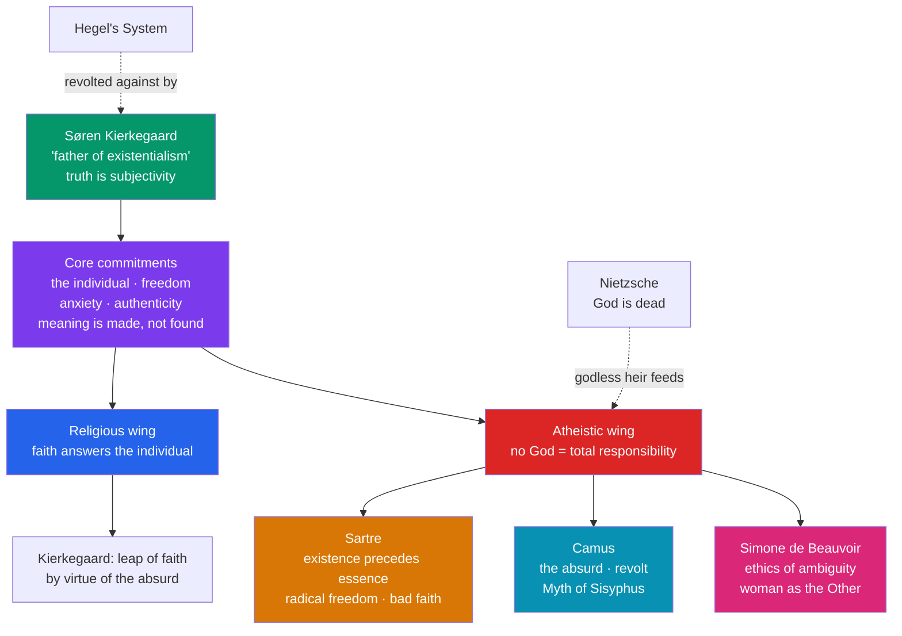

# 🎭 Kierkegaard and Existentialism

> [!abstract] TL;DR
> Existentialism begins as a revolt against grand rational systems (above all Hegel's) in the name of the concrete, choosing, suffering **individual**. **Søren Kierkegaard** (1813–1855) insisted that "truth is subjectivity," mapped the **aesthetic, ethical, and religious** stages of life, and located faith in a passionate **leap** made "by virtue of the absurd," attended by **angst** — the "dizziness of freedom." A century later **Jean-Paul Sartre** (1905–1980) gave the movement its slogan: for human beings **existence precedes essence** — we are "condemned to be free," define ourselves through choices, and flee this freedom into **bad faith** (self-deception). **Albert Camus** (1913–1960) named the **absurd** — the collision between our hunger for meaning and a silent universe — and answered it not with suicide or faith but with lucid **revolt**. **Simone de Beauvoir** (1908–1986) forged an existentialist ethics of freedom and applied it to gender: "One is not born, but rather becomes, a woman."

## Intuition — analogy first

Consider the difference between a **letter-opener** and a **newborn child**.

Before a craftsman makes a letter-opener, its **essence** already exists: a definition, a purpose ("a thing for slitting envelopes"), a set of specs. The object is then manufactured to match. Its essence *precedes* its existence.

A human being, Sartre says, is the opposite. There is no blueprint, no maker's specification, no pre-given human "purpose" you are built to fulfil. You simply *turn up* — you **exist** first — and only afterward, through everything you choose and do, does anything like an essence get made. You are not a letter-opener discovering what you were built for; you are the author writing the specs as you go, with no manual and no excuse. That vertigo — the recognition that nothing outside your own choices grounds who you are — is the existentialist starting point, and the source of both its exhilaration and its **angst**.

---

## How It Works — the existentialist lineage

Existentialism is less a doctrine than a family of thinkers united by a few commitments: the primacy of concrete existence over abstract system, radical freedom, anxiety, authenticity, and the conviction that meaning is *made*, not *found*. It splits into a **religious** wing (faith as the individual's answer) and an **atheistic** wing (no God, hence total responsibility).

## Key Concepts

### Kierkegaard: the single individual against the System

Writing in Copenhagen under a swarm of **pseudonyms** (each voicing a distinct standpoint rather than his own settled view), Kierkegaard attacked Hegel's totalizing "**System**" (see [[Hegel_and_German_Idealism]]) for having no place for the actually *existing* person. His rallying claims:

- **"Truth is subjectivity"** (*Concluding Unscientific Postscript*, 1846): what matters most in life — how to live, whether to have faith — cannot be settled by detached objective reasoning; it requires passionate, personal appropriation. The *how* of belief (inwardness) matters as much as the *what*.
- **The single individual** (*den Enkelte*): the category that resists absorption into "the crowd," the public, and the abstract universal. "The crowd is untruth."
- **Angst** (*Angest*, dread/anxiety), from *The Concept of Anxiety* (1844): unlike fear, which has a definite object, anxiety has *no* object — it is the **"dizziness of freedom"** we feel before the sheer open possibility of what we might become.
- **Despair**, from *The Sickness unto Death* (1849): a *misrelation* of the self to itself — either not willing to be oneself or defiantly willing to be a self one is not.

### The three stages (spheres) of existence

Kierkegaard maps three fundamental ways of living. One does not *reason* from one to the next; one **leaps**.

| Stage | Lives for | Exemplar | Breakdown |
|---|---|---|---|
| **Aesthetic** | Pleasure, novelty, immediacy | The seducer; Don Juan | Boredom and emptiness; despair |
| **Ethical** | Duty, commitment, the universal moral law | Judge William; marriage | Guilt at falling short of the law |
| **Religious** | A personal relation to God | Abraham; the "knight of faith" | Requires the leap "by virtue of the absurd" |

### The leap of faith

In *Fear and Trembling* (1843, as *Johannes de Silentio*), Kierkegaard meditates on **Abraham**, commanded to sacrifice Isaac. Abraham cannot *justify* his act by universal ethics — by that standard he is simply a would-be murderer. Faith demands a **teleological suspension of the ethical**: the individual, in absolute relation to God, goes *beyond* the universal on the strength of the **absurd** (believing he will both sacrifice Isaac *and* get him back). Faith is thus not the conclusion of an argument but a **passionate leap** that reason cannot underwrite — and Abraham makes it in "fear and trembling."

### Sartre: existence precedes essence

Sartre's *Being and Nothingness* (1943) and the lecture *Existentialism Is a Humanism* (1946) give existentialism its canonical form:

- **Existence precedes essence** — for the human being there is no fixed nature to realize; "man first exists... and defines himself afterward."
- **Radical freedom / "condemned to be free"** — consciousness (the *pour-soi*, being-for-itself) is a kind of nothingness, never fully determined by its past or situation. We *cannot not choose*: even refusing to choose is a choice. Freedom is not a gift but a sentence — hence *condemned*.
- **Bad faith** (*mauvaise foi*) — the pervasive attempt to escape this freedom by pretending to be a fixed **thing** with no choice. Sartre's examples: the **waiter** who over-performs "being a waiter" as if it were a fixed essence; the woman on a date who lets her hand be held while pretending not to notice, treating herself as a mere object. Bad faith exploits the tension between **facticity** (the given: body, past, situation) and **transcendence** (our freedom to surpass the given).
- **Responsibility and anguish** — with no God and no given values, we bear total responsibility; in choosing for myself I implicitly choose an image of what a human *ought* to be, "choosing for all." The weight of this is **anguish**.

### Camus: the absurd and revolt

Camus (who rejected the "existentialist" label) begins *The Myth of Sisyphus* (1942) with a jolt: "There is but one truly serious philosophical problem, and that is **suicide**." The **absurd** is not a property of the world or of us alone but the **confrontation** between the human demand for meaning and the universe's "unreasonable silence." Three possible responses:

1. **Physical suicide** — escaping the absurd by ending the confrontation. Camus rejects it.
2. **"Philosophical suicide"** — the *leap* to religious hope or metaphysical meaning (he includes Kierkegaard here), which dissolves the absurd by denying one of its terms. Camus refuses this too.
3. **Revolt** — living *in* the tension with full lucidity, without appeal and without resignation. Sisyphus, condemned to roll his boulder forever, becomes the absurd hero who owns his fate: "**One must imagine Sisyphus happy.**"

### Simone de Beauvoir: ambiguity and the Other

Beauvoir turned existentialist freedom into an **ethics**. In *The Ethics of Ambiguity* (1947) she argues that because my freedom is realized only through others, to will my own freedom authentically is to will the freedom of others — an answer to the charge that existentialism is amoral. In *The Second Sex* (1949) she applies the framework to gender: "**One is not born, but rather becomes, a woman.**" Woman has been culturally constructed as the **Other** against which "Man" is defined as the norm and the essential. This became foundational to modern feminist philosophy.

## Arguments & Examples

**Bad faith, dissected (the waiter).** Watch a café waiter whose movements are a touch too precise, too eager — "playing at being a waiter." Sartre's analysis: a human is never a waiter the way an inkwell is an inkwell; the waiter is a free consciousness who *chooses* the role moment to moment. By acting as though "waiter" were a fixed essence that dictates his conduct, he flees the anxiety of his freedom. The example generalizes: any time we say "I *can't* — that's just who I am / my role / my nature," we should suspect bad faith.

**The absurd made concrete.** Camus imagines a man in a glass phone booth, gesturing, whom you watch through soundproof glass; the "dumb show" is meaningless yet the man is obviously purposeful. That gap — meaningful from inside, meaningless from without — is a snapshot of the absurd. The response is neither to smash the glass (suicide) nor to invent a soundtrack (the leap of faith) but to keep watching, clear-eyed.

**Freedom as a sentence, not a boast.** A common misreading treats "radical freedom" as an empowering slogan. Sartre's point is heavier: a soldier cannot say "I had no choice"; even under coercion there was *some* choice (desert, refuse, die), so we are answerable even for what we suffer. Freedom this total is a burden — which is precisely why we invent excuses (bad faith) to shrink it.

## Common Pitfalls / Misconceptions

- **"Existentialism is teenage gloom / 'life is meaningless, so nothing matters.'"** The reverse: because nothing external supplies meaning, *everything* rests on our choices, which makes them weightier, not lighter. Most existentialists are moralists of responsibility.
- **"All existentialists are atheists."** Kierkegaard, Jaspers, and Marcel are *religious* existentialists. The unifying theme is the individual and freedom, not atheism.
- **"Camus was an existentialist."** He explicitly rejected the label and quarrelled publicly with Sartre. His philosophy of the **absurd** overlaps with but is distinct from Sartrean existentialism.
- **"'Existence precedes essence' means we have no nature at all / anything goes."** It targets a *pre-given purpose*, not the reality of the body, past, and situation (facticity). Freedom is always *situated*; it is the surpassing of a given, not a leap from nowhere.
- **"The leap of faith is irrational nonsense."** For Kierkegaard the leap is *trans*-rational, not sub-rational: it addresses precisely those existential questions he thinks objective reason *cannot* settle, and it is made in full awareness of the paradox.

## Related Concepts

- [[Nietzsche]] — The "godless heir": Nietzsche's death of God sets the stage for atheistic existentialism's problem of self-created meaning.
- [[Hegel_and_German_Idealism]] — The "System" whose abstraction Kierkegaard revolted against in the name of the existing individual.
- [[Analytic_and_Continental_Philosophy]] — Heidegger's *Being and Time* (existential ontology) is a bridge; existentialism is a landmark of the Continental tradition.
- [[_MOC_Modern_Contemporary_Philosophy]] — Section hub.
- Cross-vault: [[_MOC_Psychology_Master]] — Existential and humanistic psychology (Frankl's logotherapy, Rollo May, Yalom) draws directly on these themes of freedom, anxiety, and meaning.

## Review Questions

1. Explain the slogan "existence precedes essence" using Sartre's contrast between a manufactured artifact and a human being. How does **bad faith** follow from radical freedom, and what does the waiter example illustrate?
2. Reconstruct Kierkegaard's account of the **leap of faith** in *Fear and Trembling*. What is the "teleological suspension of the ethical," and why can't faith, on his view, be justified by universal reason?
3. Define Camus's notion of the **absurd** and distinguish the three responses he considers. Why does he reject both physical and "philosophical" suicide, and what does he mean by imagining Sisyphus happy?

## Sources

- Kierkegaard, S. (1843). *Fear and Trembling*. Trans. A. Hannay (1985), Penguin.
- Sartre, J.-P. (1943). *Being and Nothingness*. Trans. H. Barnes (1956), Washington Square Press; and *Existentialism Is a Humanism* (1946), trans. C. Macomber (2007).
- Camus, A. (1942). *The Myth of Sisyphus*. Trans. J. O'Brien (1955), Vintage.
- Beauvoir, S. de (1949). *The Second Sex*. Trans. C. Borde & S. Malovany-Chevallier (2009), Knopf.

#philosophy #existentialism #kierkegaard #sartre #camus #de-beauvoir #the-absurd
