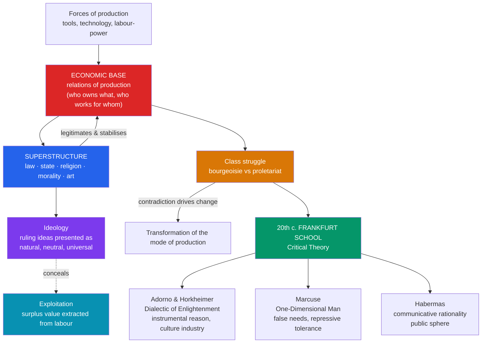

# ⚒️ Marx and Critical Theory

> [!abstract] TL;DR
> Karl Marx (1818–1883) took Hegel's dialectic and "turned it right side up": instead of Spirit driving history, the **material conditions of production** drive it. His **historical materialism** claims that a society's economic **base** (its forces and relations of production) conditions its legal, political, and cultural **superstructure**, including its **ideology** — the ruling ideas that make a particular class's interests look natural and universal. Capitalism, on this analysis, systematically **alienates** workers, extracts **surplus value**, and cloaks exploitation in **commodity fetishism**, where relations between people appear as relations between things. In the twentieth century the **Frankfurt School** (Horkheimer, Adorno, Marcuse, later Habermas) reworked Marx into **Critical Theory** — a self-reflective critique aimed not merely at describing society but at emancipating people from domination, extending the analysis from the economy to culture, reason, and communication.

## Intuition — analogy first

Imagine software where the **operating system is the economy** and everything you see on screen — the apps, the icons, the help text — is the **culture**.

Users interact with the friendly interface (law, religion, morality, art, common sense) and assume *that* is where the real decisions are made. Marx says: look under the hood. The interface is largely *generated* by the OS beneath it; change the economic operating system and the apps change too. And the OS ships with **default settings that quietly favour whoever wrote it** — the ruling class — while presenting those defaults as "just how computers work." **Ideology** is exactly this: the interface insisting it is neutral and eternal, so users never think to question the code. Critical Theory is the attempt to open the developer console, expose the defaults, and ask who benefits.

The analogy has a limit Marx would stress: unlike software, the users *make* the system through their own labour — and can remake it.

---

## How It Works — base, superstructure, and the arc to Critical Theory

## Key Concepts

### From Hegel to materialism

Marx was a "Young Hegelian" who kept Hegel's **dialectic** (reality as dynamic, driven by contradiction) but rejected his **idealism**. Where Hegel saw history as the self-development of *Geist* (see [[Hegel_and_German_Idealism]]), Marx wrote that with Hegel the dialectic "is standing on its head. It must be turned right side up again." The motor of history is not ideas but **material life** — how humans produce and reproduce their means of subsistence.

- **Dialectical materialism** — the label (coined later, mainly by Engels and Plekhanov) for the general view that material reality is dynamic and develops through contradiction.
- **Historical materialism** — its application to society and history: "It is not the consciousness of men that determines their being, but, on the contrary, their **social being** that determines their consciousness" (*Preface to A Contribution to the Critique of Political Economy*, 1859).

### Base and superstructure

| Layer | Contents | Function |
|---|---|---|
| **Forces of production** | Technology, tools, raw materials, human labour-power | The productive capacity of a society |
| **Relations of production** | Property, ownership, who commands whose labour | Together with forces, constitute the **mode of production** (e.g. feudal, capitalist) |
| **Base** | Forces + relations of production | *Conditions* the superstructure |
| **Superstructure** | Law, the state, politics, religion, morality, art, philosophy | *Reflects and legitimates* the base; reacts back on it |

The relation is one of *conditioning*, not crude one-way mechanical determination — later Marx and especially the Frankfurt School stress the "relative autonomy" and reciprocal influence of the superstructure.

### Alienation (Entfremdung)

From the *Economic and Philosophic Manuscripts of 1844*, Marx's most humanistic text. Under capitalism the worker is estranged in **four** interlocking ways:

1. **From the product** — what the worker makes belongs to another and confronts them as an alien, hostile power.
2. **From the activity of labour** — work is not free self-expression but forced, external toil ("labour is shunned like the plague").
3. **From species-being** (*Gattungswesen*) — from our distinctively human capacity for free, conscious, creative production.
4. **From other people** — social bonds are reduced to competitive market relations.

### Exploitation and surplus value

In *Capital*, Vol. 1 (1867), Marx argues the source of profit is **surplus value**. Labour-power is a commodity the worker sells; the capitalist pays its value (roughly, subsistence) but the worker produces *more* value than that during the working day. The unpaid remainder — surplus value — is appropriated by the capitalist. Exploitation is thus structural and impersonal, not a matter of individual greed.

### Commodity fetishism

A subtle, central idea (*Capital*, Ch. 1). Under capitalism, the **social relations between people** — the labour of many hands coordinated through the market — take on "the fantastic form of a **relation between things**." A commodity's value appears to be an intrinsic natural property of the object (like its weight), rather than a crystallization of human labour and social relations. We "fetishize" commodities as we might attribute powers to idols. This is why the market feels like a force of nature rather than a human arrangement — and why it can be changed.

### Ideology and class struggle

"The ideas of the ruling class are in every epoch the ruling ideas" (*The German Ideology*, 1845–46). **Ideology** is thought that misrepresents partial, class-bound interests as universal, natural, and eternal — thereby concealing the real relations of power (Engels later called this "**false consciousness**"). History advances through **class struggle**: "The history of all hitherto existing society is the history of class struggles" (*The Communist Manifesto*, 1848). Under capitalism the decisive antagonism is **bourgeoisie vs proletariat**.

### The Frankfurt School and Critical Theory

The **Institute for Social Research** (Frankfurt, founded 1923) became the home of **Critical Theory**. Max Horkheimer's manifesto "Traditional and Critical Theory" (1937) drew the key contrast: *traditional* theory describes the world as if from outside; **critical theory** is reflexively aware of its own social role and aims at **human emancipation** from domination.

| Figure | Dates | Key work | Core contribution |
|---|---|---|---|
| **Max Horkheimer** | 1895–1973 | *Dialectic of Enlightenment* (1944/47) | Critical vs traditional theory; instrumental reason |
| **Theodor W. Adorno** | 1903–1969 | *Dialectic of Enlightenment*; *Negative Dialectics* (1966) | The **culture industry**; critique of identity-thinking |
| **Herbert Marcuse** | 1898–1979 | *One-Dimensional Man* (1964) | **False needs**, "repressive tolerance," administered society |
| **Jürgen Habermas** | b. 1929 | *Theory of Communicative Action* (1981) | **Communicative rationality**, the public sphere |

- ***Dialectic of Enlightenment*** (Adorno & Horkheimer): the Enlightenment project of mastering nature through reason curdles into **instrumental reason** — reason reduced to calculating efficient means, indifferent to ends — which turns back into a new myth and enables domination. "Enlightenment is totalitarian." The **culture industry** turns art and mass media into standardized commodities that pacify and integrate people, manufacturing conformity.
- **Marcuse** argued advanced industrial society neutralizes dissent by satisfying *false needs* and absorbing opposition, flattening critical, "two-dimensional" thought into affirmative "one-dimensional" thought. A key influence on the 1960s New Left.
- **Habermas** (second generation) is more hopeful: he relocates reason's emancipatory potential in **communication** oriented toward mutual understanding (the "ideal speech situation"), and diagnoses modernity as the "**colonization of the lifeworld**" by money and administrative power. This grounds a theory of **deliberative democracy**. See [[_MOC_Political_Philosophy]].

## Arguments & Examples

**The exploitation argument, schematically.** Suppose a worker's wage corresponds to 4 hours of value but the working day is 8 hours. In the first 4 hours the worker "reproduces" their wage; in the remaining 4 they produce **surplus value** the capitalist keeps. No individual cheating is required — the exchange looks fair ("a fair day's wage") precisely because the mechanism is hidden in the wage form. This is Marx's answer to *where profit comes from* under conditions of equal exchange.

**Ideology critique in action.** A society may sincerely proclaim that "anyone can succeed through hard work." Marx's method asks: *whose interest does this belief serve, and what does it conceal?* If structural barriers make mobility rare, the belief functions to blame the poor for poverty and legitimate inequality — while presenting itself as neutral common sense. The point is not that the belief is consciously cynical but that its *social function* diverges from its stated content.

**Culture industry, updated.** Adorno's analysis of standardized popular music (interchangeable songs following a formula, pseudo-individualized to feel unique) reads as a prescient account of algorithmic recommendation feeds: content engineered for frictionless consumption that dulls rather than provokes critical attention.

## Common Pitfalls / Misconceptions

- **"Marxism is just an economic theory / a political program."** Marx's *philosophical* contributions — historical materialism, alienation, ideology, commodity fetishism — are distinct from both economics and any twentieth-century state that claimed his name. This note concerns the philosophy, not any regime.
- **"Base rigidly determines superstructure (economic determinism)."** Marx allows reciprocal influence, and Engels explicitly warned against the "vulgar" reading. The Frankfurt School's whole project stresses the *relative autonomy* of culture and reason.
- **"Alienation just means feeling unhappy at work."** It is a *structural* condition — estrangement from one's product, activity, species-being, and others — not merely a mood, and it can obtain even where workers report satisfaction.
- **"Commodity fetishism is a metaphor for consumerism."** It is a specific claim about how value *appears* as a property of things, masking the social labour behind them — a thesis about the form of appearance, not just about loving shopping.
- **"Critical Theory = Marxism."** It grows out of Marx but is heterodox: it critiques orthodox Marxism, absorbs Freud, Weber, and Nietzsche (see [[Nietzsche]]), and — with Habermas — partly breaks from the Marxist framework toward a theory of communication.

## Related Concepts

- [[Hegel_and_German_Idealism]] — The dialectic Marx inherits and inverts; the master–slave analysis of labour that feeds his account of work and exploitation.
- [[Nietzsche]] — A parallel "hermeneutics of suspicion": both unmask professed values by exposing the interests they serve (class vs will to power).
- [[Analytic_and_Continental_Philosophy]] — Critical Theory sits firmly on the Continental side; its heirs shaped later social and political thought.
- [[_MOC_Political_Philosophy]] — Marx on exploitation, class, and the state; Habermas on the public sphere and deliberative democracy.
- [[_MOC_Modern_Contemporary_Philosophy]] — Section hub.
- Cross-vault: [[_MOC_Macroeconomics_Master]] — Marx's labour theory of value and crisis theory in relation to mainstream economics; [[_MOC_History_Master]] — industrial capitalism and twentieth-century ideologies.

## Review Questions

1. State the base/superstructure model and explain the difference between crude economic determinism and Marx's actual view. How does the concept of **ideology** connect the two layers?
2. Distinguish **alienation**, **surplus value**, and **commodity fetishism**. For each, explain what it claims and why Marx thinks capitalism *systematically* produces it (rather than it being the fault of bad individuals).
3. What did Horkheimer mean by contrasting "traditional" and "critical" theory? Using the *Dialectic of Enlightenment*'s notions of **instrumental reason** and the **culture industry**, explain how the Frankfurt School extended Marx's critique from the economy to culture.

## Sources

- Marx, K. (1867). *Capital, Volume I*. Trans. B. Fowkes (1976), Penguin.
- Marx, K. & Engels, F. (1848). *The Communist Manifesto*; Marx (1844) *Economic and Philosophic Manuscripts*, in R. Tucker (ed.), *The Marx-Engels Reader* (1978), Norton.
- Horkheimer, M. & Adorno, T. (1947). *Dialectic of Enlightenment*. Trans. E. Jephcott (2002), Stanford University Press.
- Jay, M. (1973). *The Dialectical Imagination: A History of the Frankfurt School*. University of California Press.

#philosophy #marxism #critical-theory #ideology #alienation #frankfurt-school
