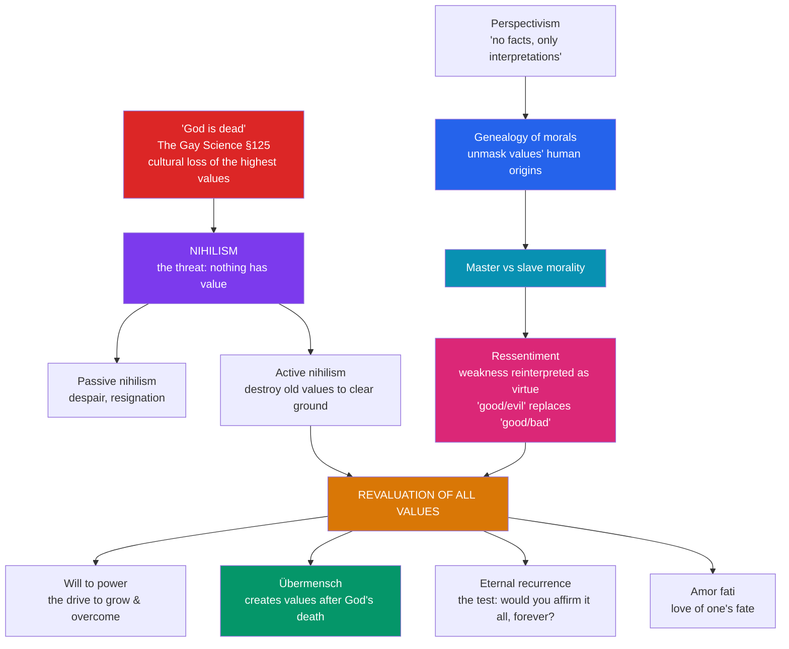

# 🔨 Nietzsche

> [!abstract] TL;DR
> Friedrich Nietzsche (1844–1900) diagnosed the central crisis of modernity: "**God is dead**" — the Christian-moral framework has lost its credibility, and with it Western culture's foundation for values, threatening a collapse into **nihilism**. His response is not despair but a **revaluation of all values**. He proposes the **will to power** as the basic drive of life (to grow, overcome, discharge strength, not merely survive); traces our morality genealogically to a "slave revolt" born of **ressentiment**, distinguishing **master** from **slave morality**; imagines the **Übermensch** who creates new values after God's death; poses **eternal recurrence** as the ultimate test of life-affirmation; and defends **perspectivism** — "there are no facts, only interpretations." A crucial caution frames all of this: after Nietzsche's collapse, his sister **Elisabeth** falsified and weaponized his work for German nationalism, and the Nazis later appropriated him — a distortion that betrays a thinker who explicitly *despised* antisemitism and nationalism.

## Intuition — analogy first

Imagine a civilization that has for centuries kept perfect time by a single great **cathedral clock**. Every schedule, contract, and ritual is set by its chimes. One day the clock stops — but the bells still echo in memory, so most people go on acting as if it runs, never noticing that the *source* of the time is gone.

Nietzsche's "God is dead" is the announcement that the clock has stopped. He does not mean a deity literally perished, nor is he gloating. He means the **shared foundation** that underwrote our values — truth, morality, meaning, purpose — has quietly lost its authority, even for many who still attend the cathedral. The danger is the interval *after* people notice: if the clock gave the time and the clock is broken, does *any* time exist? That panic is **nihilism** — the suspicion that nothing has value. Nietzsche's whole project is to get us through this interval without either clinging to the dead clock (denial) or smashing every clock (collapse) — and instead **learning to forge our own instruments** and affirm life on their basis.

---

## How It Works — from diagnosis to revaluation

## Key Concepts

### "God is dead" and the threat of nihilism

The famous line appears in *The Gay Science* (1882, §125) as the cry of a **madman** who runs into the marketplace with a lantern seeking God, only to find the crowd of unbelievers laughing. His verdict: "**God is dead. And we have killed him.**" The point is *diagnostic*, not celebratory: the shared metaphysical-moral framework of the Christian West has become unbelievable, and most people have not grasped the consequences — that the foundation of their values has been removed. The looming danger is **nihilism**, "the devaluation of the highest values," the sense that existence is purposeless. Nietzsche distinguishes:

- **Passive nihilism** — exhausted resignation and world-weariness (he links it to Schopenhauer's pessimism and to Buddhism as he read it).
- **Active nihilism** — a destructive force that clears away decayed values to make room for new creation.

His task is neither: it is the **revaluation of all values** (*Umwertung aller Werte*) — overcoming nihilism by creating life-affirming values.

### The will to power

Nietzsche proposes the **will to power** (*Wille zur Macht*) as the fundamental tendency of all life: not mere self-preservation (contra Darwin's struggle for survival) and not Schopenhauer's blind "will to life," but the drive to **grow, expand, overcome resistance, master, and discharge strength**. It functions as a psychology of motivation (our valuations express underlying configurations of power) and, in some passages, a bolder metaphysical hypothesis about reality as such.

> [!warning] *The Will to Power* is not a book Nietzsche wrote
> The volume titled *The Will to Power* (1901/1906) is a *posthumous compilation* of unpublished notebook fragments, selected and arranged by his sister Elisabeth and Peter Gast. Scholars treat it with caution: it is **not** a finished work Nietzsche authorized, and its editorial ordering can create doctrines he never asserted. Prefer the books he actually published.

### The genealogy of morals: master vs slave morality

In *Beyond Good and Evil* (1886) and *On the Genealogy of Morality* (1887), Nietzsche uses a **genealogical method** — tracing the historical and psychological *origins* of moral concepts to show they are not eternal or God-given but contingent human creations serving interests. He distinguishes two value systems:

| | **Master morality** | **Slave morality** |
|---|---|---|
| Value axis | "**good / bad**" | "**good / evil**" |
| Origin | Spontaneous self-affirmation of the strong, noble | Reactive **ressentiment** of the powerless |
| "Good" means | Noble, powerful, life-affirming, self-confident | Meek, humble, self-denying, patient |
| "Bad/evil" means | *Bad* = base, contemptible (an afterthought) | *Evil* = the powerful/masters (the primary term) |
| Direction | Says "Yes" to itself first | Says "No" to the other first, then defines itself |

**Ressentiment** is the engine of slave morality: the powerless, unable to act, take imaginary revenge by *revaluing* their weakness as virtue — "the meek shall inherit the earth." Nietzsche argues that a historic "**slave revolt in morality**," which he associates with the priestly-Judaic and then Christian tradition, inverted the noble scheme and made pity, humility, and self-abnegation into "the good." He offers this as a *genealogy*, an unmasking of origins — not as an endorsement of cruelty. (The *Genealogy*'s further essays analyze **guilt/bad conscience** as cruelty turned inward, and the **ascetic ideal**.)

### The Übermensch and eternal recurrence

- The **Übermensch** ("Overman"), introduced in *Thus Spoke Zarathustra* (1883–85), is the figure who, after the death of God, **creates values out of his own affirmation of life** rather than receiving them from on high. "Man is something that shall be overcome." He is contrasted with the **Last Man** — the complacent, comfortable, incurious creature who has abandoned all aspiration ("'We have invented happiness,' say the Last Men, and they blink"). The Übermensch is an *ideal of self-overcoming*, emphatically **not** a biological or racial superior.
- **Eternal recurrence** (*ewige Wiederkunft*), posed in *The Gay Science* §341 as "the heaviest weight": a demon whispers that you will live this very life again, in every detail, "innumerable times more." Would you gnash your teeth, or is your life such that you could crave *nothing more fervently* than its infinite repetition? It works primarily as an **existential test of life-affirmation** — the counterpart of **amor fati**, the "love of fate" that says Yes to everything one's life has been.

### Perspectivism

"There are no facts, only interpretations" (a notebook remark); and in the *Genealogy* (III, §12): "there is only a **perspective** seeing, only a perspective 'knowing.'" All knowledge is conditioned by a standpoint shaped by drives and values; there is no view from nowhere, no God's-eye "objectivity." Crucially this is **not** a lazy "anything goes" relativism: Nietzsche holds that the *more* perspectives and affects we bring to bear on a thing, "the more complete will be our 'concept' of this thing, our 'objectivity.'" Objectivity is enrichment by many eyes, not the fantasy of no eyes.

### Correcting the Nazi misappropriation

This is essential to state plainly. Nietzsche's philosophy was **posthumously falsified and then appropriated** by German nationalists and the Nazis — a betrayal of his actual views.

- After Nietzsche's mental collapse in **1889** (he died in 1900), control of his manuscripts passed to his sister **Elisabeth Förster-Nietzsche** (1846–1935). She was a **German nationalist and antisemite** who, with her husband Bernhard Förster, had founded an antisemitic colony ("Nueva Germania") in Paraguay — exactly the ideology Nietzsche loathed.
- Elisabeth built the **Nietzsche Archive**, edited and selectively arranged his notebooks (most notoriously assembling *The Will to Power*), and cultivated ties with the emerging Nazi movement. Hitler visited the Archive; she presented him with symbolic Nietzsche relics; the regime adopted slogans like "will to power" and "Übermensch."
- **Yet Nietzsche himself explicitly condemned antisemitism and German nationalism.** He broke with Richard Wagner partly over Wagner's antisemitism; he broke with his own sister over her marriage to the antisemite Förster; his letters and published works pour scorn on antisemites and on the "herd" mentality of nationalism. His **Übermensch** is about individual self-overcoming, not a master *race*; the **will to power** is a psychological principle, not a program of military conquest or domination of peoples; **master/slave morality** is a *descriptive genealogy*, not a call to enslave anyone.
- Postwar scholarship disentangled the man from the myth — above all **Walter Kaufmann**'s *Nietzsche: Philosopher, Psychologist, Antichrist* (1950) — and the critical **Colli–Montinari** edition restored the actual texts. The Nazi "Nietzsche" is a fabrication built on his sister's distortions.

## Arguments & Examples

**Ressentiment in one sentence.** The fox who cannot reach the grapes decides they were sour. Nietzsche's claim is that a whole *morality* can be built this way: those who cannot attain nobility, strength, or worldly flourishing may reinterpret their inability as *moral superiority* ("blessed are the poor"), converting impotence into virtue. Genealogy asks not "is this value true?" but "**out of what condition, and serving whom, did this value arise?**"

**Eternal recurrence as a decision procedure.** Treat it as a practical filter on how to live: before acting, ask whether you would will this act, and the whole life it belongs to, to return eternally. The test is not metaphysical bookkeeping but a way of forcing radical honesty about whether one affirms one's existence or is secretly fleeing it. A life one would replay forever is one lived without resentment or regret.

**Why "God is dead" is a problem even for atheists.** Suppose you already disbelieve in God. Nietzsche's provocation is that you have likely retained the *values* the theological framework underwrote — the sanctity of truth, equality, compassion, moral seriousness — while sawing off the branch that supported them. He presses the honest atheist to notice this debt and to ask what, if anything, can ground values once the "shadow of God" is gone.

## Common Pitfalls / Misconceptions

- **"Nietzsche was a proto-Nazi / antisemite."** False, and historically important to correct: the association is the work of his sister Elisabeth and later propagandists. Nietzsche explicitly and repeatedly attacked antisemitism and German nationalism.
- **"'God is dead' is a triumphant atheist boast."** It is a *diagnosis of a cultural crisis* delivered by a madman, laced with dread about the nihilism to follow. Nietzsche worried about the aftermath more than he celebrated the event.
- **"The Übermensch is a superior race / superhuman with powers."** It is an ideal of **individual self-overcoming and value-creation**, contrasted with the Last Man — not a biological, racial, or eugenic category.
- **"Will to power = wanting political power / bullying."** It is a broad drive to grow, master resistances, and discharge strength — realized as much in an artist's or thinker's self-overcoming as in any crude domination.
- **"Perspectivism means every opinion is equally valid."** Nietzsche holds that *more* perspectives yield *better* understanding; some interpretations are richer, stronger, more life-affirming than others. It denies a God's-eye view, not the difference between insight and stupidity.
- **"*The Will to Power* is Nietzsche's masterwork."** It is a posthumous notebook compilation edited by his sister — read the works he actually published.

## Related Concepts

- [[Kierkegaard_and_Existentialism]] — Sartre and Camus inherit Nietzsche's godless world: if there is no given meaning, humans must create it (or face the absurd).
- [[Marx_and_Critical_Theory]] — A companion "hermeneutics of suspicion": Marx unmasks values as class interest, Nietzsche as configurations of will to power; both deeply shape Critical Theory.
- [[Analytic_and_Continental_Philosophy]] — Nietzsche is a fountainhead of the Continental tradition, especially Heidegger, Foucault's genealogy, and Derrida.
- [[_MOC_Modern_Contemporary_Philosophy]] — Section hub.
- Cross-vault: [[_MOC_Psychology_Master]] — Ressentiment, the drives, and self-deception anticipate depth psychology; Freud acknowledged Nietzsche's psychological insight.

## Review Questions

1. Explain what Nietzsche means by "God is dead" and why he regards it as a crisis rather than a victory. Distinguish **passive** from **active nihilism**, and state what the "revaluation of all values" is meant to accomplish.
2. Contrast **master** and **slave** morality, defining **ressentiment** and the shift from "good/bad" to "good/evil." What is the **genealogical method**, and why does exposing a value's origin not by itself refute it?
3. Describe the posthumous **Nazi misappropriation** of Nietzsche. Who was responsible, how was it accomplished, and what specific textual and biographical evidence shows that Nietzsche himself rejected antisemitism and nationalism?

## Sources

- Nietzsche, F. (1887). *On the Genealogy of Morality*. Trans. C. Diethe, ed. K. Ansell-Pearson (2006), Cambridge University Press.
- Nietzsche, F. (1882/1887). *The Gay Science*. Trans. J. Nauckhoff (2001), Cambridge University Press.
- Kaufmann, W. (1950). *Nietzsche: Philosopher, Psychologist, Antichrist*. Princeton University Press.
- Leiter, B. (2015). *Nietzsche on Morality* (2nd ed.). Routledge.

#philosophy #nietzsche #nihilism #genealogy #will-to-power #eternal-recurrence #perspectivism
