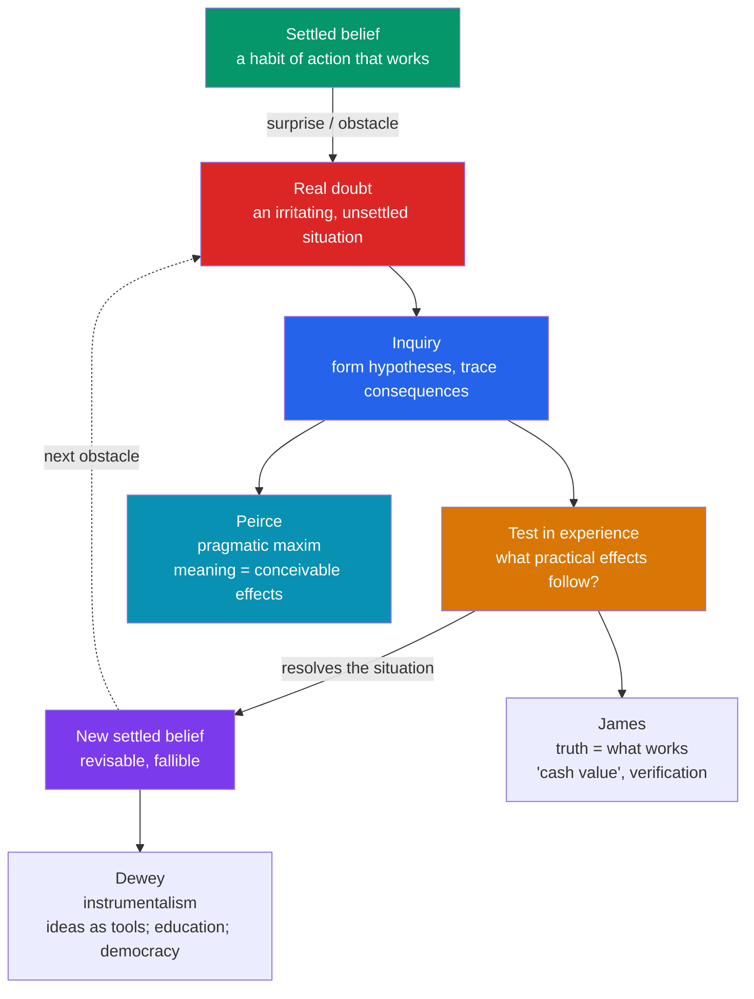

# 🔧 Pragmatism

> [!abstract] TL;DR
> Pragmatism is the first distinctively **American** philosophical movement (late 1800s onward), born in Cambridge, Massachusetts. Its founding insight — **Charles Sanders Peirce**'s *pragmatic maxim* — is that the meaning of a concept lies in its **conceivable practical effects**: to clarify an idea, ask what observable difference it would make. **William James** turned this into a theory of **truth**: an idea is true insofar as it "works," is verified in experience, and has "**cash value**" — and in *The Will to Believe* he defended the right to believe in genuinely undecidable, momentous matters. **John Dewey**'s **instrumentalism** treats ideas as *tools* for resolving problematic situations through inquiry, and applies this to **education** ("learning by doing") and **democracy** as a shared way of life. Common threads: **fallibilism**, anti-foundationalism, and the primacy of *inquiry* and *action* over spectator-style certainty.

## Intuition — analogy first

Ask what a **map** is *for*, and pragmatism's whole method falls out.

A map is not a mystical mirror of the terrain; it is a **tool you use to get somewhere**. You judge it not by whether it matches some inaccessible "reality-in-itself" but by whether, when you *act* on it, you arrive. Two maps that guide you equally well are, for practical purposes, equally good; a map that keeps leading you off cliffs is *false* no matter how elegant it looks; and every map is **provisional** — good enough for now, revisable when the road changes.

Pragmatists apply this to *all* ideas, including truth itself. A belief, like a map, is an instrument for navigating experience. Its **meaning** is the difference it would make to how things go (Peirce); its **truth** is its proven capacity to guide us successfully (James); and inquiry is the ongoing business of **repairing the map** when reality trips us up (Dewey). Philosophy stops being a search for a perfect God's-eye picture and becomes the study of how we *find our way*.

---

## How It Works — inquiry, from doubt to settled belief

For the pragmatists, thinking is not passive picture-making but an *activity* triggered when a habit of action breaks down. Peirce's **doubt–belief** model, extended by Dewey's theory of inquiry, is the movement's engine.

## Key Concepts

### Origins: the Metaphysical Club

Pragmatism grew from informal discussions of "The Metaphysical Club" in **Cambridge, Massachusetts** in the early **1870s**, whose members included Peirce, James, the mathematician Chauncey Wright, and the future jurist Oliver Wendell Holmes Jr. It was a self-consciously American, post-Civil-War, science-friendly, anti-metaphysical current — suspicious of grand systems and of the quest for absolute certainty.

### Peirce and the pragmatic maxim

**Charles Sanders Peirce** (1839–1914), a scientist and logician, is the founder. In "**How to Make Our Ideas Clear**" (1878) he states the **pragmatic maxim**:

> "Consider what effects, that might conceivably have practical bearings, we conceive the object of our conception to have. Then, our conception of these effects is the whole of our conception of the object."

That is: the **meaning** of a concept is exhausted by the sum of its *conceivable practical and experimental consequences*. A distinction that makes *no* conceivable difference to experience is empty. Related Peircean commitments:

- **Doubt–belief theory of inquiry** ("The Fixation of Belief," 1877): belief is a calm **habit of action**; doubt is an *irritation* that inquiry works to remove. We inquire to escape genuine doubt, not to reach abstract certainty.
- **Fallibilism**: no belief is guaranteed final; all are open to future revision. Truth is what inquiry would converge on "in the long run."
- Peirce later renamed his own view "**pragmaticism**" — a word "ugly enough to be safe from kidnappers" — to separate his careful theory of *meaning* from James's popular theory of *truth*.

### James: truth as "what works"

**William James** (1842–1910), psychologist and philosopher, popularized pragmatism in *Pragmatism* (1907). He extended Peirce's maxim from *meaning* to **truth**:

- Truth is not a static correspondence fixed once and for all; a belief becomes true by being **verified**, by "working" in the course of experience. "The true is only the expedient in the way of our thinking." Ideas have a "**cash value**" — a real difference they make to lived experience. Truth "**happens** to an idea; it *becomes* true, is *made* true by events."
- ***The Will to Believe*** (1897): James defends the right to believe in the absence of decisive evidence, but only for a **genuine option** — one that is *living* (a real candidate for you), *forced* (no fence-sitting), and *momentous* (consequential). Religious faith is his prime example. This answers W.K. Clifford's strict evidentialism ("it is wrong always... to believe anything upon insufficient evidence") by noting that *refusing* to believe is itself a risky choice that can cost us truth.
- **Radical empiricism**: relations between things are *directly experienced*, not added by the mind; experience comes as a connected flow.

### Dewey: instrumentalism, education, and democracy

**John Dewey** (1859–1952) built the most systematic and socially engaged version, which he called **instrumentalism**:

- **Ideas as instruments**: concepts, theories, and even "truths" are *tools* for transforming a **problematic (indeterminate) situation** into a resolved (determinate) one. They are judged by how well they *work in inquiry*, not by copying a ready-made reality (*Logic: The Theory of Inquiry*, 1938).
- **Philosophy of education**: in *Democracy and Education* (1916), Dewey rejects rote transmission for **learning by doing** — education as the active *reconstruction of experience*, growth, and problem-solving. He put this into practice at the University of Chicago **Laboratory School**.
- **Democracy as a way of life**: for Dewey, democracy is not merely a form of government or majority voting but "a mode of associated living, of conjoint communicated experience" — requiring participation, communication, and shared inquiry. Education and democracy are two sides of one project: cultivating citizens capable of intelligent cooperative action.

| Thinker | Dates | Signature idea | Level of pragmatism |
|---|---|---|---|
| **C.S. Peirce** | 1839–1914 | Pragmatic maxim; fallibilism | Theory of **meaning** and inquiry |
| **William James** | 1842–1910 | Truth as "what works"; the will to believe | Theory of **truth**; psychology of belief |
| **John Dewey** | 1859–1952 | Instrumentalism; education; democracy | Theory of **inquiry** and social practice |

### Legacy: neopragmatism

After mid-century eclipse (partly under logical positivism's rise), pragmatism revived through **W.V.O. Quine**'s holism, **Hilary Putnam**, and especially **Richard Rorty**'s *Philosophy and the Mirror of Nature* (1979), which attacked the picture of the mind as a "mirror of nature" and revived Dewey's anti-foundationalism for contemporary debates. See [[Analytic_and_Continental_Philosophy]].

## Arguments & Examples

**The squirrel (James's illustration of method).** Friends argue whether a man who circles a tree, always facing a squirrel that scurries around the trunk to stay opposite him, has gone "**around**" the squirrel. James's pragmatic move: *what practical difference hangs on the answer?* If "around" means passing north–east–south–west of the squirrel, yes; if it means passing in front–side–behind, no. Once we specify the practical consequences, the dispute **dissolves** — there was no factual question left, only an ambiguous word. This is the pragmatic maxim as a tool for defusing pseudo-problems.

**Verificationist clarity, decades early.** Peirce's maxim anticipates a core twentieth-century idea: that a claim with *no* conceivable experiential difference may be **cognitively idle**. But pragmatism is broader and gentler than the Vienna Circle's verificationism (see [[Analytic_and_Continental_Philosophy]]): it clarifies meaning by *practical bearings* rather than declaring whole domains "meaningless," and it welcomes religious or ethical beliefs when they make a genuine difference to conduct.

**The will to believe, responsibly.** Deciding whether to trust a new colleague is often a *genuine option*: living (you must work together), forced (there is no neutral "wait for proof" — withholding trust is itself an act with consequences), and momentous (the relationship is at stake). James's point is not "believe whatever you like," but that in such cases *demanding certainty first* can itself forfeit goods that only trust can secure.

## Common Pitfalls / Misconceptions

- **"Pragmatism says truth is whatever is *useful*, so you can believe convenient falsehoods."** The charge (pressed by Russell and Moore) targets a caricature. James means a belief is verified/true when it "works" *in the sense of standing up to the tests of ongoing experience and cohering with the rest of what we know* — not that wishful, disconfirmed beliefs become true because we like them.
- **"Peirce and James held the same view."** They diverged enough that Peirce renamed his position **pragmaticism**. Peirce emphasized meaning, logic, and a *convergence* theory of truth in the long run; James emphasized the psychology of belief and individual verification.
- **"Pragmatism is anti-intellectual / hostile to science."** The opposite: it *models* thought on scientific inquiry and experimentation, and Peirce was a working scientist. It opposes only the quest for infallible, experience-transcending certainty.
- **"Instrumentalism means ideas aren't *really* true, just handy."** Dewey reconstructs (rather than denies) truth: "warranted assertibility" is what inquiry delivers, and calling ideas *instruments* elevates their role in transforming experience rather than demoting them.
- **"Dewey's 'learning by doing' means abolishing content or structure."** Dewey criticized *both* rote drill *and* unstructured child-worship; he wanted experience *guided* by intelligent design toward growth.

## Related Concepts

- [[Analytic_and_Continental_Philosophy]] — Pragmatism's concern with meaning and clarity parallels the analytic tradition, and neopragmatism (Quine, Rorty, Putnam) grew out of it; Peirce's maxim prefigures verificationism.
- [[Nietzsche]] — A partly kindred anti-metaphysics: both prize life-serving, perspectival, revisable belief over a fixed God's-eye truth (though on very different grounds).
- [[_MOC_Modern_Contemporary_Philosophy]] — Section hub.
- [[_MOC_Epistemology]] — The pragmatic theory of truth alongside correspondence, coherence, and deflationary theories; fallibilism and the ethics of belief.
- Cross-vault: [[_MOC_Psychology_Master]] — James's *Principles of Psychology* (1890) founded much of American functionalist psychology; [[_MOC_Philosophy_of_Science]] — inquiry, fallibilism, and the experimental method.

## Review Questions

1. State the **pragmatic maxim** in your own words and apply it to a dispute of your choosing to show how specifying "conceivable practical effects" can either clarify or dissolve the question. Why did Peirce rename his view "pragmaticism"?
2. Explain James's claim that truth is "made true by events" and has "cash value." What is the strongest objection (that it conflates truth with mere usefulness), and how might a pragmatist reply?
3. What does Dewey mean by **instrumentalism**, and how do his theories of **education** and **democracy** follow from it? Contrast "learning by doing" with rote transmission.

## Sources

- Peirce, C.S. (1877/1878). "The Fixation of Belief" and "How to Make Our Ideas Clear," *Popular Science Monthly*.
- James, W. (1907). *Pragmatism: A New Name for Some Old Ways of Thinking*. Longmans, Green & Co.
- Dewey, J. (1916). *Democracy and Education*. Macmillan.
- Menand, L. (2001). *The Metaphysical Club: A Story of Ideas in America*. Farrar, Straus and Giroux.

#philosophy #pragmatism #truth #inquiry #peirce #james #dewey
