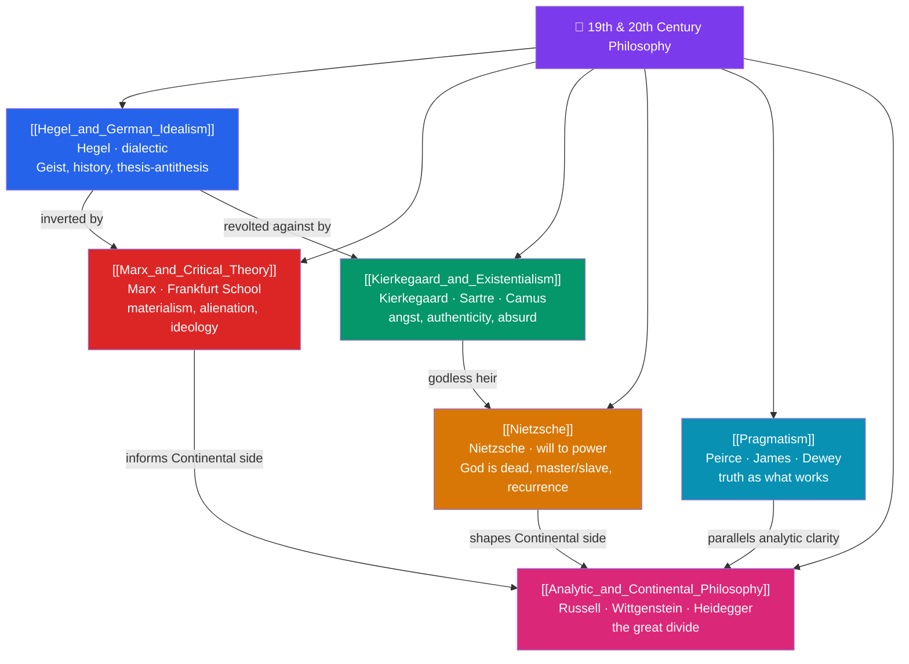

# 🗺️ Nineteenth and Twentieth Century Philosophy — Map of Content

> [!abstract] What This Section Covers
> After Kant, philosophy fragments into rival movements that still define the intellectual landscape. **Hegel and German Idealism** completes the idealist project with the dialectic, the unfolding of Geist through history; **Marx and Critical Theory** inverts Hegel into materialism, diagnosing alienation and ideology, and seeds the Frankfurt School; **Kierkegaard and Existentialism** rebels against systems in the name of the individual, anxiety, and authentic choice, flowering later in Sartre and Camus' absurdism; **Nietzsche** proclaims the death of God and revalues all values through the will to power, master/slave morality, and eternal recurrence; **Pragmatism** offers a distinctively American answer — truth as what works, from Peirce and James to Dewey; and **Analytic and Continental Philosophy** charts the twentieth century's great methodological divide, Frege–Russell–Wittgenstein on one side, Husserl–Heidegger on the other. Six notes, six revolutions in how philosophy is done.

## Concept Map

## Learning Path

1. [[Hegel_and_German_Idealism]] — Fichte and Schelling, the dialectic, Absolute Spirit, and history as the progress of freedom.
2. [[Marx_and_Critical_Theory]] — Historical materialism, alienation, commodity fetishism, ideology, and the Frankfurt School's critique of culture.
3. [[Kierkegaard_and_Existentialism]] — The single individual, dread and despair, leaps of faith, and the later existentialism of Sartre and Camus.
4. [[Nietzsche]] — The death of God, the genealogy of morals, master/slave morality, the will to power, the Übermensch, and eternal recurrence.
5. [[Pragmatism]] — Peirce's pragmatic maxim, James on truth's "cash value," and Dewey's instrumentalism and democracy.
6. [[Analytic_and_Continental_Philosophy]] — The linguistic turn, logical analysis, phenomenology, existential ontology, and the split's causes.

## All Notes at a Glance

| Note | Difficulty | What You'll Learn |
|------|------------|-------------------|
| [[Hegel_and_German_Idealism]] | Advanced | Dialectic, Geist, master–slave dialectic, Absolute Idealism, history as reason unfolding |
| [[Marx_and_Critical_Theory]] | Intermediate → Advanced | Materialism, alienation, base/superstructure, ideology, Adorno, Horkheimer, Habermas |
| [[Kierkegaard_and_Existentialism]] | Intermediate | Subjectivity, angst, the aesthetic/ethical/religious stages, Sartre's freedom, Camus' absurd |
| [[Nietzsche]] | Intermediate → Advanced | God is dead, will to power, ressentiment, perspectivism, eternal recurrence, the Übermensch |
| [[Pragmatism]] | Intermediate | Pragmatic theory of truth, fallibilism, instrumentalism, radical empiricism, inquiry |
| [[Analytic_and_Continental_Philosophy]] | Intermediate → Advanced | Frege, Russell, early/late Wittgenstein, Vienna Circle, Husserl, Heidegger, the divide |

## Key Questions This Section Answers

- How does history, for Hegel, embody the progressive self-realization of reason and freedom?
- What is alienation, and how does ideology conceal the workings of power?
- If existence precedes essence, what does it mean to live authentically?
- What did Nietzsche mean by "God is dead," and how should we revalue our values?
- What separates analytic from continental philosophy, and does the divide still hold?

## Related Sections

- [[_MOC_Philosophy_Master|↑ Philosophy Master MOC]]
- [[_MOC_Early_Modern_Philosophy|← Early Modern Philosophy]]
- [[_MOC_Metaphysics|→ Metaphysics]]
- Cross-vault: [[_MOC_History_Master]] (industrial age, ideologies), [[Marx_and_Critical_Theory]] ↔ [[_MOC_Macroeconomics_Master]], [[Pragmatism]] ↔ [[Epistemology]]

#MOC #Philosophy #ModernPhil
